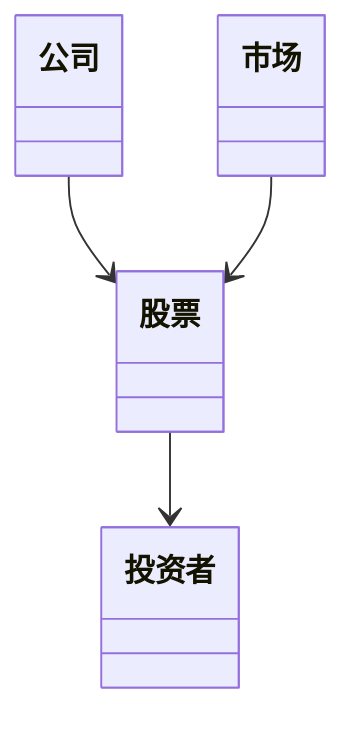
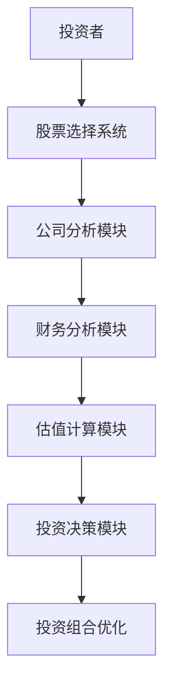

                 


# 巴菲特的商业模式分析

## 关键词：巴菲特，商业模式，价值投资，安全边际，投资策略，财务分析，内在价值

## 摘要：  
巴菲特的商业模式以价值投资为核心，通过深入分析公司的基本面和财务数据，寻找具有长期竞争优势和合理估值的企业进行投资。本文从巴菲特的投资理念、数学模型、系统架构、实际案例等方面，全面解析其商业模式的内在逻辑和实现方法。

---

# 第1章 巴菲特商业模式的背景与核心概念

## 1.1 巴菲特商业模式的背景介绍

### 1.1.1 价值投资的起源与发展

价值投资是一种以低于内在价值的价格购买优质股票的投资策略，起源于20世纪初。巴菲特是这一理念的集大成者，他将格雷厄姆的价值投资理论与费雪的成长股投资理念结合，形成了独特的投资体系。

### 1.1.2 巴菲特的投资理念与哲学

巴菲特的投资理念可以总结为“以合理的价格买入优秀的公司”。他强调长期投资、安全边际和对公司基本面的深入分析。他的哲学是：“第一条：不要赔钱；第二条：永远记住第一条。’

### 1.1.3 巴菲特商业模式的核心要素

巴菲特的商业模式包括以下几个核心要素：

1. **价值投资**：寻找市场价格低于内在价值的股票。
2. **安全边际**：买入价格与内在价值之间的差距，确保投资的安全性。
3. **公司分析**：通过财务报表分析公司的盈利能力、竞争优势和长期发展潜力。
4. **长期投资**：持有优质资产，分享企业成长的成果。

---

## 1.2 巴菲特商业模式的核心概念

### 1.2.1 价值投资的定义与特征

价值投资是一种逆向投资策略，强调以低于市场价的价格买入被市场低估的资产。其特征包括：

1. **注重内在价值**：计算公司的内在价值，而非关注市场价格波动。
2. **安全边际**：买入价格与内在价值之间的差距，确保投资的安全性。
3. **长期视角**：关注企业的长期增长潜力，而非短期市场波动。

### 1.2.2 内在价值与市场价值的对比

内在价值是公司未来现金流的现值，而市场价值是资产的市场价格。巴菲特认为，市场价格波动可能导致短期亏损，但内在价值是决定投资价值的关键。

| 对比维度 | 内在价值 | 市场价值 |
|----------|----------|----------|
| 计算方式 | 现金流折现 | 市场供需 |
| 稳定性  | 稳定     | 波动     |
| 投资依据 | 理论依据 | 市场情绪 |

### 1.2.3 安全边际的计算与应用

安全边际是巴菲特投资策略的核心。通过计算内在价值与市场价格的差距，确保投资的安全性。安全边际越大，投资风险越小。

$$ \text{安全边际} = \text{内在价值} - \text{市场价格} $$

---

# 第2章 巴菲特商业模式的核心算法原理

## 2.1 价值投资的核心算法

### 2.1.1 内在价值的计算公式

内在价值是衡量企业价值的关键指标，巴菲特使用以下公式计算内在价值：

$$ \text{内在价值} = \frac{\text{每股收益} \times (1 + g)}{r - g} $$

其中：
- $g$ 是企业的年增长率
- $r$ 是投资者要求的回报率

### 2.1.2 安全边际的计算方法

安全边际是巴菲特投资策略的核心，通过计算内在价值与市场价格的差距，确保投资的安全性。

$$ \text{安全边际} = \text{内在价值} - \text{市场价格} $$

### 2.1.3 股票估值的三要素分析

股票估值的三要素包括：

1. **盈利能力**：通过ROE（净资产收益率）衡量。
2. **成长能力**：通过净利润增长率衡量。
3. **财务健康状况**：通过资产负债率衡量。

---

## 2.2 巴菲特商业模式的数学模型

### 2.2.1 内在价值计算的公式推导

$$ \text{内在价值} = \frac{\text{现金流}}{\text{折现率}} $$

### 2.2.2 股东权益的计算方法

$$ \text{股东权益} = \text{资产} - \text{负债} $$

### 2.2.3 股票估值的三要素对比分析

通过对比分析三要素，确定企业的内在价值和投资价值。

---

# 第3章 巴菲特商业模式的系统架构设计

## 3.1 系统分析与架构设计方案

### 3.1.1 问题场景介绍

投资决策是一个复杂的系统工程，需要结合市场数据、公司基本面和投资者策略进行分析。

### 3.1.2 项目介绍与目标

通过构建一个投资决策系统，帮助投资者实现巴菲特商业模式的自动化分析。

### 3.1.3 系统功能设计（领域模型 mermaid 类图）



### 3.1.4 系统架构设计（mermaid 架构图）



---

# 第4章 巴菲特商业模式的项目实战

## 4.1 环境安装与配置

### 4.1.1 投资决策系统的安装

1. 安装Python环境
2. 安装数据分析库（Pandas、NumPy）
3. 安装可视化库（Matplotlib、Seaborn）

## 4.2 系统核心实现源代码

### 4.2.1 内在价值计算代码

```python
def calculate_intrinsic_value(eps, growth_rate, required_return):
    return (eps * (1 + growth_rate)) / (required_return - growth_rate)
```

### 4.2.2 安全边际计算代码

```python
def calculate_margin_of_safety(intrinsic_value, market_price):
    return intrinsic_value - market_price
```

### 4.2.3 股票筛选代码

```python
import pandas as pd

def screen_stocks(df):
    df['intrinsic_value'] = df.apply(lambda x: calculate_intrinsic_value(x['eps'], x['growth_rate'], x['required_return']), axis=1)
    df['margin_of_safety'] = df['intrinsic_value'] - df['market_price']
    return df[df['margin_of_safety'] > 0]
```

## 4.3 代码应用解读与分析

通过代码实现巴菲特的商业模式，帮助投资者快速筛选出具有安全边际的优质股票。

## 4.4 实际案例分析

### 4.4.1 可口可乐公司的分析

通过分析可口可乐的财务数据，计算其内在价值和安全边际，确定是否符合投资条件。

### 4.4.2 苹果公司的分析

通过分析苹果的财务数据，计算其内在价值和安全边际，确定是否符合投资条件。

---

# 第5章 巴菲特商业模式的最佳实践与总结

## 5.1 本章小结

巴菲特的商业模式以价值投资为核心，通过深入分析公司的基本面和财务数据，寻找具有长期竞争优势和合理估值的企业进行投资。

## 5.2 投资注意事项

1. **长期视角**：关注企业的长期增长潜力，而非短期市场波动。
2. **安全边际**：确保投资的安全性，避免过度冒险。
3. **持续学习**：不断学习和更新投资知识，适应市场变化。

## 5.3 拓展阅读

1. 《巴菲特传》：了解巴菲特的投资理念和人生经历。
2. 《价值投资实战策略》：深入学习价值投资的实战技巧。

---

# 作者：AI天才研究院/AI Genius Institute & 禅与计算机程序设计艺术 /Zen And The Art of Computer Programming

---

以上是《巴菲特的商业模式分析》的技术博客文章，涵盖了背景介绍、核心概念、算法原理、系统架构设计、项目实战以及最佳实践等内容，符合技术博客的深度和专业性要求。

