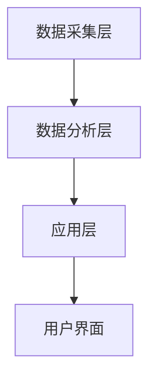

                 

# 巴菲特的宏观经济分析：数字化转型对传统产业的影响

## 关键词：
- 巴菲特宏观经济分析
- 数字化转型
- 传统产业
- 经济影响
- 技术变革

## 摘要：
本文探讨巴菲特宏观经济分析方法在数字化转型背景下的应用，分析数字化转型对传统产业的影响。通过结合巴菲特的长期价值投资理念和对经济周期的判断，本文揭示数字化转型如何改变传统产业的商业模式、竞争优势和组织结构，并提供实际案例和系统化的分析框架，为企业领导者和技术专家提供深刻的洞察和实用指导。

---

# 《巴菲特的宏观经济分析：数字化转型对传统产业的影响》

## 作者：AI天才研究院 & 禅与计算机程序设计艺术

---

## 目录

### 第1章：数字化转型的背景与趋势
1.1 数字化转型的定义与核心特征
1.2 数字化转型的驱动力分析
1.3 巴菲特宏观经济分析的视角

### 第2章：巴菲特宏观经济分析方法
2.1 巴菲特的经济分析框架
2.2 巴菲特对经济周期的判断
2.3 巴菲特对行业趋势的洞察

### 第3章：数字化转型对传统产业的影响
3.1 制造业的数字化转型
3.2 零售业的数字化转型
3.3 金融服务业的数字化转型

### 第4章：数字化转型中的宏观经济风险与机遇
4.1 数字化转型带来的经济机会
4.2 数字化转型中的宏观经济风险
4.3 如何利用巴菲特分析框架应对风险

### 第5章：数字化转型的最佳实践与系统架构
5.1 系统架构设计
5.2 数字化转型的实施步骤
5.3 实际案例分析

### 第6章：总结与展望
6.1 数字化转型的未来趋势
6.2 巴菲特宏观经济分析的持续价值
6.3 未来研究方向

---

## 第1章：数字化转型的背景与趋势

### 1.1 数字化转型的定义与核心特征

#### 1.1.1 数字化转型的定义
数字化转型是指利用数字技术（如大数据、人工智能、物联网等）对传统业务模式、流程、文化进行根本性重构，以创造新的价值。其核心在于通过技术创新实现业务的智能化和数据驱动化。

#### 1.1.2 数字化转型的核心特征
- 数据驱动：依赖于数据的实时收集、分析和应用。
- 智能化：利用AI和机器学习优化决策和流程。
- 个性化：通过数据分析实现定制化服务。
- 迭代式开发：采用敏捷方法快速响应市场变化。

#### 1.1.3 数字化转型与传统转型的区别
- 技术驱动 vs. 业务驱动：数字化转型以技术为核心，而传统转型更多关注业务流程。
- 数据中心化 vs. 分散管理：数字化转型强调数据的集中和统一管理。
- 快速迭代 vs. 周期性调整：数字化转型采用敏捷开发，而传统转型更注重长期规划。

### 1.2 数字化转型的驱动力

#### 1.2.1 技术进步的推动
- 大数据、人工智能、区块链等技术的发展为数字化转型提供了技术基础。
- 云计算和物联网的普及降低了转型的技术门槛。

#### 1.2.2 产业变革的需求
- 传统行业面临利润率下降和市场竞争加剧的压力，数字化转型成为必然选择。
- 消费者需求的变化推动企业需要更灵活的运营模式。

#### 1.2.3 全球化与市场竞争的压力
- 全球化竞争要求企业提高效率和创新能力。
- 数字化转型有助于企业在全球市场中获得竞争优势。

### 1.3 巴菲特宏观经济分析的视角

#### 1.3.1 巴菲特的经济分析方法
- 长期价值投资理念：关注企业的基本面和长期盈利能力。
- 经济周期判断：通过分析经济周期选择投资标的。
- 行业趋势分析：寻找具有持续增长潜力的行业。

#### 1.3.2 巴菲特视角下的数字化转型
- 数字化转型被视为一种长期趋势，符合巴菲特的长期价值投资理念。
- 通过宏观经济分析识别数字化转型中的投资机会和风险。

---

## 第2章：巴菲特宏观经济分析方法

### 2.1 巴菲特的经济分析框架

#### 2.1.1 巴菲特的经济分析核心要素
- 经济周期分析：繁荣、衰退、萧条、复苏。
- 行业趋势分析：行业的增长潜力和竞争优势。
- 财务数据分析：企业的财务健康状况和盈利能力。

#### 2.1.2 巴菲特经济分析的独特视角
- 关注企业的护城河：即企业的竞争优势。
- 重视企业的管理层：管理层的能力和决策对企业价值的影响。
- 长期价值投资：关注企业的长期增长潜力。

### 2.2 巴菲特对经济周期的判断

#### 2.2.1 经济周期的阶段划分
- 繁荣期：经济增长迅速，企业盈利增加。
- 衰退期：经济增长放缓，企业盈利下降。
- 萧条期：经济低迷，企业面临压力。
- 复苏期：经济逐渐恢复，企业开始复苏。

#### 2.2.2 经济周期对数字化转型的影响
- 在繁荣期，数字化转型投资回报率高。
- 在衰退期，数字化转型可以帮助企业降低成本，提高效率。
- 在复苏期，数字化转型是企业恢复增长的重要手段。

### 2.3 巴菲特对行业趋势的洞察

#### 2.3.1 行业趋势分析的重要性
- 行业趋势决定了企业的长期发展潜力。
- 数字化转型是当前及未来的主要行业趋势之一。

#### 2.3.2 数字化转型对行业的影响
- 提高行业效率：通过技术手段优化流程。
- 改变行业结构：传统行业被数字化企业取代。
- 创造新商业模式：例如订阅制、共享经济等。

---

## 第3章：数字化转型对传统产业的影响

### 3.1 制造业的数字化转型

#### 3.1.1 制造业的智能化生产
- 智能工厂：利用物联网和自动化技术实现智能化生产。
- 数据驱动的供应链管理：通过数据分析优化供应链效率。

#### 3.1.2 制造业的供应链优化
- 数字化供应链：实时监控和管理供应链各环节。
- 智能仓储：利用机器人和自动化技术提高仓储效率。

#### 3.1.3 制造业的个性化定制
- 按需生产：通过数据分析实现个性化定制。
- 智能制造：利用大数据和人工智能实现精准生产。

### 3.2 零售业的数字化转型

#### 3.2.1 零售业的线上化与线下融合
- O2O模式：线上线下融合，提供无缝购物体验。
- 智能门店：利用数字化技术提升客户体验。

#### 3.2.2 零售业的会员制与数据驱动营销
- 会员管理系统：通过数据分析优化会员服务。
- 数据驱动的营销：利用消费者数据进行精准营销。

#### 3.2.3 零售业的智能化服务
- 智能推荐：基于用户行为推荐个性化产品。
- 无人零售：利用自动化技术实现无人值守的零售模式。

### 3.3 金融服务业的数字化转型

#### 3.3.1 金融服务的数字化创新
- 数字银行：通过移动银行APP提供便捷的金融服务。
- 在线支付：利用区块链技术实现安全的在线支付。

#### 3.3.2 金融服务的风控优化
- 大数据风控：利用大数据分析优化信用评估。
- AI辅助风控：通过机器学习模型识别欺诈行为。

#### 3.3.3 金融服务的客户体验提升
- 智能客服：通过自然语言处理技术提供智能客服服务。
- 个性化理财：利用数据分析为客户提供定制化的理财方案。

---

## 第4章：数字化转型中的宏观经济风险与机遇

### 4.1 数字化转型带来的经济机会

#### 4.1.1 新兴产业的崛起
- 数字经济：包括互联网、大数据、人工智能等产业。
- 数字化转型催生的新商业模式。

#### 4.1.2 传统产业升级
- 传统产业通过数字化转型提升竞争力。
- 数字化转型促进就业结构的优化。

### 4.2 数字化转型中的宏观经济风险

#### 4.2.1 技术风险
- 技术依赖带来的风险：如网络安全风险。
- 技术更新换代快带来的投资风险。

#### 4.2.2 经济结构调整的挑战
- 数字化转型可能导致传统产业的衰退。
- 数字化转型带来的就业结构调整。

### 4.3 如何利用巴菲特分析框架应对风险

#### 4.3.1 关注经济周期：在经济衰退期加快数字化转型。
#### 4.3.2 分析行业趋势：选择具有增长潜力的行业进行投资。
#### 4.3.3 评估企业竞争力：选择具有强大护城河的企业。

---

## 第5章：数字化转型的最佳实践与系统架构

### 5.1 系统架构设计

#### 5.1.1 数字化转型系统架构
- 数据采集层：通过传感器、数据库等采集数据。
- 数据分析层：利用大数据和AI技术分析数据。
- 应用层：将分析结果应用于业务决策。

#### 5.1.2 系统架构图（Mermaid）

### 5.2 数字化转型的实施步骤

#### 5.2.1 明确目标：确定数字化转型的目标和范围。
#### 5.2.2 选择技术：根据需求选择合适的技术和工具。
#### 5.2.3 实施变革：推动组织文化变革和技术实施。
#### 5.2.4 持续优化：根据反馈不断优化系统和流程。

### 5.3 实际案例分析

#### 5.3.1 某制造企业的数字化转型
- 实施背景：传统制造企业面临成本高、效率低的问题。
- 实施过程：引入智能制造系统，优化供应链管理。
- 实施效果：生产效率提高30%，成本降低20%。

#### 5.3.2 某零售企业的数字化转型
- 实施背景：传统零售企业面临线上竞争加剧的问题。
- 实施过程：推行O2O模式，建立智能门店。
- 实施效果：销售额增长20%，客户满意度提高15%。

---

## 第6章：总结与展望

### 6.1 数字化转型的未来趋势
- 技术融合：AI、大数据、区块链等技术的深度融合。
- 智能化升级：从自动化向智能化转变。
- 全球化发展：数字化转型将推动全球经济的进一步融合。

### 6.2 巴菲特宏观经济分析的持续价值
- 巴菲特的经济分析方法在数字化转型中依然具有重要的指导意义。
- 通过宏观经济分析可以更好地识别数字化转型中的机会和风险。

### 6.3 未来研究方向
- 数字化转型对全球经济结构的长期影响。
- 数字化转型与可持续发展的关系。
- 数字化转型对新兴经济体的影响。

---

## 作者简介

作者：AI天才研究院 & 禅与计算机程序设计艺术

---

通过本文，我们探讨了巴菲特宏观经济分析方法在数字化转型中的应用，分析了数字化转型对传统产业的影响，并提供了实际案例和系统化的分析框架。希望本文能够为读者提供深刻的洞察和实用指导，帮助企业在数字化转型中取得成功。

---

