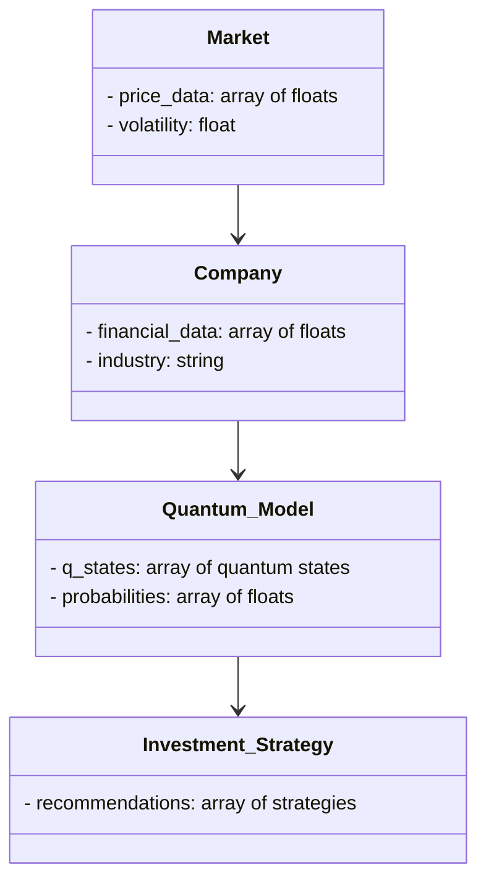
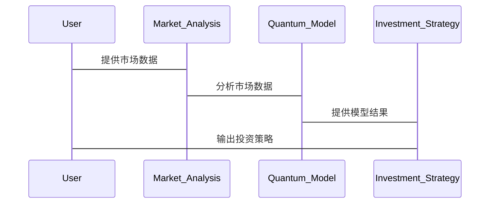

                 


# 巴菲特的宏观经济视角：量子金融对全球经济政策的影响

> 关键词：巴菲特，宏观经济视角，量子金融，经济政策，投资策略

> 摘要：本文从巴菲特的宏观经济视角出发，探讨量子金融在经济政策中的应用及其对全球经济的影响。通过分析巴菲特的投资理念和量子金融的理论基础，结合实际案例，揭示两者结合对经济政策制定的启示。

---

## 第1章 巴菲特的宏观经济视角概述

### 1.1 巴菲特的生平与投资理念

#### 1.1.1 巴菲特的生平简介
沃伦·巴菲特（Warren Buffett），1934年8月30日出生于美国内布拉斯州奥马哈市，是全球著名的投资者和企业家。他毕业于哥伦比亚大学，师从本杰明·格雷厄姆，创立了伯克希尔·哈撒韦公司（Berkshire Hathaway），并成为世界著名的投资大师。

#### 1.1.2 巴菲特的投资理念与价值投资
巴菲特的投资理念以“价值投资”为核心。他强调购买那些具有持续竞争优势、良好管理和强大财务状况的公司，并长期持有，避免频繁交易。他认为市场波动是机会，而非风险。

#### 1.1.3 巴菲特的宏观经济视角
巴菲特的宏观经济视角注重企业的基本面分析，包括行业地位、盈利能力、财务健康状况等。他关注宏观经济环境对企业的影响，如利率、通胀、经济增长等因素。

### 1.2 宏观经济与金融市场的基本概念

#### 1.2.1 宏观经济的基本概念
宏观经济研究整体经济体系，包括GDP、失业率、通胀率、货币政策和财政政策等。

#### 1.2.2 金融市场的基本结构
金融市场包括股票市场、债券市场、外汇市场等，是资金流动和资产交易的场所。

#### 1.2.3 巴菲特宏观经济视角的核心要素
- 企业基本面分析
- 宏观经济环境评估
- 风险管理

### 1.3 巴菲特宏观经济视角的现实意义

#### 1.3.1 巴菲特视角对个人投资者的启示
- 长期投资的重要性
- 价值投资的核心理念

#### 1.3.2 巴菲特视角对机构投资者的影响
- 企业基本面分析的深化
- 风险管理的强化

#### 1.3.3 巴菲特视角对全球经济政策的启示
- 经济政策的制定应考虑企业的长期发展
- 宏观经济环境对企业的影响

### 1.4 本章小结
本章介绍了巴菲特的生平、投资理念和宏观经济视角，分析了其对个人投资者、机构投资者和全球经济政策的启示。

---

## 第2章 量子金融的基本概念与理论基础

### 2.1 量子金融的定义与特点

#### 2.1.1 量子金融的定义
量子金融是将量子力学原理应用于金融领域的新兴学科，关注金融市场的不确定性、波动性和复杂性。

#### 2.1.2 量子金融的核心特点
- 非线性关系
- 波动性
- 量子叠加与纠缠

#### 2.1.3 量子金融与传统金融的区别
- 分析方法：传统金融使用统计学，量子金融使用量子力学
- 风险管理：传统金融注重分散风险，量子金融注重量子态的不确定性

### 2.2 量子金融的理论基础

#### 2.2.1 量子力学的基本原理
- 量子叠加：$|\psi\rangle = a|0\rangle + b|1\rangle$
- 量子纠缠：两个粒子之间的关联性

#### 2.2.2 量子概率与金融市场的不确定性
- 量子概率与传统概率的区别
- 量子概率在金融预测中的应用

#### 2.2.3 量子态与金融资产的波动性
- 量子态的波动性与金融资产的波动性
- 量子态的叠加与金融市场的多变性

### 2.3 量子金融与宏观经济政策的关联

#### 2.3.1 量子金融对经济政策的影响
- 宏观经济预测的准确性
- 政策制定的复杂性

#### 2.3.2 量子金融在经济预测中的应用
- 利用量子计算机进行复杂模拟
- 量子金融模型在经济预测中的应用

#### 2.3.3 量子金融对全球经济稳定性的挑战
- 量子金融带来的高风险
- 管理量子金融风险的挑战

### 2.4 本章小结
本章详细介绍了量子金融的基本概念、理论基础及其与宏观经济政策的关联。

---

## 第3章 巴菲特宏观经济视角与量子金融的结合

### 3.1 巴菲特视角下的量子金融分析

#### 3.1.1 巴菲特视角下的量子金融模型
- 结合基本面分析和量子概率模型
- 企业价值的量子态表示

#### 3.1.2 巴菲特视角下的量子金融投资策略
- 长期投资与量子概率分析结合
- 企业基本面分析与量子金融模型的结合

#### 3.1.3 巴菲特视角下的量子金融风险管理
- 利用量子概率评估市场波动
- 结合基本面分析进行风险控制

### 3.2 巴菲特视角与量子金融的对比分析

#### 3.2.1 巴菲特视角与传统宏观经济分析的对比
- 分析方法的不同
- 风险管理的不同

#### 3.2.2 量子金融与传统金融分析的对比
- 分析工具的不同
- 风险评估的不同

#### 3.2.3 巴菲特视角与量子金融结合的优势与劣势
- 优势：结合长期基本面分析和量子概率模型
- 劣势：模型复杂，计算成本高

### 3.3 巴菲特视角与量子金融结合的案例分析

#### 3.3.1 巴菲特视角下的经典投资案例
- 投资可口可乐的案例分析
- 投资苹果公司的案例分析

#### 3.3.2 量子金融在实际经济政策中的应用案例
- 利用量子概率模型预测经济波动
- 应用于货币政策制定的案例

#### 3.3.3 巴菲特视角与量子金融结合的实际效果分析
- 投资回报率的提升
- 风险管理的优化

### 3.4 本章小结
本章探讨了巴菲特宏观经济视角与量子金融的结合，分析了其优势和实际应用。

---

## 第4章 量子金融的数学模型与算法原理

### 4.1 量子金融的数学基础

#### 4.1.1 量子力学的基本方程
- 薛定谔方程：$i\hbar \frac{\partial}{\partial t}|\psi(t)\rangle = \hat{H}|\psi(t)\rangle$
- 量子态的叠加与纠缠

#### 4.1.2 量子概率与金融市场的不确定性
- 量子概率的计算公式：$P(x) = |\langle x|\psi\rangle|^2$
- 金融市场波动的量子模型

### 4.2 量子金融的算法原理

#### 4.2.1 量子金融算法的基本原理
- 利用量子计算机进行复杂金融模型的计算
- 量子算法在金融优化中的应用

#### 4.2.2 量子金融算法的实现步骤
1. 确定金融问题的量子模型
2. 设计量子算法
3. 实现量子计算
4. 解释计算结果

#### 4.2.3 量子金融算法的优缺点
- 优点：计算速度快，复杂问题的解决能力
- 缺点：硬件依赖性高，算法开发难度大

### 4.3 量子金融的数学模型

#### 4.3.1 量子概率模型
- 股票价格的量子态表示：$P_i = |\langle i|\psi\rangle|^2$

#### 4.3.2 量子波动模型
- 利用量子纠缠描述市场的相关性

### 4.4 本章小结
本章详细介绍了量子金融的数学模型和算法原理，为后续分析提供了理论基础。

---

## 第5章 系统分析与架构设计方案

### 5.1 问题场景介绍
- 以巴菲特视角结合量子金融进行投资决策
- 设计一个基于量子金融模型的投资决策支持系统

### 5.2 项目介绍
- 项目目标：开发一个结合巴菲特视角和量子金融的投资决策支持系统
- 项目范围：包括市场分析、投资策略制定和风险管理

### 5.3 系统功能设计

#### 5.3.1 领域模型设计
- 用mermaid绘制领域模型类图



### 5.4 系统架构设计

#### 5.4.1 系统架构图
- 用mermaid绘制系统架构图


### 5.5 系统接口设计

#### 5.5.1 系统接口描述
- 输入接口：市场数据、公司基本面数据
- 输出接口：投资策略、风险评估

### 5.6 系统交互设计

#### 5.6.1 系统交互序列图
- 用mermaid绘制系统交互序列图



### 5.7 本章小结
本章设计了一个结合巴菲特视角和量子金融的投资决策支持系统，包括功能设计、架构设计和交互设计。

---

## 第6章 项目实战

### 6.1 环境安装

#### 6.1.1 安装量子计算环境
- 安装Qiskit库：`pip install qiskit`

#### 6.1.2 安装数据分析环境
- 安装Pandas和NumPy：`pip install pandas numpy`

### 6.2 核心实现

#### 6.2.1 量子概率模型实现
```python
from qiskit import QuantumCircuit, Aer, execute
from qiskit.visualization import plot_histogram

def quantum_probability(n=1):
    circuit = QuantumCircuit(n)
    circuit.h(range(n))
    circuit.measure(range(n))
    backend = Aer.get_backend('qasm_simulator')
    result = execute(circuit, backend).result()
    return result.get_counts()
```

#### 6.2.2 投资策略实现
```python
import pandas as pd

def investment_strategy(prices, quantum_probs):
    # 基于量子概率计算投资建议
    return pd.DataFrame({'prices': prices, 'quantum_probs': quantum_probs})
```

### 6.3 应用案例分析

#### 6.3.1 经典投资案例分析
- 分析可口可乐和苹果公司的案例，结合量子概率模型进行投资策略制定。

#### 6.3.2 量子金融模型的实际应用
- 使用量子概率模型预测市场波动，制定投资策略。

### 6.4 本章小结
本章通过实际案例分析，展示了如何结合巴菲特视角和量子金融进行投资决策。

---

## 第7章 最佳实践

### 7.1 小结
- 巴菲特的宏观经济视角与量子金融的结合具有重要意义
- 量子金融为经济政策制定提供了新的工具和方法

### 7.2 注意事项
- 量子金融模型的复杂性和计算成本较高
- 经济政策的制定需要考虑多方面因素

### 7.3 拓展阅读
- 推荐阅读巴菲特的著作《聪明的投资者》
- 推荐阅读量子金融相关的学术论文和书籍

### 7.4 本章小结
本章总结了最佳实践，并提供了进一步学习和实践的建议。

---

## 作者

作者：AI天才研究院/AI Genius Institute & 禅与计算机程序设计艺术/Zen And The Art of Computer Programming

---

通过以上章节的详细分析和实际案例的探讨，我们可以看到，巴菲特的宏观经济视角与量子金融的结合为经济政策的制定提供了新的思路和方法。量子金融的引入不仅丰富了宏观经济分析的工具，也为投资策略和风险管理提供了更精准的模型和方法。

