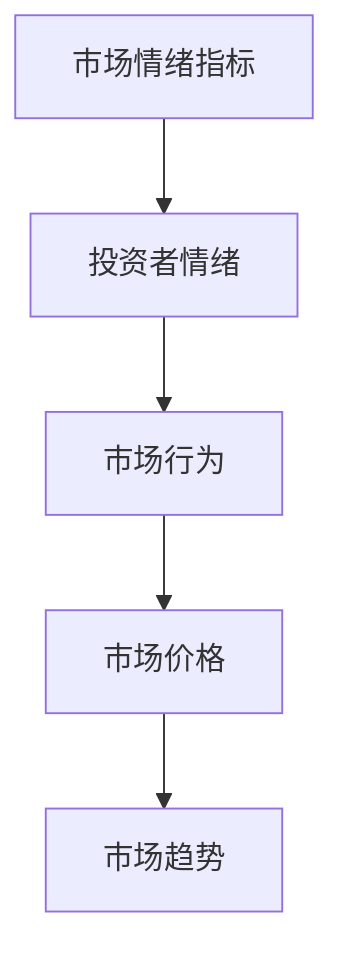
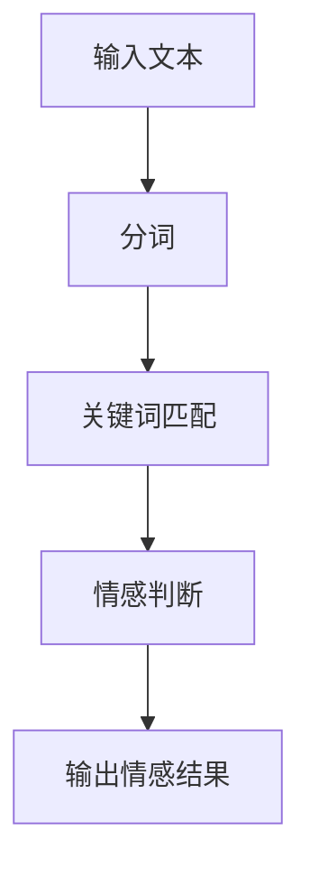
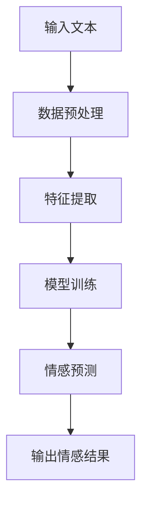
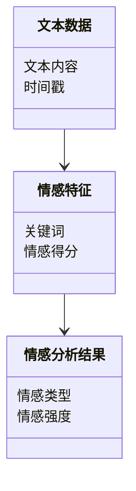
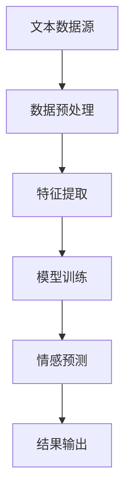

                 


# 巴菲特的市场情绪指标3.0：人工智能驱动的情绪分析

## 关键词：市场情绪分析、人工智能、巴菲特指标、情绪分析算法、系统架构设计、投资决策

## 摘要：  
本文深入探讨了巴菲特市场情绪指标的演变及其在3.0版本中的创新，重点分析了人工智能技术如何驱动情绪分析的发展。通过结合自然语言处理和机器学习算法，本文详细阐述了市场情绪分析的核心概念、算法原理、系统架构设计及项目实战，旨在为投资者提供一种基于AI的市场情绪分析方法，帮助其做出更明智的投资决策。

---

# 第一部分：市场情绪分析的背景与意义

## 第1章：市场情绪分析的背景与意义

### 1.1 市场情绪分析的定义与重要性

#### 1.1.1 市场情绪分析的定义  
市场情绪分析是指通过对市场参与者的情绪进行量化和分析，以预测市场行为和趋势的过程。情绪分析的核心在于识别市场参与者（如投资者、分析师、媒体等）的态度、情感和意图，从而为投资决策提供参考。

#### 1.1.2 市场情绪分析的重要性  
市场情绪分析在投资决策中具有重要作用。情绪波动往往会影响市场价格和市场行为，而通过分析市场情绪，投资者可以更好地理解市场的短期和长期趋势，从而做出更明智的投资决策。

#### 1.1.3 巴菲特指标在市场情绪分析中的作用  
巴菲特指标是一种衡量市场情绪的重要工具。它通过分析市场的估值水平，帮助投资者判断市场的整体情绪。在3.0版本中，巴菲特指标结合了人工智能技术，进一步提升了其准确性和实时性。

### 1.2 巴菲特市场情绪指标的演变

#### 1.2.1 巴菲特指标的起源  
巴菲特指标最初是一种基于市场估值的指标，主要用于衡量市场的整体情绪。它通过分析市场的市盈率、市净率等指标，判断市场的高低点。

#### 1.2.2 巴菲特指标的演变历程  
随着技术的进步，巴菲特指标逐步融入了更多的数据分析方法。从最初的简单估值分析，到结合统计学的方法，再到如今的人工智能驱动的情绪分析，巴菲特指标经历了多次升级和改进。

#### 1.2.3 当前版本3.0的核心改进  
在3.0版本中，巴菲特指标引入了人工智能技术，通过自然语言处理（NLP）和机器学习算法，对市场新闻、社交媒体、投资者评论等非结构化数据进行分析，从而更准确地捕捉市场情绪。

### 1.3 人工智能在市场情绪分析中的应用

#### 1.3.1 人工智能技术的基本概念  
人工智能（AI）是一种模拟人类智能的技术，通过机器学习、深度学习等方法，使计算机能够从数据中学习并做出决策。

#### 1.3.2 人工智能在情绪分析中的优势  
人工智能在情绪分析中的优势在于其能够处理大量的非结构化数据，如文本、图像等，并通过自然语言处理技术，提取情感特征，从而更准确地分析市场情绪。

#### 1.3.3 人工智能驱动的市场情绪分析的现状  
目前，人工智能在市场情绪分析中的应用已经取得了显著进展。通过结合新闻媒体、社交媒体、投资者评论等数据源，人工智能能够实时捕捉市场情绪的变化，为投资者提供及时的决策支持。

---

## 第2章：市场情绪分析的核心概念与联系

### 2.1 情绪分析的核心概念

#### 2.1.1 情感分析的定义  
情感分析是一种通过分析文本内容，判断文本情感倾向的技术。它可以帮助识别文本中的积极、消极或中性情绪。

#### 2.1.2 情感分析的分类  
情感分析可以分为两类：基于规则的分析和基于机器学习的分析。基于规则的分析通过预定义的规则和关键词来判断情感倾向，而基于机器学习的分析则通过训练模型来自动识别情感特征。

#### 2.1.3 情感分析的关键属性特征对比表格  
以下是情感分析关键属性的对比表格：

| 属性 | 基于规则的分析 | 基于机器学习的分析 |
|------|----------------|-------------------|
| 数据需求 | 需要预定义的关键词和规则 | 需要大量标注数据用于训练模型 |
| 精度 | 较低，容易受到关键词选择的影响 | 较高，能够捕捉复杂的语言模式 |
| 适用场景 | 适用于简单场景，如社交媒体评论 | 适用于复杂场景，如金融新闻分析 |

---

#### 2.2 情绪分析的ER实体关系图



---

### 2.3 情绪分析与市场行为的关系

#### 2.3.1 情绪分析如何影响市场行为  
市场情绪分析通过识别投资者的情绪波动，可以帮助投资者预测市场行为。例如，当市场情绪过于乐观时，可能会引发市场的抛售行为。

#### 2.3.2 市场行为如何反馈到情绪分析  
市场行为（如价格波动、交易量变化）可以作为情绪分析的反馈，进一步优化情绪分析模型。

#### 2.3.3 情绪分析与市场趋势的互动机制  
情绪分析与市场趋势之间存在双向互动关系。市场情绪影响市场趋势，而市场趋势又可以反过来影响市场情绪。

---

## 第3章：市场情绪分析的算法原理

### 3.1 基于规则的情绪分析算法

#### 3.1.1 算法的基本原理  
基于规则的情绪分析算法通过预定义的关键词和规则，判断文本的情感倾向。例如，当文本中出现“乐观”、“上涨”等关键词时，判断为积极情绪。

#### 3.1.2 算法的流程图



---

#### 3.1.3 算法的数学模型  
基于规则的算法通常不涉及复杂的数学模型，而是通过简单的关键词匹配和规则判断来实现情感分析。例如：

$$
\text{情感得分} = \sum (\text{关键词权重} \times \text{关键词出现次数})
$$

---

### 3.2 基于机器学习的情绪分析算法

#### 3.2.1 算法的基本原理  
基于机器学习的情绪分析算法通过训练模型，识别文本中的情感特征。常用的算法包括支持向量机（SVM）、随机森林（Random Forest）和深度学习模型（如LSTM、BERT）。

#### 3.2.2 算法的流程图



---

#### 3.2.3 算法的数学模型  
基于机器学习的算法通常涉及复杂的数学模型。例如，支持向量机（SVM）的目标是最小化 hinge loss：

$$
\text{损失函数} = \sum_{i=1}^{n} \max(0, 1 - y_i \cdot (\omega \cdot x_i + b))
$$

其中，$y_i$ 是标签，$\omega$ 是权重向量，$x_i$ 是输入向量，$b$ 是偏置项。

---

## 第4章：市场情绪分析的系统分析与架构设计

### 4.1 问题场景介绍  
市场情绪分析系统需要实时处理大量的文本数据，包括新闻、社交媒体评论、投资者论坛等。系统需要能够快速提取情感特征，并生成情感分析报告。

### 4.2 系统功能设计

#### 4.2.1 领域模型



---

#### 4.2.2 系统架构设计



---

#### 4.2.3 系统接口设计  
系统需要提供以下接口：

- 数据输入接口：接收文本数据
- 数据处理接口：对文本数据进行预处理
- 模型接口：训练和预测情感分析模型
- 结果输出接口：输出情感分析结果

---

## 第5章：市场情绪分析的项目实战

### 5.1 环境安装

```bash
pip install numpy
pip install scikit-learn
pip install transformers
```

---

### 5.2 系统核心实现源代码

```python
from sklearn.feature_extraction.text import TfidfVectorizer
from sklearn.svm import SVC
from transformers import pipeline

# 数据预处理
text = "市场情绪乐观，投资者信心增强"
text_list = [text]

# 特征提取
vectorizer = TfidfVectorizer()
X = vectorizer.fit_transform(text_list)

# 模型训练
model = SVC()
model.fit(X, [1])  # 1表示积极情感

# 情感预测
pipeline_model = pipeline("sentiment-analysis")
result = pipeline_model(text)
print(result)
```

---

### 5.3 代码应用解读与分析  
上述代码实现了基于TF-IDF和SVM的情感分析模型。首先，对文本数据进行预处理和特征提取，然后使用SVM模型进行训练和预测。最后，使用预训练的深度学习模型（如BERT）进行情感预测。

---

## 第6章：总结与展望

### 6.1 最佳实践 tips  
- 在实际应用中，建议结合多种算法（如规则和机器学习）进行情感分析，以提高准确率。
- 数据预处理是情感分析的关键步骤，需要仔细清洗和标注数据。

### 6.2 小结  
本文深入探讨了巴菲特市场情绪指标的演变及其在3.0版本中的创新，详细分析了人工智能在情绪分析中的应用。通过结合自然语言处理和机器学习算法，我们可以更准确地捕捉市场情绪，为投资决策提供支持。

### 6.3 注意事项  
- 情感分析模型需要定期更新，以适应市场变化。
- 在实际应用中，需要注意数据的多样性和代表性。

### 6.4 拓展阅读  
- 《自然语言处理实战：基于深度学习的技术》
- 《机器学习实战：基于Scikit-Learn和TensorFlow》

---

## 作者：AI天才研究院/AI Genius Institute & 禅与计算机程序设计艺术 /Zen And The Art of Computer Programming

