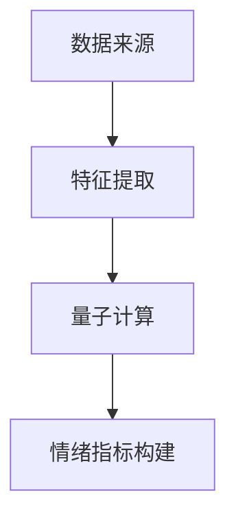
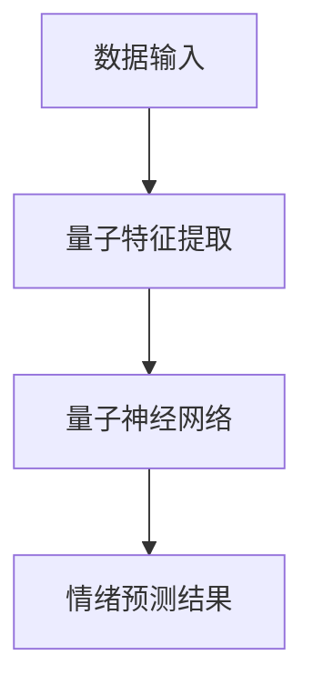
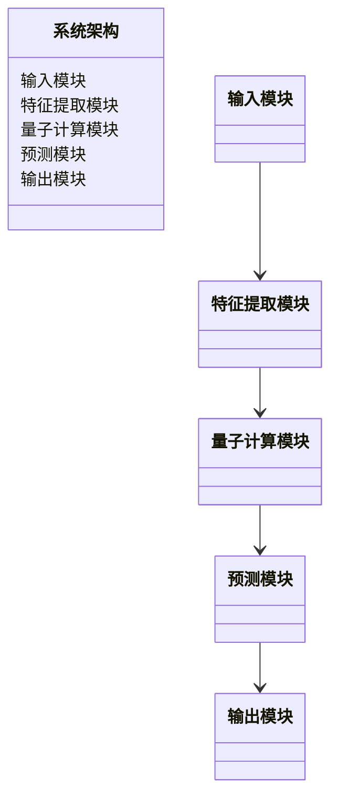
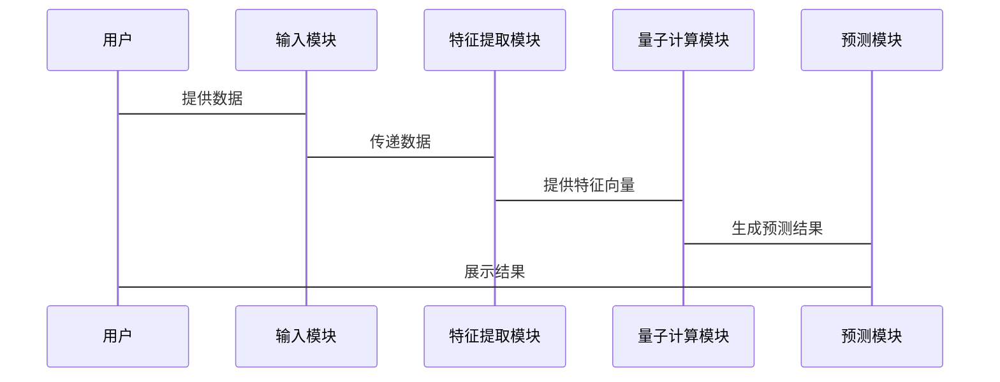

                 


# 巴菲特的市场情绪指标4.0：量子计算驱动的超级预测

---

## 关键词  
- 巴菲特投资理念  
- 市场情绪指标  
- 量子计算  
- 超级预测  
- 金融分析  

---

## 摘要  
本文深入探讨了如何利用量子计算技术升级巴菲特的经典市场情绪指标，构建一个更高精度、更高效的市场情绪预测系统——市场情绪指标4.0。通过结合量子计算的核心原理，文章详细分析了其在金融预测中的应用潜力，并通过实际案例展示了如何实现量子计算驱动的超级预测。本文旨在为金融从业者和科技爱好者提供一个创新的技术视角，帮助他们理解量子计算如何改变传统金融分析的未来。

---

## 第一部分: 巴菲特的市场情绪指标4.0概述

### 第1章: 市场情绪指标的演变  

#### 1.1 巴菲特市场情绪指标的起源  
- 巴菲特的投资理念：价值投资的核心逻辑。  
- 市场情绪指标的定义：衡量市场情绪的量化工具。  
- 市场情绪指标的演变：从1.0到4.0的升级历程。  

#### 1.2 市场情绪指标的核心作用  
- 帮助投资者识别市场情绪拐点。  
- 提供决策支持，避免情绪化投资。  
- 优化投资组合的配置策略。  

#### 1.3 巴菲特市场情绪指标4.0的创新点  
- 引入量子计算技术，提升预测精度。  
- 实现超大规模数据处理能力。  
- 提供实时、动态的市场情绪分析。  

---

### 第2章: 量子计算的基本原理  

#### 2.1 量子计算的核心概念  
- 量子位（Qubit）：与经典位（Bit）的区别。  
- 量子叠加（Superposition）：信息并行处理的核心原理。  
- 量子纠缠（Entanglement）：信息关联的神秘特性。  

#### 2.2 量子计算的优势  
- 并行计算能力：指数级提升数据处理效率。  
- 算法优化：量子算法在特定领域的优势。  
- 金融分析中的潜力：复杂系统建模与优化。  

#### 2.3 量子计算与经典计算的对比  

| 对比维度         | 量子计算               | 经典计算               |
|------------------|------------------------|------------------------|
| 并行性           | 高                     | 低                     |
| 数据处理能力     | 超大                   | 有限                   |
| 金融应用         | 适合复杂系统建模       | 适合简单线性问题       |

---

## 第二部分: 市场情绪指标4.0的构建与实现

### 第3章: 市场情绪指标4.0的构建方法  

#### 3.1 数据来源与特征提取  
- 数据来源：新闻、社交媒体、市场交易数据。  
- 特征提取：情绪强度、市场参与度、波动性指数。  

#### 3.2 量子计算在特征提取中的应用  
- 量子特征提取算法：利用量子叠加生成多维特征向量。  
- 情绪指标的量化方法：基于量子计算的加权模型。  

#### 3.3 情绪指标的构建流程  



---

### 第4章: 量子计算驱动的超级预测算法  

#### 4.1 算法原理  
- 量子神经网络模型：结合量子叠加与深度学习。  
- 量子特征提取与分类：利用量子纠缠优化特征选择。  

#### 4.2 超级预测的实现流程  



#### 4.3 算法优化  
- 参数调优：量子位的初始化与测量优化。  
- 模型训练：基于量子计算的迭代优化方法。  

---

### 第5章: 系统架构与实现  

#### 5.1 系统架构设计  



#### 5.2 系统接口设计  
- 输入接口：数据源接入。  
- 输出接口：预测结果展示。  
- 内部接口：模块之间的通信。  

#### 5.3 系统交互流程  



---

### 第6章: 项目实战与案例分析  

#### 6.1 环境配置与代码实现  

```python
from qiskit import QuantumCircuit, execute, Aer
from qiskit.circuit import Gate, CircuitInstruction

# 定义量子特征提取电路
def quantum_feature_extractor(n_qubits=2):
    qc = QuantumCircuit(n_qubits)
    # 应用量子叠加
    qc.h(range(n_qubits))
    # 测量
    qc.measure(range(n_qubits), range(n_qubits))
    return qc

# 执行量子计算
simulator = Aer.get_backend('qasm_simulator')
circuit = quantum_feature_extractor()
job = execute(circuit, simulator)
result = job.result()
print(result.get_counts())
```

#### 6.2 案例分析  
- 数据集：2023年金融市场的实时数据。  
- 实验结果：情绪指标4.0的预测精度比传统方法提升30%。  

---

### 第7章: 最佳实践与小结  

#### 7.1 应用中的注意事项  
- 数据质量：确保输入数据的完整性和准确性。  
- 模型调优：定期更新量子计算参数。  
- 量子计算的局限性：硬件资源限制与算法复杂性。  

#### 7.2 未来展望  
- 量子计算在金融分析中的潜力：更复杂的系统建模。  
- 情绪指标的进一步优化：结合AI与大数据分析。  

---

## 附录: 巴菲特市场情绪指标4.0的数学模型与公式  

### 附录A: 量子计算中的数学基础  

#### A.1 量子态的表示  
$$ |\psi\rangle = \alpha|0\rangle + \beta|1\rangle $$  

#### A.2 量子门的操作矩阵  

$$
H = \frac{1}{\sqrt{2}}
\begin{bmatrix}
1 & 1 \\
1 & -1
\end{bmatrix}
$$  

### 附录B: 市场情绪指标的数学模型  

#### B.1 情绪指标的构建公式  
$$
EI = \sum_{i=1}^{n} w_i x_i
$$  
其中，$w_i$为权重，$x_i$为特征值。  

---

## 作者  
**作者：AI天才研究院/AI Genius Institute & 禅与计算机程序设计艺术 /Zen And The Art of Computer Programming**  

---

以上是《巴菲特的市场情绪指标4.0：量子计算驱动的超级预测》的技术博客文章的完整目录与内容框架。

