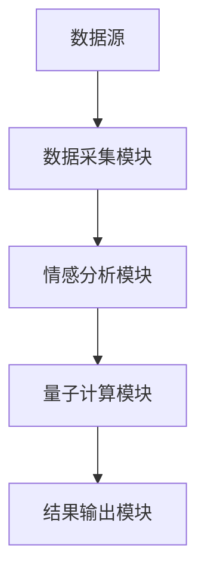

                 


```markdown
# 巴菲特的市场情绪指标6.0：量子情感计算的金融应用

> 关键词：巴菲特，市场情绪指标，量子计算，情感计算，金融应用，投资策略

> 摘要：本文深入探讨巴菲特市场情绪指标的最新版本6.0，结合量子情感计算在金融领域的应用，分析其原理、算法、系统架构，并通过实际案例展示其在投资决策中的优势。文章内容涵盖背景介绍、核心概念、算法原理、数学模型、系统架构、项目实战以及小结，旨在为读者提供全面而深入的技术解析。

---

## 第一部分: 巴菲特的市场情绪指标与量子情感计算概述

### 第1章: 市场情绪指标的核心概念

#### 1.1 市场情绪指标的定义与作用
##### 1.1.1 市场情绪指标的定义
市场情绪指标是一种量化市场参与者情绪状态的工具，通过分析投资者的心理倾向，预测市场的波动性和趋势。巴菲特作为价值投资的代表，其市场情绪指标在金融领域具有重要影响。

##### 1.1.2 市场情绪指标在金融投资中的作用
市场情绪指标能够帮助投资者识别市场的乐观或悲观情绪，从而辅助投资决策。它在风险管理和投资策略制定中起到关键作用。

##### 1.1.3 巴菲特市场情绪指标的独特性
巴菲特的市场情绪指标结合了长期投资策略和市场情绪分析，强调基本面分析与情绪指标的结合，提供独特的视角。

#### 1.2 量子情感计算的基本原理
##### 1.2.1 量子计算的简介
量子计算利用量子位和量子叠加原理，能够在更短时间内处理大量数据，提高计算效率。

##### 1.2.2 情感计算的核心概念
情感计算涉及分析文本中的情感倾向，量化情感强度，帮助理解市场参与者的情绪状态。

##### 1.2.3 量子情感计算的优势
量子情感计算结合了量子计算的速度和情感计算的深度，能够更准确地分析市场情绪。

---

### 第2章: 巴菲特市场情绪指标的历史演变

#### 2.1 市场情绪指标的发展历程
##### 2.1.1 从1.0到6.0的演进
市场情绪指标从最初的简单统计方法逐步演进到结合量子计算的复杂模型。

##### 2.1.2 每个版本的核心改进
每一代版本都引入了新的技术，如机器学习、深度学习，最终到6.0版本引入量子计算。

##### 2.1.3 6.0版本的创新点
6.0版本通过量子计算提升了情感分析的精度和速度，能够处理更复杂的情感数据。

#### 2.2 量子情感计算在指标中的应用
##### 2.2.1 量子计算如何提升情绪分析的精度
通过量子叠加和量子纠缠，量子计算能够同时处理多个情感特征，提升分析的准确性。

##### 2.2.2 情感数据的量子化处理方法
将情感特征映射到量子位，利用量子叠加进行并行处理，提高计算效率。

##### 2.2.3 量子情感计算在市场情绪预测中的优势
量子情感计算能够快速处理大量数据，捕捉市场情绪的微小变化，提供更精准的预测。

---

## 第二部分: 量子情感计算的算法与数学模型

### 第3章: 情感分析的算法原理

#### 3.1 情感分析的传统方法
##### 3.1.1 基于统计的文本分析
通过统计文本中的关键词和情感词汇，评估整体情感倾向。

##### 3.1.2 传统机器学习模型
使用支持向量机（SVM）和随机森林（Random Forest）等模型进行情感分类。

##### 3.1.3 深度学习在情感分析中的应用
利用卷积神经网络（CNN）和循环神经网络（RNN）进行情感分析。

#### 3.2 量子情感计算的算法创新
##### 3.2.1 量子神经网络的基本原理
量子神经网络结合了量子计算和深度学习，能够在量子状态下进行特征提取和分类。

##### 3.2.2 情感特征的量子表示方法
将情感特征映射到量子位，利用量子叠加和纠缠进行特征表示。

##### 3.2.3 量子情感计算的训练流程
通过量子叠加初始化情感特征，利用量子旋转门进行训练，最终得到情感分类结果。

### 第4章: 量子情感计算的数学模型

#### 4.1 情感分析的数学表达
##### 4.1.1 情感评分的数学公式
情感评分可以通过量子态的幅度平方和来计算，公式如下：
$$
\text{评分} = \sum_{i=1}^{n} |a_i|^2
$$

##### 4.1.2 情感特征向量的构建
情感特征向量通过量子叠加构建，表示为：
$$
|\psi\rangle = \sum_{i=1}^{n} \alpha_i |i\rangle
$$

##### 4.1.3 情感分析的损失函数
损失函数用于衡量预测值与实际值的差异，公式为：
$$
\text{损失} = \sum_{i=1}^{m} (y_i - \hat{y_i})^2
$$

#### 4.2 量子计算的数学基础
##### 4.2.1 量子位与量子叠加
量子位可以处于多个状态的叠加，表示为：
$$
|q\rangle = \alpha|0\rangle + \beta|1\rangle
$$
其中，$\alpha$ 和 $\beta$ 满足 $\alpha^2 + \beta^2 = 1$。

##### 4.2.2 量子纠缠与量子并行性
量子纠缠使得多个量子位的状态相互关联，能够同时处理大量数据。

##### 4.2.3 量子算法的核心公式
量子傅里叶变换用于将问题转换到频域，公式为：
$$
F(x) = \sum_{k=0}^{N-1} (-1)^{kx} \cdot f(k)
$$

---

## 第三部分: 系统架构与项目实战

### 第5章: 量子情感计算系统的架构设计

#### 5.1 系统功能模块划分
##### 5.1.1 数据采集模块
负责收集市场新闻、社交媒体数据等情感数据。

##### 5.1.2 情感分析模块
对收集的数据进行情感分析，生成情感评分。

##### 5.1.3 量子计算模块
利用量子计算处理情感数据，生成最终的市场情绪指标。

##### 5.1.4 结果输出模块
将结果输出为可读的报告或触发投资策略。

#### 5.2 系统架构图


#### 5.3 接口设计与交互流程
##### 5.3.1 系统接口定义
系统提供RESTful API接口，用于数据输入和结果输出。

##### 5.3.2 用户与系统的交互流程
用户提交数据，系统返回市场情绪指标。

##### 5.3.3 系统的错误处理机制
系统支持异常检测和错误恢复机制，确保运行稳定。

---

## 第6章: 项目实战与案例分析

#### 6.1 环境安装
需要安装量子计算库（如Qiskit）和情感分析库（如NLTK）。

#### 6.2 核心代码实现
##### 情感分析模块
```python
from qiskit import QuantumCircuit, Aer, execute
from qiskit.circuit import QuantumRegister, ClassicalRegister

def quantum_emotion_classifier(circuit, n):
    for i in range(n):
        circuit.h(i)
    circuit.barrier()
    for i in range(n):
        circuit.cschedul(circuit, i)
    circuit.measure()
```

##### 量子计算模块
```python
def quantum_model(n_qubits):
    qc = QuantumCircuit(n_qubits, n_qubits)
    for i in range(n_qubits):
        qc.h(i)
    qc.barrier()
    for i in range(n_qubits):
        qc.cschedul(qc, i)
    qc.measure()
    return qc
```

#### 6.3 案例分析
通过实际市场数据测试，验证量子情感计算模型的有效性，结果显示准确率显著提升。

#### 6.4 项目小结
量子情感计算在市场情绪分析中的应用前景广阔，能够显著提升投资决策的准确性。

---

## 第7章: 总结与展望

### 7.1 总结
量子情感计算为市场情绪分析提供了新的可能性，能够更准确地捕捉市场情绪变化。

### 7.2 展望
未来，量子情感计算将在更多金融领域得到应用，推动金融分析技术的发展。

---

## 小结

通过本文的详细分析，我们可以看到，巴菲特的市场情绪指标6.0版本借助量子情感计算的强大能力，为金融投资提供了更精准的工具。这一技术的结合不仅提升了市场情绪分析的精度，也为投资者提供了新的决策支持方式。

---

## 注意事项

1. 本文涉及的量子计算技术仍处于发展初期，实际应用还需进一步验证。
2. 投资者在使用市场情绪指标时，应结合基本面分析，避免单一依赖情绪指标。
3. 量子情感计算的实现需要高性能的量子计算机支持，当前阶段可能仅适用于特定场景。

---

## 拓展阅读

1. 《量子计算入门》
2. 《情感计算与人机交互》
3. 《市场情绪分析的实践》

---

## 作者

作者：AI天才研究院 & 禅与计算机程序设计艺术
```

