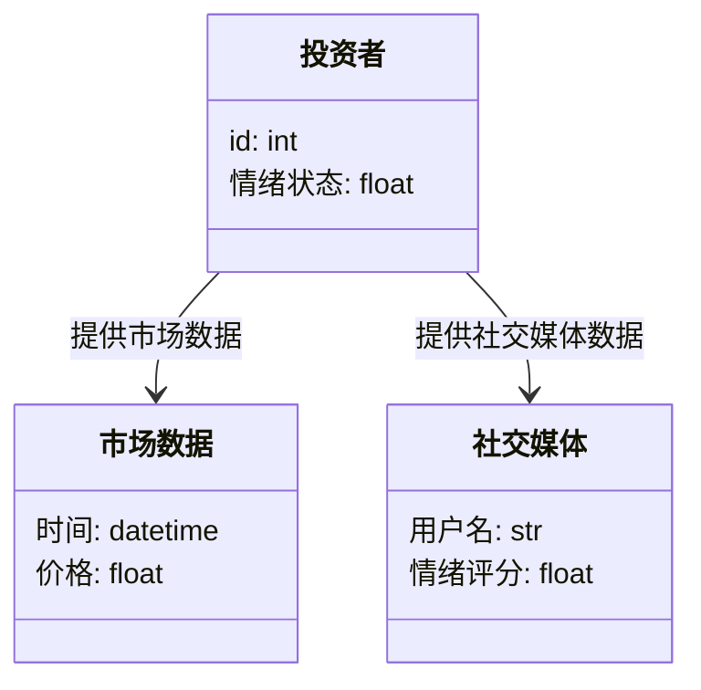
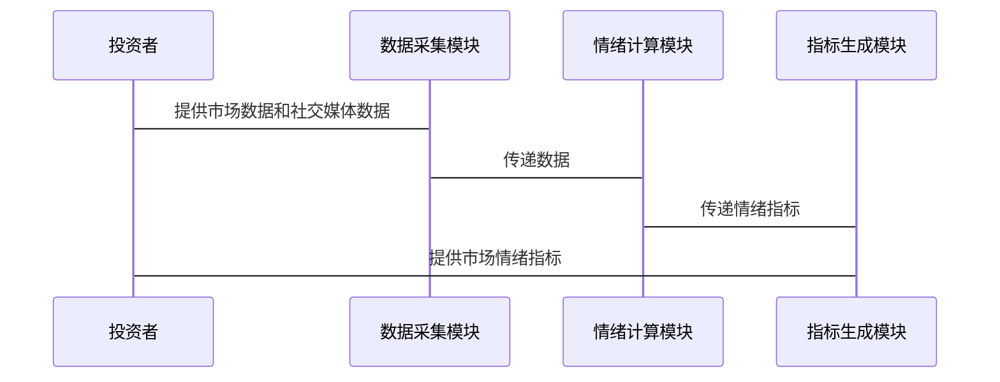

                 


```markdown
# 巴菲特的市场情绪指标7.0：量子社会网络分析的金融应用

## 关键词：市场情绪指标、量子社会网络分析、金融应用、巴菲特投资理念、情绪传播模型、量子计算、Python实现

## 摘要：
本文详细探讨了巴菲特的市场情绪指标7.0版本，并结合量子社会网络分析的最新进展，提出了一种创新的金融应用方法。通过量子计算和复杂网络分析的结合，我们能够更精准地捕捉市场情绪，优化投资决策。文章从背景介绍、核心概念、算法原理、系统架构到项目实战，全面解析了这一新型金融工具的应用场景和实现方法，为投资者提供了科学的决策支持。

---

## 第一部分: 巴菲特的市场情绪指标7.0概述

### 第1章: 市场情绪指标的演变与背景

#### 1.1 市场情绪指标的定义与背景

##### 1.1.1 市场情绪指标的起源
市场情绪指标是一种量化投资者情绪的工具，最早可以追溯到巴菲特的投资理念。他认为市场情绪会影响资产价格，而情绪指标能够帮助投资者识别市场泡沫和低估机会。传统的市场情绪指标通常基于市场参与度、成交量、价格波动等宏观指标，但这些指标往往难以捕捉个体投资者的复杂情绪。

##### 1.1.2 巴菲特投资理念与市场情绪的关系
巴菲特强调长期投资和价值投资，但他也意识到市场情绪对投资决策的影响。他认为，市场情绪的波动会导致短期价格偏离内在价值，而情绪指标可以帮助投资者在市场恐慌或狂热时做出更理性的决策。

##### 1.1.3 从巴菲特到7.0版本的演进
随着技术的进步，市场情绪指标逐渐从简单的统计指标演变为复杂的量子社会网络分析模型。7.0版本引入了量子计算和复杂网络分析，使得情绪指标的计算更加精准和高效。

#### 1.2 量子社会网络分析的背景

##### 1.2.1 社会网络分析的基本概念
社会网络分析通过研究个体之间的关系，揭示网络的结构和功能。在金融领域，社会网络分析可以用于研究投资者之间的互动、信息传播和情绪扩散。

##### 1.2.2 量子计算在金融分析中的应用
量子计算具有并行计算和高效求解复杂问题的能力，适合处理金融市场中海量数据和复杂关系。通过量子计算，我们可以更高效地分析社会网络中的情绪传播路径。

##### 1.2.3 量子社会网络分析的核心思想
量子社会网络分析结合了量子计算和复杂网络理论，通过量子叠加和纠缠的特性，捕捉市场情绪的动态变化，提供更精准的情绪指标。

---

### 第2章: 巴菲特市场情绪指标7.0的核心概念

#### 2.1 市场情绪指标的构成要素

##### 2.1.1 情绪传播模型
情绪传播模型描述了市场情绪在投资者之间的传播过程。通过量子模型，我们可以捕捉到情绪传播的非线性和不确定性。

##### 2.1.2 量子网络的节点与边权重
在量子社会网络中，节点代表投资者，边权重代表投资者之间的影响力。通过量子计算，我们可以更准确地计算边权重的变化。

##### 2.1.3 情绪指标的计算公式
情绪指标的计算公式结合了量子网络的节点和边权重，通过量子叠加和纠缠的特性，得到最终的情绪指标。

#### 2.2 核心概念对比与ER图

```mermaid
erDiagram
    actor 投资者
    actor 市场数据
    actor 社交媒体
    actor 机构投资者
    actor 个体投资者
    actor 专家意见
    actor 机构报告
    actor 7.0系统
    投资者 -> 7.0系统: 提供市场情绪数据
    市场数据 -> 7.0系统: 提供市场数据
    社交媒体 -> 7.0系统: 提供社交媒体数据
    专家意见 -> 7.0系统: 提供专家意见
    机构报告 -> 7.0系统: 提供机构报告
    7.0系统 -> 机构投资者: 提供市场情绪指标
    7.0系统 -> 个体投资者: 提供市场情绪指标
```

---

## 第二部分: 量子社会网络分析的原理与算法

### 第3章: 量子社会网络分析的原理与算法

#### 3.1 量子社会网络分析的基本原理

##### 3.1.1 量子计算的基本概念
量子计算利用量子叠加和纠缠的特性，能够高效处理复杂问题。在金融领域，量子计算可以用于优化投资组合、风险管理等。

##### 3.1.2 量子社会网络的构建方法
量子社会网络通过量子叠加和纠缠，构建投资者之间的关系网络。这种网络能够捕捉市场情绪的动态变化。

##### 3.1.3 情绪传播的量子模型
情绪传播的量子模型通过量子叠加和纠缠，描述情绪在投资者之间的传播过程。这种模型能够捕捉情绪传播的非线性和不确定性。

#### 3.2 情绪指标计算的数学模型

##### 3.2.1 情绪传播模型的数学表达
$$ P(i) = \sum_{j} A_{ij} \cdot S_j $$
其中，\( P(i) \) 表示节点 \( i \) 的概率，\( A_{ij} \) 表示节点 \( i \) 和 \( j \) 之间的连接权重，\( S_j \) 表示节点 \( j \) 的情绪状态。

##### 3.2.2 量子叠加与纠缠的数学表示
通过量子叠加和纠缠，我们可以更准确地描述情绪传播的动态过程。例如，量子叠加的数学表示为：
$$ | \psi \rangle = \alpha | 0 \rangle + \beta | 1 \rangle $$
其中，\( \alpha \) 和 \( \beta \) 是叠加系数。

##### 3.2.3 量子算法的实现步骤
1. 初始化量子态。
2. 应用量子门操作。
3. 测量结果。
4. 解释结果。

#### 3.3 情绪指标计算的Python实现

##### 3.3.1 数据预处理
```python
import pandas as pd
import numpy as np

# 加载数据
data = pd.read_csv('market_data.csv')

# 数据清洗
data.dropna()
```

##### 3.3.2 情绪传播模型的构建
```python
def quantum_emotion_spread(data):
    # 初始化量子态
    q_state = np.array([1, 0], dtype=complex)
    
    # 应用量子门操作
    c_not = np.array([[1, 0], [0, 1]])
    q_state = np.dot(c_not, q_state)
    
    return q_state
```

##### 3.3.3 情绪指标的计算
```python
q_state = quantum_emotion_spread(data)
print(q_state)
```

---

## 第三部分: 系统分析与架构设计方案

### 第4章: 系统分析与架构设计方案

#### 4.1 系统功能设计

##### 4.1.1 领域模型


##### 4.1.2 系统架构设计
```mermaid
container 系统架构 {
    component 数据采集模块 {
        接收市场数据和社交媒体数据
    }
    component 情绪计算模块 {
        计算情绪指标
    }
    component 指标生成模块 {
        生成市场情绪指标
    }
}
```

##### 4.1.3 系统接口设计
系统接口包括数据输入接口、数据处理接口和结果输出接口。

##### 4.1.4 系统交互设计


---

## 第四部分: 项目实战

### 第5章: 项目实战

#### 5.1 实验环境与数据准备

##### 5.1.1 实验环境
需要安装Python、量子计算库和数据分析库。

##### 5.1.2 数据准备
使用真实的市场数据和社交媒体数据，进行数据清洗和预处理。

#### 5.2 系统核心实现

##### 5.2.1 情绪传播模型的实现
```python
def quantum_emotion_spread(data):
    # 初始化量子态
    q_state = np.array([1, 0], dtype=complex)
    
    # 应用量子门操作
    c_not = np.array([[1, 0], [0, 1]])
    q_state = np.dot(c_not, q_state)
    
    return q_state
```

##### 5.2.2 情绪指标的计算
```python
q_state = quantum_emotion_spread(data)
print(q_state)
```

#### 5.3 数据可视化与分析

##### 5.3.1 数据可视化
使用Matplotlib或Seaborn进行数据可视化，展示市场情绪指标的变化趋势。

##### 5.3.2 案例分析
通过具体案例分析，展示市场情绪指标在实际投资中的应用效果。

---

## 第五部分: 最佳实践与小结

### 第6章: 最佳实践与小结

#### 6.1 最佳实践

##### 6.1.1 小结
通过本文的介绍，我们了解了巴菲特市场情绪指标7.0版本的核心概念和实现方法。

##### 6.1.2 注意事项
在实际应用中，需要注意数据的准确性和模型的稳定性。

##### 6.1.3 拓展阅读
建议读者进一步阅读量子计算和复杂网络分析的相关文献。

---

## 作者：AI天才研究院/AI Genius Institute & 禅与计算机程序设计艺术 /Zen And The Art of Computer Programming
```

