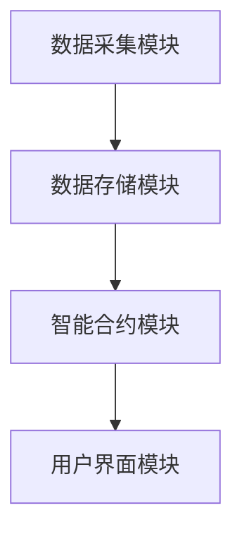

                 


# 巴菲特的市场情绪指标：区块链技术在金融市场的应用

## 关键词：市场情绪指标，区块链技术，金融市场，巴菲特，智能合约

## 摘要：本文探讨了巴菲特的市场情绪指标在金融市场中的应用，并深入分析了区块链技术如何提升市场情绪分析的效率和准确性。通过区块链技术的分布式账本、共识机制和智能合约，我们可以实现市场情绪数据的透明化和自动化分析。文章结合理论与实践，详细介绍了区块链技术在市场情绪分析中的具体应用场景，为投资者和金融机构提供了新的思路和解决方案。

---

# 第1章：市场情绪指标概述

## 1.1 巴菲特的市场情绪指标

### 1.1.1 市场情绪指标的定义

市场情绪指标是反映金融市场参与者情绪状态的量化工具。巴菲特认为，市场情绪波动是投资决策的重要参考，尤其是在市场恐慌或狂热时，往往会出现非理性定价。市场情绪指标通常包括投资者信心指数、市场波动率、交易量等指标。

### 1.1.2 市场情绪指标的核心要素

1. **投资者信心**：反映市场参与者对市场的看法，通常通过问卷调查或情绪分析工具获取。
2. **市场波动率**：衡量市场的波动程度，通常通过标准差或波动率指标计算。
3. **交易量**：反映市场活跃度，高交易量可能意味着市场情绪高涨或恐慌。
4. **市场参与度**：包括投资者数量、资金流入流出等。

### 1.1.3 巴菲特市场情绪指标的哲学与实践

巴菲特强调长期投资和价值投资，但他也关注市场情绪对投资决策的影响。他认为，在市场恐慌时买入，在市场狂热时卖出，可以获取超额收益。市场情绪指标帮助投资者识别市场的非理性状态，从而做出更明智的投资决策。

## 1.2 区块链技术在金融市场的应用前景

### 1.2.1 区块链技术的基本概念

区块链是一种分布式账本技术，通过去中心化的共识机制确保数据的安全性和不可篡改性。区块链的核心特征包括去中心化、透明性、不可篡改性和高效性。

### 1.2.2 区块链在金融市场的优势

1. **安全性**：区块链通过加密技术和分布式网络，确保数据的安全性和抗篡改性。
2. **透明性**：所有交易记录在区块链上公开透明，便于监管和审计。
3. **高效性**：区块链通过智能合约自动化交易和结算，减少中间环节，提高效率。

### 1.2.3 区块链技术与市场情绪分析的结合

区块链技术可以为市场情绪分析提供实时、透明的数据支持。通过区块链平台，投资者可以实时获取市场情绪数据，并利用智能合约自动执行投资策略。

## 1.3 本章小结

本章介绍了市场情绪指标的定义和核心要素，并探讨了区块链技术在金融市场的应用前景。区块链技术的去中心化、透明性和高效性为市场情绪分析提供了新的可能性。

---

# 第2章：区块链技术核心概念

## 2.1 分布式账本与共识机制

### 2.1.1 分布式账本的定义与特点

分布式账本是一种去中心化的记录方式，所有参与者共享同一份账本，确保数据的一致性和可靠性。

### 2.1.2 共识机制的类型与原理

共识机制是区块链的核心技术之一，常见的共识机制包括工作量证明（PoW）、权益证明（PoS）、 delegated proof of stake（DPoS）等。

### 2.1.3 区块链的去中心化特性

去中心化是区块链的核心特征之一，通过去中心化的网络结构，避免单点故障和权力集中。

### 2.1.4 分布式账本与市场情绪分析

通过分布式账本技术，可以实时记录市场情绪数据，并确保数据的透明性和不可篡改性。

## 2.2 智能合约与区块链平台

### 2.2.1 智能合约的定义与功能

智能合约是区块链上的自动化程序，用于自动执行合同条款。它可以在区块链网络上自动执行交易、结算和支付。

### 2.2.2 主流区块链平台介绍

1. **比特币（Bitcoin）**：最早的区块链平台，主要用于加密货币的交易。
2. **以太坊（Ethereum）**：支持智能合约的区块链平台，广泛应用于去中心化应用（DApps）。
3. **Hyperledger Fabric**：企业级区块链平台，支持可扩展性和模块化设计。

### 2.2.3 智能合约的安全性与可靠性

智能合约的安全性依赖于区块链平台的共识机制和代码质量。通过严格的代码审计和测试，可以确保智能合约的安全性和可靠性。

## 2.3 区块链的交易与数据存储

### 2.3.1 区块链交易的流程与特点

区块链交易通常包括发起交易、广播交易、验证交易、记录交易到区块、确认交易等步骤。

### 2.3.2 区块链数据存储的结构

区块链数据存储通常采用链式结构，每个区块包含交易数据和哈希指针。

### 2.3.3 区块链数据的不可篡改性

区块链数据通过加密技术和共识机制，确保数据的不可篡改性和不可删除性。

## 2.4 本章小结

本章详细介绍了区块链技术的核心概念，包括分布式账本、共识机制、智能合约和数据存储结构。这些技术为市场情绪分析提供了强有力的支持。

---

# 第3章：市场情绪指标的区块链实现

## 3.1 市场情绪数据的分布式存储

### 3.1.1 数据分布式存储的原理

通过区块链的分布式账本技术，市场情绪数据可以在多个节点上同步存储，确保数据的高可用性和可靠性。

### 3.1.2 区块链在数据存储中的优势

1. **高可用性**：数据分布在多个节点上，单个节点故障不会导致数据丢失。
2. **透明性**：所有节点都可以访问数据，确保数据的透明性和公正性。
3. **不可篡改性**：数据一旦写入区块链，无法被篡改或删除。

### 3.1.3 数据存储的去中心化架构

通过去中心化的网络结构，市场情绪数据可以在多个节点上同步存储，确保数据的安全性和一致性。

## 3.2 智能合约在市场情绪分析中的应用

### 3.2.1 智能合约的定义与功能

智能合约可以自动执行市场情绪分析的逻辑，例如根据市场波动率触发预警或自动调整投资策略。

### 3.2.2 智能合约在市场情绪分析中的实现

通过编写智能合约，可以实现市场情绪数据的自动采集、分析和响应。例如，当市场波动率超过阈值时，智能合约可以自动触发警报或执行交易。

### 3.2.3 智能合约的安全性与可靠性

智能合约的安全性依赖于区块链平台的共识机制和代码质量。通过严格的代码审计和测试，可以确保智能合约的安全性和可靠性。

## 3.3 市场情绪指标的区块链共识机制

### 3.3.1 共识机制在市场情绪分析中的作用

通过共识机制，可以确保市场情绪数据的一致性和可靠性。所有节点必须达成一致，才能确认数据的有效性。

### 3.3.2 区块链共识机制的选择

根据具体需求选择合适的共识机制，例如在高交易量的场景下，可以选择权益证明（PoS）或 delegated proof of stake（DPoS）等高效共识机制。

### 3.3.3 共识机制对市场情绪分析的影响

共识机制的效率和安全性直接影响市场情绪分析的实时性和准确性。高效的共识机制可以确保市场情绪数据的实时更新和快速响应。

## 3.4 本章小结

本章详细介绍了市场情绪指标的区块链实现，包括数据的分布式存储、智能合约的应用和共识机制的选择。区块链技术为市场情绪分析提供了高效、透明和可靠的支持。

---

# 第4章：基于区块链的市场情绪分析系统设计

## 4.1 系统功能设计

### 4.1.1 系统功能模块

1. **数据采集模块**：实时采集市场情绪数据，包括交易量、波动率等指标。
2. **数据存储模块**：将市场情绪数据存储在区块链上，确保数据的安全性和不可篡改性。
3. **智能合约模块**：编写智能合约，实现市场情绪分析的自动化逻辑。
4. **用户界面模块**：提供直观的用户界面，供投资者查看和分析市场情绪数据。

### 4.1.2 系统功能流程

1. 数据采集模块实时采集市场情绪数据，并将数据传输到数据存储模块。
2. 数据存储模块将数据存储在区块链上，并生成唯一的哈希值。
3. 智能合约模块根据预设的逻辑，对存储的数据进行分析，并触发相应的预警或交易。
4. 用户界面模块将分析结果展示给投资者，供其参考决策。

### 4.1.3 系统功能设计的注意事项

1. 数据采集的实时性和准确性是系统设计的关键。
2. 智能合约的编写需要考虑安全性，避免漏洞被利用。
3. 用户界面的设计需要直观易用，方便投资者快速获取信息。

## 4.2 系统架构设计

### 4.2.1 系统架构图



### 4.2.2 系统组件之间的关系

数据采集模块负责采集数据，数据存储模块负责存储数据，智能合约模块负责分析数据并触发预警，用户界面模块负责展示数据。

## 4.3 系统接口设计

### 4.3.1 数据接口

1. 数据采集接口：用于实时采集市场情绪数据。
2. 数据存储接口：用于将数据存储在区块链上。
3. 数据查询接口：用于查询市场情绪数据。

### 4.3.2 智能合约接口

1. 分析接口：用于分析市场情绪数据。
2. 预警接口：用于触发预警或交易。

## 4.4 系统交互设计

### 4.4.1 系统交互流程

1. 投资者通过用户界面模块提交数据采集请求。
2. 数据采集模块采集数据并传输到数据存储模块。
3. 数据存储模块将数据存储在区块链上，并生成唯一的哈希值。
4. 智能合约模块根据预设的逻辑，对存储的数据进行分析，并触发相应的预警或交易。
5. 用户界面模块将分析结果展示给投资者。

### 4.4.2 交互设计的注意事项

1. 系统交互流程需要简洁明了，确保操作的高效性。
2. 用户界面设计需要直观易用，减少用户的操作负担。

## 4.5 本章小结

本章详细介绍了基于区块链的市场情绪分析系统的功能设计、架构设计和交互设计。通过合理的设计，可以实现市场情绪数据的实时采集、存储和分析，为投资者提供有力的支持。

---

# 第5章：区块链技术在市场情绪分析中的算法实现

## 5.1 算法原理

### 5.1.1 算法流程

1. 数据采集：实时采集市场情绪数据。
2. 数据预处理：对数据进行清洗和标准化处理。
3. 数据分析：使用机器学习算法分析市场情绪数据。
4. 智能合约触发：根据分析结果触发预警或交易。

### 5.1.2 算法实现的数学模型

$$ market\_mood = \alpha \times volatility + \beta \times volume + \gamma \times sentiment $$

其中，$\alpha$, $\beta$, $\gamma$ 是权重系数，$volatility$ 是市场波动率，$volume$ 是交易量，$sentiment$ 是市场情绪指数。

## 5.2 算法实现的步骤

### 5.2.1 数据采集

通过API接口实时采集市场情绪数据，包括交易量、波动率、市场情绪指数等。

### 5.2.2 数据预处理

对采集的数据进行清洗和标准化处理，确保数据的准确性和一致性。

### 5.2.3 数据分析

使用机器学习算法对预处理后的数据进行分析，生成市场情绪指数。

### 5.2.4 智能合约触发

根据分析结果，智能合约自动触发预警或交易。

## 5.3 算法实现的注意事项

1. 数据采集的实时性和准确性是算法实现的关键。
2. 数据预处理的合理性直接影响分析结果。
3. 智能合约的编写需要考虑安全性，避免漏洞被利用。

## 5.4 本章小结

本章详细介绍了区块链技术在市场情绪分析中的算法实现，包括算法流程、数学模型和实现步骤。通过合理的设计和实现，可以提高市场情绪分析的准确性和效率。

---

# 第6章：项目实战——基于区块链的市场情绪分析系统

## 6.1 项目背景

随着金融市场的发展，市场情绪分析越来越重要。通过区块链技术，可以实现市场情绪数据的实时采集、存储和分析，为投资者提供有力的支持。

## 6.2 项目需求分析

1. 实时采集市场情绪数据。
2. 将数据存储在区块链上，确保数据的安全性和不可篡改性。
3. 使用智能合约实现市场情绪分析的自动化逻辑。
4. 提供直观的用户界面，供投资者查看和分析市场情绪数据。

## 6.3 项目设计

### 6.3.1 系统架构设计


### 6.3.2 数据流设计


## 6.4 项目实现

### 6.4.1 环境搭建

1. 安装区块链平台（例如以太坊）。
2. 安装智能合约开发工具（例如Solidity）。
3. 安装数据采集工具（例如API接口）。

### 6.4.2 核心代码实现

#### 6.4.2.1 数据采集模块

```python
import requests

def get_market_data():
    response = requests.get('https://api.example.com/market_data')
    return response.json()
```

#### 6.4.2.2 数据存储模块

```solidity
contract MarketData {
    event MarketMood(bytes32 _moodHash, uint _moodValue);
    
    function storeMarketMood(uint _moodValue) {
        bytes32 moodHash = keccak256(abi.encode(_moodValue));
        emit MarketMood(moodHash, _moodValue);
    }
}
```

#### 6.4.2.3 智能合约模块

```solidity
contract MarketAnalyzer {
    function analyzeMarketMood(bytes32 _moodHash) {
        // 实现市场情绪分析逻辑
    }
}
```

#### 6.4.2.4 用户界面模块

```html
<!DOCTYPE html>
<html>
<head>
    <title>市场情绪分析</title>
</head>
<body>
    <div id="moodDisplay"></div>
    <script>
        function updateMood() {
            fetch('https://api.example.com/market_mood')
                .then(response => response.json())
                .then(data => {
                    document.getElementById('moodDisplay').innerHTML = data.mood;
                });
        }
        setInterval(updateMood, 60000);
    </script>
</body>
</html>
```

### 6.4.3 项目小结

通过以上代码实现，可以构建一个基于区块链的市场情绪分析系统，实现数据的实时采集、存储和分析，并通过用户界面展示分析结果。

---

# 第7章：系统优化与扩展

## 7.1 系统优化

### 7.1.1 性能优化

通过优化区块链平台的共识机制和网络传输效率，可以提高系统的性能。

### 7.1.2 安全性优化

通过加强智能合约的安全性，例如进行代码审计和漏洞扫描，可以提高系统的安全性。

## 7.2 系统扩展

### 7.2.1 功能扩展

1. 增加更多市场情绪指标，例如投资者信心指数、市场参与度等。
2. 实现多资产市场的市场情绪分析。

### 7.2.2 技术扩展

1. 引入大数据技术，提高市场情绪分析的深度和广度。
2. 结合人工智能技术，实现更智能的市场情绪分析。

## 7.3 本章小结

本章详细介绍了基于区块链的市场情绪分析系统的优化与扩展，包括性能优化、安全性优化、功能扩展和技术扩展。通过优化和扩展，可以进一步提高系统的性能和功能。

---

# 第8章：总结与展望

## 8.1 总结

本文详细探讨了巴菲特的市场情绪指标在金融市场中的应用，并深入分析了区块链技术如何提升市场情绪分析的效率和准确性。通过区块链技术的分布式账本、共识机制和智能合约，我们可以实现市场情绪数据的透明化和自动化分析。

## 8.2 展望

未来，随着区块链技术的不断发展，市场情绪分析将更加智能化和自动化。通过引入更多先进技术，如人工智能和大数据，市场情绪分析将为投资者提供更有力的支持。

---

# 作者：AI天才研究院/AI Genius Institute & 禅与计算机程序设计艺术 /Zen And The Art of Computer Programming

---

以上是《巴菲特的市场情绪指标：区块链技术在金融市场的应用》的完整目录大纲和文章内容。

