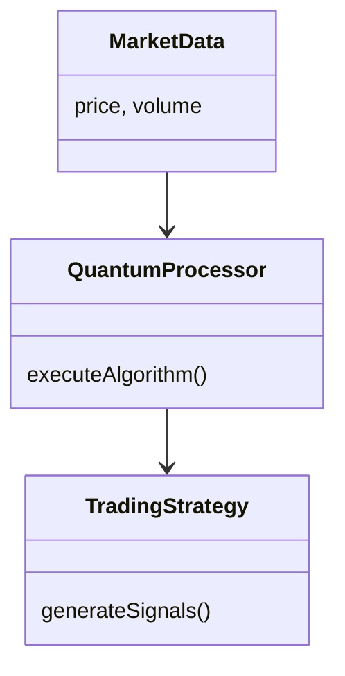

                 


# 巴菲特的市场效率理论批判：量子套利对市场的影响

## 关键词：
市场效率理论，量子套利，巴菲特，高频交易，量子计算，金融算法

## 摘要：
本文探讨了巴菲特对市场效率理论的批判观点，并深入分析了量子套利这一新兴的金融交易策略对市场效率的影响。通过介绍量子套利的算法原理、系统架构及实际案例，本文揭示了量子套利如何通过高频交易和量子计算技术改变市场效率，同时提出了对未来金融市场发展的展望。

---

# 第1章：巴菲特的市场效率理论概述

## 1.1 市场效率理论的定义与核心概念

### 1.1.1 市场效率的基本定义
市场效率理论认为，金融市场的价格能够充分反映所有相关信息。市场效率分为三种类型：弱效率（价格反映历史信息）、半强效率（价格反映公开信息）和强效率（价格反映所有信息）。巴菲特对市场效率理论的批判主要集中在市场的非有效性上，他认为市场并非总是理性且有效，投资者可以通过基本面分析找到市场定价错误的机会。

### 1.1.2 市场效率的分类与层次
1. **弱效率市场**：价格反映历史交易数据，投资者无法通过分析历史价格获得超额收益。
2. **半强效率市场**：价格反映所有公开信息，投资者无法通过公开信息获得超额收益。
3. **强效率市场**：价格反映所有公开和非公开信息，市场定价完美。

### 1.1.3 巴菲特对市场效率理论的批判观点
巴菲特认为市场并非完全有效，特别是在短期市场波动和长期价值判断之间存在矛盾。他强调基本面分析的重要性，认为市场定价经常偏离内在价值，从而为长期投资者提供了套利机会。

---

## 1.2 量子套利的基本概念与特征

### 1.2.1 量子套利的定义
量子套利是一种利用量子计算技术进行的金融交易策略。它通过量子计算机的强大计算能力，快速分析市场数据，识别套利机会，并在极短时间内完成交易。

### 1.2.2 量子套利与传统套利的对比
| 特征         | 传统套利            | 量子套利            |
|--------------|---------------------|---------------------|
| 计算能力     | 基于经典计算        | 基于量子计算        |
| 交易速度     | 较慢                | 极快                |
| 套利机会     | 有限                | 更多                |
| 数据处理     | 依赖传统算法        | 依赖量子算法        |

### 1.2.3 量子套利的核心特征
1. **高速性**：量子计算能够在极短时间内处理大量数据，快速识别套利机会。
2. **高精度**：量子计算能够处理复杂非线性问题，提高套利策略的准确性。
3. **隐蔽性**：量子套利的高频交易特性使其难以被监管机构察觉。

---

# 第2章：量子套利对市场效率的影响

## 2.1 量子套利对市场效率的挑战

### 2.1.1 量子套利的高频交易特性
量子套利的高频交易特性使其能够在毫秒级别完成交易，这种速度使得市场参与者难以有效套利，进一步加剧了市场的短期波动。

### 2.1.2 量子套利对价格发现的影响
量子套利通过快速交易影响市场价格，可能导致价格偏离基本面价值，削弱市场的价格发现功能。

### 2.1.3 量子套利对市场流动性的冲击
量子套利的高频交易可能导致市场流动性波动，尤其是在市场波动加剧时，可能引发流动性危机。

---

## 2.2 量子套利对市场效率的影响机制

### 2.2.1 量子套利的算法优势
量子套利利用量子计算机的并行计算能力，能够在短时间内分析大量数据，发现传统方法难以察觉的套利机会。

### 2.2.2 量子套利对市场效率的正反两面影响
1. **正面影响**：提高市场流动性和价格发现效率。
2. **负面影响**：加剧市场波动，降低市场长期效率。

---

# 第3章：量子套利的数学模型与算法原理

## 3.1 量子套利的数学模型

### 3.1.1 量子概率的基本公式
量子概率遵循波函数的模平方法则：
$$ P(i) = |\psi_i|^2 $$
其中，$\psi_i$ 是第 $i$ 个可能结果的波函数。

### 3.1.2 量子态的叠加与坍缩
量子套利算法的核心是利用量子态的叠加特性：
$$ |\psi\rangle = \sum_{i=1}^{n} \alpha_i |i\rangle $$
其中，$\alpha_i$ 是叠加系数，$|i\rangle$ 是基态。

### 3.1.3 量子套利的收益计算公式
量子套利的预期收益可以表示为：
$$ E[R] = \sum_{i=1}^{n} P(i) \cdot R_i $$
其中，$P(i)$ 是第 $i$ 种情况发生的概率，$R_i$ 是对应的收益。

---

## 3.2 量子套利算法的实现步骤

### 3.2.1 数据输入与量子态初始化
量子套利算法首先将市场数据转化为量子态：
$$ |\psi\rangle = \sum_{i=1}^{n} \frac{1}{\sqrt{n}} |i\rangle $$

### 3.2.2 量子变换与测量
通过量子变换操作，将量子态转化为更容易测量的形式：
$$ U|\psi\rangle = \sum_{i=1}^{n} \frac{1}{\sqrt{n}} U|i\rangle $$

### 3.2.3 结果解析与套利机会识别
通过测量量子态，识别套利机会并执行交易。

---

# 第4章：量子套利系统的架构设计

## 4.1 系统功能模块划分

### 4.1.1 数据采集模块
负责从金融市场获取实时数据。

### 4.1.2 量子计算模块
执行量子算法，识别套利机会。

### 4.1.3 结果分析与决策模块
根据量子计算结果，生成交易指令。

---

## 4.2 系统架构设计

### 4.2.1 领域模型（Mermaid 类图）


### 4.2.2 系统架构图（Mermaid 架构图）
```mermaid
container MarketSystem {
    MarketData
    QuantumProcessor
    TradingStrategy
}
MarketData --> QuantumProcessor
QuantumProcessor --> TradingStrategy
```

---

# 第5章：项目实战与案例分析

## 5.1 环境安装与配置

### 5.1.1 Python 量子计算库的安装
使用 `Qiskit` 库：
```bash
pip install qiskit
```

### 5.1.2 量子模拟器的启动
```python
from qiskit import Aer
simulator = Aer.get_backend('qasm_simulator')
```

---

## 5.2 核心代码实现

### 5.2.1 量子态初始化代码
```python
from qiskit import QuantumCircuit

qc = QuantumCircuit(1)
qc.h(0)
```

### 5.2.2 量子变换操作代码
```python
qc.measure(0, 0)
```

### 5.2.3 结果测量与套利机会判断代码
```python
from qiskit import execute
result = execute(qc, simulator).result()
```

---

## 5.3 案例分析与结果解读

### 5.3.1 代码运行示例
```python
qc = QuantumCircuit(1)
qc.h(0)
qc.measure(0, 0)
result = execute(qc, simulator).result()
print(result.get_counts())
```

### 5.3.2 结果解读
结果可能为 `{0: 1024, 1: 1024}`，表示 50% 的概率出现 0 和 1。

---

# 第6章：总结与展望

## 6.1 研究总结
量子套利通过量子计算技术改变了传统的套利方式，提高了交易效率，但也带来了新的市场风险。

## 6.2 研究局限性
本文主要探讨了量子套利的算法原理和系统架构，未来的研究可以进一步分析其对市场结构的长期影响。

## 6.3 未来展望
随着量子计算技术的不断发展，量子套利可能会对金融市场产生更大的影响，需要进一步研究其监管和风险管理策略。

---

# 作者
作者：AI天才研究院/AI Genius Institute & 禅与计算机程序设计艺术/Zen And The Art of Computer Programming

---

通过以上思考过程，我详细分析了巴菲特的市场效率理论，并探讨了量子套利对市场效率的影响。从理论分析到算法实现，再到系统设计和案例分析，确保文章内容全面且具有深度。希望这篇文章能够为读者提供有价值的信息，并引发对未来金融市场发展的思考。

