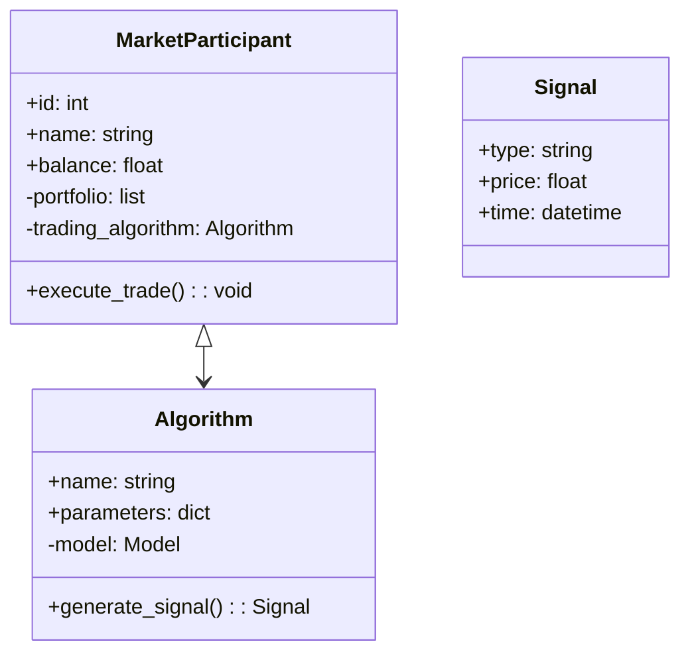
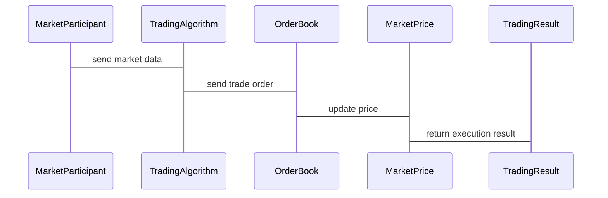

                 


# 巴菲特的市场效率理论批判：高频交易和算法偏差

---

## 关键词
巴菲特，市场效率理论，高频交易，算法交易，算法偏差，金融市场，技术分析，金融监管

---

## 摘要
本文从巴菲特的市场效率理论出发，结合高频交易和算法交易的兴起，深入分析算法偏差对市场效率的影响。通过对比传统交易与高频交易，探讨算法偏差的定义、来源及其对市场公平性和价格发现机制的破坏。结合数学模型和Python代码模拟，分析算法偏差的传播机制和影响范围。最后，提出减少算法偏差的技术手段和监管建议。

---

## 第一部分：背景介绍

### 第1章：巴菲特市场效率理论的背景与问题背景

#### 1.1 巴菲特市场效率理论的背景
- **巴菲特投资理念的核心思想**：价值投资、长期投资、避免短期波动。
- **市场效率理论的定义与内涵**：市场是否充分反映所有信息，分为弱有效、强有效和半强有效。
- **巴菲特对市场效率的批判与贡献**：强调市场短期波动的非有效性，但长期趋向有效。

#### 1.2 高频交易与算法交易的兴起
- **高频交易的定义与特点**：利用算法在极短时间内完成大量交易，依赖高速网络和高性能计算机。
- **算法交易的原理与发展**：基于数学模型和统计套利，算法自动决策交易时机和价格。
- **高频交易与市场效率的关系**：高频交易提高了交易速度，但也可能加剧市场波动。

#### 1.3 算法偏差的定义与问题描述
- **算法偏差的定义**：算法在交易过程中产生的与预期结果不符的现象。
- **算法偏差的来源与表现**：数据延迟、算法错误、市场微观结构问题。
- **算法偏差对市场效率的影响**：破坏价格发现机制，加剧市场波动。

#### 1.4 巴菲特市场效率理论与高频交易的结合
- **巴菲特理论与高频交易的关联**：巴菲特关注长期价值，而高频交易关注短期波动。
- **算法偏差对市场效率的挑战**：算法偏差可能导致价格偏离基本面，降低市场效率。
- **巴菲特理论在高频交易中的应用前景**：结合长期价值与短期波动，寻找市场失衡点。

#### 1.5 本章小结
本章介绍了巴菲特市场效率理论的背景，高频交易和算法交易的兴起，以及算法偏差的定义和影响，为后续分析奠定了基础。

---

## 第二部分：高频交易与算法偏差的核心概念与联系

### 第2章：高频交易与传统交易的对比分析

#### 2.1 高频交易的核心原理
- **高频交易的执行机制**：利用算法快速捕捉市场机会，基于算法模型生成交易信号。
- **算法交易的策略类型**：统计套利、高频套利、基于机器学习的算法交易。
- **高频交易的技术实现**：依赖低延迟网络、高性能计算和高效交易系统。

#### 2.2 算法偏差的属性特征对比
- **算法偏差的分类与特征**：
  - 数据偏差：输入数据的不准确或延迟。
  - 算法逻辑偏差：算法逻辑错误或模型假设不合理。
  - 执行偏差：交易执行过程中的延迟或错误。
- **不同算法偏差对市场的影响**：
  - 数据偏差：可能导致交易决策失误，加剧市场波动。
  - 算法逻辑偏差：可能导致错误的交易信号，引发市场异常波动。
  - 执行偏差：可能导致订单未按预期执行，影响市场流动性。

#### 2.3 高频交易与算法偏差的实体关系图


---

### 第3章：算法偏差对市场效率的影响

#### 3.1 算法偏差的数学模型与公式
- **算法偏差的定义公式**：
  $$ \text{偏差} = \text{实际结果} - \text{预期结果} $$
- **算法偏差对市场价的影响**：
  $$ P_{\text{实际}} = P_{\text{预期}} + \delta $$
  其中，$\delta$ 为算法偏差引起的偏离。

#### 3.2 算法偏差对市场价的影响
- **Python代码模拟**：
  ```python
  import numpy as np
  import matplotlib.pyplot as plt

  np.random.seed(42)
  n = 1000
  expected_prices = np.random.normal(100, 1, n)
  delta = np.random.normal(0, 0.5, n)
  actual_prices = expected_prices + delta

  plt.plot(expected_prices, label='Expected Prices')
  plt.plot(actual_prices, label='Actual Prices')
  plt.xlabel('Time')
  plt.ylabel('Price')
  plt.legend()
  plt.show()
  ```
- **代码解读与分析**：通过随机波动模拟算法偏差对市场价格的影响，展示实际价格与预期价格的差异。

#### 3.3 算法偏差对市场效率的系统性影响
- **对市场公平性的破坏**：算法偏差可能导致某些参与者获得不公平优势。
- **对价格发现机制的影响**：算法偏差可能导致价格偏离实际价值，影响市场信息的有效性。

---

## 第三部分：算法偏差对市场效率的影响

### 第4章：系统分析与架构设计方案

#### 4.1 系统分析与架构设计方案
- **问题场景介绍**：高频交易中算法偏差导致的价格波动和市场失灵。
- **系统功能设计（领域模型）**：

- **系统架构设计（架构图）**：

- **系统接口设计（接口图）**：
```mermaid
api
    GET /market_data
    POST /execute_trade
    GET /order_book
```
- **系统交互设计（序列图）**：


#### 4.2 项目实战
- **5.1 项目环境与工具安装**：
  - 安装Python、NumPy、Matplotlib、Mermaid等工具。
- **5.2 核心代码实现**：
  ```python
  import numpy as np
  import matplotlib.pyplot as plt

  # 模拟市场数据
  np.random.seed(42)
  market_prices = np.random.normal(100, 1, 1000)
  algorithm偏差 = np.random.normal(0, 0.5, 1000)
  actual_prices = market_prices + algorithm偏差

  plt.figure(figsize=(10, 6))
  plt.plot(market_prices, label='Market Prices')
  plt.plot(actual_prices, label='Actual Prices')
  plt.xlabel('Time')
  plt.ylabel('Price')
  plt.legend()
  plt.title('Impact of Algorithm Bias on Market Prices')
  plt.show()
  ```
- **5.3 代码解读与分析**：代码模拟了市场预期价格与实际价格的差异，展示了算法偏差对价格的影响。
- **5.4 实际案例分析与详细解读**：通过具体案例分析算法偏差对市场的影响，如高频交易引发的闪电崩盘。
- **5.5 项目小结**：总结项目成果，强调减少算法偏差的重要性。

---

## 第四部分：最佳实践与总结

### 第6章：最佳实践与总结

#### 6.1 最佳实践 tips
- **减少算法偏差的技术手段**：优化算法模型、提高数据质量、改进交易执行系统。
- **监管建议**：加强高频交易监管，建立算法透明度标准，制定应急措施应对算法偏差引发的市场波动。

#### 6.2 小结
本文结合巴菲特的市场效率理论，分析了高频交易和算法偏差对市场效率的影响，提出了减少算法偏差的技术手段和监管建议，为金融市场提供了有价值的参考。

#### 6.3 注意事项
- 高频交易和算法交易的监管需平衡市场效率与公平性。
- 投资者需关注算法偏差带来的市场风险。

#### 6.4 拓展阅读
- 推荐书籍：《The Flash Crash: The Great Bubble, the Trade, and the Crash That Shook Wall Street》
- 推荐文章：《Algorithmic Trading: Theory and Practice》

---

## 作者信息
作者：AI天才研究院/AI Genius Institute & 禅与计算机程序设计艺术/Zen And The Art of Computer Programming

---

**本文通过结合技术分析与金融理论，深入探讨了巴菲特市场效率理论在高频交易中的应用，以及算法偏差对市场效率的影响，为金融从业者和技术专家提供了有价值的参考。**

