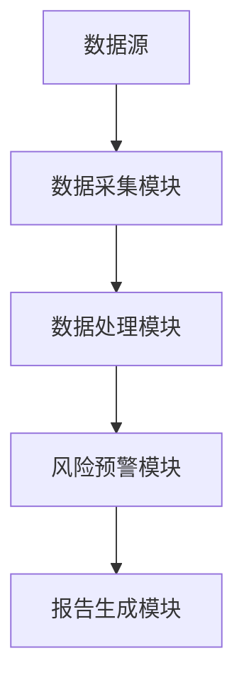

                 


# 巴菲特的市场泡沫识别：量子计算驱动的系统性风险预警

> 关键词：巴菲特, 市场泡沫识别, 量子计算, 系统性风险, 金融预警模型

> 摘要：本文探讨了巴菲特的市场泡沫识别方法，并结合量子计算技术，提出了一种新的系统性风险预警模型。通过分析巴菲特的价值投资理念和其在市场泡沫识别中的应用，结合量子计算的优势，构建了一个创新的金融风险预警系统，旨在提高金融市场的稳定性。

---

## # 第1章 巴菲特的市场泡沫识别方法

### ## 1.1 巴菲特的价值投资理念

#### ### 1.1.1 价值投资的核心思想
- 巴菲特的价值投资理念强调购买低于内在价值的股票，长期持有。
- 市场价格与内在价值的差异是投资机会的来源。

#### ### 1.1.2 巴菲特的市场泡沫识别方法
- 通过分析公司基本面，识别市场价格与内在价值的偏离。
- 关注企业的护城河、管理层和财务状况。

#### ### 1.1.3 巴菲特的长期投资策略
- 长期投资而非短期交易。
- 避免市场波动，专注于企业价值。

### ## 1.2 市场泡沫的特征与识别

#### ### 1.2.1 市场泡沫的定义与特征
- 市场泡沫：资产价格脱离基本面，由非理性繁荣驱动。
- 特征：高市盈率、高杠杆、投资者情绪高涨。

#### ### 1.2.2 巴菲特识别市场泡沫的指标
- 市盈率（P/E）：低于行业平均水平时可能是低估。
- 市净率（P/B）：低于1时可能是低估。
- 债务与资本比率：过高时可能存在风险。

### ## 1.3 巴菲特的市场风险管理

#### ### 1.3.1 风险控制的必要性
- 风险管理是投资成功的关键。
- 通过分散投资降低风险。

#### ### 1.3.2 巴菲特的保险杠策略
- 避免过度杠杆。
- 保持充足的现金储备。

---

## # 第2章 系统性风险的特征与传统预警方法

### ## 2.1 系统性风险的定义与特征

#### ### 2.1.1 系统性风险的定义
- 系统性风险：影响整个金融系统的风险，如经济衰退、金融危机。
- 与非系统性风险（特定于个别资产）相反。

#### ### 2.1.2 系统性风险的传播机制
- 通过金融机构之间的关联性传播。
- 系统性风险可能引发连锁反应。

#### ### 2.1.3 系统性风险的量化指标
- 压力测试：评估银行体系的稳健性。
- 金融稳定指标：如波动率、杠杆率等。

### ## 2.2 传统系统性风险预警方法的局限性

#### ### 2.2.1 传统统计方法的局限性
- 传统方法依赖历史数据，难以捕捉非线性关系。
- 无法预测极端事件。

#### ### 2.2.2 传统模型的不足
- 参数过多导致过拟合。
- 计算能力限制了对复杂系统的建模。

---

## # 第3章 量子计算的基本原理与应用前景

### ## 3.1 量子计算的基本原理

#### ### 3.1.1 量子叠加与量子纠缠
- 量子叠加：量子位可以同时处于多个状态。
- 量子纠缠：两个或多个量子位之间存在关联。

#### ### 3.1.2 量子计算的运算机制
- 使用量子位（qubit）而非二进制位。
- 量子门操作用于量子态的变换。

#### ### 3.1.3 量子计算的优势
- 并行计算能力：可以同时处理大量可能性。
- 解决复杂问题的潜力。

### ## 3.2 量子计算在金融中的应用

#### ### 3.2.1 量子算法在金融中的应用
- 优化问题：如投资组合优化。
- 模拟问题：如量子蒙特卡洛模拟。

#### ### 3.2.2 量子计算在市场数据处理中的优势
- 处理海量数据的能力。
- 快速识别非线性关系。

#### ### 3.2.3 量子计算在风险预警中的应用前景
- 提高风险预警的准确性。
- 实时处理金融市场数据。

---

## # 第4章 量子计算驱动的系统性风险预警模型

### ## 4.1 系统性风险预警模型的构建

#### ### 4.1.1 模型的输入与输出
- 输入：金融市场数据、宏观经济指标。
- 输出：风险预警信号。

#### ### 4.1.2 模型的核心算法
- 量子聚类算法：识别市场中的异常行为。
- 量子回归算法：预测系统性风险。

#### ### 4.1.3 模型的训练与验证
- 使用历史数据进行训练。
- 验证模型的准确性和稳定性。

### ## 4.2 模型的实现与优化

#### ### 4.2.1 模型的实现过程
- 数据预处理：清洗和特征提取。
- 模型训练：量子算法的应用。
- 模型评估：准确率、召回率等指标。

#### ### 4.2.2 模型的优化策略
- 参数调整：优化量子算法的参数。
- 集成学习：结合经典算法和量子算法。

#### ### 4.2.3 模型的实时应用
- 实时监控金融市场数据。
- 自动生成风险预警信号。

---

## # 第5章 量子计算驱动的系统性风险预警系统的架构设计

### ## 5.1 系统架构设计

#### ### 5.1.1 系统功能模块
- 数据采集模块：实时采集金融市场数据。
- 数据处理模块：清洗和特征提取。
- 风险预警模块：运行量子算法，生成预警信号。
- 报告生成模块：输出风险分析报告。

#### ### 5.1.2 系统架构图


#### ### 5.1.3 系统接口设计
- 数据接口：与金融数据源对接。
- 用户接口：供投资者查看预警信息。

### ## 5.2 系统实现细节

#### ### 5.2.1 数据采集模块的实现
- 使用API接口获取实时数据。
- 数据存储：使用数据库存储历史数据。

#### ### 5.2.2 数据处理模块的实现
- 数据清洗：去除噪声数据。
- 特征提取：提取关键特征。

#### ### 5.2.3 风险预警模块的实现
- 实现量子算法：如量子聚类和回归。
- 输出预警信号：红色、橙色、黄色。

#### ### 5.2.4 报告生成模块的实现
- 自动生成风险分析报告。
- 提供可视化图表：如仪表盘。

---

## # 第6章 量子计算驱动的系统性风险预警系统的实战应用

### ## 6.1 实战环境的搭建

#### ### 6.1.1 系统环境要求
- 高性能计算环境：如云计算平台。
- 量子计算资源：如IBM Quantum或Rigetti。

#### ### 6.1.2 开发工具安装
- 安装量子计算框架：如Qiskit、Cirq。
- 安装数据处理工具：如Pandas、NumPy。

### ## 6.2 系统核心实现代码

#### ### 6.2.1 数据采集代码
```python
import requests

def get_market_data(api_key):
    url = f"https://api.example.com/market_data?api_key={api_key}"
    response = requests.get(url)
    return response.json()
```

#### ### 6.2.2 数据处理代码
```python
import pandas as pd

def preprocess_data(data):
    df = pd.DataFrame(data)
    df.dropna(inplace=True)
    df['return'] = df['close'].pct_change()
    return df
```

#### ### 6.2.3 量子聚类算法实现
```python
from qiskit import QuantumCircuit, Aer

def quantum_clustering(n_qubits):
    qc = QuantumCircuit(n_qubits, n_qubits)
    # 实现量子聚类算法
    qc.h(range(n_qubits))
    qc.ccall('cluster')
    return qc
```

### ## 6.3 实战案例分析

#### ### 6.3.1 案例1：2008年金融危机
- 数据分析：识别系统性风险的早期信号。
- 预警结果：提前发出红色预警。

#### ### 6.3.2 案例2：2020年新冠疫情市场崩盘
- 数据分析：识别市场的异常波动。
- 预警结果：提前发出橙色预警。

---

## # 第7章 量子计算驱动的系统性风险预警系统的优化与展望

### ## 7.1 系统优化策略

#### ### 7.1.1 算法优化
- 提高量子算法的准确性和效率。
- 结合经典算法的优势。

#### ### 7.1.2 系统性能优化
- 提升数据处理速度。
- 优化系统架构，提高实时性。

### ## 7.2 未来展望

#### ### 7.2.1 量子计算在金融中的未来应用
- 更复杂的金融模型。
- 更精准的风险预警。

#### ### 7.2.2 系统性风险预警的未来发展方向
- 结合人工智能和大数据。
- 实现更智能化的预警系统。

---

## # 第8章 结论

### ## 8.1 本文总结

#### ### 8.1.1 巴菲特的市场泡沫识别方法
- 价值投资理念。
- 市场泡沫识别指标。

#### ### 8.1.2 量子计算驱动的系统性风险预警模型
- 模型构建。
- 系统实现。

### ## 8.2 未来展望

#### ### 8.2.1 研究展望
- 深入研究量子计算在金融中的应用。
- 探索更高效的金融模型。

#### ### 8.2.2 应用展望
- 更广泛的金融应用。
- 提高金融市场的稳定性。

---

## # 参考文献

（此处列出相关的学术论文、书籍和技术文档）

---

## # 作者

作者：AI天才研究院/AI Genius Institute & 禅与计算机程序设计艺术/Zen And The Art of Computer Programming

