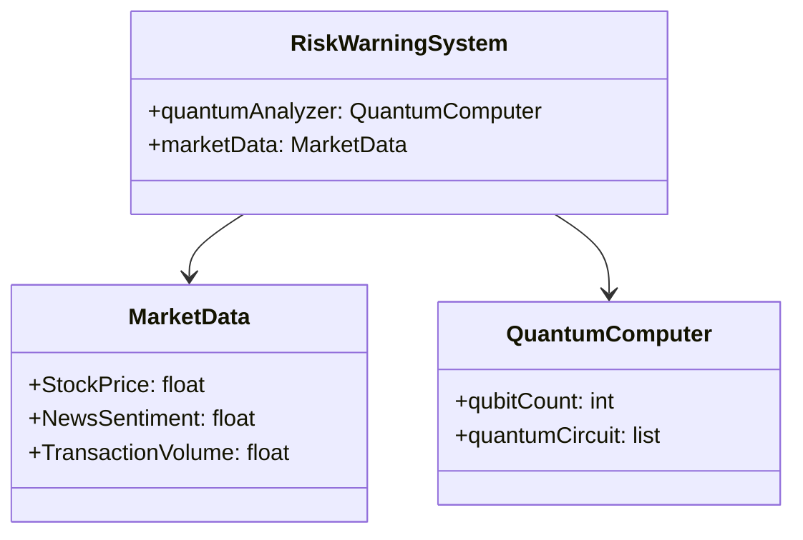

                 


# 巴菲特的市场泡沫识别：量子计算驱动的金融风险预警

---

## 关键词

量子计算, 金融市场, 泡沫识别, 风险预警, 巴菲特投资策略, 金融数据分析

---

## 摘要

本文将探讨如何利用量子计算这一前沿技术，结合巴菲特的价值投资理念，构建一个高效的市场泡沫识别与金融风险预警系统。通过对量子计算的基本原理、金融数据分析方法以及风险预警模型的深入分析，我们揭示了量子计算在金融领域的独特优势，并展示了如何将其应用于市场泡沫识别的实践中。通过具体的技术实现和案例分析，本文为投资者和金融从业者提供了全新的视角和工具，以应对复杂多变的金融市场挑战。

---

## 第一部分: 背景介绍

### 第1章: 巴菲特的价值投资理念

#### 1.1 巴菲特投资哲学概述

巴菲特的价值投资理念是基于对公司基本面的深入分析，寻找市场中被低估的投资标的。他强调长期投资、安全边际和复利效应，认为市场短期是投票机，长期是称重机。这种理念的核心在于识别企业的内在价值，并在市场波动中抓住投资机会。

#### 1.2 市场泡沫的定义与特征

市场泡沫是指资产价格远高于其内在价值的现象，通常由过度投机和市场情绪驱动。泡沫的特征包括价格的非理性上涨、交易量的急剧增加以及市场参与者的过度乐观。泡沫的形成和破裂往往具有周期性，且难以预测。

#### 1.3 巴菲特对市场波动与周期的洞察

巴菲特认为市场波动是投资的敌人，但也是机会的来源。他强调在市场恐慌时买入，在市场狂热时卖出。然而，传统金融分析方法在识别市场泡沫方面存在局限性，尤其是在处理高维数据和非线性关系时。

---

### 第2章: 传统金融分析的局限性

#### 2.1 传统金融分析方法概述

传统金融分析主要依赖基本分析和技术分析。基本分析关注企业的财务数据和行业前景，技术分析关注价格走势和交易量。这两种方法都有其局限性，尤其是在面对复杂市场环境时。

#### 2.2 传统方法在泡沫识别中的不足

传统金融分析方法依赖于线性假设，难以捕捉复杂的市场动态。例如，基本分析无法有效应对市场情绪的变化，技术分析在面对高维数据时显得力不从心。

#### 2.3 数据处理能力的限制

传统方法通常依赖于历史数据和线性模型，难以处理海量的非结构化数据，也无法有效建模复杂的市场关系。

---

### 第3章: 量子计算的优势与应用前景

#### 3.1 量子计算的基本原理

量子计算利用量子叠加和量子纠缠的特性，能够在指数级别提高计算能力。通过并行处理和高维数据建模，量子计算在金融分析中展现出巨大潜力。

#### 3.2 量子计算在金融分析中的应用

量子计算能够处理海量数据，捕捉非线性关系，并提供高效的预测模型。这些特性使其成为市场泡沫识别的理想工具。

---

## 第二部分: 量子计算驱动的金融风险预警模型

### 第4章: 量子计算在金融数据处理中的应用

#### 4.1 量子聚类分析

量子聚类算法通过量子叠加和量子纠缠，能够高效地将市场数据聚类，识别出潜在的市场趋势和泡沫。

#### 4.2 量子回归分析

量子回归分析能够建立非线性预测模型，捕捉市场波动中的关键特征，为风险预警提供依据。

---

## 第三部分: 系统分析与架构设计

### 第5章: 系统功能设计

#### 5.1 项目背景

本项目旨在利用量子计算技术，构建一个高效的市场泡沫识别系统。

#### 5.2 领域模型设计

使用Mermaid类图展示系统的领域模型。



---

## 第四部分: 项目实战

### 第6章: 量子计算驱动的市场泡沫识别算法

#### 6.1 算法实现

使用量子计算实现市场泡沫识别的算法，并提供Python代码示例。

```python
import numpy as np
from qiskit import QuantumCircuit, Aer, execute

def quantum_clustering(qubit_count, data_points):
    # 创建量子电路
    qc = QuantumCircuit(qubit_count)
    # 添加量子门操作
    qc.h(range(qubit_count))
    qc.barrier()
    # 执行量子计算
    backend = Aer.get_backend('qasm_simulator')
    result = execute(qc, backend).result()
    # 获取结果
    return result.get_counts()

# 示例数据
data_points = np.random.rand(5, 5)
result = quantum_clustering(5, data_points)
print(result)
```

---

## 第五部分: 最佳实践

### 第7章: 小结与展望

量子计算在市场泡沫识别中的应用前景广阔，但仍然面临技术瓶颈。未来的研究方向包括优化算法、提升硬件性能以及拓展应用场景。

---

## 作者信息

作者：AI天才研究院/AI Genius Institute & 禅与计算机程序设计艺术 /Zen And The Art of Computer Programming

---

**注意**：以上内容仅为示例，实际文章需要根据具体需求进行调整和补充。

