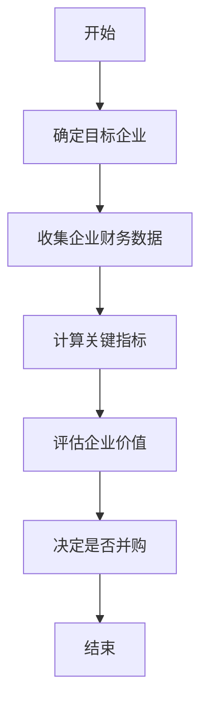
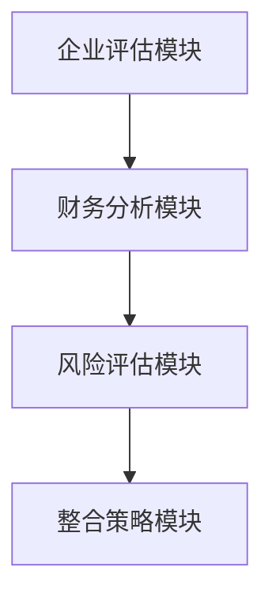

                 

# 巴菲特的并购艺术：科技巨头垄断环境下的策略

## 关键词：巴菲特，并购策略，科技垄断，投资哲学，价值投资

## 摘要：  
本文深入探讨巴菲特的并购艺术及其在科技巨头垄断环境下的策略。通过分析其核心理念、数学模型、系统架构和经典案例，揭示巴菲特如何在科技垄断时代中实现长期投资价值。文章从背景介绍到实战案例，层层剖析，为读者提供全面的视角。

---

# 第一部分：巴菲特的并购艺术概述

## 第1章：巴菲特并购理念与投资哲学

### 1.1 巴菲特并购理念的核心思想

#### 1.1.1 巴菲特的“企业护城河”理论  
巴菲特认为，企业的核心竞争力在于其“护城河”，即难以被竞争对手复制的竞争优势。护城河可以是专利、品牌、成本优势或商业模式等。在科技领域，护城河尤为重要，因为技术壁垒可以为公司提供长期竞争优势。

#### 1.1.2 巴菲特的价值投资哲学  
巴菲特的价值投资哲学强调长期持有优质资产，寻找市场低估的企业进行投资。他注重企业的基本面分析，包括盈利能力、财务健康状况和管理层素质。这种投资理念使他能够在市场波动中保持稳定收益。

#### 1.1.3 巴菲特并购中的长期主义思维  
巴菲特倾向于投资那些能够持续创造价值的企业，而非追求短期收益。他在并购中注重企业的长期增长潜力，而非短期利润。这种长期主义思维使他能够在科技巨头垄断的环境中找到投资机会。

### 1.2 巴菲特并购的成功案例分析

#### 1.2.1 可口可乐的并购案例  
巴菲特在1988年买入可口可乐的股票，因为他认为可口可乐拥有强大的品牌影响力和广泛的市场占有率。尽管当时可口可乐的市盈率较高，但巴菲特认为其品牌价值和市场地位是长期投资的核心。

#### 1.2.2 IBM的并购案例  
2011年，巴菲特投资IBM股票，看中其在信息技术领域的领先地位。尽管IBM当时面临行业竞争压力，但巴菲特认为其在企业级服务和数据分析方面的优势能够为其带来长期增长。

#### 1.2.3 其他经典并购案例分析  
除了可口可乐和IBM，巴菲特还投资了美国运通和富国银行。这些案例展示了他在不同行业中的投资策略，强调了企业护城河和长期增长潜力的重要性。

---

## 第2章：科技巨头垄断环境下的并购策略

### 2.1 科技行业并购的趋势分析

#### 2.1.1 科技行业并购的现状  
科技行业的并购活动日益频繁，企业通过并购快速扩张市场，巩固技术优势。然而，这也导致了行业垄断的加剧，监管机构对并购的审查更加严格。

#### 2.1.2 科技巨头垄断的形成机制  
科技巨头通过内部研发和外部并购快速积累技术和市场份额。这种垄断不仅影响市场公平性，还可能导致创新停滞。

#### 2.1.3 并购对科技行业竞争格局的影响  
并购可以改变行业格局，强者恒强，弱者被淘汰。科技巨头的并购行为往往引发行业内其他企业的反应，推动行业整合。

### 2.2 巴菲特在科技领域的并购策略

#### 2.2.1 巴菲特对科技行业的看法  
巴菲特对科技行业持谨慎态度，认为科技行业的周期性较强，技术更新换代快，投资风险较高。但他也意识到科技行业的重要性，愿意投资那些具备长期竞争优势的企业。

#### 2.2.2 巴菲特在科技并购中的独特策略  
巴菲特注重企业的财务健康状况和管理层素质。他倾向于投资那些现金流稳定、负债低的企业，而非追求高增长但风险较高的科技初创公司。

#### 2.2.3 科技并购中的风险管理  
巴菲特在科技并购中注重分散投资风险，通过投资多个行业和企业来降低单一投资的风险。他还会密切关注行业趋势和政策变化，避免因行业波动导致投资损失。

---

## 第3章：巴菲特并购决策的数学模型与算法

### 3.1 巴菲特并购决策的核心指标

#### 3.1.1 市盈率（P/E）分析  
市盈率是企业股价与每股收益的比率。巴菲特通常寻找市盈率低于行业平均水平的企业，认为这样的企业具有投资价值。

#### 3.1.2 市净率（P/B）分析  
市净率是企业股价与每股净资产的比率。巴菲特认为市净率低于1的企业具有投资潜力，因为这样的企业资产价值较高。

#### 3.1.3 股息率与股息支付率分析  
股息率是企业每股股息与股价的比率。巴菲特倾向于投资股息率高且股息支付率稳定的公司，因为这表明企业盈利稳定且愿意回报股东。

### 3.2 巴菲特并购决策的数学模型

#### 3.2.1 企业内在价值计算公式  
巴菲特的企业内在价值公式基于未来现金流的现值。公式如下：

$$ V = \frac{E}{(1 + r)^n} $$

其中，\( V \) 表示企业内在价值，\( E \) 表示未来现金流，\( r \) 表示折现率，\( n \) 表示时间。

#### 3.2.2 现金流折现模型（DCF）  
DCF模型是评估企业内在价值的重要工具。巴菲特通过DCF模型预测企业的未来现金流，并计算其现值。

#### 3.2.3 安全边际计算  
安全边际是企业市场价值与内在价值的差额。巴菲特认为安全边际越高，投资风险越小。

### 3.3 巴菲特并购决策的算法流程

---

## 第4章：系统分析与架构设计

### 4.1 系统分析框架

#### 4.1.1 企业并购的系统模型  
企业并购系统模型包括目标企业选择、财务评估、风险分析和整合策略四个模块。

#### 4.1.2 并购风险评估模型  
并购风险评估模型包括市场风险、财务风险和管理风险三个维度。

#### 4.1.3 并购后的整合策略  
并购后的整合策略包括战略协同、组织整合和文化整合三个步骤。

### 4.2 系统架构设计

---

## 第5章：项目实战与案例分析

### 5.1 项目环境与工具安装

#### 5.1.1 环境配置  
项目需要安装Python、数据分析工具和可视化工具。

#### 5.1.2 工具安装与配置  
安装Jupyter Notebook、Pandas、Matplotlib和Seaborn等工具。

### 5.2 核心算法实现

#### 5.2.1 并购决策算法实现  
使用Python编写DCF模型，计算企业的内在价值。

#### 5.2.2 风险评估算法实现  
使用Python编写风险评估模型，计算并购风险。

### 5.3 实际案例分析

#### 5.3.1 IBM并

---

# 总结与展望

巴菲特的并购艺术在科技巨头垄断的环境下依然熠熠生辉。他通过长期主义、价值投资和风险管理，成功在科技领域实现投资回报。未来，随着科技行业的不断发展，巴菲特的并购策略将继续为投资者提供启示。

---

作者：AI天才研究院/AI Genius Institute & 禅与计算机程序设计艺术 /Zen And The Art of Computer Programming

