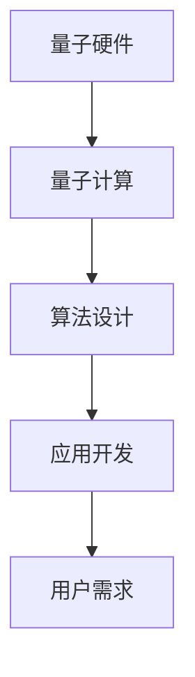

                 


```markdown
# 巴菲特的并购艺术：量子科技生态系统整合的新策略

## 关键词：巴菲特，并购艺术，量子科技，生态系统整合，新策略

## 摘要：本文探讨了巴菲特的并购艺术在量子科技生态系统整合中的应用，通过分析量子科技的基本概念、并购策略、算法原理和系统架构，提出了将巴菲特的长期投资理念与量子科技结合的新策略。

---

## 第1章: 巴菲特并购艺术概述

### 1.1 巴菲特并购理念的核心思想

#### 1.1.1 巴菲特并购的基本原则
巴菲特的并购理念以价值投资为核心，强调长期稳定、内在价值和安全边际。他注重企业的财务健康、竞争优势和管理团队。

#### 1.1.2 巴菲特并购的成功案例分析
以可口可乐和IBM为例，分析巴菲特如何通过并购实现长期价值增长，以及他对目标公司的估值方法。

#### 1.1.3 巴菲特并购策略的演变
从早期的低价买入到后期的注重企业内在价值，巴菲特的并购策略随着市场变化不断优化。

### 1.2 量子科技的基本概念与应用领域

#### 1.2.1 量子科技的定义与核心原理
量子科技包括量子计算、量子通信和量子测量，利用量子叠加和纠缠的原理，提供远超经典计算的能力。

#### 1.2.2 量子计算、量子通信与量子测量
量子计算用于复杂问题求解，量子通信实现安全通信，量子测量提供高精度测量能力。

#### 1.2.3 量子科技在企业中的潜在应用
在金融、医疗、能源等领域，量子科技可以优化计算、提高安全性、提升测量精度。

---

## 第2章: 量子科技生态系统整合的背景与挑战

### 2.1 量子科技生态系统的基本结构

#### 2.1.1 量子科技生态系统的组成要素
包括硬件、软件、算法、应用和用户，各部分相互依赖，共同构建完整的生态系统。

#### 2.1.2 量子科技生态系统的整合模式
通过协同合作、资源共享和技术创新，实现生态系统的高效整合。

#### 2.1.3 量子科技生态系统的核心特征
技术领先、资源整合、协同发展，形成可持续的竞争优势。

### 2.2 并购在量子科技生态系统整合中的作用

#### 2.2.1 并购作为资源整合的手段
通过并购整合技术、人才和资源，快速构建生态系统。

#### 2.2.2 并购在技术互补中的应用
并购互补技术的企业，弥补自身技术短板，提升整体竞争力。

#### 2.2.3 并购对生态系统竞争力的影响
并购整合可以优化资源配置，提升生态系统的整体竞争力。

---

## 第3章: 巴菲特并购艺术与量子科技的结合

### 3.1 巴菲特并购理念在量子科技中的适用性

#### 3.1.1 巴菲特的长期投资理念
长期投资理念与量子科技的长周期研发特点相契合，注重企业的长期价值。

#### 3.1.2 巴菲特的价值投资原则
关注企业的内在价值和竞争优势，选择具有长期增长潜力的企业进行并购。

#### 3.1.3 巴菲特的风险控制策略
通过分散投资、严格估值和管理层评估，降低并购风险。

### 3.2 量子科技生态系统整合中的并购策略

#### 3.2.1 并购目标的选择标准
选择具有核心技术、良好管理和市场前景的企业作为并购目标。

#### 3.2.2 并购后的整合与协同效应
制定详细的整合计划，优化组织结构，最大化协同效应。

#### 3.2.3 并购风险的评估与管理
从技术和市场两个维度，全面评估并购风险，并制定应对措施。

---

## 第4章: 量子科技生态系统整合的算法与模型

### 4.1 量子计算在并购决策中的应用

#### 4.1.1 量子计算的基本原理
利用量子叠加和纠缠，量子计算机可以在短时间内解决复杂的优化问题。

#### 4.1.2 量子计算在并购评估中的应用
通过量子算法优化并购目标的选择和估值模型的构建。

#### 4.1.3 量子算法在并购优化中的作用
利用量子算法提高并购决策的效率和准确性。

### 4.2 并购整合的数学模型与公式

#### 4.2.1 并购价值评估的数学模型
$$ V = \text{目标企业价值} + \text{协同效应} - \text{整合成本} $$

#### 4.2.2 量子计算在并购决策中的公式推导
利用量子优化算法对并购目标进行排序和选择。

#### 4.2.3 并购协同效应的量化分析
通过量子计算模拟不同并购组合的协同效应，选择最优方案。

---

## 第5章: 量子科技生态系统整合的系统架构设计

### 5.1 系统功能设计

#### 5.1.1 量子科技生态系统的功能模块
包括数据采集、算法计算、结果分析和决策支持模块。

#### 5.1.2 并购整合的系统功能需求
支持并购目标筛选、协同效应计算和风险评估等功能。

#### 5.1.3 系统功能的交互设计
设计用户友好的界面，实现并购决策的高效支持。

### 5.2 系统架构设计

#### 5.2.1 量子科技生态系统的架构图


#### 5.2.2 并购整合的系统架构分析
采用分层架构，包括数据层、计算层和应用层，确保系统的高效运行。

#### 5.2.3 系统接口设计与实现
定义清晰的API接口，实现系统模块之间的高效通信。

---

## 第6章: 量子科技生态系统整合的项目实战

### 6.1 项目环境与工具安装

#### 6.1.1 开发环境的搭建
安装Python、量子计算库和相关工具，配置开发环境。

#### 6.1.2 量子计算工具的安装与配置
安装Qiskit等量子计算库，配置量子计算环境。

#### 6.1.3 并购数据分析工具的准备
准备并购数据，安装数据分析工具，如Python的Pandas库。

### 6.2 核心代码实现

#### 6.2.1 量子计算算法实现
```python
from qiskit import QuantumCircuit, execute, Aer

def quantum_merge_calculation():
    qc = QuantumCircuit(2)
    qc.h(0)
    qc.cx(0,1)
    qc.measure_all()
    backend = Aer.get_backend('qasm_simulator')
    job = execute(qc, backend)
    result = job.result()
    return result.get_counts()

print(quantum_merge_calculation())
```

#### 6.2.2 并购协同效应的计算
$$ \text{协同效应} = \text{目标企业价值} + \text{整合价值} $$

#### 6.2.3 并购风险的评估
利用量子计算模拟不同并购组合的风险，选择最优方案。

### 6.3 项目实战总结

#### 6.3.1 项目成果
通过量子计算优化并购决策，提高整合效率和效果。

#### 6.3.2 实践经验
注重技术与业务的结合，确保并购策略的有效实施。

#### 6.3.3 改进建议
持续优化算法和模型，提升系统的智能化水平。

---

## 第7章: 总结与展望

### 7.1 本章总结
本文将巴菲特的并购艺术与量子科技相结合，提出了新的整合策略，通过量子计算优化并购决策，提升生态系统竞争力。

### 7.2 未来展望
随着量子科技的不断发展，未来的并购整合将更加智能化和高效化，量子科技在生态系统中的应用将更加广泛。

---

## 作者：AI天才研究院/AI Genius Institute & 禅与计算机程序设计艺术 /Zen And The Art of Computer Programming
```

