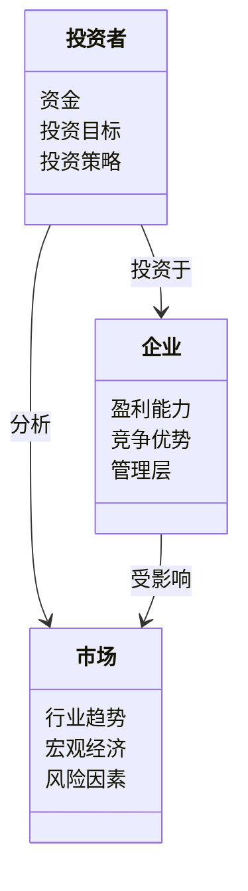
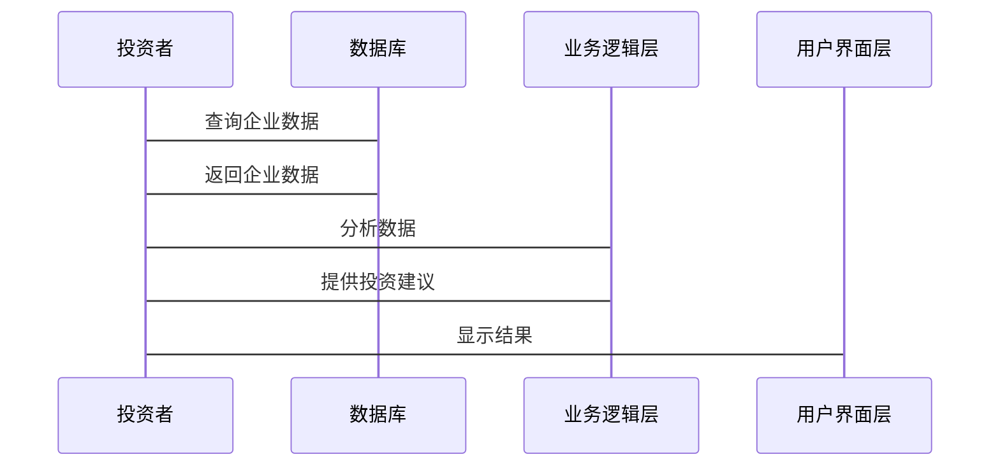

                 


# 巴菲特的慈善投资策略

## 关键词
- 巴菲特，慈善投资，价值投资，长期收益，风险管理

## 摘要
本文深入探讨巴菲特的慈善投资策略，分析其投资哲学、策略和模式，结合实际案例和系统分析，揭示其成功的秘诀。文章从背景介绍、策略分析、风险管理到实际应用，全面解析巴菲特的慈善投资之道。

---

## 第一部分: 巴菲特的慈善投资背景与理念

### 第1章: 巴菲特的慈善投资背景

#### 1.1 巴菲特的生平与投资哲学
- **1.1.1 巴菲特的生平简介**  
  巴菲特，生于1934年，是世界著名投资者，以价值投资闻名。他的投资哲学强调长期持有、安全边际和企业基本面分析。

#### 1.2 巴菲特与慈善的关系
- **1.2.1 巴菲特的慈善理念**  
  巴菲特认为慈善是投资的延伸，通过投资优质企业，实现社会价值和经济回报的双重目标。
- **1.2.2 巴菲特的慈善捐赠**  
  他通过巴菲特基金会进行捐赠，主要投资于教育、医疗和灾害救援等领域。

#### 1.3 巴菲特慈善投资的核心理念
- **长期价值投资**  
  巴菲特选择那些具有持续竞争优势和稳定现金流的企业进行投资。
- **安全边际**  
  他强调在投资中留有安全边际，确保在市场波动中依然稳健。

### 第2章: 巴菲特的慈善投资原则

#### 2.1 巴菲特的慈善投资标准
- **选择投资标的的核心标准**  
  巴菲特主要投资于那些具备强大护城河、稳定收益和优秀管理层的企业。
- **企业的竞争优势与护城河**  
  他偏好那些在行业内具有独特优势，难以被竞争对手取代的企业。

#### 2.2 巴菲特的慈善投资组合管理
- **投资组合的构建与优化**  
  巴菲特注重分散投资，避免过度集中在单一行业或企业。
- **长期持有与定期调整**  
  他坚持长期持有，定期评估并调整投资组合。

#### 2.3 巴菲特慈善投资的税务规划
- **慈善捐赠的税务优惠**  
  巴菲特通过设立慈善信托，最大化税务优惠，同时实现资产的保值和增值。
- **慈善信托与税务优化**  
  通过信托结构，将资产转移给基金会，降低税务负担，同时确保资金用于慈善事业。

---

## 第二部分: 巴菲特的慈善投资策略分析

### 第3章: 巴菲特的慈善投资模式与实践

#### 3.1 巴菲特的慈善投资模式
- **直接投资模式**  
  通过直接购买企业股份，获得稳定的股息收益。
- **控股公司模式**  
  通过控股公司管理多个投资项目，分散风险。
- **家族信托模式**  
  将资产转移至家族信托，确保传承和税务优化。

#### 3.2 巴菲特的慈善投资实践
- **巴菲特基金会的运作**  
  通过基金会进行慈善捐赠，支持教育、医疗和灾害救援。
- **慈善捐赠案例**  
  例如，巴菲特曾向比尔·盖茨的慈善项目捐赠巨资，支持全球公共卫生事业。

### 第4章: 巴菲特的慈善投资策略与风险管理

#### 4.1 巴菲特慈善投资的风险管理
- **风险识别与评估**  
  巴菲特注重分析企业的财务状况和行业风险，避免投资高风险领域。
- **风险控制与分散化**  
  通过多元化投资降低风险，同时保持对优质企业的长期持有。

#### 4.2 巴菲特的慈善投资风险管理工具
- **财务指标分析**  
  使用ROE、毛利率等指标评估企业的盈利能力。
- **行业趋势分析**  
  关注行业发展趋势，选择具备长期增长潜力的企业。

---

## 第三部分: 巴菲特慈善投资策略的系统分析与应用

### 第5章: 巴菲特慈善投资的系统架构设计

#### 5.1 系统功能设计
- **领域模型（Mermaid 类图）**



#### 5.2 系统架构设计
- **系统架构（Mermaid 架构图）**


#### 5.3 系统接口设计
- **接口描述**  
  - 投资决策接口：接收企业数据，生成投资建议。
- **系统交互（Mermaid 序列图）**



---

## 第四部分: 项目实战与最佳实践

### 第6章: 项目实战

#### 6.1 环境安装
- **工具安装**  
  安装Python、Pandas、Matplotlib等工具用于数据分析和可视化。

#### 6.2 核心实现源代码
- **投资组合优化代码**

```python
import pandas as pd
import numpy as np
import matplotlib.pyplot as plt

# 示例数据：企业财务数据
data = {'企业': ['企业A', '企业B', '企业C'],
        'ROE': [0.15, 0.2, 0.1],
        '毛利率': [0.3, 0.4, 0.25],
        '净利润': [100, 200, 150]}
df = pd.DataFrame(data)

# 计算投资评分
df['投资评分'] = df['ROE'] * 0.4 + df['毛利率'] * 0.3 + df['净利润'] * 0.3

# 可视化
plt.figure(figsize=(10, 6))
plt.bar(df['企业'], df['投资评分'])
plt.title('投资评分')
plt.xlabel('企业')
plt.ylabel('评分')
plt.show()
```

#### 6.3 应用解读与分析
- **代码解读**  
  上述代码展示了如何通过ROE、毛利率和净利润等指标计算企业投资评分，并通过柱状图进行可视化。

---

## 第五部分: 总结与展望

### 第7章: 总结

- **核心总结**  
  巴菲特的慈善投资策略强调长期价值、安全边际和企业基本面分析，通过多元化投资和风险管理实现稳健回报。

### 第8章: 展望

- **未来趋势**  
  随着技术进步，慈善投资将更加智能化，利用大数据和人工智能优化投资决策和风险管理。

---

## 作者信息

作者：AI天才研究院/AI Genius Institute & 禅与计算机程序设计艺术 /Zen And The Art of Computer Programming

---

通过以上结构和内容，您可以开始撰写完整的博客文章。每一部分都需要详细展开，确保逻辑清晰、内容详实。

