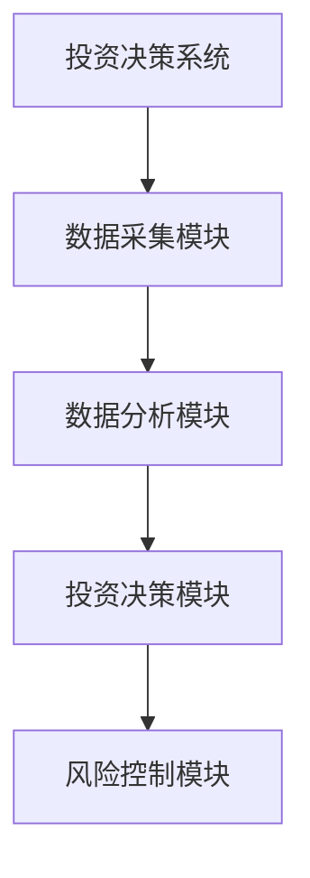
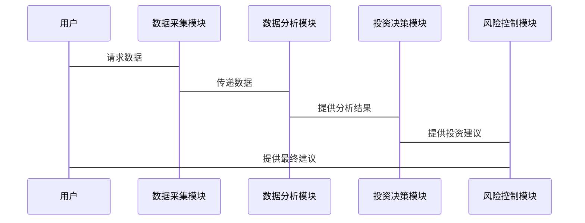

                 


# 巴菲特的投资哲学：简单但不容易

> 关键词：巴菲特、投资哲学、价值投资、内在价值、安全边际、竞争优势

> 摘要：本文深入探讨了巴菲特的投资哲学，从其核心概念、数学模型、系统架构到实际案例分析，全面解析了巴菲特投资策略的内在逻辑和实践方法。文章结合技术语言，通过清晰的结构和逻辑推理，帮助读者理解巴菲特投资哲学的精髓，并将其应用于实际投资中。

---

## 第1章：投资的基本问题与巴菲特的解决方案

### 1.1 投资的基本问题

#### 1.1.1 什么是投资
投资是指将资金投入到某个资产或企业，以期在未来获得超过初始投入的回报。投资的核心在于通过合理的资源配置，实现财富的增值。

#### 1.1.2 投资的主要目的
投资的主要目的是通过资产配置和风险管理，实现财富的保值与增值。投资不仅仅是追求收益，还包括降低风险、分散投资和长期持有的策略。

#### 1.1.3 投资的基本分类
投资可以分为以下几类：
1. **股票投资**：通过购买公司股份，成为股东，分享公司成长的收益。
2. **债券投资**：通过购买政府或企业的债券，获得固定的利息收入。
3. **房地产投资**：通过购买房地产资产，获得租金收入或资产增值。
4. **基金投资**：通过购买共同基金或指数基金，实现分散投资和专业管理。

### 1.2 投资问题的解决方法

#### 1.2.1 为什么投资如此困难
投资的困难在于市场的不确定性和人性的弱点。市场的波动、信息不对称、情绪化决策以及短期利益的诱惑，都使得投资变得复杂。

#### 1.2.2 投资者的主要挑战
投资者在投资过程中面临的主要挑战包括：
1. **信息过载**：市场信息繁杂，难以筛选和判断。
2. **情绪影响**：贪婪和恐惧情绪会影响决策。
3. **短期思维**：市场短期波动可能导致决策失误。
4. **复杂性**：投资涉及多个领域和学科，需要综合知识。

#### 1.2.3 巴菲特的解决方案
巴菲特提出的价值投资理念，强调长期持有优质资产，注重企业的内在价值，避免短期波动的干扰。其解决方案包括：
1. **价值投资**：寻找被市场低估的优质企业。
2. **安全边际**：通过合理估值和分散投资降低风险。
3. **长期持有**：避免频繁交易，减少成本和错误决策。

### 1.3 巴菲特投资哲学的边界与外延

#### 1.3.1 投资哲学的核心要素
巴菲特投资哲学的核心要素包括：
1. **价值投资**：寻找具有持续竞争优势的企业。
2. **内在价值**：评估企业的实际价值，而非市场定价。
3. **安全边际**：通过低估价格确保投资的安全性。
4. **长期持有**：通过时间积累收益。

#### 1.3.2 投资哲学的适用范围
巴菲特的投资哲学适用于长期投资者，尤其是那些能够深入研究企业基本面、具备耐心和纪律的投资者。其方法在股票投资中表现尤为突出。

#### 1.3.3 投资哲学的潜在局限性
巴菲特投资哲学的局限性在于其依赖于长期的市场有效性、企业的持续竞争优势以及市场的理性回归。在短期波动较大的市场中，其方法可能面临挑战。

---

## 第2章：巴菲特投资哲学的核心概念与联系

### 2.1 价值投资的原理

#### 2.1.1 价值投资的定义
价值投资是一种投资策略，强调以低于内在价值的价格购买优质企业。其核心在于寻找市场低估的资产，通过长期持有实现收益。

#### 2.1.2 价值投资的核心原则
1. **安全边际**：购买价格低于内在价值，确保投资的安全性。
2. **长期持有**：避免短期波动，通过时间积累收益。
3. **竞争优势**：选择具有持续竞争优势的企业。

#### 2.1.3 价值投资与成长投资的区别
| **维度**       | **价值投资**                        | **成长投资**                        |
|-----------------|------------------------------------|------------------------------------|
| 投资目标         | 以低于内在价值的价格买入            | 投资于成长性强的企业                |
| 关注点           | 企业的内在价值和安全边际            | 企业的成长性和未来潜力              |
| 投资期限         | 长期持有，追求内在价值的回归          | 中长期投资，等待企业成长兑现        |
| 风险控制         | 通过安全边际降低风险                | 通过成长性分散风险                  |

### 2.2 内在价值与市场价值

#### 2.2.1 内在价值的定义
内在价值是指一家企业在正常经营情况下，能够为股东创造的最大价值。它是基于企业的财务状况、盈利能力、竞争优势和行业地位等因素计算得出的。

#### 2.2.2 市场价值的定义
市场价值是指资产在市场上的交易价格，通常由市场供需关系决定。市场价值可能高于或低于内在价值。

#### 2.2.3 内在价值与市场价值的关系
1. **市场价值围绕内在价值波动**：市场价值会受到短期情绪和市场波动的影响，但长期来看，市场价值会回归内在价值。
2. **内在价值是投资的基础**：投资者应关注企业的内在价值，而不是短期的市场波动。

### 2.3 安全边际与风险控制

#### 2.3.1 安全边际的定义
安全边际是指购买价格低于内在价值的部分。通过预留安全边际，投资者可以降低投资风险，避免因市场价格波动导致的损失。

#### 2.3.2 安全边际的重要性
1. **降低投资风险**：安全边际为投资者提供了缓冲空间，减少市场波动带来的影响。
2. **提高投资信心**：通过预留安全边际，投资者可以更加自信地进行投资。

#### 2.3.3 如何在投资中应用安全边际
1. **计算内在价值**：通过基本面分析计算企业的内在价值。
2. **确定安全边际**：购买价格低于内在价值的一定比例。
3. **分散投资**：通过分散投资降低单一投资的风险。

### 2.4 企业竞争优势与护城河

#### 2.4.1 企业竞争优势的定义
企业竞争优势是指企业在行业中相对于竞争对手的独特优势，包括成本优势、技术优势、品牌优势、市场占有率等。

#### 2.4.2 企业竞争优势的分类
1. **成本优势**：企业能够在相同或更低的成本下生产产品或服务。
2. **技术优势**：企业拥有独特的技术或专利，能够提供创新的产品或服务。
3. **品牌优势**：强大的品牌影响力能够吸引更多的客户。
4. **市场占有率**：企业在市场中占据主导地位，具有定价权。

#### 2.4.3 如何识别企业的竞争优势
1. **分析财务数据**：通过企业的财务报表识别成本优势和盈利能力。
2. **研究行业地位**：了解企业在行业中的市场份额和技术水平。
3. **考察管理团队**：优秀的管理团队能够维持和增强企业的竞争优势。

---

## 第3章：巴菲特投资哲学的算法原理与数学模型

### 3.1 内在价值的计算公式

#### 3.1.1 内在价值的公式
$$ \text{内在价值} = \frac{\text{未来现金流}}{\text{折现率}} $$

#### 3.1.2 现金流量的折现模型
$$ \text{内在价值} = \sum_{t=1}^{n} \frac{\text{现金流}_t}{(1 + r)^t} $$

其中，$r$ 是折现率，$n$ 是预测的年数，$\text{现金流}_t$ 是第 $t$ 年的现金流。

#### 3.1.3 未来现金流的预测方法
1. **基于历史数据预测**：通过分析企业的历史财务数据，预测未来的现金流。
2. **基于行业趋势预测**：结合行业的发展趋势，预测企业的未来现金流。

### 3.2 安全边际的数学模型

#### 3.2.1 安全边际的计算公式
$$ \text{安全边际} = \text{内在价值} - \text{市场价格} $$

#### 3.2.2 安全边际与投资风险的关系
1. **安全边际越大，投资风险越小**：当安全边际较大时，市场价格远低于内在价值，投资风险较低。
2. **安全边际越小，投资风险越大**：当安全边际较小时，市场价格接近内在价值，投资风险较高。

#### 3.2.3 如何通过数学模型优化安全边际
1. **动态调整折现率**：根据市场的变化调整折现率，以反映不同的风险水平。
2. **定期重新评估内在价值**：随着企业的发展和市场的变化，定期重新评估内在价值，确保安全边际的有效性。

### 3.3 企业竞争优势的量化指标

#### 3.3.1 净资产收益率（ROE）
$$ \text{ROE} = \frac{\text{净利润}}{\text{净资产}} $$

#### 3.3.2 资产回报率（ROA）
$$ \text{ROA} = \frac{\text{净利润}}{\text{总资产}} $$

#### 3.3.3 股东权益回报率（ROE）
$$ \text{ROE} = \frac{\text{净利润}}{\text{股东权益}} $$

---

## 第4章：巴菲特投资哲学的系统架构与实现

### 4.1 投资决策系统的功能设计

#### 4.1.1 投资目标设定
1. **设定投资目标**：明确投资的收益目标和风险承受能力。
2. **确定投资期限**：根据投资目标设定投资的时间跨度。

#### 4.1.2 财务数据收集与分析
1. **收集财务数据**：获取企业的财务报表、行业数据和市场信息。
2. **分析财务数据**：通过财务指标分析企业的盈利能力、成长性和风险水平。

#### 4.1.3 投资策略制定
1. **制定投资策略**：根据财务分析结果，制定具体的投资策略。
2. **风险控制策略**：设定止损点和止盈点，确保投资的安全性。

### 4.2 系统架构设计

#### 4.2.1 系统功能模块
1. **数据采集模块**：负责收集企业的财务数据和市场信息。
2. **数据分析模块**：对收集的数据进行处理和分析，计算内在价值和安全边际。
3. **投资决策模块**：根据分析结果，制定投资策略。
4. **风险控制模块**：监控投资组合，确保风险在可承受范围内。

#### 4.2.2 系统架构图


#### 4.2.3 系统接口设计
1. **数据接口**：与数据源（如股票行情、财务报表）进行数据交互。
2. **用户接口**：提供用户友好的界面，展示分析结果和投资建议。

### 4.3 系统交互流程

#### 4.3.1 系统交互序列图


---

## 第5章：项目实战——巴菲特投资哲学的应用

### 5.1 环境安装

#### 5.1.1 系统环境
1. **操作系统**：Windows 10 或更高版本，macOS 10.15 或更高版本。
2. **编程语言**：Python 3.8 或更高版本。
3. **开发工具**：Visual Studio Code 或 PyCharm。

#### 5.1.2 安装依赖
1. **Python库**：pandas、numpy、matplotlib、seaborn。
2. **数据源**：股票行情数据（如 Yahoo Finance）。

### 5.2 核心代码实现

#### 5.2.1 数据采集代码
```python
import pandas as pd
import numpy as np

# 下载股票数据
def get_stock_data(ticker, start_date, end_date):
    data = pd.DataFrame()
    # 示例代码，实际需要根据具体数据源进行调整
    return data
```

#### 5.2.2 内在价值计算代码
```python
def calculate_intrinsic_value(data, discount_rate):
    # 计算未来现金流
    future_cash_flows = data['现金流'].tolist()
    # 计算内在价值
    intrinsic_value = np.npv(discount_rate, future_cash_flows)
    return intrinsic_value
```

#### 5.2.3 投资决策代码
```python
def investment_decision(price, intrinsic_value, margin_of_safety):
    if price < intrinsic_value * (1 - margin_of_safety):
        return "买入"
    elif price > intrinsic_value * (1 + margin_of_safety):
        return "卖出"
    else:
        return "观望"
```

### 5.3 案例分析

#### 5.3.1 案例选择
以腾讯为例，分析其投资价值。

#### 5.3.2 数据分析与计算
1. **获取腾讯的财务数据**：包括收入、利润、现金流等。
2. **计算腾讯的内在价值**：使用现金流折现模型。
3. **计算安全边际**：比较腾讯的市场价格与内在价值。

#### 5.3.3 投资建议
根据计算结果，提供具体的买入、卖出或观望建议。

### 5.4 项目小结

#### 5.4.1 项目总结
通过实际案例分析，验证巴菲特投资哲学的有效性，掌握内在价值计算和安全边际的应用。

#### 5.4.2 经验与教训
1. **数据准确性**：财务数据的准确性对内在价值计算至关重要。
2. **模型适用性**：模型需要根据实际情况进行调整和优化。

---

## 第6章：总结与展望

### 6.1 巴菲特投资哲学的核心理念
巴菲特投资哲学的核心理念包括：
1. **价值投资**：寻找市场低估的优质企业。
2. **内在价值**：基于企业基本面进行估值。
3. **安全边际**：通过合理估值降低投资风险。
4. **长期持有**：通过时间积累收益。

### 6.2 投资中的注意事项
1. **避免情绪化决策**：投资需要理性，避免贪婪和恐惧的影响。
2. **分散投资**：通过分散投资降低风险。
3. **持续学习**：市场在不断变化，投资者需要不断学习和调整策略。

### 6.3 拓展阅读
1. **《巴菲特致股东的信》**：了解巴菲特的投资理念和管理智慧。
2. **《投资学原理》**：深入学习投资学的基本原理和方法。
3. **《股票投资实战》**：通过实际案例学习股票投资的技巧。

---

## 作者：AI天才研究院/AI Genius Institute & 禅与计算机程序设计艺术 /Zen And The Art of Computer Programming

