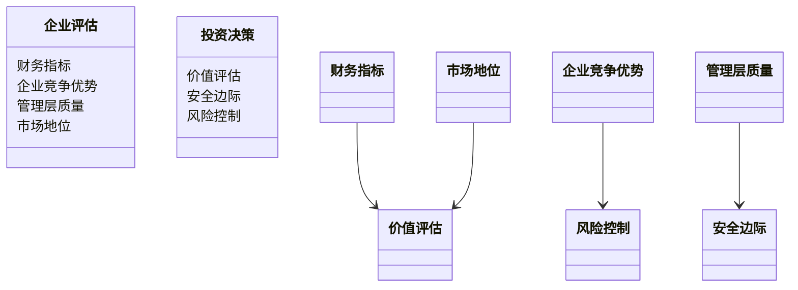

                 

# 巴菲特的投资失误教训

> 关键词：巴菲特、投资失误、价值投资、企业估值、风险控制、投资策略

> 摘要：本文通过分析巴菲特在投资过程中所经历的几次重大失误，揭示其背后的教训和经验，帮助投资者更好地理解价值投资的精髓，避免类似的错误。文章分为背景介绍、主要失误分析、数学模型、系统架构和项目实战五个部分，详细探讨了巴菲特的投资理念、失误原因及应对策略，并提供了实际案例和系统设计，帮助读者构建更稳健的投资体系。

---

# 第一部分：背景介绍

## 第1章：巴菲特的投资理念与方法

### 1.1 价值投资的核心概念

#### 1.1.1 价值投资的定义
价值投资是一种以低于公平价值的价格购买优质资产的投资策略，其核心在于寻找市场先生的错误定价。

#### 1.1.2 巴菲特的价值投资原则
- 质量第一：选择具有持续竞争优势的企业。
- 安全边际：以合理折扣价买入。
- 长期思维：关注企业的长期价值，而非短期波动。

#### 1.1.3 投资中的长期主义
巴菲特强调长期投资，避免短期市场的波动干扰。

### 1.2 巴菲特的投资策略

#### 1.2.1 股票分析的核心要素
- 财务健康：关注企业的盈利能力、现金流和资产负债表。
- 企业竞争优势：寻找护城河宽厚的企业。
- 管理层质量：信任可靠且有能力的管理层。

#### 1.2.2 巴菲特的选股标准
- 高ROE：净资产收益率是巴菲特选股的重要指标。
- 稳定的股息政策：倾向于支付稳定股息的企业。
- 理解的企业：只投资自己理解的行业和企业。

---

# 第二部分：巴菲特的主要投资失误

## 第2章：低估了市场的波动性

### 2.1 1987年股市崩盘的教训

#### 2.1.1 事件背景
1987年美国股市 crash，巴菲特的伯克希尔公司遭受重大损失。

#### 2.1.2 巴菲特的应对策略
- 减少杠杆使用。
- 增加对优质企业投资的重视。

#### 2.1.3 对市场波动性的重新认识
市场的不可预测性和波动性是投资中不可忽视的因素。

## 第3章：误判了管理层的风险

### 3.1 霍尼韦尔事件的分析

#### 3.1.1 投资背景
巴菲特投资霍尼韦尔，但管理层决策失误导致股价下跌。

#### 3.1.2 管理层的问题
管理层的短期决策损害了公司的长期利益。

#### 3.1.3 对管理层信任的反思
巴菲特意识到管理层诚信的重要性，加强了对企业治理的审查。

---

# 第三部分：投资决策的数学模型与案例分析

## 第4章：企业价值评估的数学模型

### 4.1 常用的企业估值方法

#### 4.1.1 市盈率法
公式：市盈率 = 股价 / 每股净利润。
案例：分析某企业的市盈率是否合理。

#### 4.1.2 市净率法
公式：市净率 = 股价 / 每股净资产。
案例：判断企业是否被低估。

#### 4.1.3 现金流折现法
公式：DCF模型 = 未来现金流的现值。
案例：计算企业未来现金流的公允价值。

## 第5章：价值陷阱识别的数学模型

### 5.1 识别价值陷阱的关键指标

#### 5.1.1 财务指标异常分析
- 过高的负债比率。
- 低ROE但高利润。

#### 5.1.2 行业周期性的影响
- 判断行业周期，避免周期性低谷的企业。

#### 5.1.3 管理层诚信度的评估
- 通过管理层历史表现和决策判断其诚信度。

---

# 第四部分：系统分析与架构设计方案

## 第6章：投资决策的系统架构设计

### 6.1 问题场景介绍
- 投资者需要一个系统化的框架来评估企业，避免人为情绪干扰。

### 6.2 系统功能设计

#### 6.2.1 领域模型设计

#### 6.2.2 系统架构设计

---

# 第五部分：项目实战

## 第7章：如何避免巴菲特的失误

### 7.1 环境安装
- 学习财务分析工具和企业估值模型。
- 了解市场波动性和风险控制方法。

### 7.2 核心实现

#### 7.2.1 价值评估模型
- 使用DCF模型评估企业公允价值。
- 通过ROE和ROA判断企业盈利能力。

#### 7.2.2 风险控制策略
- 设定止损点。
- 分散投资以降低风险。

### 7.3 实际案例分析
- 分析某企业的财务报表，评估其价值。
- 判断管理层的诚信度和决策能力。

---

# 第六部分：总结与最佳实践

## 第8章：总结与小结

### 8.1 最佳实践 tips
- 定期回顾投资组合，评估企业基本面。
- 坚持长期投资，避免短期波动干扰。
- 加强对企业管理层和治理结构的审查。

### 8.2 注意事项
- 避免过度自信，及时调整投资策略。
- 学会止损，控制风险。

### 8.3 拓展阅读
- 阅读巴菲特的股东大会讲话和投资案例。
- 学习价值投资的经典书籍。

---

# 作者：AI天才研究院 & 禅与计算机程序设计艺术

---

通过分析巴菲特的投资失误，我们可以吸取教训，优化自己的投资策略，构建更稳健的投资体系。

