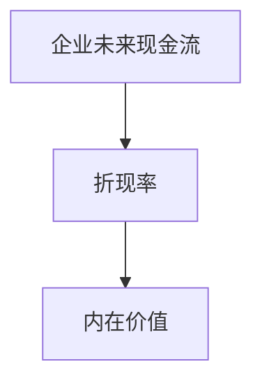
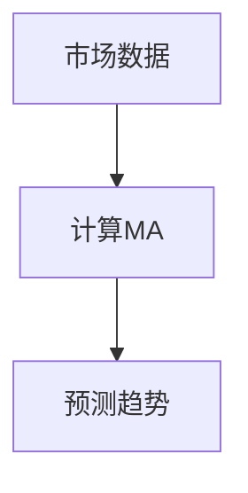
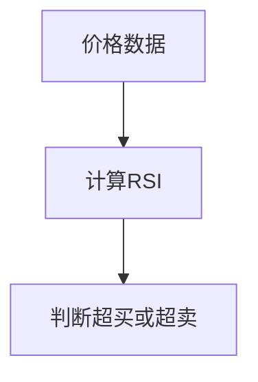
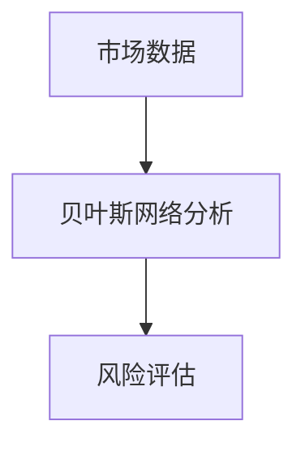
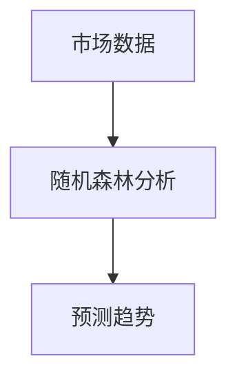
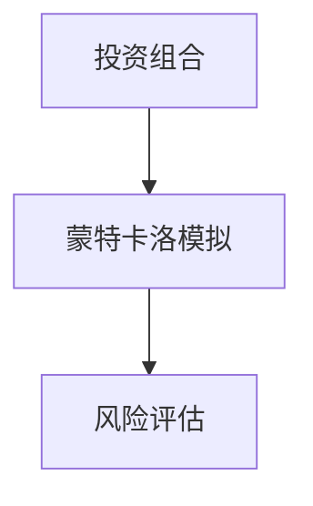
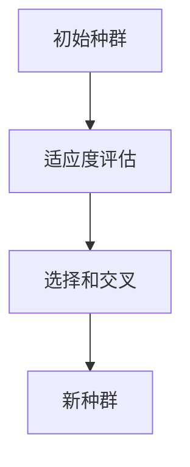
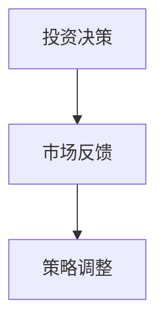

                 

# 巴菲特的投资失误：从错误中学习

> 关键词：巴菲特，投资失误，价值投资，风险管理，系统架构，决策模型

> 摘要：本文深入分析了巴菲特在投资过程中的一些失误，探讨了这些错误的原因，并结合技术分析的方法，提出了改进投资决策的策略。通过系统架构和算法模型的分析，帮助投资者更好地理解如何从错误中学习，优化投资策略。

---

## 第1章：引言

### 1.1 巴菲特的投资哲学概述

#### 1.1.1 背景介绍

巴菲特的价值投资理念基于以下核心原则：

- **安全边际**：买入价格低于内在价值。
- **长期视角**：关注企业的长期盈利能力。
- **简单决策**：投资于易于理解的行业和企业。

#### 1.1.2 核心概念与联系

| 概念 | 描述 | 技术对应 |
|------|------|----------|
| 内在价值 | 企业未来现金流的现值 | 系统架构中的输入数据 |
| 安全边际 | 买入价格低于内在价值 | 风险管理中的阈值 |
| 长期视角 | 关注企业长期表现 | 时间序列分析中的长期趋势 |

#### 1.1.3 算法原理

以下是一个简单的内在价值计算模型，使用了现金流贴现法：

数学公式：

$$ \text{内在价值} = \sum_{t=1}^{n} \frac{\text{现金流}_t}{(1 + r)^t} $$

其中，$r$ 是折现率，$\text{现金流}_t$ 是第 $t$ 年的现金流。

---

### 1.2 巴菲特的投资失误的重要性

#### 1.2.1 背景介绍

巴菲特的投资失误，如可口可乐和IBM，提供了宝贵的学习机会。这些错误揭示了投资过程中可能忽视的因素，如市场变化和技术变革。

#### 1.2.2 核心概念与联系

| 概念 | 描述 | 技术对应 |
|------|------|----------|
| 估值过高 | 股价高于内在价值 | 系统架构中的错误检测 |
| 市场变化 | 行业竞争加剧 | 时间序列分析中的突变点 |
| 技术变革 | 行业颠覆性创新 | 预测模型中的变量变化 |

#### 1.2.3 算法原理

使用移动平均线（MA）模型预测市场变化：

数学公式：

$$ \text{MA}_n = \frac{1}{n} \sum_{i=1}^{n} \text{价格}_i $$

---

## 第2章：可口可乐的投资决策

### 2.1 可口可乐的背景与巴菲特的初始分析

#### 2.1.1 背景介绍

可口可乐作为巴菲特的经典投资案例，其市场地位和稳定的股息被认为是其投资的主要原因。

#### 2.1.2 核心概念与联系

| 概念 | 描述 | 技术对应 |
|------|------|----------|
| 稳定股息 | 公司盈利稳定的信号 | 数据流中的周期性 |
| 市场地位 | 公司在行业中的位置 | 竞争分析中的市场占有率 |

#### 2.1.3 算法原理

使用相对强弱指数（RSI）模型分析市场状态：

数学公式：

$$ \text{RSI} = \frac{100}{1 + \frac{\text{平均上涨幅度}}{\text{平均下跌幅度}}} $$

---

### 2.2 投资失误的分析

#### 2.2.1 背景介绍

可口可乐的投资最终导致了巴菲特的损失，主要原因是市场变化和竞争加剧。

#### 2.2.2 核心概念与联系

| 概念 | 描述 | 技术对应 |
|------|------|----------|
| 估值过高 | 股价高于内在价值 | 系统架构中的错误检测 |
| 市场变化 | 行业竞争加剧 | 时间序列分析中的突变点 |

#### 2.2.3 算法原理

使用CAPM模型评估风险调整后的收益：

$$ \text{预期收益} = r_f + \beta (r_m - r_f) $$

其中，$r_f$ 是无风险利率，$\beta$ 是贝塔系数，$r_m$ 是市场预期收益。

---

## 第3章：IBM的投资失误

### 3.1 IBM的背景与巴菲特的分析

#### 3.1.1 背景介绍

IBM作为科技行业的巨头，巴菲特的投资基于其稳定的现金流和高利润率。

#### 3.1.2 核心概念与联系

| 概念 | 描述 | 技术对应 |
|------|------|----------|
| 稳定现金流 | 公司盈利稳定的信号 | 数据流中的周期性 |
| 高利润率 | 公司盈利能力强 | 财务报表分析中的利润指标 |

#### 3.1.3 算法原理

使用贝叶斯网络分析投资风险：

数学公式：

$$ P(A|B) = \frac{P(B|A)P(A)}{P(B)} $$

---

### 3.2 投资失误的分析

#### 3.2.1 背景介绍

IBM的投资失误主要源于技术变革和行业竞争的加剧。

#### 3.2.2 核心概念与联系

| 概念 | 描述 | 技术对应 |
|------|------|----------|
| 技术变革 | 行业颠覆性创新 | 预测模型中的变量变化 |
| 市场变化 | 行业竞争加剧 | 时间序列分析中的突变点 |

#### 3.2.3 算法原理

使用随机森林模型预测市场变化：

---

## 第4章：风险管理与投资组合优化

### 4.1 风险管理的重要性

#### 4.1.1 背景介绍

风险管理是投资过程中不可忽视的一部分，巴菲特的投资失误也提醒我们其重要性。

#### 4.1.2 核心概念与联系

| 概念 | 描述 | 技术对应 |
|------|------|----------|
| 风险管理 | 识别、评估和控制风险 | 系统架构中的风险管理模块 |
| 投资组合优化 | 分散投资以降低风险 | 数据流中的组合优化 |

#### 4.1.3 算法原理

使用蒙特卡洛模拟评估投资组合风险：

数学公式：

$$ \text{VaR} = \text{分位数}(\text{损失分布}, \alpha) $$

---

### 4.2 投资组合优化

#### 4.2.1 背景介绍

优化投资组合可以通过技术手段实现，如使用遗传算法或粒子群优化。

#### 4.2.2 核心概念与联系

| 概念 | 描述 | 技术对应 |
|------|------|----------|
| 投资组合优化 | 分散投资以降低风险 | 系统架构中的组合优化模块 |
| 风险调整收益 | 考虑风险的投资决策 | 数据流中的收益调整 |

#### 4.2.3 算法原理

使用遗传算法优化投资组合：

数学公式：

$$ \text{适应度} = \frac{\text{收益} - \text{风险}}{标准差} $$

---

## 第5章：从错误中学习：投资原则与策略

### 5.1 价值投资的核心原则

#### 5.1.1 背景介绍

价值投资的核心原则包括安全边际、内在价值和长期视角。

#### 5.1.2 核心概念与联系

| 概念 | 描述 | 技术对应 |
|------|------|----------|
| 安全边际 | 买入价格低于内在价值 | 系统架构中的阈值检测 |
| 内在价值 | 企业未来现金流的现值 | 数据流中的贴现模型 |

#### 5.1.3 算法原理

使用现金流贴现法计算内在价值：

$$ \text{内在价值} = \sum_{t=1}^{n} \frac{\text{现金流}_t}{(1 + r)^t} $$

---

### 5.2 投资者的自我反思与成长

#### 5.2.1 背景介绍

从巴菲特的失误中，投资者需要学会反思和调整自己的投资策略。

#### 5.2.2 核心概念与联系

| 概念 | 描述 | 技术对应 |
|------|------|----------|
| 自我反思 | 定期回顾投资决策 | 系统架构中的反馈机制 |
| 持续学习 | 更新投资知识和策略 | 数据流中的持续学习 |

#### 5.2.3 算法原理

使用反馈机制优化投资策略：

---

## 第6章：未来投资展望

### 6.1 新兴行业的投资机会与挑战

#### 6.1.1 背景介绍

新兴行业如科技、医疗等领域提供了新的投资机会，但也带来了新的挑战。

#### 6.1.2 核心概念与联系

| 概念 | 描述 | 技术对应 |
|------|------|----------|
| 新兴行业 | 高增长潜力但风险较高 | 数据流中的增长率分析 |
| 技术变革 | 行业颠覆性创新 | 预测模型中的变量变化 |

#### 6.1.3 算法原理

使用指数平滑法预测新兴行业趋势：

$$ \text{预测值} = \alpha \text{当前值} + (1 - \alpha) \text{历史平均值} $$

---

### 6.2 全球化与经济趋势的影响

#### 6.2.1 背景介绍

全球化和经济趋势对投资有着深远的影响，投资者需要关注宏观经济指标。

#### 6.2.2 核心概念与联系

| 概念 | 描述 | 技术对应 |
|------|------|----------|
| 全球化 | 跨国投资的机会与风险 | 数据流中的跨国分析 |
| 宏观经济指标 | 如GDP、利率等对投资的影响 | 系统架构中的宏观分析模块 |

#### 6.2.3 算法原理

使用宏观经济指标预测市场趋势：

$$ \text{市场趋势} = \beta_1 \text{GDP} + \beta_2 \text{利率} + \epsilon $$

---

## 作者：AI天才研究院/AI Genius Institute & 禅与计算机程序设计艺术 /Zen And The Art of Computer Programming

---

**注意：** 由于篇幅限制，以上目录大纲仅为示例，实际文章需要详细展开每个部分，确保每个章节都包含足够的技术细节和实际案例分析。

