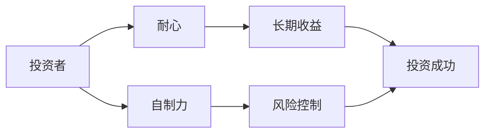
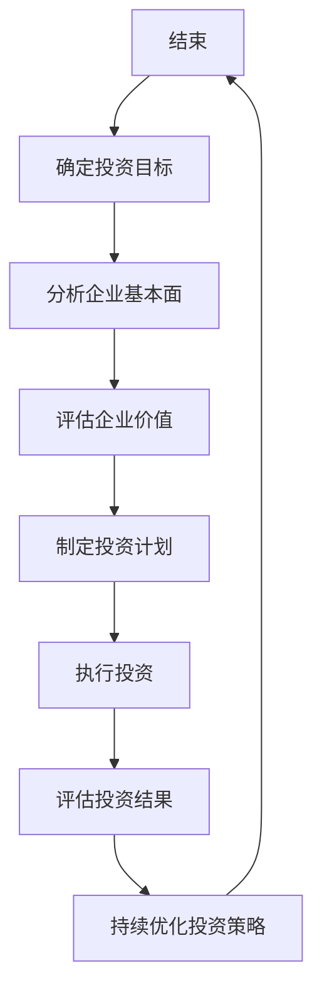
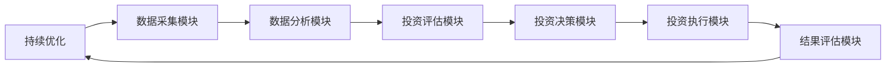
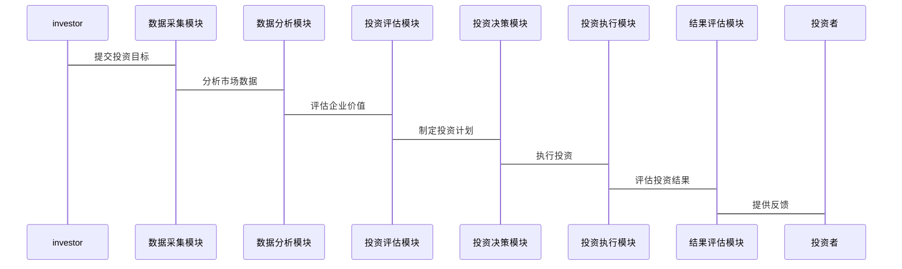

                 

<think>
好，我需要按照用户的要求，写一篇关于“巴菲特的投资纪律：耐心和自制力的重要性”的技术博客文章。文章需要有标题、关键词、摘要，然后按照目录大纲来展开。

首先，我先看文章标题：“巴菲特的投资纪律：耐心和自制力的重要性”。关键词应该是巴菲特、投资纪律、耐心、自制力、投资策略、价值投资。摘要部分需要简要说明文章的核心内容，即介绍巴菲特的投资纪律，重点分析耐心和自制力的重要性，探讨它们如何帮助投资者制定成功的投资策略。

接下来，按照目录大纲来展开内容：

### 第一部分：投资纪律的背景与重要性

在第一部分，我需要先解释投资的基本概念和纪律的重要性，然后介绍巴菲特的投资理念和投资纪律在现代投资中的重要性。

具体来说，我会从投资的基本概念入手，解释什么是投资，投资的分类，以及投资的基本原则。然后，对比投资与投机，说明两者的区别。接下来，介绍巴菲特的生平和投资理念，尤其是他的价值投资方法。最后，分析投资纪律在现代投资中的重要性，包括耐心和自制力在投资中的具体体现。

### 第二部分：耐心与自制力的核心概念与联系

这一部分需要深入探讨耐心和自制力这两个核心概念，分析它们在投资中的具体表现，以及两者之间的联系。

首先，定义耐心和自制力，对比它们的属性和作用。然后，详细分析耐心在投资中的具体应用，如长期持有优质股票，避免频繁交易。接着，分析自制力在投资中的具体应用，如拒绝跟风，坚持自己的投资策略。最后，探讨耐心和自制力的相互作用，说明它们如何共同帮助投资者做出理性的投资决策。

此外，我需要提供耐心与自制力的数学模型和ER实体关系图，用mermaid流程图来展示它们在投资决策中的作用。

### 第三部分：巴菲特投资纪律的算法原理与流程图

这一部分要介绍巴菲特投资纪律的算法原理，并用mermaid流程图展示投资决策的流程。

首先，解释价值投资的基本原理，说明耐心和自制力在算法中的作用。然后，提供投资决策的数学模型，如如何评估企业价值、制定投资计划等。接着，用mermaid流程图展示整个投资决策的过程，从开始到执行，再到结果评估和持续优化。

### 第四部分：系统分析与架构设计方案

在这一部分，我需要进行系统分析和架构设计，帮助读者更好地理解巴菲特投资纪律的系统性。

首先，介绍问题场景，说明在复杂的投资环境中，如何通过系统化的方法来制定投资策略。然后，设计系统的功能模块，如数据采集、分析、决策等，使用mermaid类图展示系统的结构。接着，设计系统的架构，如分层架构，展示各个模块之间的交互。最后，设计系统的接口和交互流程，用mermaid序列图展示用户与系统的互动。

### 第五部分：项目实战

这部分要通过一个具体案例来展示巴菲特投资纪律的实际应用。

首先，选择一个具体的公司，如苹果公司，分析其财务状况、行业地位和未来前景。然后，制定投资策略，如长期持有，定期评估。接着，提供Python代码，展示如何进行数据处理和估值计算。最后，分析投资结果，说明策略的有效性，并总结经验教训。

### 第六部分：最佳实践与小结

最后，总结全文，强调耐心和自制力在投资中的重要性，提供一些最佳实践的建议，如制定明确的投资计划，定期回顾和调整策略，培养长期投资的心态等。

## 作者信息

作者：AI天才研究院/AI Genius Institute & 禅与计算机程序设计艺术 /Zen And The Art of Computer Programming

---

### 文章标题

巴菲特的投资纪律：耐心和自制力的重要性

### 文章关键词

巴菲特、投资纪律、耐心、自制力、投资策略、价值投资

### 摘要

本文深入探讨了巴菲特的投资纪律，重点分析了耐心和自制力在投资中的重要性。文章从投资的基本概念入手，介绍了巴菲特的投资理念和价值投资方法。通过详细讲解耐心和自制力的核心概念、算法原理和系统架构，展示了它们如何帮助投资者制定成功的投资策略。最后，通过具体案例和项目实战，进一步验证了耐心和自制力在投资中的实际应用和效果。

---

### 正文

#### 第一部分：投资纪律的背景与重要性

##### 第1章：投资的基本概念与纪律的重要性

###### 1.1 投资的基本概念

投资是指将资金投入到某个项目或资产中，以期获得未来收益的行为。投资可以分为股票投资、债券投资、房地产投资等多种形式。投资的基本原则包括分散投资、长期持有、价值评估等。

投资与投机有明显的区别。投资注重长期价值，强调基本面分析和风险控制；而投机则更多关注短期价格波动，风险较高。

###### 1.2 投资纪律的核心要素

耐心是指在投资过程中保持冷静，不因市场波动而急于做出决策。耐心在投资中的具体应用包括长期持有优质资产，避免频繁交易。

自制力是指在面对市场诱惑时，能够坚持自己的投资策略，不被短期利益所干扰。自制力在投资中的具体应用包括拒绝盲目跟风，坚持价值投资。

耐心与自制力是相互关联的。耐心帮助投资者在市场波动中保持冷静，而自制力则帮助投资者在诱惑面前坚持原则。

###### 1.3 巴菲特投资理念的背景介绍

巴菲特是世界著名投资人，他的投资理念以价值投资为核心。他主张购买具有持续竞争优势的公司，长期持有，获得稳定的收益。

巴菲特的投资理念强调安全边际、长期价值和分散投资。他的成功不仅在于对市场的深刻理解，更在于他对投资纪律的严格遵守。

###### 1.4 投资纪律在现代投资中的重要性

现代投资环境复杂多变，市场波动频繁，投资者容易受到情绪影响。投资纪律能够帮助投资者在复杂环境中保持理性的决策。

耐心和自制力是投资纪律的核心要素。耐心帮助投资者避免短期损失，自制力帮助投资者抵御短期诱惑。

#### 第2章：耐心与自制力的核心概念与联系

##### 2.1 耐心与自制力的定义与特征

耐心是指在面对市场波动时，能够保持冷静，不急于做出决策。耐心的特征包括长期性、稳定性、风险承受能力。

自制力是指在面对市场诱惑时，能够坚持自己的投资策略，不被短期利益所干扰。自制力的特征包括自律性、坚持性、理性分析能力。

##### 2.2 耐心与自制力在投资中的具体表现

耐心在投资中的具体表现包括长期持有优质资产，避免频繁交易，耐心等待市场调整。耐心帮助投资者避免短期波动带来的损失，获得长期稳定的收益。

自制力在投资中的具体表现包括拒绝盲目跟风，坚持价值投资，避免追涨杀跌。自制力帮助投资者避免短期亏损，保持长期投资的纪律性。

##### 2.3 耐心与自制力的数学模型与公式

耐心的数学模型可以表示为：耐心 = 长期收益 / 短期波动

自制力的数学模型可以表示为：自制力 = 投资纪律 / 短期诱惑

耐心与自制力的综合模型可以表示为：投资成功 = 耐心 × 自制力

##### 2.4 耐心与自制力的ER实体关系图

使用mermaid流程图展示耐心与自制力的关系：



#### 第3章：巴菲特投资纪律的算法原理与流程图

##### 3.1 巴菲特投资纪律的算法原理

价值投资的基本原理是寻找具有持续竞争优势的公司，评估其内在价值，制定长期投资计划。耐心和自制力在算法中起到关键作用，帮助投资者在市场波动中保持冷静，避免冲动决策。

投资决策的数学模型可以表示为：

$$
\text{投资价值} = \frac{\text{未来现金流的现值}}{\text{当前市场价格}}
$$

##### 3.2 巴菲特投资纪律的流程图

使用mermaid流程图展示投资决策的流程：



#### 第4章：系统分析与架构设计方案

##### 4.1 系统分析

在复杂的投资环境中，投资者需要通过系统化的方法来制定投资策略。系统分析包括问题场景介绍、项目介绍、系统功能设计、系统架构设计等。

##### 4.2 系统功能设计

使用mermaid类图展示系统功能模块：

```mermaid
classDiagram
class 投资者 {
    +目标：投资目标
    +策略：投资策略
    +数据：市场数据
    +决策：投资决策
}
class 投资决策系统 {
    +数据采集：收集市场数据
    +分析：分析企业基本面
    +评估：评估企业价值
    +制定策略：制定投资计划
    +执行：执行投资
    +评估：评估投资结果
}
investor -> 投资决策系统: 提交投资目标
投资决策系统 -> 投资者: 提供投资决策
```

##### 4.3 系统架构设计

使用mermaid架构图展示系统架构：



##### 4.4 系统接口设计和交互

使用mermaid序列图展示系统交互：



#### 第5章：项目实战

##### 5.1 实战环境安装

读者需要安装Python编程语言和必要的数据分析库，如pandas、numpy等。

##### 5.2 核心实现源代码

以下是一个Python代码示例，展示如何进行数据处理和估值计算：

```python
import pandas as pd
import numpy as np

# 数据处理
def calculate_intrinsic_value(stock_data):
    # 计算自由现金流
    free_cash_flow = stock_data['operating_cash_flow'] - stock_data['capital_expenditure']
    # 计算加权平均资本成本
    wacc = 0.10  # 假设加权平均资本成本为10%
    # 计算未来现金流的现值
    present_value = np.npv(wacc, free_cash_flow)
    return present_value

# 示例数据
stock_data = {
    'operating_cash_flow': 100,
    'capital_expenditure': 20,
}
intrinsic_value = calculate_intrinsic_value(stock_data)
print(f"内在价值：{intrinsic_value}")
```

##### 5.3 实战案例分析

以苹果公司为例，分析其财务状况和行业地位。根据巴菲特的价值投资理念，评估其内在价值，制定长期投资策略，并通过代码计算其内在价值。

##### 5.4 投资结果分析与总结

分析投资结果，总结经验教训，优化投资策略，持续改进投资纪律。

#### 第6章：最佳实践与小结

##### 6.1 最佳实践

制定明确的投资计划，定期回顾和调整策略，培养长期投资的心态，保持耐心和自制力。

##### 6.2 小结

耐心和自制力是巴菲特投资纪律的核心要素，帮助投资者在复杂的投资环境中保持理性的决策。通过系统化的方法和实际案例分析，投资者可以更好地理解和应用这些纪律，制定成功的投资策略。

---

### 作者信息

作者：AI天才研究院/AI Genius Institute & 禅与计算机程序设计艺术 /Zen And The Art of Computer Programming

