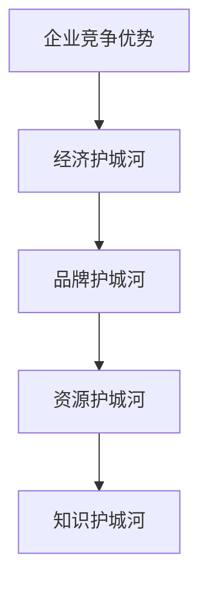

                 


```markdown
# 巴菲特的护城河理论及其应用

## 关键词
- 巴菲特
- 护城河理论
- 投资策略
- 企业竞争优势
- 数学模型

## 摘要
巴菲特的护城河理论是价值投资的核心理念之一，强调通过构建和维护企业的竞争优势来实现长期稳健的投资回报。本文系统地分析了护城河理论的背景、核心概念、分析方法、构建与维护策略，并通过实际案例展示了其在投资、企业管理和创业中的广泛应用。文章还探讨了护城河失效的风险管理策略，为读者提供了全面的理论指导和实践启示。

---

## 第1章: 巴菲特与护城河理论的背景介绍

### 1.1 巴菲特的生平与投资理念
#### 1.1.1 巴菲特的早期经历与投资哲学
沃伦·巴菲特（Warren Buffett）是全球最著名的价值投资者之一，出生于1934年，早年通过投资俱乐部和合伙企业积累了丰富的投资经验。他的投资哲学强调长期价值创造、安全边际和企业基本面分析。

#### 1.1.2 巴菲特的价值投资理论
巴菲特的价值投资理论强调买入并持有优质资产，关注企业的长期盈利能力、财务健康状况和管理团队。他主张以合理的价格买入具有强大竞争优势的企业。

#### 1.1.3 护城河理论的提出与演变
护城河理论是巴菲特投资理念的核心，提出企业在市场上构建竞争优势的能力决定了其长期盈利能力。随着时间推移，护城河理论不断完善，从简单的成本优势扩展到品牌、资源和技术等多个维度。

### 1.2 护城河理论的核心概念
#### 1.2.1 经济护城河的定义与特征
经济护城河是指企业在市场上形成成本优势，通过规模经济、专利和技术壁垒等手段降低竞争对手的进入门槛，从而巩固市场地位。

#### 1.2.2 企业竞争优势的分类
企业竞争优势可以分为经济护城河、品牌护城河、资源护城河和知识护城河四种类型，每种类型都有其独特的竞争优势和特征。

#### 1.2.3 护城河的长期可持续性
护城河的可持续性取决于企业的创新能力、市场适应能力和管理能力。只有不断优化和创新，护城河才能长期有效。

---

## 第2章: 护城河理论的核心概念与联系

### 2.1 护城河的类型与特征对比
#### 2.1.1 经济护城河：成本优势、规模经济与专利
经济护城河的核心在于通过降低成本、扩大规模和申请专利来形成竞争优势。

#### 2.1.2 品牌护城河：品牌忠诚度与市场影响力
品牌护城河通过建立强大的品牌影响力和客户忠诚度，形成市场壁垒。

#### 2.1.3 资源护城河：独特资源与战略资产
资源护城河依赖于企业独有的战略资源，如原材料、技术设备等。

#### 2.1.4 知识护城河：技术壁垒与专有知识
知识护城河通过技术专利、专有知识和管理经验形成竞争优势。

#### 2.1.5 护城河类型的对比表格
| 护城河类型 | 核心要素 | 特征 | 可持续性 |
|-----------|----------|------|----------|
| 经济护城河 | 成本优势、规模经济 | 低成本、高效率 | 较高 |
| 品牌护城河 | 品牌忠诚度 | 高品牌认知度 | 较高 |
| 资源护城河 | 独特资源 | 稀缺性 | 较高 |
| 知识护城河 | 专有技术 | 技术壁垒 | 较高 |

#### 2.1.6 实体关系图（Mermaid流程图）


### 2.2 护城河的实体关系图


---

## 第3章: 护城河的分析方法与数学模型

### 3.1 护城河的定量分析方法
#### 3.1.1 财务指标分析：ROE、ROA、净利率
- 净资产收益率（ROE）：衡量企业盈利能力，公式为：
  $$ \text{ROE} = \frac{\text{净利润}}{\text{股东权益}} $$
- 资产回报率（ROA）：衡量资产使用效率，公式为：
  $$ \text{ROA} = \frac{\text{净利润}}{\text{总资产}} $$
- 净利率：衡量每单位收入的净利润，公式为：
  $$ \text{净利率} = \frac{\text{净利润}}{\text{营业收入}} $$

#### 3.1.2 竞争优势分析：市场占有率、客户忠诚度
- 市场占有率：衡量企业在市场中的地位，公式为：
  $$ \text{市场占有率} = \frac{\text{企业销售额}}{\text{行业销售额}} $$
- 客户忠诚度：通过客户保留率和重复购买率评估。

#### 3.1.3 价值链分析：成本结构、价值创造点
价值链分析帮助企业识别核心竞争力，优化资源分配，降低成本。

### 3.2 护城河的数学模型与公式
#### 3.2.1 经济护城河的计算公式
$$ \text{经济护城河宽度} = \frac{\text{企业边际成本}}{\text{市场价格}} $$

#### 3.2.2 品牌价值的评估公式
$$ \text{品牌价值} = \text{销售收入} \times \text{品牌忠诚度} \times \text{价格溢价} $$

---

## 第4章: 护城河的构建与维护策略

### 4.1 护城河的战略制定
#### 4.1.1 企业核心竞争力的识别
识别企业的核心竞争力，包括技术、品牌、资源等方面。

#### 4.1.2 护城河的长期规划与目标设定
制定护城河的建设目标，如市场占有率、利润率等。

#### 4.1.3 护城河的动态调整与优化
根据市场变化和竞争环境，动态调整护城河策略。

### 4.2 护城河的组织与管理
#### 4.2.1 企业文化与员工激励
通过企业文化建设提高员工忠诚度和创造力。

#### 4.2.2 创新能力的培养
通过研发投入和技术创新巩固护城河。

#### 4.2.3 资源配置与成本控制
合理配置资源，优化成本结构，提高效率。

---

## 第5章: 护城河理论的实际案例分析

### 5.1 可口可乐的护城河分析
#### 5.1.1 品牌优势与全球市场布局
可口可乐通过强大的品牌影响力和全球分销网络形成竞争优势。

#### 5.1.2 分销网络与成本控制
通过高效的分销网络降低成本，提高市场占有率。

#### 5.1.3 持续创新与产品更新
通过不断创新推出新产品，保持市场领先地位。

### 5.2 谷歌的护城河构建
#### 5.2.1 技术壁垒与搜索引

---

## 作者：AI天才研究院/AI Genius Institute & 禅与计算机程序设计艺术 /Zen And The Art of Computer Programming

---

通过以上目录结构和内容概要，您可以根据需要进一步扩展每个章节的内容，添加具体的案例分析、数学公式和图表等，以完成一篇完整的专业技术博客文章。
```

