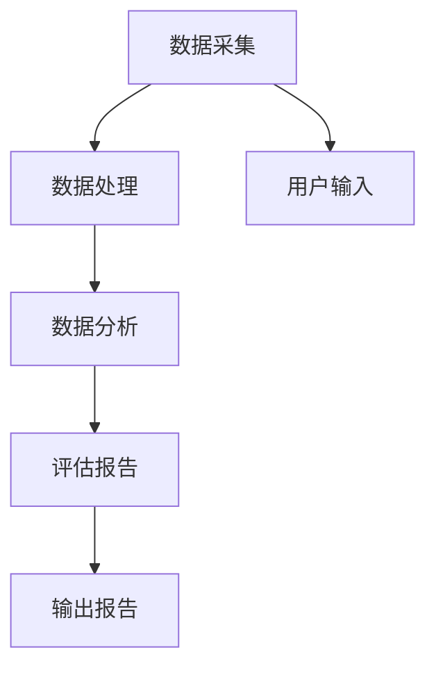

                 


# 巴菲特的护城河理论：寻找持久竞争优势

---

## 关键词  
巴菲特, 护城河理论, 竞争优势, 企业价值, 可持续发展

---

## 摘要  
巴菲特的护城河理论是投资与企业管理领域的核心思想之一，其本质是通过识别企业的持久竞争优势来预测其长期价值增长。本文从护城河理论的背景、核心概念、算法原理、系统分析、项目实战等多个维度展开，结合技术语言与实际案例，深入解析如何通过护城河理论寻找持久竞争优势。

---

# 第一部分：巴菲特护城河理论的背景与核心概念

## 第1章：护城河理论的起源与核心理念

### 1.1 护城河理论的起源  
- **1.1.1 巴菲特的投资理念**  
  巴菲特的“护城河”概念源于他的投资哲学，即寻找那些拥有强大竞争优势、能够在长期市场中保持领先地位的企业。  
- **1.1.2 护城河理论的定义**  
  护城河是企业在市场中形成的竞争优势，能够防止竞争对手侵入，确保企业在特定领域内的长期盈利能力。  
- **1.1.3 护城河理论的核心要素**  
  - **市场地位**：企业在市场中的占有率和品牌影响力。  
  - **资源壁垒**：企业独有的资源或技术优势。  
  - **运营效率**：企业内部流程的优化与成本控制能力。  
  - **创新能力**：企业持续创新的能力，能够不断推出新产品或服务。  

### 1.2 护城河理论在商业中的应用  
- **1.2.1 护城河理论的商业价值**  
  护城河理论不仅适用于投资领域，也适用于企业战略规划，帮助企业建立可持续的竞争优势。  
- **1.2.2 护城河理论与企业竞争优势**  
  通过分析企业的护城河，可以识别其核心竞争力，并制定相应的战略。  
- **1.2.3 护城河理论的现代发展**  
  随着技术的进步，护城河理论也在不断演变，例如数字化转型带来的技术壁垒。

---

## 第2章：护城河的核心概念与类型

### 2.1 护城河的核心概念  
- **2.1.1 护城河的定义与特征**  
  护城河是一种结构性的竞争优势，能够在长期内保护企业免受竞争威胁。  
- **2.1.2 护城河的边界与外延**  
  护城河不仅包括企业的内部优势，还涉及外部市场的环境因素。  
- **2.1.3 护城河的结构与组成要素**  
  - **核心竞争力**：企业的独特能力或技术优势。  
  - **资源储备**：企业拥有的关键资源，如数据、人才等。  
  - **组织能力**：企业的管理和运营效率。  

### 2.2 护城河的主要类型  
- **2.2.1 成本优势**  
  企业通过规模效应或流程优化降低成本，从而在价格竞争中占据优势。  
- **2.2.2 品牌优势**  
  强大的品牌形象能够吸引客户并建立忠诚度。  
- **2.2.3 网络效应**  
  产品或服务的用户越多，其价值越大，形成正反馈循环。  
- **2.2.4 技术壁垒**  
  通过专利或技术领先性，防止竞争对手进入市场。

---

## 第3章：护城河理论的核心要素与关系

### 3.1 护城河的核心要素  
- **3.1.1 市场地位**  
  市场占有率和品牌影响力是护城河的重要组成部分。  
- **3.1.2 资源优势**  
  包括资金、技术、数据等资源的储备。  
- **3.1.3 运营效率**  
  通过优化流程降低成本，提高生产效率。  
- **3.1.4 创新能力**  
  持续创新是企业保持竞争优势的关键。

### 3.2 护城河要素之间的关系  
- **3.2.1 要素之间的相互作用**  
  护城河的各个要素相互关联，共同作用于企业的竞争优势。  
- **3.2.2 要素与竞争优势的关系**  
  护城河要素是竞争优势的来源，而竞争优势又决定了企业的市场地位。  
- **3.2.3 要素与企业价值的关系**  
  护城河要素越强大，企业的长期价值增长潜力越大。

---

# 第二部分：护城河理论的系统分析与评估方法

## 第4章：护城河评估的算法原理

### 4.1 护城河评估的基本步骤  
- **4.1.1 识别企业的护城河**  
  通过分析企业的市场地位、资源储备和创新能力，识别其护城河要素。  
- **4.1.2 评估护城河的宽度与深度**  
  宽度指护城河覆盖的范围，深度指其强度和可持续性。  
- **4.1.3 评估护城河的可持续性**  
  通过分析市场竞争和行业趋势，评估护城河的长期稳定性。

### 4.2 护城河评估的数学模型  
- **4.2.1 护城河评估的加权评分法**  
  通过权重分配对各要素进行评分，综合计算得出企业的护城河指数。  
  - 公式：$$ \text{护城河指数} = \sum (\text{要素权重} \times \text{要素评分}) $$  
- **4.2.2 护城河评估的层次分析法**  
  使用层次分析法（AHP）确定各要素的权重，再进行综合评估。  
  - 示例代码：  
    ```python
    def calculate_weights(elements, pairwise_matrix):
        # 计算权重
        pass
    ```
- **4.2.3 护城河评估的数学公式**  
  综合评估公式：$$ \text{综合评分} = \sum_{i=1}^{n} w_i \times s_i $$  
  其中，$$w_i$$ 是第 $$i$$ 个要素的权重，$$s_i$$ 是评分。

---

## 第5章：护城河评估的系统架构设计

### 5.1 系统分析与设计  
- **5.1.1 系统功能设计**  
  包括数据采集、分析模块、评估报告生成等功能。  
- **5.1.2 系统架构设计**  
  使用分层架构，包括数据层、业务逻辑层和用户界面层。  
- **5.1.3 系统接口设计**  
  定义模块之间的接口，确保各部分协同工作。  
- **5.1.4 系统交互设计**  
  通过用户需求分析，设计直观的交互流程。

### 5.2 系统架构图  


---

## 第6章：项目实战——护城河评估案例分析

### 6.1 环境安装与数据准备  
- **6.1.1 环境安装**  
  安装Python、数据处理库（Pandas、NumPy）和可视化工具（Matplotlib）。  
- **6.1.2 数据准备**  
  收集企业的市场地位、资源储备等数据。

### 6.2 系统核心实现  
- **6.2.1 数据分析模块**  
  ```python
  import pandas as pd

  def analyze_data(data_frame):
      # 分析数据并返回结果
      return result
  ```
- **6.2.2 评估模型实现**  
  ```python
  def calculate_hydraulics(data):
      # 计算护城河指数
      return index
  ```

### 6.3 案例分析与解读  
- **6.3.1 案例选择**  
  以亚马逊为例，分析其成本优势、品牌忠诚度和网络效应。  
- **6.3.2 评估过程**  
  使用层次分析法评估各要素的权重，计算综合评分。

---

## 第7章：最佳实践与小结

### 7.1 最佳实践  
- **7.1.1 投资中的护城河策略**  
  长期投资者应优先选择具有强大护城河的企业。  
- **7.1.2 企业战略中的护城河建设**  
  企业应持续优化自身资源、技术和品牌，构建坚固的护城河。  
- **7.1.3 注意事项**  
  定期评估护城河的可持续性，及时调整战略。

### 7.2 小结  
护城河理论不仅为投资者提供了价值评估的工具，也为企业的持续发展提供了战略方向。通过系统化的方法和工具，我们可以更好地识别和构建企业的竞争优势。

---

## 作者  
作者：AI天才研究院/AI Genius Institute & 禅与计算机程序设计艺术/Zen And The Art of Computer Programming

