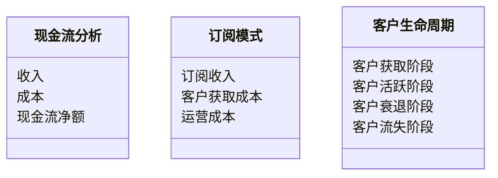
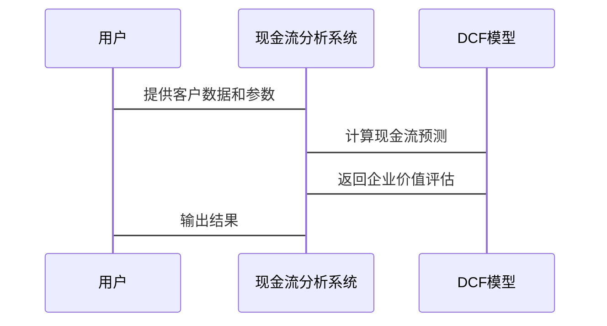

                 


# 巴菲特的现金流分析：订阅经济模式下的新指标

## 关键词：
- 巴菲特
- 现金流分析
- 订阅经济
- 价值投资
- 自由现金流
- DCF模型

## 摘要：
本文深入探讨了巴菲特的现金流分析方法在订阅经济模式下的应用，提出了新的现金流分析指标。通过结合订阅经济的特点，分析了如何利用现金流模型评估企业的长期价值，为企业投资者提供了新的视角和工具。

---

# 第一部分：现金流分析的基本概念

## 第1章：现金流分析的基本概念

### 1.1 现金流分析的定义与重要性

#### 1.1.1 现金流的基本概念
现金流是指企业在一定时期内通过经营或其他活动所获得或支付的现金和现金等价物的流入和流出。现金流分析是评估企业财务健康和价值的重要工具。

#### 1.1.2 现金流分析的重要性
现金流分析能够揭示企业的实际财务状况，帮助投资者评估企业的盈利能力和偿债能力。现金流充足的公司通常具有更强的市场竞争力和发展潜力。

#### 1.1.3 现金流与企业价值的关系
现金流是企业价值的核心驱动因素。通过现金流分析，投资者可以更好地理解企业的盈利模式和未来增长潜力。

---

### 1.2 订阅经济模式的定义与特点

#### 1.2.1 订阅经济模式的定义
订阅经济模式是一种以订阅服务为基础的商业模式，消费者通过支付定期费用获得持续的服务或产品使用权。

#### 1.2.2 订阅经济模式的核心特征
- **持续性**：消费者按月或按年支付订阅费用，企业获得稳定的收入流。
- **客户粘性**：订阅模式通过提供独特价值增强客户忠诚度。
- **成本分摊**：企业通过订阅模式将成本分摊到客户的使用周期中。

#### 1.2.3 订阅经济模式与传统商业模式的区别
订阅经济模式注重长期客户关系和持续收入，而传统商业模式关注单次销售和利润最大化。

---

### 1.3 巴菲特的价值投资理念

#### 1.3.1 巴菲特投资理念的核心思想
巴菲特倡导长期价值投资，注重企业的基本面分析，尤其是现金流和盈利能力。

#### 1.3.2 巴菲特对现金流的重视
巴菲特认为现金流是企业价值的最终来源，稳定的现金流能够支撑企业的持续发展和股东价值的实现。

#### 1.3.3 巴菲特的长期投资策略
巴菲特倾向于投资那些具有稳定现金流、强大护城河和良好管理团队的企业。

---

## 第2章：现金流分析的核心指标

### 2.1 自由现金流模型

#### 2.1.1 自由现金流的定义
自由现金流是指企业在支付了所有运营成本和资本支出后的剩余现金流，反映了企业的实际盈利能力。

#### 2.1.2 自由现金流的计算公式
$$\text{自由现金流} = \text{营业收入} - \text{运营成本} - \text{资本支出}$$

#### 2.1.3 自由现金流与企业价值的关系
自由现金流是企业价值的核心驱动力，高自由现金流意味着企业有更多资金用于再投资或回报股东。

---

### 2.2 现金流质量分析

#### 2.2.1 现金流质量的定义
现金流质量是指企业现金流的稳定性和可持续性，反映了企业的财务健康状况。

#### 2.2.2 现金流质量的评估指标
- **经营活动现金流净额**：经营活动产生的现金流净额越高，企业的盈利质量越好。
- **自由现金流比率**：自由现金流占营业收入的比例越高，企业财务健康状况越好。

#### 2.2.3 现金流质量与企业财务健康的关系
高质量的现金流意味着企业具有较强的偿债能力和扩张能力，能够为股东创造更大的价值。

---

### 2.3 现金流预测与DCF模型

#### 2.3.1 现金流预测的定义
现金流预测是对未来一定时期内企业现金流的估计，通常用于评估企业的长期价值。

#### 2.3.2 DCF模型的基本原理
DCF（Discounted Cash Flow）模型通过将未来现金流按一定折现率折现，计算企业的现值。

#### 2.3.3 DCF模型的应用步骤
1. **预测未来现金流**：基于企业的历史数据和市场预测，估算未来各期的现金流。
2. **确定折现率**：通常使用加权平均资本成本（WACC）作为折现率。
3. **计算现值**：将未来现金流折现，计算企业价值。

---

## 第3章：订阅经济模式下的现金流分析

### 3.1 订阅经济模式的现金流特点

#### 3.1.1 订阅模式下的现金流波动
订阅模式通常具有稳定的现金流，但由于客户 churn 和获取新客户成本的存在，现金流波动性较大。

#### 3.1.2 订阅模式下的客户生命周期
客户生命周期包括获取、活跃、衰退和流失四个阶段，每个阶段的现金流特征不同。

#### 3.1.3 订阅模式下的收入与成本匹配
订阅模式下，收入与成本的匹配性较强，但由于前期获取成本较高，现金流可能存在前期亏损。

---

### 3.2 订阅经济模式下的现金流模型

#### 3.2.1 订阅模式下的现金流公式
$$\text{订阅现金流} = \text{订阅收入} - \text{客户获取成本} - \text{运营成本}$$

#### 3.2.2 现金流预测在订阅模式中的应用
通过预测客户数量、订阅价格和 churn 率，可以估算未来的现金流。

#### 3.2.3 DCF模型在订阅经济中的应用
使用DCF模型评估订阅模式下的企业价值时，需要考虑客户生命周期和订阅收入的可持续性。

---

## 第4章：系统分析与架构设计方案

### 4.1 问题场景介绍
我们以一家SaaS公司为例，分析其现金流情况，评估其长期价值。

### 4.2 系统功能设计

#### 4.2.1 领域模型（Mermaid类图）


### 4.3 系统架构设计（Mermaid架构图）


### 4.4 系统接口设计
- **输入接口**：客户数据、订阅价格、成本数据。
- **输出接口**：现金流预测、企业价值评估。

### 4.5 系统交互（Mermaid序列图）


---

## 第5章：项目实战

### 5.1 环境配置
- **工具**：Python、Jupyter Notebook、Mermaid。
- **数据**：SaaS公司过去3年的财务数据和客户数据。

### 5.2 核心实现（Python代码示例）

#### 5.2.1 现金流计算
```python
def calculate_cash_flow(revenue, costs, capital_expenditure):
    return revenue - costs - capital_expenditure
```

#### 5.2.2 DCF模型实现
```python
def discounted_cash_flow(cash_flows, discount_rate):
    present_value = 0
    for year, cash_flow in enumerate(cash_flows):
        present_value += cash_flow / (1 + discount_rate) ** year
    return present_value
```

### 5.3 实际案例分析
以一家SaaS公司为例，分析其现金流情况，评估其企业价值。

### 5.4 结果分析与优化建议
根据现金流分析结果，提出优化企业价值的建议，如降低成本、提高客户 retention 率等。

---

## 第6章：最佳实践与小结

### 6.1 最佳实践
- **关注现金流质量**：不仅仅是现金流的数量，还要关注其来源和稳定性。
- **定期评估模型**：根据市场变化和企业情况，定期更新现金流模型。
- **注意财务造假**：现金流分析需要结合其他财务指标，防止企业财务造假。

### 6.2 小结
通过本文的分析，我们可以看到，现金流分析在订阅经济模式下的重要性。巴菲特的价值投资理念为企业投资者提供了新的视角，结合现金流分析和DCF模型，可以帮助投资者更好地评估企业的长期价值。

---

## 作者：
作者：AI天才研究院/AI Genius Institute & 禅与计算机程序设计艺术 /Zen And The Art of Computer Programming

