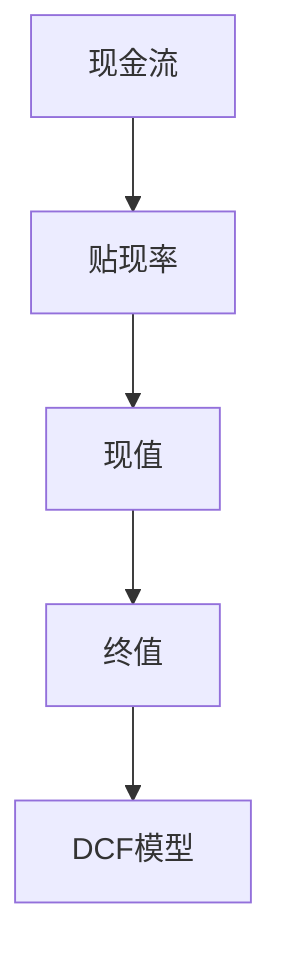
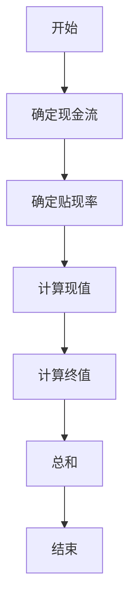
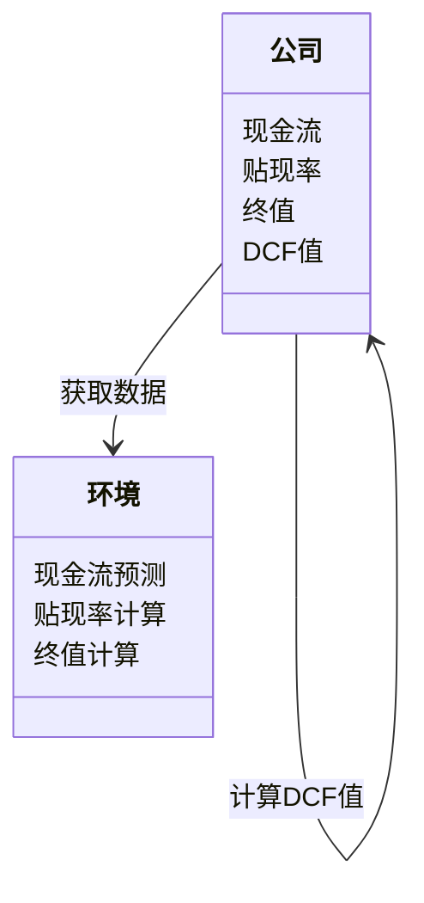
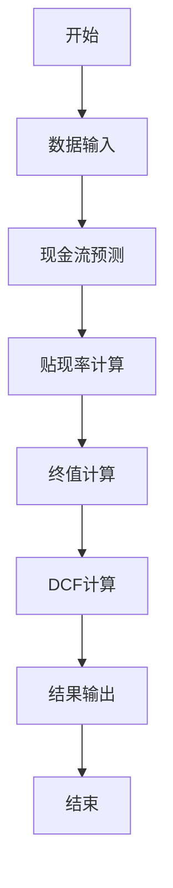
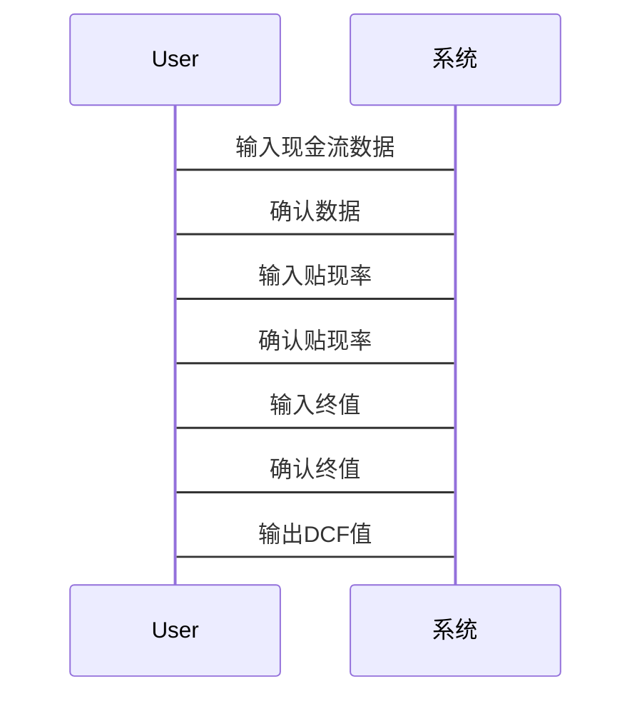

                 


```markdown
# 巴菲特的现金流折现模型：公司估值的核心方法

> 关键词：巴菲特，现金流折现模型，公司估值，投资分析，财务模型，贴现率，DCF

> 摘要：本文系统地介绍并深入分析了巴菲特的现金流折现模型（DCF）在公司估值中的核心作用。通过理论与实践相结合的方式，详细阐述了现金流折现模型的基本概念、数学原理、算法流程、系统架构以及实际案例分析，帮助读者全面理解和掌握这一经典估值方法。

---

# 第一部分: 股权投资与现金流折现模型的背景

# 第1章: 股权投资与现金流折现模型概述

## 1.1 股权投资的基本概念
### 1.1.1 股权投资的定义与特点
- 股权投资是指通过购买公司股份，成为其股东，以获取公司未来收益的一种投资方式。
- 其特点是高风险、高回报，要求投资者具备深入的行业分析能力和财务判断能力。

### 1.1.2 股权投资的基本原则
- 长期投资：股权投资的核心是长期持有优质资产。
- 安全边际：在投资中，确保买入价格低于公司的内在价值。
- 资质门槛：要求公司具备持续盈利能力和良好治理结构。

### 1.1.3 股权投资的核心目标
- 实现资产增值。
- 通过持有优质公司股份，分享其长期成长收益。

## 1.2 股权投资的估值方法
### 1.2.1 市盈率法
- 市盈率（P/E）= 股价 / 每股净利润。
- 优点：简单易用，适用于比较同类公司。
- 缺点：无法反映公司的未来盈利能力。

### 1.2.2 市净率法
- 市净率（P/B）= 股价 / 每股净资产。
- 适用于银行、房地产等资产驱动型行业。
- 缺点：无法衡量公司的盈利能力。

### 1.2.3 股息率法
- 股息率 = 每股股息 / 股价。
- 适用于稳定分红的公司。
- 缺点：无法反映公司的成长潜力。

### 1.2.4 现金流折现模型的提出
- 现金流折现模型（DCF）是一种基于公司未来现金流的折现方法，用于估算公司的内在价值。
- 它克服了传统估值方法的局限性，能够更准确地反映公司的长期价值。

## 1.3 现金流折现模型的核心思想
### 1.3.1 现金流折现模型的定义
- DCF模型通过将公司未来产生的现金流折现到当前时点，计算其现值，作为公司股权的内在价值。
- 核心公式：$$DCF = \sum_{t=1}^{n} \frac{CF_t}{(1 + r)^t} + \frac{TV}{(1 + r)^n}$$

### 1.3.2 现金流折现模型的基本假设
- 公司未来现金流可以预测。
- 贴现率（r）能够准确反映公司的风险水平。
- 终值（TV）基于永续增长率计算。

### 1.3.3 现金流折现模型的适用场景
- 适用于具有稳定现金流的公司。
- 适用于能够预测未来盈利的公司。
- 适用于长期股权投资分析。

## 1.4 巴菲特与现金流折现模型
### 1.4.1 巴菲特的投资理念
- 价值投资：寻找市场低估的优质公司。
- 长期持有：通过时间复利效应实现财富增长。
- 安全边际：确保买入价格低于内在价值。

### 1.4.2 巴菲特对现金流折现模型的贡献
- 将DCF模型应用于实践，强调现金流的重要性。
- 强调企业的内在价值与未来现金流的折现关系。

### 1.4.3 巴菲特现金流折现模型的独特性
- 强调企业竞争优势和护城河。
- 注重企业的长期盈利能力。
- 结合市场情绪进行估值修正。

## 1.5 本章小结
本章通过介绍股权投资的基本概念、常见估值方法及其局限性，引出现金流折现模型的核心思想。通过巴菲特的投资理念，强调现金流折现模型在公司估值中的重要性。

---

# 第2章: 现金流折现模型的核心概念与联系

## 2.1 现金流折现模型的定义与公式
### 2.1.1 现金流折现模型的公式
- 现金流折现模型的公式为：
$$DCF = \sum_{t=1}^{n} \frac{CF_t}{(1 + r)^t} + \frac{TV}{(1 + r)^n}$$
其中：
- \(CF_t\) 表示第 t 年的现金流。
- \(r\) 表示贴现率。
- \(n\) 表示预测期数。
- \(TV\) 表示终值。

### 2.1.2 现金流折现模型的变量解析
- 现金流（CF）：公司未来各年的现金流预测。
- 贴现率（r）：反映公司风险的折现率。
- 终值（TV）：基于永续增长率计算的最终价值。

## 2.2 现金流折现模型的属性特征对比
### 2.2.1 不同贴现率的对比
- 高贴现率：低估未来现金流。
- 低贴现率：高估未来现金流。
- 合适的贴现率：反映公司风险的真实水平。

### 2.2.2 不同现金流的对比
- 稳定现金流：DCF模型计算简单，结果可靠。
- 波动现金流：DCF模型结果波动较大。

### 2.2.3 不同终值的对比
- 高终值：DCF模型计算的内在价值较高。
- 低终值：DCF模型计算的内在价值较低。

## 2.3 现金流折现模型的ER实体关系图


## 2.4 本章小结
本章通过详细解析现金流折现模型的定义、公式和变量，展示了模型的核心属性和特征。通过ER实体关系图，进一步明确了模型的构成和各部分之间的关系。

---

# 第3章: 现金流折现模型的算法原理讲解

## 3.1 现金流折现模型的数学模型与公式
### 3.1.1 现金流折现模型的基本公式
- DCF模型的基本公式为：
$$DCF = \sum_{t=1}^{n} \frac{CF_t}{(1 + r)^t} + \frac{TV}{(1 + r)^n}$$
- 其中，CF_t 代表第 t 年的现金流，r 代表贴现率，n 代表预测期数，TV 代表终值。

### 3.1.2 终值的计算公式
- 终值的计算公式为：
$$TV = \frac{CF_{n+1}}{(1 + g)}$$
其中，g 代表永续增长率。

## 3.2 现金流折现模型的算法流程


## 3.3 现金流折现模型的代码实现
### 3.3.1 环境安装
- 需要安装Python和相关库（如numpy、pandas）。
- 安装命令：
  ```bash
  pip install numpy pandas
  ```

### 3.3.2 核心实现代码
```python
import numpy as np

def calculate_dcf(cash_flows, discount_rate, terminal_value, years):
    present_value = 0
    for t in range(years):
        CF_t = cash_flows[t]
        PV_t = CF_t / (1 + discount_rate) ** t
        present_value += PV_t
    TV = terminal_value / (1 + discount_rate) ** years
    present_value += TV
    return present_value

# 示例数据
cash_flows = [100, 150, 200, 250]
discount_rate = 0.1
terminal_value = 300
years = 4

# 计算DCF
DCF = calculate_dcf(cash_flows, discount_rate, terminal_value, years)
print("DCF 值为:", DCF)
```

### 3.3.3 代码解读与分析
- 代码实现了现金流折现模型的基本算法，输入现金流、贴现率、终值和预测年数，输出DCF值。
- 通过示例数据展示了如何使用代码进行DCF计算。

## 3.4 本章小结
本章通过数学公式和代码实现，详细讲解了现金流折现模型的算法原理。通过代码示例，帮助读者更好地理解和应用模型。

---

# 第4章: 现金流折现模型的系统分析与架构设计

## 4.1 问题场景介绍
- 某上市公司未来五年的现金流预测：
  - 第一年：100万元
  - 第二年：150万元
  - 第三年：200万元
  - 第四年：250万元
  - 第五年：300万元
- 贴现率：10%
- 终值：基于永续增长率5%计算。

## 4.2 系统功能设计
### 4.2.1 领域模型


### 4.2.2 系统架构设计


## 4.3 系统接口设计
- 输入接口：现金流、贴现率、终值。
- 输出接口：DCF值。

## 4.4 系统交互设计


## 4.5 本章小结
本章通过系统分析和架构设计，展示了现金流折现模型在实际应用中的系统结构和交互流程。

---

# 第5章: 现金流折现模型的项目实战

## 5.1 项目背景与目标
- 某上市公司未来五年的现金流预测。
- 使用DCF模型计算其内在价值。

## 5.2 项目环境与工具
- 工具：Python、Excel。
- 数据来源：公司财务报表。

## 5.3 核心实现代码
```python
import numpy as np

def calculate_dcf(cash_flows, discount_rate, terminal_value, years):
    present_value = 0
    for t in range(years):
        CF_t = cash_flows[t]
        PV_t = CF_t / (1 + discount_rate) ** t
        present_value += PV_t
    TV = terminal_value / (1 + discount_rate) ** years
    present_value += TV
    return present_value

# 示例数据
cash_flows = [100, 150, 200, 250, 300]
discount_rate = 0.1
terminal_value = 300 * 1.05
years = 5

# 计算DCF
DCF = calculate_dcf(cash_flows, discount_rate, terminal_value, years)
print("DCF 值为:", DCF)
```

## 5.4 代码应用解读与分析
- 代码实现了DCF模型的计算，输入现金流、贴现率和终值，输出DCF值。
- 通过示例数据展示了如何进行实际的DCF计算。

## 5.5 实际案例分析
### 5.5.1 数据收集
- 公司未来五年的现金流预测。
- 贴现率设定为10%。
- 终值基于永续增长率5%计算。

### 5.5.2 模型搭建
- 使用Excel或Python进行现金流折现计算。
- 计算各年的现值和终值，求和得到DCF值。

### 5.5.3 结果分析
- 计算得到的DCF值与实际股价进行对比。
- 如果DCF值高于股价，说明公司被低估。

## 5.6 本章小结
本章通过实际案例分析，展示了现金流折现模型在公司估值中的应用。通过代码实现和结果分析，帮助读者更好地掌握模型的实际应用。

---

# 第6章: 总结与展望

## 6.1 总结
- 现金流折现模型是一种基于未来现金流折现的估值方法。
- 它通过计算公司未来现金流的现值，确定其内在价值。
- 巴菲特将DCF模型应用于实践，成为价值投资的核心方法。

## 6.2 展望
- 随着人工智能和大数据技术的发展，DCF模型将更加精确。
- 结合机器学习算法，DCF模型将能够更好地预测现金流和贴现率。
- DCF模型在股权投资中的应用将更加广泛和深入。

## 6.3 最佳实践 tips
- 在使用DCF模型时，要确保现金流预测的准确性。
- 合理选择贴现率，反映公司的风险水平。
- 定期更新DCF模型，适应市场变化。

## 6.4 本章小结
本章总结了现金流折现模型的核心思想和应用，并展望了其未来的发展方向。

---

# 作者：AI天才研究院/AI Genius Institute & 禅与计算机程序设计艺术/Zen And The Art of Computer Programming
```

