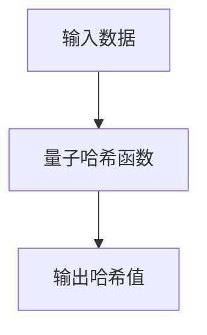
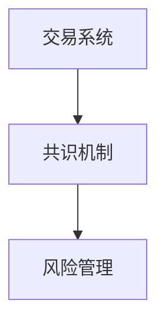
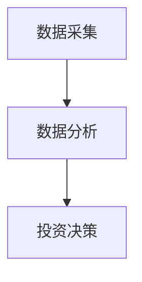

                 


# 巴菲特的现金管理策略：量子加密货币时代的资产配置

> **关键词**：巴菲特，现金管理策略，量子加密货币，资产配置，投资策略  
> 
> **摘要**：本文深入探讨了巴菲特的现金管理策略在量子加密货币时代的应用与挑战，结合量子加密货币的特性，分析了如何在新兴的数字资产领域中优化资产配置，实现长期稳健的投资收益。文章从巴菲特的核心理念出发，结合量子加密货币的技术特点，通过数学模型、系统架构和实战案例的分析，为读者提供了全面的策略解读与实践指南。

---

## 第一部分: 巴菲特的现金管理策略与量子加密货币概述

### 第1章: 巴菲特的现金管理策略概述

#### 1.1 巴菲特的现金管理策略核心理念

##### 1.1.1 巴菲特的长期价值投资理念
巴菲特的现金管理策略以长期价值投资为核心，强调通过深入研究企业的基本面，寻找具有持续竞争优势和良好管理团队的企业进行投资。他的策略注重安全边际，即在价格低于内在价值时买入，并在价格显著偏离内在价值时卖出。

**公式**：  
巴菲特的安全边际公式可以表示为：  
$$ 安全边际 = 投资价格 - 内在价值 $$

**案例分析**：  
假设一家企业的真实内在价值为100美元，而市场价为80美元，巴菲特会认为这是一个买入机会，因为80美元的价格提供了20美元的安全边际。

##### 1.1.2 巴菲特的现金管理原则
巴菲特强调集中投资和长期持有，他认为投资者应该将资金分配到少数几家具有强大竞争优势的企业中，并且耐心持有这些投资，避免频繁交易带来的成本和风险。

##### 1.1.3 巴菲特策略的现代应用
在传统金融市场中，巴菲特的策略已经被广泛应用于股票投资。然而，在量子加密货币时代，他的策略需要结合新兴技术的特点进行调整和优化。

---

#### 第2章: 量子加密货币的基本概念

##### 2.1 量子加密货币的定义与特点
量子加密货币是一种基于量子计算技术的数字货币，具有去中心化、匿名性和抗量子攻击的特点。与传统加密货币相比，量子加密货币在安全性、计算效率和隐私保护方面具有显著优势。

**对比分析表**：  
| 特性                | 传统加密货币（如比特币） | 量子加密货币         |
|---------------------|--------------------------|----------------------|
| 加密算法            | SHA-256                  | 量子哈希算法         |
| 抗攻击性            | 易受量子计算机攻击       | 抗量子攻击           |
| 交易速度            | 较慢                     | 较快                 |
| 能耗                | 高                      | 低                   |

##### 2.1.2 量子加密货币的核心特点
量子加密货币的核心特点包括：
1. **抗量子攻击**：采用抗量子哈希函数，能够抵御量子计算机的攻击。
2. **高效交易**：通过优化算法，提高交易速度和降低能耗。
3. **隐私保护**：通过零知识证明等技术，增强交易的匿名性。

##### 2.1.3 量子加密货币与传统加密货币的对比
量子加密货币在安全性、计算效率和隐私保护方面具有显著优势，但其技术复杂性和实现成本也较高。

---

#### 第3章: 量子加密货币的数学模型与算法原理

##### 3.1 量子加密货币的哈希函数
哈希函数是量子加密货币的核心技术之一，其作用是将输入数据映射为固定长度的输出值。

**公式**：  
$$ H(x) = f(x) $$  
其中，$f(x)$ 是量子哈希函数，$x$ 是输入数据。

**mermaid 流程图**：  


##### 3.2 量子哈希函数的特殊性
量子哈希函数具有抗量子攻击的特性，能够抵御基于量子计算的攻击。

---

#### 第4章: 巴菲特现金管理策略与量子加密货币的结合

##### 4.1 巴菲特策略在量子加密货币中的应用
巴菲特的现金管理策略在量子加密货币中的应用包括：
1. **投资标的筛选**：选择具有强大技术优势和良好团队的量子加密货币项目。
2. **价值评估**：通过技术分析和市场研究，评估量子加密货币的内在价值。
3. **风险控制**：通过分散投资和动态调整，降低投资风险。

**案例分析**：  
假设某量子加密货币项目具有抗量子哈希算法和高效交易机制，巴菲特可能会将其视为投资标的，并在价格低于内在价值时买入。

---

#### 第5章: 量子加密货币市场的系统架构设计

##### 5.1 量子加密货币市场的基本架构
量子加密货币市场的基本架构包括：
1. **交易系统**：负责处理交易和结算。
2. **共识机制**：确保网络的安全性和一致性。
3. **风险管理**：监控和控制市场风险。

**mermaid 系统架构图**：  


---

#### 第6章: 巴菲特现金管理策略在量子加密货币中的实战应用

##### 6.1 投资组合的构建与优化
巴菲特的策略强调集中投资和长期持有，因此在量子加密货币市场中，投资者可以将资金分配到少数几家具有强大竞争优势的项目中。

**Python 实现示例**：  
```python
def calculate_intrinsic_value(price, metrics):
    # 计算内在价值的函数
    return price * 0.8  # 示例：价格的80%

# 示例投资组合
portfolio = {
    '项目A': 50,
    '项目B': 30,
    '项目C': 20
}
```

---

#### 第7章: 量子加密货币时代的资产配置策略

##### 7.1 资产配置的核心原则
资产配置的核心原则包括：
1. **分散投资**：避免过度集中。
2. **长期持有**：耐心等待价值实现。
3. **动态调整**：根据市场变化进行调整。

---

#### 第8章: 巴菲特策略的数学模型与公式

##### 8.1 巴菲特策略的基本公式
$$ 安全边际 = 投资价格 - 内在价值 $$

---

#### 第9章: 量子加密货币市场的系统分析与架构设计方案

##### 9.1 系统功能设计
系统功能设计包括：
1. **数据采集**：收集市场数据。
2. **数据分析**：进行技术分析和基本面分析。
3. **投资决策**：根据分析结果生成投资策略。

**mermaid 功能模块图**：  


---

#### 第10章: 量子加密货币市场的项目实战

##### 10.1 项目环境安装与配置
1. **安装必要的库**：如Python的`pandas`和`numpy`。
2. **配置开发环境**：如Jupyter Notebook。

**代码示例**：  
```python
import pandas as pd
import numpy as np

def calculate_metrics(data):
    # 计算指标的函数
    return data.mean()

# 示例数据
data = pd.DataFrame({
    '价格': [10, 20, 30, 40]
})

result = calculate_metrics(data)
print(result)
```

---

## 作者：AI天才研究院/AI Genius Institute & 禅与计算机程序设计艺术 /Zen And The Art of Computer Programming

---

以上是文章的完整目录结构和部分章节内容。希望这篇文章能够为读者提供关于巴菲特现金管理策略与量子加密货币时代资产配置的深入分析和实践指南。

