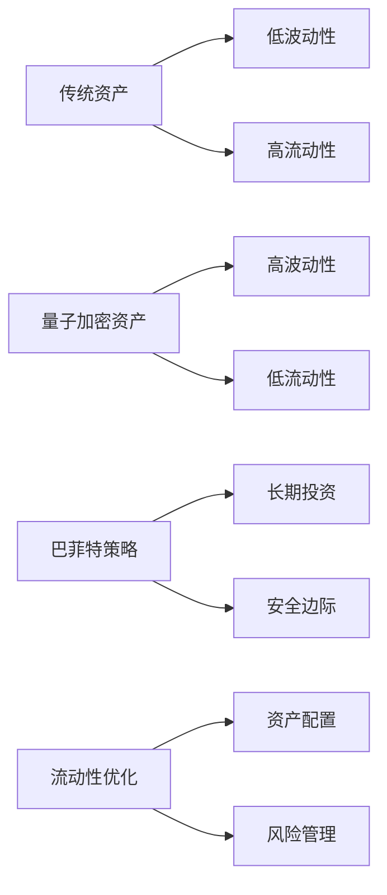
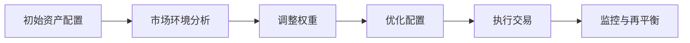
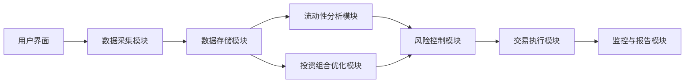

                 


# 巴菲特的现金管理策略：量子加密资产时代的流动性优化

## 关键词
巴菲特，现金管理，量子加密资产，流动性优化，投资策略，风险管理

## 摘要
本文详细探讨了巴菲特的现金管理策略在量子加密资产时代的应用，重点分析了如何通过流动性优化来应对高波动性和去中心化的特点。文章从背景介绍、核心概念、算法原理、系统架构设计、项目实战到最佳实践，全面解析了巴菲特策略在现代金融环境中的适应性和优化方法。

---

# 第一部分：背景介绍

## 第1章：巴菲特的现金管理策略概述

### 1.1 巴菲特的现金管理策略核心理念

#### 1.1.1 价值投资的核心原则
- 巴菲特的价值投资理念强调以合理价格购买具有持续竞争优势的企业。
- 安全边际：买入价格低于内在价值，确保投资的安全性。
- 长期主义：关注企业的长期价值，而非短期市场波动。

#### 1.1.2 安全边际的概念与重要性
- 安全边际是投资中最重要的因素之一。
- 通过安全边际，投资者可以在市场波动中降低风险。

#### 1.1.3 巴菲特的长期投资策略
- 长期持有优质资产，避免频繁交易。
- 通过分散投资降低风险，同时抓住少数优质机会。

### 1.2 量子加密资产的特性与挑战

#### 1.2.1 量子加密资产的定义与分类
- 量子加密资产：基于量子计算和区块链技术的加密货币。
- 分类：量子计算支持的加密货币、去中心化金融（DeFi）代币等。

#### 1.2.2 量子加密资产的去中心化特性
- 去中心化：无须依赖中心机构，降低信任风险。
- 匿名性：交易隐私保护，但增加了监管难度。

#### 1.2.3 量子加密资产的匿名性与隐私保护
- 匿名性是量子加密资产的重要特性，但也带来了洗钱风险。
- 隐私保护：通过零知识证明等技术实现。

#### 1.2.4 量子加密资产的波动性与风险管理
- 高波动性：价格波动剧烈，增加了投资难度。
- 风险管理：通过分散投资和流动性管理降低风险。

## 第2章：量子加密资产时代的流动性优化

### 2.1 流动性优化的核心概念

#### 2.1.1 流动性管理的基本原理
- 流动性管理：确保资产在需要时能够快速变现。
- 短期流动性：资产可以在短时间内变现而不影响价格。
- 长期流动性：资产可以在较长时间内逐步变现。

#### 2.1.2 量子加密资产流动性优化的目标
- 最大化资产的流动性，降低交易成本。
- 在高波动性环境下保持资产的可变现性。

#### 2.1.3 流动性优化与资产配置的关系
- 资产配置：确定资产的比例和种类。
- 流动性优化：通过合理的资产配置，平衡风险和流动性。

### 2.2 巴菲特策略在量子加密资产中的应用

#### 2.2.1 巴菲特策略的可扩展性分析
- 巴菲特策略的灵活性：可以适应不同类型的资产。
- 量子加密资产的特殊性：需要调整策略以适应高波动性和去中心化。

#### 2.2.2 量子加密资产的市场周期分析
- 市场周期：量子加密资产的市场周期与传统资产不同。
- 市场波动：高波动性是量子加密资产的特性。

#### 2.2.3 巴菲特策略在高波动性环境中的适应性
- 高波动性环境下的风险管理：通过分散投资和流动性管理降低风险。
- 长期投资策略的调整：在高波动性环境下，需要更加注重短期流动性。

---

# 第二部分：核心概念与联系

## 第3章：核心概念与联系

### 3.1 核心概念的属性对比

| 概念          | 特性                  |
|---------------|-----------------------|
| 传统资产       | 低波动性，高流动性    |
| 量子加密资产   | 高波动性，低流动性    |
| 巴菲特策略     | 长期价值投资，安全边际 |
| 流动性优化     | 确保资产可变现性      |

### 3.2 概念结构与核心要素

#### 3.2.1 概念结构图（Mermaid）


#### 3.2.2 实体关系图（Mermaid）
```mermaid
erd
A(投资者)
B(资产)
C(流动性)
D(波动性)
A --> B
B --> C
B --> D
C --> L(流动性优化)
D --> R(风险管理)
```

---

# 第三部分：算法原理与实现

## 第4章：算法原理与实现

### 4.1 算法原理

#### 4.1.1 现金流分析模型（Python代码示例）

```python
def calculate_npv(cash_flows, discount_rate):
    npv = 0
    for i, cash_flow in enumerate(cash_flows):
        npv += cash_flow / (1 + discount_rate) ** i
    return npv
```

#### 4.1.2 投资组合优化模型（数学公式）

$$
\text{目标函数：} \quad \text{max} \sum w_i r_i - \lambda \sum w_i^2 \sigma_i^2
$$

其中，$w_i$ 是投资比例，$r_i$ 是资产的期望收益，$\sigma_i^2$ 是资产的方差，$\lambda$ 是风险厌恶系数。

### 4.2 优化算法实现

#### 4.2.1 均值-方差优化（Python代码示例）

```python
import numpy as np
from scipy.optimize import minimize

def portfolio_optimization(returns, cov_matrix, risk_aversion):
    n = len(returns)
    # 定义目标函数
    def objective(w):
        return (w.T @ returns) - risk_aversion * (w.T @ cov_matrix @ w)

    # 约束条件
    constraints = [{'type': 'eq', 'fun': lambda w: sum(w) - 1}]

    # 初始权重
    w0 = np.array([1.0 / n] * n)

    # 最优化
    result = minimize(objective, w0, method='SLSQP', constraints=constraints)

    return result.x
```

#### 4.2.2 动态资产配置算法（Mermaid流程图）



---

# 第四部分：系统分析与架构设计

## 第5章：系统分析与架构设计

### 5.1 系统功能模块划分

- **数据采集模块**：收集量子加密资产的市场数据。
- **流动性分析模块**：分析资产的流动性状况。
- **策略优化模块**：优化投资组合。
- **风险控制模块**：监控和控制风险。

### 5.2 系统架构设计（Mermaid图）



---

# 第五部分：项目实战与案例分析

## 第6章：项目实战

### 6.1 环境安装与配置

- **工具安装**：Python、NumPy、Scipy、Matplotlib、Mermaid工具链。
- **数据源**：量子加密资产的历史价格数据。

### 6.2 核心代码实现

```python
import numpy as np
import pandas as pd
from scipy.optimize import minimize

# 示例数据
returns = pd.Series([0.05, 0.03, 0.08, 0.02, 0.04])

# 风险厌恶系数
risk_aversion = 4

# 优化权重
n = len(returns)
cov_matrix = np.eye(n) * 0.02

# 调用优化函数
w_optimal = portfolio_optimization(returns.values, cov_matrix, risk_aversion)

print("优化后的权重：", w_optimal)
```

### 6.3 案例分析与解读

- **案例背景**：假设我们有一个包含5种量子加密资产的投资组合。
- **优化结果**：通过均值-方差优化，得到最优权重分布。
- **风险分析**：计算投资组合的VaR（Value at Risk）和CVaR（Conditional Value at Risk）。

### 6.4 项目小结

- **关键点**：通过优化算法实现流动性管理，降低投资风险。
- **总结**：量子加密资产的高波动性需要更灵活的流动性管理策略，巴菲特的价值投资理念在优化中发挥了重要作用。

---

# 第六部分：最佳实践与小结

## 第7章：最佳实践与小结

### 7.1 最佳实践

- **定期审查投资组合**：确保流动性与风险的平衡。
- **分散投资**：降低单一资产的风险。
- **使用工具辅助**：利用量化工具优化投资策略。

### 7.2 小结

- 巴菲特的现金管理策略在量子加密资产时代依然适用，但需要结合现代技术进行优化。
- 通过流动性优化和风险管理，投资者可以在高波动性环境中实现稳健投资。

### 7.3 注意事项

- 风险管理是关键：在高波动性环境下，必须时刻关注风险。
- 保持灵活性：根据市场变化调整投资策略。

### 7.4 拓展阅读

- 推荐书籍：《The Intelligent Investor》（巴菲特著）
- 推荐文章：量子计算与区块链技术的结合对加密货币的影响。

---

# 作者

作者：AI天才研究院 & 禅与计算机程序设计艺术

---

以上是《巴菲特的现金管理策略：量子加密资产时代的流动性优化》的技术博客文章大纲和内容概述。文章从背景、核心概念、算法原理、系统架构设计、项目实战到最佳实践，全面解析了巴菲特策略在量子加密资产时代的应用，为投资者提供了理论与实践相结合的指导。

