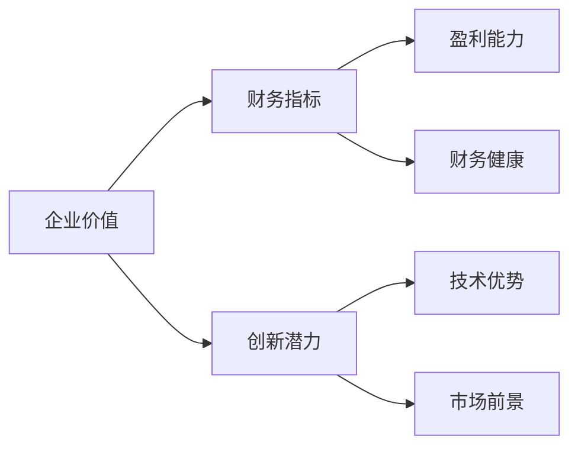

                 


# 巴菲特的科技股投资转变：从规避到拥抱的历程分析

## 关键词：
- 巴菲特，科技股，投资策略，价值投资，科技行业

## 摘要：
本文分析了巴菲特从规避科技股到拥抱科技股的投资转变过程，探讨了其投资理念的演变、科技股的特点及其对投资策略的影响。文章详细阐述了巴菲特在科技股投资中的哲学转变，结合具体案例分析了其投资策略的变化，并构建了科技股投资的分析框架，最后通过模拟案例展示了如何应用巴菲特的投资理念进行科技股投资。

---

# 第一部分: 巴菲特的科技股投资转变背景

## 第1章: 巴菲特早期对科技股的态度

### 1.1 巴菲特的价值投资理念

#### 1.1.1 价值投资的核心要素
- 价值投资的核心是寻找被市场低估的股票，关注企业的内在价值。
- 强调企业的财务健康、盈利能力、管理层素质和行业地位。
- 长期持有，避免频繁交易。

#### 1.1.2 巴菲特对科技行业的初始看法
- 科技行业具有高不确定性和高波动性。
- 科技公司的盈利能力不稳定，难以预测。
- 偏好传统行业，如制造业、消费行业，认为这些行业更稳定。

#### 1.1.3 传统行业投资的优势与局限性
- 优势：企业盈利稳定，风险较低。
- 局限性：科技行业的快速发展可能带来更大的增长潜力，而传统行业难以跟上变革速度。

### 1.2 科技股的特点与风险

#### 1.2.1 科技行业的波动性分析
- 科技行业的波动性较高，受市场和技术变化影响大。
- 市场对科技公司的未来预期容易导致股价大幅波动。

#### 1.2.2 科技股的高成长性与高风险并存
- 高成长性：科技公司可能通过创新迅速扩大市场份额。
- 高风险：技术更新换代快，竞争激烈，失败可能导致企业价值大幅下降。

#### 1.2.3 巴菲特对科技股的规避逻辑
- 难以评估科技公司的长期价值。
- 科技行业的不确定性与价值投资理念不符。

### 1.3 巴菲特投资策略的局限性

#### 1.3.1 传统价值投资在科技股中的失效
- 传统价值投资注重财务指标，而科技公司研发投入大，财务表现可能不佳。
- 科技公司的未来盈利难以准确预测。

#### 1.3.2 科技行业变化对企业估值的影响
- 技术进步可能导致现有业务模式快速过时。
- 高研发投入可能影响短期盈利能力，导致估值困难。

#### 1.3.3 巴菲特投资理念的调整需求
- 需要适应科技行业的特点，调整投资策略。
- 引入新的评估方法，考虑科技公司的创新能力和竞争优势。

## 第2章: 巴菲特对科技股投资的哲学转变

### 2.1 从长期价值到动态评估

#### 2.1.1 价值投资中的长期视角
- 长期视角下，科技公司的价值取决于其持续创新能力。
- 需要重新定义“内在价值”，考虑科技公司的未来增长潜力。

#### 2.1.2 科技行业的动态变化
- 科技行业变化快，企业需要具备持续创新的能力。
- 需要动态评估企业价值，及时调整投资策略。

#### 2.1.3 巴菲特投资理念的调整
- 从单纯关注财务指标转向关注企业的创新能力和竞争优势。
- 重视管理层的战略眼光和执行力。

### 2.2 转向科技股投资的转折点

#### 2.2.1 科技行业的崛起
- 科技行业在经济中的比重越来越大，成为推动经济增长的核心力量。
- 科技公司具备强大的市场影响力和盈利能力。

#### 2.2.2 巴菲特对苹果的投资
- 2016年，巴菲特通过旗下公司买入苹果股票，标志其对科技股态度的转变。
- 苹果的稳定盈利和持续创新是吸引巴菲特的关键因素。

#### 2.2.3 亚马逊等科技公司的纳入
- 巴菲特逐步增加对亚马逊等科技公司的投资，认可其长期增长潜力。
- 亚马逊在云计算、人工智能等领域的布局，展示了强大的竞争优势。

### 2.3 科技股投资的新策略

#### 2.3.1 强调企业的竞争优势
- 选择具备强大护城河的科技公司，能够抵御竞争压力。
- 关注企业的技术优势、市场占有率和创新能力强弱。

#### 2.3.2 重视管理层的战略眼光
- 高管团队的决策能力和战略规划是科技公司成功的关键。
- 选择由经验丰富、能力强的管理层领导的公司。

#### 2.3.3 长期投资与动态调整的结合
- 在长期持有基础上，定期评估企业价值变化。
- 根据市场变化和企业表现，适时调整投资组合。

## 第3章: 巴菲特科技股投资的系统分析

### 3.1 科技股投资的分析框架

#### 3.1.1 核心概念与联系
- 企业价值评估：结合财务指标和创新潜力。
- 市场地位：市场份额、品牌影响力。
- 竞争优势：技术壁垒、成本优势、商业模式创新。

#### 3.1.2 分析框架的构建
- 使用 Mermaid 图展示分析框架，包括企业价值、市场地位、竞争优势等关键要素。



### 3.2 科技股投资的数学模型

#### 3.2.1 企业价值评估公式
- 企业价值 = 股东权益 + 净债务
- 净债务 = 总负债 - 现金及等价物
- 股东权益 = 总资产 - 净债务

#### 3.2.2 市场地位评估指标
- 市场份额 = (公司收入 / 行业总收入) × 100%
- 市场增长率 = (当前收入 - 上期收入) / 上期收入 × 100%

#### 3.2.3 竞争优势评估模型
- 竞争优势指数 = (技术壁垒 + 市场份额 + 创新能力) / 3

### 3.3 系统架构设计

#### 3.3.1 系统功能设计
- 数据采集：收集科技公司的财务数据、技术创新能力、市场表现等。
- 数据分析：运用数学模型评估企业价值、市场地位和竞争优势。
- 投资决策：根据分析结果制定投资策略。

#### 3.3.2 系统架构图


### 3.4 算法原理

#### 3.4.1 企业价值评估算法
```python
def calculate_enterprise_value(company):
    equity = company.equity
    net_debt = company.total_debt - company.cash_equivalents
    enterprise_value = equity + net_debt
    return enterprise_value
```

#### 3.4.2 市场地位评估算法
```python
def calculate_market_share(company, industry):
    industry_revenue = industry.total_revenue
    company_revenue = company.revenue
    market_share = (company_revenue / industry_revenue) * 100
    return market_share
```

## 第4章: 项目实战

### 4.1 模拟投资案例

#### 4.1.1 环境配置
- 数据来源：公开的财务数据、行业报告、公司新闻。
- 工具：数据分析软件（如Excel、Python）、投资分析工具。

#### 4.1.2 投资策略实施
- 选择苹果公司作为投资标的。
- 分析苹果的财务状况、市场地位和技术优势。

#### 4.1.3 案例分析
- 苹果公司财务表现：稳定的盈利能力，强大的现金流。
- 市场地位：全球最大的科技公司之一，iPhone 和服务业务占据重要地位。
- 技术优势：在操作系统、芯片设计和用户体验方面具有显著优势。

#### 4.1.4 投资结果解读
- 苹果股票长期表现优异，证明了巴菲特投资策略的有效性。
- 公司持续创新和市场拓展，支持其长期增长潜力。

### 4.2 项目小结

#### 4.2.1 经验总结
- 科技股投资需要结合财务分析和行业趋势分析。
- 选择具备强大竞争优势和良好管理的公司。

#### 4.2.2 注意事项
- 定期评估投资组合，及时调整。
- 关注行业动态和技术发展，识别潜在风险。

#### 4.2.3 最佳实践
- 长期投资，避免短期波动影响决策。
- 保持对市场的敏感性，及时捕捉投资机会。

## 第五部分: 总结与展望

### 5.1 总结

#### 5.1.1 投资策略转变的意义
- 巴菲特的投资策略转变反映了科技行业的重要性和不可忽视性。
- 价值投资理念的灵活性和适应性是长期投资成功的关键。

#### 5.1.2 对投资者的启示
- 在科技时代，投资者需要具备跨行业知识，灵活调整投资策略。
- 结合传统投资方法与科技行业特点，制定个性化投资策略。

### 5.2 未来展望

#### 5.2.1 科技股投资的趋势
- 人工智能、云计算、大数据等领域将继续推动科技行业的发展。
- 科技公司的创新能力和商业模式将决定其长期价值。

#### 5.2.2 对投资策略的影响
- 更加注重企业的技术优势和创新能力。
- 科技股在投资组合中的比重可能进一步增加。

#### 5.2.3 投资者应关注的领域
- 具备长期增长潜力的科技细分领域。
- 具有强大护城河的科技公司。

### 5.3 小结

#### 5.3.1 投资哲学的演变
- 从规避到拥抱科技股，体现了投资理念的灵活性和开放性。
- 价值投资的核心是寻找具有长期增长潜力的企业。

#### 5.3.2 对未来的思考
- 科技行业的变革将继续影响投资策略。
- 投资者需要不断学习，适应市场变化。

## 作者：
AI天才研究院/AI Genius Institute  
禅与计算机程序设计艺术/Zen And The Art of Computer Programming

