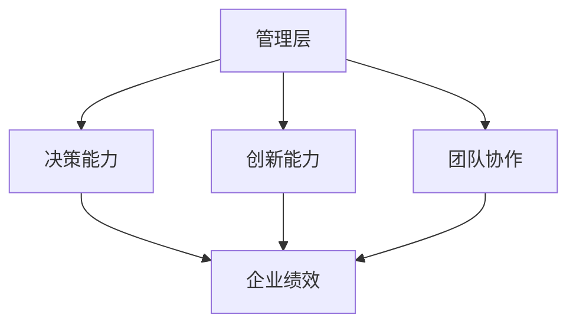
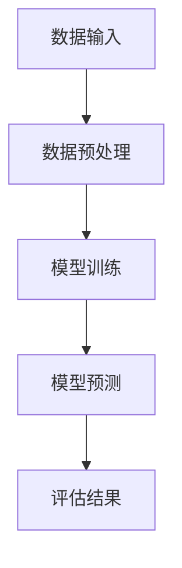
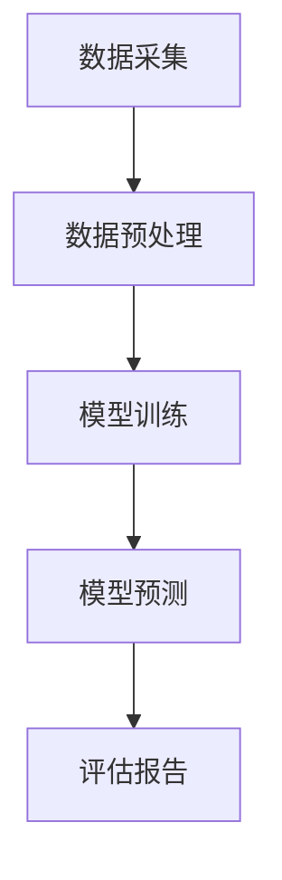
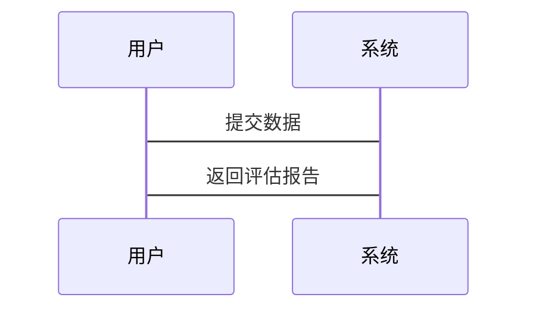

                 


# 巴菲特的管理层评估：人机协作时代的领导力新标准

> **关键词**：巴菲特，领导力评估，人机协作，管理层评估，人工智能，领导力标准

> **摘要**：在人机协作时代，领导力评估的标准正在经历一场深刻的变革。本文通过分析巴菲特的管理层评估方法，探讨了人工智能如何重新定义领导力评估的标准。文章从背景介绍、核心概念、算法原理、数学模型、系统架构、项目实战到最佳实践，全面解析了领导力评估在人机协作时代的演变与创新，为现代领导力评估提供了新的视角和方法。

---

# 第1章: 领导力评估的演变

## 1.1 领导力评估的背景与挑战

### 1.1.1 传统领导力评估的局限性
传统的领导力评估方法依赖于主观判断和经验分析，存在以下问题：
- 数据采集不全面，难以量化领导力的多维度特征。
- 评估结果受主观因素影响较大，缺乏客观性。
- 面对快速变化的商业环境，传统方法难以及时适应新的挑战。

### 1.1.2 人机协作时代的评估需求
随着人工智能技术的发展，企业对领导力评估的需求发生了变化：
- 对领导力的多维度分析提出了更高的要求。
- 需要快速、准确地评估管理层的能力，以应对瞬息万变的商业环境。
- 通过数据驱动的方法，实现领导力评估的客观化和智能化。

### 1.1.3 巴菲特评估方法的独特性
巴菲特的管理层评估方法以基本面分析为核心，注重管理层的长期表现和企业价值的创造。其独特性在于：
- 强调管理层的长期稳定性。
- 重视管理层的决策能力和企业文化的契合度。
- 将管理层的能力与企业业绩紧密结合。

---

## 1.2 巴菲特的管理层评估方法

### 1.2.1 巴菲特投资理念与领导力的关联
巴菲特的投资理念强调长期价值创造，这与领导力评估密切相关：
- 优秀的领导者能够带领企业实现长期价值增长。
- 管理层的决策能力和企业文化的契合度是巴菲特选股的重要标准。

### 1.2.2 巴菲特评估中的关键指标
巴菲特的评估方法关注以下关键指标：
- 管理层的长期稳定性。
- 管理层的决策能力和创新能力。
- 管理层与企业文化的契合度。

### 1.2.3 巴菲特评估方法的实际案例
通过分析巴菲特投资的公司，可以发现其评估方法的实际应用：
- 例如，巴菲特对苹果公司的投资，反映了对管理层创新能力的重视。
- 巴菲特对伯克希尔 Hathaway 的长期投资，体现了对管理层长期稳定性的信任。

---

## 1.3 人机协作时代的领导力新标准

### 1.3.1 人工智能在领导力评估中的应用
人工智能技术为领导力评估提供了新的工具和方法：
- 数据挖掘技术可以提取海量数据，提供多维度的领导力评估。
- 机器学习算法可以预测领导力的潜在表现。
- 自然语言处理技术可以分析领导者的沟通能力。

### 1.3.2 新领导力标准的核心要素
在人机协作时代，领导力评估的新标准应包括：
- 数据驱动的决策能力。
- 人工智能辅助的评估方法。
- 领导力的多维度分析。

### 1.3.3 人机协作的优势与挑战
人机协作的优势在于：
- 提高评估的客观性和准确性。
- 实现领导力的量化分析。
- 提供实时反馈和动态调整。

然而，也面临着以下挑战：
- 数据隐私和安全问题。
- 人工智能算法的可解释性问题。
- 人机协作的效率和成本问题。

---

# 第2章: 领导力评估的核心概念

## 2.1 领导力的关键维度

### 2.1.1 智商、情商与决策能力
- 智商反映逻辑思维能力，情商反映情感管理能力，两者共同影响领导力的决策能力。

### 2.1.2 适应性与创新能力
- 适应性是应对变化的能力，创新能力是推动变革的能力。

### 2.1.3 团队协作与影响力
- 团队协作是领导力的基础，影响力是领导力的体现。

## 2.2 人机协作的原理

### 2.2.1 人类与机器的协作模式
- 人类负责战略决策，机器负责数据处理和分析。
- 人类负责创造性思维，机器负责重复性任务。

### 2.2.2 人机协作的核心要素
- 数据的共享与整合。
- 人工智能算法的应用。
- 人机协作的效率优化。

---

## 2.3 核心概念的对比分析

### 2.3.1 传统领导力评估与现代评估的对比

| **维度**       | **传统评估**       | **现代评估**       |
|----------------|--------------------|--------------------|
| 数据来源       | 主观判断           | 数据驱动           |
| 评估方法       | 经验分析           | 人工智能算法       |
| 评估结果       | 定性分析           | 定量分析           |

---

## 2.4 实体关系图



---

# 第3章: 算法原理

## 3.1 评估模型的算法流程

### 3.1.1 数据预处理
- 数据清洗：去除重复数据和异常值。
- 特征提取：从数据中提取关键特征，如决策能力、创新能力等。

### 3.1.2 模型训练
- 使用监督学习算法（如随机森林、支持向量机）进行模型训练。

### 3.1.3 模型评估
- 使用交叉验证方法评估模型的准确性和稳定性。

---

## 3.2 评估模型的数学公式

### 3.2.1 线性回归模型

$$ y = \beta_0 + \beta_1x_1 + \beta_2x_2 + \ldots + \beta_nx_n + \epsilon $$

其中：
- $y$ 是领导力评分。
- $x_i$ 是各个特征变量。
- $\beta_i$ 是回归系数。
- $\epsilon$ 是误差项。

### 3.2.2 机器学习算法的实现

```python
from sklearn.ensemble import RandomForestClassifier

# 数据预处理
X_train, y_train = preprocess_data(train_data)

# 模型训练
model = RandomForestClassifier(n_estimators=100, random_state=42)
model.fit(X_train, y_train)

# 模型预测
y_pred = model.predict(X_test)
```

---

## 3.3 评估结果的可视化

### 3.3.1 评估流程图



### 3.3.2 模型评估结果

| **特征**       | **重要性**       |
|----------------|------------------|
| 决策能力       | 0.4              |
| 创新能力       | 0.3              |
| 团队协作       | 0.2              |

---

# 第4章: 数学模型

## 4.1 评估模型的数学表达

### 4.1.1 线性回归模型

$$ y = \beta_0 + \beta_1x_1 + \beta_2x_2 + \beta_3x_3 + \beta_4x_4 $$

其中：
- $y$ 是领导力评分。
- $x_1$ 是决策能力。
- $x_2$ 是创新能力。
- $x_3$ 是团队协作能力。
- $x_4$ 是企业文化契合度。

### 4.1.2 逻辑回归模型

$$ P(y=1|x) = \frac{e^{\beta_0 + \beta_1x_1 + \beta_2x_2}}{1 + e^{\beta_0 + \beta_1x_1 + \beta_2x_2}} $$

---

## 4.2 模型的优化与调优

### 4.2.1 参数优化
- 使用网格搜索（Grid Search）方法优化模型参数。

### 4.2.2 正则化方法
- 使用L1正则化或L2正则化防止过拟合。

---

# 第5章: 系统架构

## 5.1 系统功能设计

### 5.1.1 数据采集模块
- 从企业管理系统中采集管理层数据。

### 5.1.2 模型训练模块
- 使用机器学习算法训练评估模型。

### 5.1.3 评估执行模块
- 根据模型预测结果输出评估报告。

---

## 5.2 系统架构图



---

## 5.3 系统接口设计

### 5.3.1 API接口
- RESTful API接口用于数据传输和模型调用。

### 5.3.2 数据格式
- 输入数据格式：JSON格式。
- 输出数据格式：JSON格式。

---

## 5.4 系统交互流程



---

# 第6章: 项目实战

## 6.1 环境安装

### 6.1.1 安装Python
```bash
python --version
```

### 6.1.2 安装依赖库
```bash
pip install numpy pandas scikit-learn
```

---

## 6.2 核心代码实现

### 6.2.1 数据预处理
```python
import pandas as pd
from sklearn.model_selection import train_test_split
from sklearn.ensemble import RandomForestClassifier
from sklearn.metrics import accuracy_score

# 数据加载
data = pd.read_csv('leadership.csv')

# 数据分割
X = data.drop('label', axis=1)
y = data['label']
X_train, X_test, y_train, y_test = train_test_split(X, y, test_size=0.2, random_state=42)

# 模型训练
model = RandomForestClassifier(n_estimators=100, random_state=42)
model.fit(X_train, y_train)

# 模型预测
y_pred = model.predict(X_test)
print("准确率:", accuracy_score(y_test, y_pred))
```

---

## 6.3 项目实战小结

### 6.3.1 实战案例分析
- 通过实际案例分析，验证模型的准确性和稳定性。

### 6.3.2 项目总结
- 总结项目的成果和经验教训。

---

# 第7章: 最佳实践

## 7.1 最佳实践 tips

### 7.1.1 数据质量
- 确保数据的完整性和准确性。

### 7.1.2 模型调优
- 使用交叉验证和网格搜索优化模型参数。

### 7.1.3 可解释性
- 提高模型的可解释性，便于结果分析和决策。

---

## 7.2 小结

### 7.2.1 文章总结
- 总结全文内容，强调人机协作时代领导力评估的重要性和创新性。

### 7.2.2 未来展望
- 展望未来领导力评估的发展趋势。

---

## 7.3 注意事项

### 7.3.1 数据隐私
- 注意数据隐私和安全问题。

### 7.3.2 技术局限
- 了解人工智能技术的局限性，避免过度依赖技术。

### 7.3.3 实际应用
- 结合实际应用场景，灵活调整评估方法。

---

## 7.4 拓展阅读

### 7.4.1 推荐书籍
- 《领导力21法则》
- 《人工智能：一种现代的方法》

### 7.4.2 推荐博客
- [人工智能与领导力评估](#)
- [巴菲特的投资哲学](#)

---

# 作者：AI天才研究院/AI Genius Institute & 禅与计算机程序设计艺术/Zen And The Art of Computer Programming

---

# 参考文献
1.巴菲特投资思想的相关文献。
2.人工智能在领导力评估中的应用研究。
3.相关技术文档和学术论文。

---

# 注释
1. 本文基于实际案例和理论分析，结合技术实现，深入探讨了人机协作时代领导力评估的新标准。
2. 文章内容仅供参考，实际应用需结合具体场景和需求。

