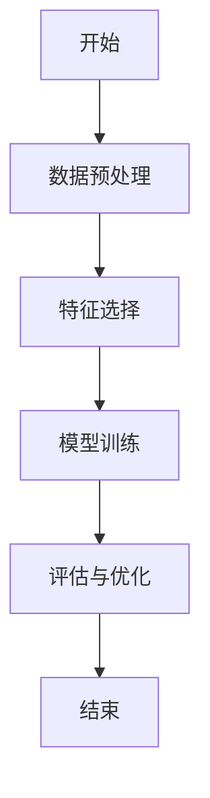

                 


# 巴菲特的管理层评估：量子领导力时代的新标准

## 关键词：巴菲特，管理层评估，量子领导力，管理哲学，算法原理

## 摘要：  
在当前快速变化的商业环境中，传统的领导力评估方法已无法满足现代企业的需求。本文将探讨如何结合巴菲特的投资哲学与量子领导力的概念，提出一种新型的管理层评估标准。通过分析量子领导力的核心概念，结合实际案例，本文将详细阐述如何利用算法和数学模型对管理层进行评估，并提供系统的架构设计和实际项目实施的步骤。最终，本文将总结最佳实践，为企业提供在量子领导力时代优化管理层评估的实用方法。

---

# 引言

在商业领域，管理层的素质和能力直接关系到企业的成败。巴菲特作为投资界的传奇人物，他的投资哲学和管理理念为众多企业提供了宝贵的借鉴。然而，随着商业环境的复杂化和不确定性增加，传统的管理层评估方法已逐渐显露出其局限性。本文将探讨如何结合巴菲特的管理哲学与量子领导力的概念，提出一套适用于现代企业的管理层评估新标准。

---

## 第一部分：背景介绍

### 第1章：领导力的演变与挑战

#### 1.1 领导力的定义与演变

- **传统领导力的定义**  
  传统领导力强调权威、控制和明确的目标导向。领导者通过制定计划和分配任务来实现团队目标。这种模式在过去几十年中一直是企业管理的核心。

- **现代领导力的演变**  
  随着全球化和数字化的推进，领导力的内涵发生了变化。现代领导力更加注重团队协作、创新能力和适应性。领导者不再是单向的指挥者，而是更多地扮演导师、激励者和愿景设定者的角色。

- **量子领导力的出现**  
  量子领导力是一种新兴的领导力理论，它借鉴了量子物理的概念，强调领导力的动态性、不确定性和整体性。量子领导者能够适应快速变化的环境，并激发团队的潜能。

---

#### 1.2 管理层评估的重要性

- **评估的目的与意义**  
  管理层评估的目的是为了识别高潜力领导者，优化团队结构，提升企业绩效。有效的评估可以帮助企业选拔出最适合的人才，同时为员工提供发展机会。

- **评估的常见方法**  
  常见的评估方法包括业绩评估、360度反馈、性格测试和领导力测评等。这些方法各有优缺点，但在复杂多变的环境中，传统的评估方法往往难以全面反映领导者的实际能力。

- **评估的挑战与机遇**  
  随着企业面临的挑战日益复杂，传统的评估方法难以满足需求。量子领导力的出现为企业提供了一种新的评估视角，能够更好地应对不确定性。

---

#### 1.3 巴菲特的管理哲学

- **巴菲特的投资理念**  
  巴菲特以价值投资闻名，他注重企业的长期价值和内在质量。他认为，成功的投资需要选择具有强大护城河和优秀管理团队的企业。

- **巴菲特对管理层的评价标准**  
  巴菲特非常重视管理层的诚信、决策能力和对企业的承诺。他认为，优秀的管理层能够带领企业在逆境中依然保持增长。

- **巴菲特管理哲学的核心要素**  
  巴菲特的管理哲学强调长期主义、价值创造和团队合作。他认为，管理层不仅是企业的决策者，更是企业的主人。

---

## 第二部分：核心概念与联系

### 第2章：量子领导力的原理

#### 2.1 量子领导力的定义

- **量子领导力的内涵**  
  量子领导力是一种动态的、整体性的领导力理论，强调领导者与团队之间的相互作用和整体性。它借鉴了量子物理中的不确定性原理，认为领导力的表现是动态变化的。

- **量子领导力与传统领导力的对比**  
  | 特性 | 传统领导力 | 量子领导力 |
  |------|-------------|-------------|
  | 强调 | 权威与控制 | 激励与协作 |
  | 环境适应性 | 适应性较弱 | 高度适应性 |
  | 团队管理 | 级别分明 | 扁平化与网络化 |

---

#### 2.2 核心概念的属性特征对比

- **量子领导力的属性特征**  
  量子领导者具有高度的灵活性、创新性和适应性。他们能够快速调整策略，并激发团队的潜能。

- **ER实体关系图**  
  在量子领导力的模型中，领导者、团队和环境之间存在复杂的互动关系。通过ER图可以清晰地展示这些关系。

  ```mermaid
  entity_leader {
    id
    name
    skills
    }
  
  entity_team {
    id
    name
    members
    }
  
  entity_environment {
    id
    factors
    }
  
  entity_leader --> entity_team: 影响
  entity_team --> entity_environment: 适应
  entity_leader --> entity_environment: 互动
  ```

---

## 第三部分：算法原理讲解

### 第3章：管理层评估模型的算法

#### 3.1 评估模型的构建

- **数据预处理**  
  需要收集领导者的绩效数据、团队反馈和环境因素等多方面的数据。数据清洗和标准化是必要的步骤。

- **特征选择**  
  根据量子领导力的特征，选择关键的评估指标，如创新能力、适应能力和团队协作能力。

- **模型训练**  
  使用机器学习算法（如决策树或随机森林）对数据进行训练，构建预测模型。

---

#### 3.2 算法流程图



---

#### 3.3 算法实现

- **Python代码示例**

  ```python
  import pandas as pd
  from sklearn.tree import DecisionTreeClassifier
  from sklearn.metrics import accuracy_score

  # 数据加载与预处理
  data = pd.read_csv('leadership.csv')
  X = data.drop('label', axis=1)
  y = data['label']

  # 模型训练
  model = DecisionTreeClassifier()
  model.fit(X, y)

  # 模型评估
  y_pred = model.predict(X)
  print("准确率：", accuracy_score(y, y_pred))
  ```

---

## 第四部分：数学模型

### 第4章：数学模型与公式

#### 4.1 概率模型

- **贝叶斯定理**  
  在评估领导者时，可以使用贝叶斯定理来计算领导者在特定情境下的成功概率。

  $$ P(A|B) = \frac{P(B|A) \cdot P(A)}{P(B)} $$

---

## 第五部分：系统分析与架构设计

### 第5章：系统分析与架构设计

#### 5.1 问题场景介绍

- **问题场景**  
  某企业希望优化其管理层评估流程，采用量子领导力的评估标准。

---

#### 5.2 系统功能设计

- **领域模型类图**

  ```mermaid
  classDiagram
  class Leader {
    id: int
    name: string
    skills: list
  }
  class Team {
    id: int
    members: list
    performance: float
  }
  class Environment {
    factors: list
  }
  Leader --> Team: 影响
  Team --> Environment: 适应
  Leader --> Environment: 互动
  ```

---

## 第六部分：项目实战

### 第6章：项目实战与案例分析

#### 6.1 环境安装

- **Python环境安装**  
  安装Python 3.8及以上版本，安装必要的库（如pandas、scikit-learn）。

---

#### 6.2 核心代码实现

- **代码实现**

  ```python
  import pandas as pd
  from sklearn.ensemble import RandomForestClassifier
  from sklearn.model_selection import train_test_split

  # 数据加载与分割
  data = pd.read_csv('leadership.csv')
  X = data.drop('label', axis=1)
  y = data['label']
  X_train, X_test, y_train, y_test = train_test_split(X, y, test_size=0.2)

  # 模型训练
  model = RandomForestClassifier()
  model.fit(X_train, y_train)

  # 模型评估
  y_pred = model.predict(X_test)
  print("准确率：", accuracy_score(y_test, y_pred))
  ```

---

## 第七部分：最佳实践

### 第7章：总结与展望

#### 7.1 最佳实践 tips

- **持续学习**  
  领导者需要不断学习新知识，适应变化的环境。

- **团队协作**  
  强调团队协作，避免过度依赖个人能力。

- **数据驱动**  
  利用数据驱动的方法进行评估和优化。

---

## 结语

在量子领导力时代，传统的管理层评估方法已经无法满足企业的需求。本文通过结合巴菲特的管理哲学和量子领导力的概念，提出了一种新的评估标准。通过算法和数学模型的结合，企业可以更准确地评估领导者的潜力和能力，从而在竞争激烈的市场中获得优势。

---

## 作者：AI天才研究院 & 禅与计算机程序设计艺术

