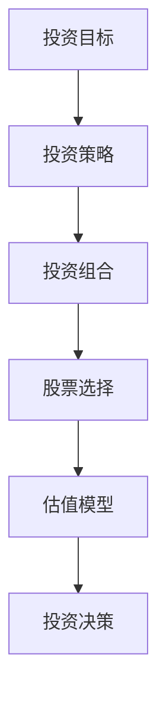
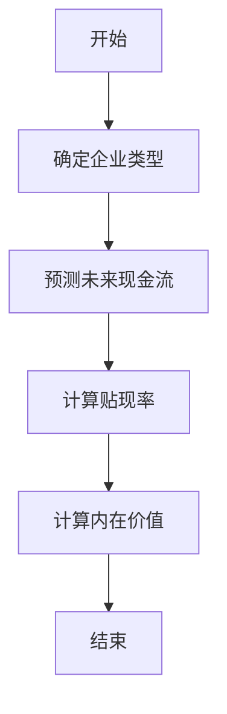

                 

# 巴菲特的经济周期投资法则：后疫情时代的经济复苏

> 关键词：巴菲特，经济周期，价值投资，后疫情时代，投资策略，复苏

> 摘要：本文深入探讨了巴菲特的经济周期投资法则，结合后疫情时代的经济复苏背景，分析了巴菲特的投资理念、经济周期分析、投资策略以及在复苏期的应用。通过系统的架构设计和实际案例分析，揭示了巴菲特投资法则的数学模型和算法，为投资者提供了实用的指导和建议。

---

# 第1章: 巴菲特投资理念概述

## 1.1 巴菲特投资哲学的核心思想

### 1.1.1 价值投资的定义与特点

价值投资是一种以低于其内在价值的价格买入优质股票的投资策略。它的核心在于寻找市场先生（Mr. Market）犯错的机会，即市场定价低于企业真实价值的时候买入。

- **定义**：价值投资强调长期持有优质资产，关注企业的基本面，而非短期市场波动。
- **特点**：
  - 长期导向
  - 重视基本面分析
  - 买入并持有策略
  - 耐心等待市场回归理性

### 1.1.2 巴菲特的价值投资体系

巴菲特的价值投资体系可以分为以下几个关键部分：

1. **安全边际**：买入价格低于内在价值，留出的安全边际（_margin of safety_）可以缓冲短期波动和市场错误定价的风险。
2. **企业基本面分析**：关注企业的财务状况、盈利能力、竞争优势和管理层质量。
3. **长期持有**：避免频繁交易，减少交易成本和税收影响，同时享受复利效应。

### 1.1.3 巴菲特投资理念的演变

巴菲特的投资理念经历了从早期的“烟蒂投资”到后期的“护城河投资”的演变：

- **早期阶段**：注重低市盈率、低市净率的股票，寻找被市场忽视的低估资产。
- **成熟阶段**：转向投资具有强大竞争优势（护城河）、持续盈利能力和优秀管理层的企业。

---

## 1.2 经济周期的基本概念

### 1.2.1 经济周期的定义与特征

经济周期是指经济活动在长期趋势中围绕趋势线波动的过程，通常分为四个阶段：衰退、复苏、过热和滞胀。

- **衰退阶段**：经济增长放缓，企业利润下降，失业率上升。
- **复苏阶段**：经济开始恢复，企业利润逐渐回升，市场情绪改善。
- **过热阶段**：经济增长过快，通胀抬头，市场可能出现泡沫。
- **滞胀阶段**：经济增长停滞，通胀高企，市场信心受挫。

### 1.2.2 经济周期的四个阶段

1. **衰退阶段**：
   - 经济活动萎缩，企业盈利下降。
   - 投资者倾向于规避风险，资金流向防御性资产（如债券、黄金）。

2. **复苏阶段**：
   - 经济逐渐恢复，企业盈利开始回升。
   - 市场情绪改善，风险资产（如股票）重新获得投资者青睐。

3. **过热阶段**：
   - 经济增长过快，通胀上升。
   - 市场可能出现泡沫，投资者情绪极度乐观。

4. **滞胀阶段**：
   - 经济增长停滞，通胀高企。
   - 市场情绪低迷，资金流向避险资产。

### 1.2.3 经济周期对投资的影响

经济周期的变化直接影响投资策略的选择。例如：

- 在衰退阶段，应选择防御性资产。
- 在复苏阶段，应关注周期性股票（如工业、材料板块）。
- 在过热阶段，应警惕市场泡沫，适当降低风险敞口。
- 在滞胀阶段，应关注抗通胀资产（如房地产、黄金）。

---

# 第2章: 巴菲特的经济周期投资法则

## 2.1 巴菲特经济周期投资的核心法则

### 2.1.1 经济周期中的投资策略

巴菲特的投资策略在不同的经济周期阶段有所不同，但核心是寻找具有长期竞争优势的企业，并在市场低估时买入。

- **衰退阶段**：
  - 买入优质企业的股票，因为这些企业在经济低迷时能够保持盈利，甚至扩大市场份额。
- **复苏阶段**：
  - 增加对周期性股票的配置，因为这些行业在经济复苏时会受益。
- **过热阶段**：
  - 减少对高估值股票的配置，避免市场泡沫破裂的风险。
- **滞胀阶段**：
  - 增加对防御性资产的配置，如公用事业、消费品等行业。

### 2.1.2 巴菲特的"安全边际"概念

安全边际是巴菲特投资理念的核心之一，它是指买入价格与内在价值之间的差距。

- **公式**：
  $$ \text{安全边际} = \text{内在价值} - \text{买入价格} $$
- **意义**：安全边际提供了缓冲空间，避免因市场波动或估值错误导致的损失。

### 2.1.3 巴菲特的选股标准

巴菲特选股的标准包括以下几个方面：

1. **强大的竞争优势**：企业必须有护城河，能够长期保持竞争优势。
2. **优秀的管理层**：管理层应具备诚信、能力和决策能力。
3. **可持续的盈利能力**：企业应具有稳定的盈利能力，并能够持续创造价值。
4. **合理的估值**：买入价格应低于企业的内在价值。

---

## 2.2 巴菲特投资法则的数学模型与算法

### 2.2.1 内在价值计算公式

巴菲特的内在价值计算公式是价值投资的核心工具之一。其公式如下：

$$ V = \frac{CF}{r - g} $$

其中：
- \( V \) 表示企业的内在价值
- \( CF \) 表示未来现金流
- \( r \) 表示贴现率
- \( g \) 表示现金流的永续增长率

### 2.2.2 股票估值的简化模型

在实际操作中，巴菲特通常使用简化模型来估算内在价值。例如，使用市盈率（P/E）或市净率（P/B）来评估股票的价值。

- **市盈率**：
  $$ \text{市盈率} = \frac{\text{股价}}{\text{每股收益}} $$
- **市净率**：
  $$ \text{市净率} = \frac{\text{股价}}{\text{每股净资产}} $$

### 2.2.3 安全边际的计算方法

安全边际的计算方法如下：

$$ \text{安全边际} = \text{内在价值} - \text{买入价格} $$

如果安全边际为正，说明买入价格低于内在价值，具有投资价值。

---

# 第3章: 巴菲特投资法则的系统分析与架构设计

## 3.1 投资决策的系统架构

### 3.1.1 投资目标的确定

投资目标是投资决策的基础，通常包括以下几个方面：

1. **财务目标**：明确投资的财务目标，如财富增长、资产保值等。
2. **风险承受能力**：根据自身的风险偏好确定投资策略。
3. **投资期限**：明确投资的时间跨度，决定投资品种的选择。

### 3.1.2 投资策略的选择

根据投资目标和市场环境，选择合适的投资策略。例如：

- **价值投资策略**：寻找低估资产，长期持有。
- **成长投资策略**：投资于高成长企业，关注未来的盈利潜力。
- **股息投资策略**：投资于高股息率的股票，获取稳定的现金流。

### 3.1.3 投资组合的构建

投资组合的构建需要考虑资产配置、风险分散和收益最大化。

1. **资产配置**：将资金分配到不同的资产类别中，如股票、债券、房地产等。
2. **风险分散**：通过投资多样化的资产降低风险。
3. **收益最大化**：在风险可控的前提下，追求最高的收益。

---

## 3.2 系统架构图

以下是投资决策系统的架构图：

---

## 3.3 后疫情时代的经济复苏特征

### 3.3.1 经济复苏的阶段划分

疫情对全球经济造成了深远的影响，经济复苏需要经历以下几个阶段：

1. **衰退阶段**：疫情爆发初期，全球经济活动停滞，企业盈利大幅下降。
2. **复苏阶段**：随着疫苗的普及和政策支持，经济逐渐恢复。
3. **过热阶段**：经济复苏过快，可能导致通胀抬头和市场泡沫。
4. **滞胀阶段**：经济增长放缓，通胀高企，市场信心受挫。

### 3.3.2 疫情对经济周期的影响

疫情对经济周期的影响主要体现在以下几个方面：

1. **消费习惯的变化**：线上购物、远程办公成为新常态，影响了多个行业的兴衰。
2. **政策支持**：政府和央行采取了大规模的财政和货币政策刺激，可能导致市场过热。
3. **供应链中断**：疫情导致全球供应链中断，影响了企业的生产和利润。

### 3.3.3 疫情后投资环境的变化

疫情后，投资环境发生了以下变化：

1. **科技行业的崛起**：线上经济、云计算、人工智能等行业的增长显著。
2. **防御性资产的重要性**：在不确定性增加的情况下，防御性资产（如公用事业、消费品）更受投资者青睐。
3. **政策环境的变化**：政府和央行的政策支持可能影响市场的短期走势。

---

## 3.4 巴菲特投资法则的实战应用

### 3.4.1 疫情后复苏行业的选择

在疫情后，复苏行业可以分为以下几类：

1. **消费行业**：随着疫情得到有效控制，消费逐渐复苏，尤其是食品饮料、家电、旅游等行业。
2. **科技行业**：线上经济的持续增长，推动了科技行业的复苏。
3. **金融行业**：低利率环境和经济复苏推动了金融行业的增长。

### 3.4.2 巴菲特风格企业的识别

巴菲特风格的企业通常具有以下特征：

1. **强大的竞争优势**：如可口可乐、苹果等企业。
2. **优秀的管理层**：管理层具备诚信和决策能力。
3. **稳定的盈利能力**：企业能够在不同经济周期中保持盈利。

### 3.4.3 投资组合的动态调整

在疫情后，投资组合需要根据经济复苏的阶段进行动态调整。

1. **衰退阶段**：增加防御性资产的配置。
2. **复苏阶段**：逐步增加周期性股票的配置。
3. **过热阶段**：减少高估值股票的配置，防范市场泡沫。
4. **滞胀阶段**：增加抗通胀资产的配置。

---

# 第4章: 巴菲特投资法则的数学模型与算法

## 4.1 内在价值计算的算法流程

以下是内在价值计算的算法流程图：

---

## 4.2 企业估值的对比分析

以下是不同估值模型的对比表：

| 估值模型 | 优点 | 缺点 |
|----------|------|------|
| 内在价值法 | 考虑了企业的未来现金流 | 需要预测未来现金流，存在不确定性 |
| 市盈率法 | 简单易用 | 受企业盈利波动影响较大 |
| 市净率法 | 考虑了企业的资产价值 | 不能反映企业的盈利能力和成长性 |

---

## 4.3 投资决策的系统架构

以下是投资决策的系统架构图：

---

## 4.4 项目实战

### 4.4.1 疫情后复苏行业的选择

以消费行业为例，以下是几种消费企业的对比分析：

| 企业名称 | 行业 | 市盈率 | 市净率 | 内在价值 |
|----------|------|--------|--------|----------|
| 可口可乐 | 食品饮料 | 25 | 4 | $100/股 |
| 百事可乐 | 食品饮料 | 20 | 5 | $90/股 |
| 麦当劳 | 餐饮 | 28 | 6 | $110/股 |

### 4.4.2 巴菲特风格企业的识别

以下是巴菲特风格企业的特征对比：

| 企业名称 | 行业 | 竞争优势 | 管理层质量 | 盈利能力 |
|----------|------|----------|------------|----------|
| 苹果 | 科技 | 技术创新、品牌优势 | 优秀 | 高 |
| 可口可乐 | 食品饮料 | 品牌忠诚度、全球分销网络 | 优秀 | 高 |

### 4.4.3 投资组合的动态调整

以下是疫情后投资组合的动态调整策略：

| 经济阶段 | 投资策略 |
|----------|----------|
| 衰退阶段 | 增加防御性资产配置 |
| 复苏阶段 | 增加周期性股票配置 |
| 过热阶段 | 减少高估值股票配置 |
| 滞胀阶段 | 增加抗通胀资产配置 |

---

# 第5章: 总结与展望

## 5.1 总结

巴菲特的经济周期投资法则为投资者提供了在不同经济阶段进行投资的指导。通过关注企业的内在价值、竞争优势和管理层质量，投资者可以在市场低估时买入优质资产，并在市场高估时进行调整。在后疫情时代，投资者需要根据经济复苏的阶段，动态调整投资组合，选择合适的行业和企业。

## 5.2 展望

未来，随着全球经济逐步复苏，投资者需要关注以下几个方面：

1. **科技行业的投资机会**：线上经济、人工智能等行业的增长潜力巨大。
2. **防御性资产的重要性**：在不确定性增加的情况下，防御性资产（如公用事业、消费品）更受投资者青睐。
3. **政策环境的变化**：政府和央行的政策支持可能影响市场的短期走势。

---

# 作者：AI天才研究院/AI Genius Institute & 禅与计算机程序设计艺术 /Zen And The Art of Computer Programming

