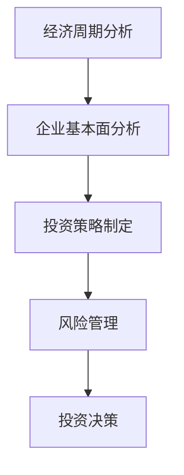

                 


# 巴菲特的经济周期投资法则：如何在不同阶段获利

## 关键词：巴菲特，经济周期，投资策略，价值投资，风险管理

## 摘要：本文深入分析了巴菲特的投资理念及其在不同经济周期阶段的应用。通过系统分析和实际案例，探讨了如何利用巴菲特的经济周期投资法则在市场波动中获利。文章结合理论与实践，为投资者提供了在不同经济环境下制定和调整投资策略的指导。

---

# 第一部分: 经济周期与巴菲特投资法则概述

## 第1章: 经济周期的基本概念与巴菲特投资理念

### 1.1 经济周期的定义与特征

经济周期是指经济活动的波动，通常分为四个阶段：繁荣、衰退、萧条和复苏。每个阶段的特点和对投资的影响不同。

- **繁荣期**：经济增长快，企业盈利高，股票估值上升。
- **衰退期**：经济增长放缓，企业盈利下降，股票估值调整。
- **萧条期**：经济极度低迷，企业盈利严重下降，股票估值可能被低估。
- **复苏期**：经济开始恢复，企业盈利逐步回升，股票估值可能触底反弹。

经济周期对投资决策有重要影响，投资者需要根据经济周期的阶段调整投资策略。

### 1.2 巴菲特投资理念的核心思想

巴菲特是价值投资的倡导者，强调以合理价格投资于优质企业，长期持有。

- **价值投资**：寻找市场估值低于内在价值的股票。
- **安全边际**：在投资时留有安全边际，即买入价格低于内在价值。
- **长期持有**：避免频繁交易，降低交易成本，获得复利效应。

巴菲特的投资理念与经济周期密切相关。在不同经济周期阶段，巴菲特的选股标准和投资策略会有所不同。

---

## 第2章: 巴菲特投资法则在不同经济周期的表现

### 2.1 经济周期对投资策略的影响

经济周期的变化会影响企业的盈利能力和股票估值。投资者需要根据经济周期的阶段调整投资策略。

- **扩张期**：企业盈利增长快，适合投资成长型企业。
- **衰退期**：企业盈利下降，适合寻找估值低的股票。
- **萧条期**：企业盈利严重下降，适合寻找被市场忽视的优质企业。
- **复苏期**：企业盈利逐步恢复，适合投资于复苏行业的股票。

### 2.2 巴菲特在经济周期中的投资策略

巴菲特在不同经济周期阶段的投资策略如下：

#### 2.2.1 扩张期的投资策略
- 选择具有强大竞争优势的企业。
- 买入价格合理，避免过高估值。
- 长期持有，享受企业成长带来的收益。

#### 2.2.2 衰退期的投资策略
- 寻找估值低的股票，尤其是那些具有强大竞争优势的企业。
- 耐心等待市场复苏，避免盲目抄底。

#### 2.2.3 萧条期的投资策略
- 寻找被市场忽视的优质企业，尤其是那些具有强大竞争优势且估值被严重低估的股票。
- 增加投资，利用市场恐慌的机会。

#### 2.2.4 复苏期的投资策略
- 投资于复苏行业的股票，尤其是那些在衰退期中表现不佳但在复苏期中快速反弹的企业。
- 逐步减少对防御性股票的投资，增加对周期性股票的投资。

---

## 第3章: 巴菲特选股标准与经济周期的结合

### 3.1 巴菲特选股标准的核心要素

巴菲特选股的核心要素包括：

- **企业基本面**：企业的盈利能力、财务状况、竞争优势。
- **财务指标**：ROE（净资产收益率）、ROA（资产回报率）、毛利率等。
- **竞争优势**：企业的护城河，如品牌、技术、成本优势等。

### 3.2 经济周期对选股标准的影响

在不同经济周期阶段，巴菲特的选股标准会有所调整：

#### 3.2.1 扩张期的选股标准
- 选择具有强大竞争优势的企业。
- 重点关注企业的盈利能力和发展潜力。

#### 3.2.2 衰退期的选股标准
- 寻找估值低的股票，尤其是那些具有强大竞争优势的企业。
- 重点关注企业的财务状况和竞争优势。

#### 3.2.3 萧条期的选股标准
- 寻找被市场忽视的优质企业，尤其是那些具有强大竞争优势且估值被严重低估的股票。
- 重点关注企业的竞争优势和财务状况。

#### 3.2.4 复苏期的选股标准
- 投资于复苏行业的股票，尤其是那些在衰退期中表现不佳但在复苏期中快速反弹的企业。
- 重点关注企业的盈利能力和发展潜力。

---

# 第二部分: 巴菲特投资法则的系统分析与架构设计

## 第4章: 巴菲特投资法则的系统架构

### 4.1 投资系统的核心模块

巴菲特投资法则的系统架构包括以下几个核心模块：

- **经济周期分析模块**：分析当前经济周期的阶段。
- **企业基本面分析模块**：评估企业的盈利能力、财务状况和竞争优势。
- **投资策略制定模块**：根据经济周期和企业基本面制定投资策略。
- **风险管理模块**：控制投资风险，确保投资组合的稳定性。

### 4.2 系统架构的流程图



---

## 第5章: 投资策略的动态调整与风险管理

### 5.1 投资策略的动态调整机制

巴菲特的投资策略需要根据经济周期的变化进行动态调整：

- **经济周期变化的监测**：定期分析经济周期的阶段，评估市场环境的变化。
- **投资策略的调整原则**：根据经济周期的变化，调整投资组合的构成。
- **动态调整的具体实施步骤**：重新评估企业的基本面，调整买入价格和卖出价格。

### 5.2 风险管理的核心策略

风险管理是巴菲特投资策略的重要组成部分：

- **风险评估与量化**：评估投资组合的风险，量化潜在损失。
- **风险分散策略**：通过分散投资降低风险。
- **风险控制的数学模型**：使用数学模型进行风险评估和控制。

$$ \text{风险调整后的投资收益} = \text{预期收益} - \text{风险调整因子} $$

---

## 第6章: 投资系统的功能实现与代码实现

### 6.1 投资系统功能模块实现

#### 6.1.1 经济周期分析模块的代码实现

以下是经济周期分析模块的代码实现：

```python
def economic_cycle_analysis(economic_data):
    # 经济数据包括GDP增长率、失业率、通胀率等
    # 根据经济数据判断经济周期的阶段
    if economic_data['GDP_growth'] > 3 and economic_data['unemployment_rate'] < 5 and economic_data['inflation_rate'] < 2:
        return 'expansion'
    elif economic_data['GDP_growth'] < 0 and economic_data['unemployment_rate'] > 8 and economic_data['inflation_rate'] > 5:
        return 'recession'
    elif economic_data['GDP_growth'] < -5 and economic_data['unemployment_rate'] > 10 and economic_data['inflation_rate'] > 10:
        return 'depression'
    else:
        return 'recovery'
```

#### 6.1.2 企业基本面分析模块的代码实现

以下是企业基本面分析模块的代码实现：

```python
def fundamental_analysis(financial_data):
    # 财务数据包括ROE、ROA、毛利率等
    # 根据财务数据评估企业的基本面
    if financial_data['ROE'] > 15 and financial_data['ROA'] > 5 and financial_data['gross_margin'] > 20:
        return 'strong'
    elif financial_data['ROE'] < 5 and financial_data['ROA'] < 3 and financial_data['gross_margin'] < 10:
        return 'weak'
    else:
        return 'neutral'
```

---

## 第7章: 投资系统的实际案例分析

### 7.1 案例背景

假设当前经济处于衰退期，企业基本面分析显示某公司的ROE为8%，ROA为3%，毛利率为15%。根据巴菲特的投资理念，该公司的基本面表现一般，但在衰退期中，可能具有一定的投资价值。

### 7.2 投资策略制定

根据经济周期分析模块的判断，当前经济处于衰退期。企业基本面分析显示该公司的基本面表现一般，但具有一定的竞争优势。因此，投资策略是：买入该公司的股票，等待市场复苏。

### 7.3 风险管理

为了控制风险，投资组合中应分散投资，避免过度集中。同时，设置止损点，当股价下跌超过20%时，卖出股票。

---

## 第8章: 总结与展望

### 8.1 总结

本文详细分析了巴菲特的投资理念及其在不同经济周期阶段的应用。通过系统分析和实际案例，探讨了如何利用巴菲特的经济周期投资法则在市场波动中获利。文章结合理论与实践，为投资者提供了在不同经济环境下制定和调整投资策略的指导。

### 8.2 展望

未来，随着经济环境的变化，巴菲特的投资理念和策略也需要不断调整和完善。投资者需要根据市场环境的变化，灵活运用巴菲特的投资法则，制定适合自己的投资策略。

---

作者：AI天才研究院/AI Genius Institute & 禅与计算机程序设计艺术 /Zen And The Art of Computer Programming

