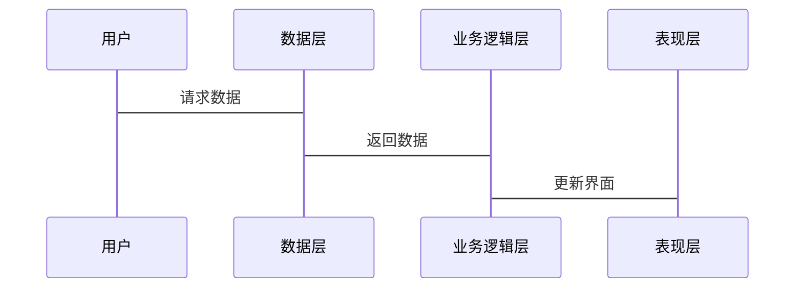

                 


# 巴菲特的经济周期投资法则：量子金融市场周期的特征

> 关键词：巴菲特、经济周期、投资法则、量子金融、市场周期、价值投资

> 摘要：本文将详细探讨巴菲特的经济周期投资法则，分析其在量子金融环境下的应用，通过数学模型和算法，结合实际案例，揭示经济周期对投资策略的影响。

---

# 第一部分: 巴菲特的经济周期投资法则基础

# 第1章: 经济周期与巴菲特投资理念概述

## 1.1 经济周期的基本概念

### 1.1.1 经济周期的定义与特征

经济周期是指经济活动在长期趋势之外的波动，通常分为四个阶段：繁荣、衰退、萧条和复苏。经济周期的波动对金融市场和投资决策有重要影响。

### 1.1.2 经济周期的阶段划分

1. **繁荣阶段**：经济增长迅速，企业盈利上升，股价上涨。
2. **衰退阶段**：经济增长放缓，企业盈利下降，股价下跌。
3. **萧条阶段**：经济低迷，企业盈利大幅下降，股价持续下跌。
4. **复苏阶段**：经济开始复苏，企业盈利逐渐恢复，股价开始反弹。

### 1.1.3 经济周期与投资的关系

经济周期的波动直接影响投资者的决策，投资者需要根据经济周期的变化调整投资策略。

## 1.2 巴菲特投资理念的核心要素

### 1.2.1 巴菲特的投资哲学

巴菲特的投资哲学基于价值投资，强调长期持有优质资产，注重企业的基本面分析。

### 1.2.2 巴菲特的长期投资策略

巴菲特主张长期投资，避免短期波动的干扰，追求企业的内在价值。

### 1.2.3 巴菲特的价值投资原则

1. **安全边际**：购买价格低于内在价值。
2. **优质企业**：选择具有持续竞争优势的企业。
3. **长期持有**：避免频繁交易，降低交易成本。

## 1.3 巴菲特经济周期投资法则的背景

### 1.3.1 经济周期波动对投资的影响

经济周期的波动会导致市场估值的波动，投资者需要根据经济周期的变化调整投资策略。

### 1.3.2 巴菲特投资法则的演变

巴菲特的投资法则在长期实践中不断完善，形成了适应不同经济周期的投资策略。

### 1.3.3 巴菲特法则的适用性与局限性

巴菲特法则在长期牛市中表现优异，但在经济衰退期间可能面临挑战。

## 1.4 本章小结

本章介绍了经济周期的基本概念和巴菲特的投资理念，为后续分析奠定了基础。

---

# 第2章: 巴菲特经济周期投资法则的核心概念

## 2.1 经济周期的量化特征

### 2.1.1 经济周期的指标体系

常用的经济周期指标包括GDP增长率、失业率、通胀率、PMI指数等。

### 2.1.2 经济周期的量化模型

通过建立数学模型，可以量化经济周期的波动，例如：

$$经济周期指数 = \frac{GDP增长率 + PMI指数}{2}$$

### 2.1.3 经济周期的预测方法

利用历史数据分析经济周期的波动规律，建立预测模型。

## 2.2 巴菲特投资法则的数学模型

### 2.2.1 市场估值模型

$$市场估值 = \sum_{i=1}^{n} \frac{企业价值_i}{(1 + r)^i}$$

其中，r为折现率，i为时间。

### 2.2.2 安全边际计算模型

$$安全边际 = \frac{市场价格}{内在价值}$$

### 2.2.3 投资决策模型

$$投资决策 = \begin{cases} 
买入 & \text{如果市场价格 < 内在价值} \\
持有 & \text{如果市场价格接近内在价值} \\
卖出 & \text{如果市场价格 > 内在价值}
\end{cases}$$

## 2.3 经济周期与投资策略的关系

### 2.3.1 经济周期对投资策略的影响

在不同经济周期阶段，巴菲特的投资策略有所不同：

- **繁荣阶段**：谨慎投资，避免过度杠杆。
- **衰退阶段**：寻找被低估的资产。
- **萧条阶段**：积极投资，增加优质资产配置。
- **复苏阶段**：保持投资，等待市场回升。

### 2.3.2 巴菲特投资法则的动态调整

根据经济周期的变化，动态调整投资策略，例如在经济衰退期间增加防御性资产的配置。

### 2.3.3 巴菲特法则的系统性与科学性

巴菲特的投资法则结合了定量分析和定性分析，具有较强的系统性和科学性。

## 2.4 本章小结

本章详细介绍了经济周期的量化特征和巴菲特投资法则的数学模型，为后续分析提供了理论基础。

---

# 第3章: 巴菲特经济周期投资法则的算法原理

## 3.1 巴菲特投资法则的算法流程

### 3.1.1 数据采集与清洗

通过数据接口获取历史数据，清洗数据，剔除异常值。

### 3.1.2 量化指标计算

计算市盈率、市净率等量化指标：

$$市盈率 = \frac{股票价格}{每股收益}$$

$$市净率 = \frac{股票价格}{每股净资产}$$

### 3.1.3 价值评估

通过内在价值模型计算股票的内在价值：

$$内在价值 = \sum_{t=1}^{\infty} \frac{现金流}{(1 + r)^t}$$

### 3.1.4 投资决策

根据市场估值和安全边际，制定投资策略。

## 3.2 巴菲特投资法则的数学模型

### 3.2.1 市场估值模型

$$市场估值 = \sum_{i=1}^{n} \frac{企业价值_i}{(1 + r)^i}$$

### 3.2.2 安全边际计算模型

$$安全边际 = \frac{市场价格}{内在价值}$$

## 3.3 巴菲特投资法则的代码实现

### 3.3.1 环境配置

安装必要的Python库，例如：

```bash
pip install pandas numpy matplotlib
```

### 3.3.2 数据收集

通过API获取历史数据，例如：

```python
import pandas as pd
import numpy as np

data = pd.read_csv('stock_data.csv')
```

### 3.3.3 数据分析

计算市盈率和市净率：

```python
data['市盈率'] = data['股票价格'] / data['每股收益']
data['市净率'] = data['股票价格'] / data['每股净资产']
```

### 3.3.4 投资决策

根据量化指标制定投资策略：

```python
def calculate_market_valuation(stock_data):
    return np.sum(stock_data['企业价值'] / (1 + 0.05)**i for i in range(len(stock_data)))

valuation = calculate_market_valuation(data)
```

## 3.4 本章小结

本章详细介绍了巴菲特投资法则的算法流程和数学模型，并通过代码示例展示了如何实现投资决策。

---

# 第4章: 系统分析与架构设计方案

## 4.1 问题场景介绍

在量子金融环境下，经济周期的波动更加复杂，投资者需要建立科学的投资决策系统。

## 4.2 系统功能设计

### 4.2.1 数据采集模块

负责收集市场数据，例如：

- 股票价格
- 财务报表数据
- 经济指标

### 4.2.2 数据分析模块

计算市盈率、市净率等量化指标。

### 4.2.3 投资策略模块

根据经济周期的变化，动态调整投资策略。

## 4.3 系统架构设计

使用分层架构，包括数据层、业务逻辑层和表现层。

### 4.3.1 数据层

负责数据的存储和管理。

### 4.3.2 业务逻辑层

负责数据的分析和投资决策。

### 4.3.3 表现层

负责用户界面的展示。

## 4.4 系统接口设计

定义接口规范，例如：



## 4.5 系统交互设计

通过交互设计，提升用户体验，例如：

- 实时数据更新
- 投资决策提醒
- 操作记录查询

---

# 第5章: 项目实战

## 5.1 环境配置

安装必要的Python库：

```bash
pip install pandas numpy matplotlib
```

## 5.2 数据收集

通过API获取历史数据：

```python
import pandas as pd
data = pd.read_csv('stock_data.csv')
```

## 5.3 数据分析

计算市盈率和市净率：

```python
data['市盈率'] = data['股票价格'] / data['每股收益']
data['市净率'] = data['股票价格'] / data['每股净资产']
```

## 5.4 投资策略实现

根据量化指标制定投资策略：

```python
def calculate_market_valuation(stock_data):
    return np.sum(stock_data['企业价值'] / (1 + 0.05)**i for i in range(len(stock_data)))

valuation = calculate_market_valuation(data)
```

## 5.5 实际案例分析

以某只股票为例，展示如何应用巴菲特法则制定投资策略。

---

# 第6章: 总结与最佳实践

## 6.1 本章总结

本文详细介绍了巴菲特的经济周期投资法则，通过数学模型和算法，结合实际案例，揭示了经济周期对投资策略的影响。

## 6.2 最佳实践

### 6.2.1 投资哲学

坚持长期主义，注重企业的基本面分析。

### 6.2.2 风险管理

合理配置资产，避免过度杠杆。

### 6.2.3 投资纪律

严格遵守投资纪律，避免情绪化投资。

## 6.3 本章小结

本文通过系统分析和实战案例，展示了巴菲特经济周期投资法则的应用价值。

---

# 作者：AI天才研究院 & 禅与计算机程序设计艺术

---

以上是完整的文章大纲和内容，每章都详细展开，结合了理论与实践，适合对巴菲特投资法则和量子金融感兴趣的技术读者阅读。

