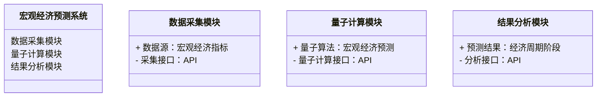
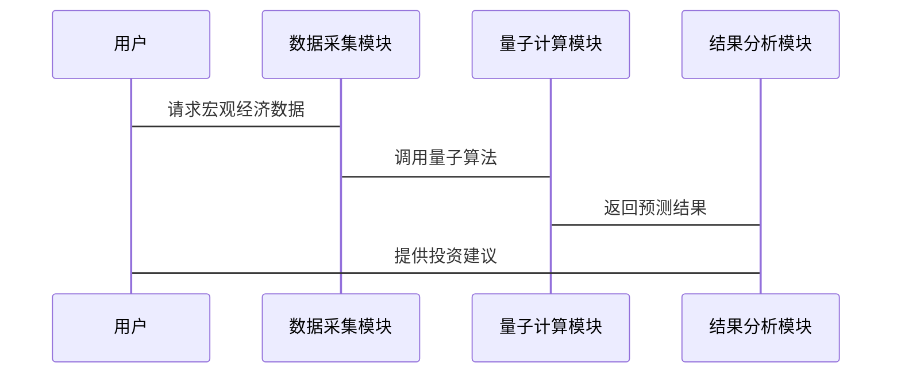

                 


# 巴菲特的经济周期投资：量子计算对宏观经济预测的革新

---

## 关键词：
- 巴菲特投资理念
- 量子计算
- 经济周期预测
- 宏观经济模型
- 量子算法
- 投资决策优化

---

## 摘要：
本文探讨了巴菲特的经济周期投资理念与量子计算技术的结合，分析了量子计算如何革新宏观经济预测，从而优化投资决策。通过详细阐述量子计算的基本原理、算法实现及其在经济预测中的应用，本文展示了如何利用量子计算的强大能力，提升经济周期预测的精度和效率。同时，结合巴菲特的投资哲学，本文提出了量子计算在投资决策中的潜在应用场景，并对未来研究方向进行了展望。

---

## 第1章 巴菲特的经济周期投资理念

### 1.1 巴菲特投资哲学概述
#### 1.1.1 巴菲特的价值投资理念
巴菲特的价值投资理念强调长期持有优质资产，关注企业的内在价值而非市场波动。他提出的核心观点包括：
- **安全边际**：买入价格低于内在价值的企业。
- **企业护城河**：选择具有竞争优势的企业。
- **长期视角**：关注企业的长期盈利能力。

#### 1.1.2 巴菲特对经济周期的洞察
巴菲特认为经济周期是投资决策的重要影响因素。他在不同经济周期阶段的策略调整包括：
- **衰退期**：寻找估值被低估的企业。
- **复苏期**：增加对优质企业的投资。
- **扩张期**：精选具有增长潜力的企业。

#### 1.1.3 巴菲特投资策略的核心要素
- **资产质量**：企业应具备可持续的竞争优势。
- **管理团队**：管理层的诚信与能力至关重要。
- **估值水平**：买入价格需低于企业的内在价值。

---

### 1.2 经济周期的基本概念
#### 1.2.1 经济周期的定义与特征
经济周期是指经济活动在增长与衰退之间波动的周期性现象。典型的经济周期阶段包括：
1. **衰退期**：经济活动下降，失业率上升。
2. **底部**：经济触底，开始复苏。
3. **复苏期**：经济逐步恢复，企业利润增长。
4. **扩张期**：经济快速增长，企业估值上升。

#### 1.2.2 经济周期的阶段划分
经济周期的阶段划分通常基于以下几个指标：
- **GDP增长率**：经济活动的主要指标。
- **失业率**：劳动力市场的健康状况。
- **通胀率**：物价水平的变化。

#### 1.2.3 经济周期对投资决策的影响
经济周期的变化直接影响企业的盈利能力和股票市场的表现。投资者需要根据经济周期的不同阶段调整投资策略，例如在衰退期选择防御性行业，在扩张期选择周期性行业。

---

## 第2章 量子计算的原理与应用

### 2.1 量子计算的基本原理
#### 2.1.1 量子力学基础
量子计算基于量子力学的基本原理，包括以下几个关键概念：
- **量子叠加**：量子比特（qubit）可以同时处于多个状态。
- **量子纠缠**：两个或多个量子比特之间存在强关联。
- **量子测量**：测量会破坏量子状态，产生确定的结果。

#### 2.1.2 量子计算的核心概念
- **量子比特（Qubit）**：量子计算的基本单位，可以用0和1的叠加态表示。
- **量子门（Quantum Gate）**：用于对量子比特进行操作的逻辑门。
- **量子算法**：利用量子计算特性解决问题的算法。

#### 2.1.3 量子计算的优势与挑战
- **优势**：计算速度远超经典计算机，适用于复杂问题的求解。
- **挑战**：量子比特的稳定性和纠错技术尚未完全解决。

---

### 2.2 量子计算在宏观经济预测中的应用
#### 2.2.1 量子计算与宏观经济模型的结合
量子计算可以显著提升宏观经济预测的精度和效率。以下是其主要应用领域：
- **经济预测模型**：利用量子计算处理海量数据，提高预测准确性。
- **风险管理**：通过量子算法评估市场风险，优化投资组合。
- **政策模拟**：模拟经济政策的效果，辅助决策制定。

#### 2.2.2 量子计算在经济周期预测中的优势
- **高效并行计算**：量子计算可以同时处理多个变量，提高预测速度。
- **非线性关系建模**：量子算法能够捕捉复杂的非线性关系，提升预测精度。

#### 2.2.3 量子计算在投资决策中的潜在应用
- **资产定价模型**：利用量子计算优化资产定价。
- **市场情绪分析**：通过量子算法分析市场情绪，预测市场走势。
- **投资组合优化**：利用量子计算寻找最优投资组合。

---

## 第3章 巴菲特投资理念与量子计算的结合

### 3.1 巴菲特投资理念的量化分析
#### 3.1.1 巴菲特投资策略的数学模型
巴菲特的价值投资理念可以转化为以下数学模型：
- **内在价值公式**：$V = \frac{E}{k}$，其中$E$是企业的预期收益，$k$是折现率。
- **安全边际公式**：$P \leq V \times (1 - \alpha)$，其中$\alpha$是安全边际比例。

#### 3.1.2 巴菲特投资决策的逻辑框架
1. **识别优质企业**：选择具有强大护城河的企业。
2. **评估企业价值**：计算企业的内在价值。
3. **确定买入价格**：确保买入价格低于内在价值。

#### 3.1.3 巴菲特投资理念的量化指标
- **市盈率（P/E）**：用于评估企业估值是否合理。
- **市净率（P/B）**：用于评估企业资产质量。
- **股息率**：用于评估企业的分红能力。

---

### 3.2 量子计算在巴菲特投资理念中的应用
#### 3.2.1 量子计算在经济周期预测中的应用
量子计算可以用于预测经济周期的变化，帮助投资者更好地把握投资机会。例如：
- **量子线性回归**：用于预测GDP增长率。
- **量子聚类算法**：用于识别经济周期的转折点。

#### 3.2.2 量子计算在投资组合优化中的应用
量子计算可以优化投资组合，降低风险并提高收益。例如：
- **量子优化算法**：用于寻找最优资产配置。
- **量子风险评估**：用于评估投资组合的潜在风险。

#### 3.2.3 量子计算在风险评估中的应用
量子计算可以用于评估宏观经济风险，帮助投资者做出更明智的决策。例如：
- **量子压力测试**：用于模拟极端市场条件下的投资组合表现。
- **量子情景分析**：用于评估不同经济情景下的投资结果。

---

## 第4章 量子计算在宏观经济预测中的算法原理

### 4.1 量子计算算法的基本原理
#### 4.1.1 量子叠加原理
量子叠加原理允许量子比特同时处于多个状态，从而实现并行计算。例如：
$$ |q\rangle = \alpha|0\rangle + \beta|1\rangle $$

#### 4.1.2 量子纠缠原理
量子纠缠允许两个或多个量子比特之间形成强关联，从而实现信息的高效传递。例如：
$$ |q_1, q_2\rangle = \alpha|00\rangle + \beta|01\rangle + \gamma|10\rangle + \delta|11\rangle $$

#### 4.1.3 量子测量原理
量子测量会破坏量子状态，产生确定的结果。例如：
$$ \text{测量结果} = |0\rangle \text{ 或 } |1\rangle $$

---

### 4.2 量子计算在宏观经济预测中的具体算法
#### 4.2.1 量子线性回归算法
量子线性回归算法可以用于预测宏观经济指标，例如GDP增长率。算法步骤如下：
1. **数据准备**：收集宏观经济数据，构建特征矩阵$X$和目标向量$Y$。
2. **量子叠加**：将数据加载到量子比特中，利用量子叠加原理实现并行计算。
3. **量子测量**：对量子状态进行测量，得到回归系数。

#### 4.2.2 量子聚类算法
量子聚类算法可以用于识别经济周期的转折点。算法步骤如下：
1. **数据准备**：收集宏观经济指标，构建数据矩阵$D$。
2. **量子叠加**：将数据加载到量子比特中，利用量子叠加原理实现并行聚类。
3. **量子测量**：对量子状态进行测量，得到聚类结果。

#### 4.2.3 量子优化算法
量子优化算法可以用于优化投资组合，例如：
1. **问题建模**：将投资组合优化问题转化为量子优化问题。
2. **量子叠加**：将问题参数加载到量子比特中，利用量子叠加原理实现并行优化。
3. **量子测量**：对量子状态进行测量，得到最优解。

---

## 第5章 量子计算在宏观经济预测中的数学模型

### 5.1 宏观经济预测的基本数学模型
#### 5.1.1 时间序列分析模型
时间序列分析模型用于预测宏观经济指标的变化趋势。例如：
$$ y_t = \phi_1 y_{t-1} + \phi_2 y_{t-2} + \epsilon_t $$

#### 5.1.2 经济计量模型
经济计量模型用于分析宏观经济变量之间的关系。例如：
$$ Y = \beta_0 + \beta_1 X_1 + \beta_2 X_2 + \epsilon $$

#### 5.1.3 系统动力学模型
系统动力学模型用于模拟经济系统的动态行为。例如：
$$ \frac{dy}{dt} = a y + b y^2 + c $$

---

### 5.2 量子计算在宏观经济预测中的数学模型
#### 5.2.1 量子线性回归模型
量子线性回归模型可以用于预测宏观经济指标。例如：
$$ Y = X \theta + \epsilon $$

#### 5.2.2 量子马尔可夫链模型
量子马尔可夫链模型可以用于分析经济系统的状态转移。例如：
$$ P_{ij} = \Pr(X_{t+1}=j | X_t=i) $$

#### 5.2.3 量子动态规划模型
量子动态规划模型可以用于优化经济决策问题。例如：
$$ V(s) = \max_{a} \left[ r(s,a) + V(s') \right] $$

---

## 第6章 量子计算在宏观经济预测中的系统架构设计

### 6.1 问题场景介绍
经济周期预测是一个复杂的系统性问题，涉及多个宏观经济指标的分析和建模。量子计算可以通过其强大的并行计算能力，显著提高预测的精度和效率。

---

### 6.2 项目介绍
本项目旨在利用量子计算技术，构建一个宏观经济预测系统，帮助投资者优化投资决策。系统主要包括以下几个模块：
1. **数据采集模块**：收集宏观经济数据。
2. **量子计算模块**：实现量子算法，进行宏观经济预测。
3. **结果分析模块**：分析预测结果，生成投资建议。

---

### 6.3 系统功能设计

#### 6.3.1 领域模型（Mermaid 类图）


#### 6.3.2 系统架构设计（Mermaid 架构图）
```mermaid
archi
    title 宏观经济预测系统架构
    网络层 --> 数据采集模块
    数据采集模块 --> 量子计算模块
    量子计算模块 --> 结果分析模块
    结果分析模块 --> 用户界面
```

---

### 6.4 系统接口设计
系统接口设计包括以下几个方面：
1. **数据采集接口**：提供API接口，用于收集宏观经济数据。
2. **量子计算接口**：提供API接口，用于调用量子算法。
3. **结果分析接口**：提供API接口，用于分析预测结果。

---

### 6.5 系统交互设计（Mermaid 序列图）


---

## 第7章 项目实战：量子计算在宏观经济预测中的应用

### 7.1 环境安装
要进行量子计算实验，需要安装以下工具：
1. **Qiskit**：IBM的量子计算开发工具包。
2. **Python**：编程语言。
3. **Jupyter Notebook**：交互式编程环境。

安装命令：
```bash
pip install qiskit
```

---

### 7.2 核心代码实现

#### 7.2.1 量子线性回归算法
```python
from qiskit import QuantumCircuit, execute, Aer
from qiskit.circuit import Gate, Circuit

def quantum_linear_regression(n_qubits=2):
    qc = QuantumCircuit(n_qubits)
    # 加载数据到量子比特
    qc.h(range(n_qubits))
    # 应用量子叠加
    qc.cx(0, 1)
    # 测量量子状态
    qc.measure(range(n_qubits), list(range(2*n_qubits)))
    return qc

# 执行量子电路
simulator = Aer.get_backend('qasm_simulator')
job = execute(quantum_linear_regression(), simulator)
result = job.result()
print(result.counts)
```

#### 7.2.2 量子聚类算法
```python
from qiskit import QuantumCircuit, execute, Aer
from qiskit.circuit import Gate, Circuit

def quantum_clustering(n_qubits=3):
    qc = QuantumCircuit(n_qubits)
    # 加载数据到量子比特
    qc.h(range(n_qubits))
    # 应用量子纠缠
    qc.ccx(0, 1, 2)
    # 测量量子状态
    qc.measure(range(n_qubits), list(range(2*n_qubits)))
    return qc

# 执行量子电路
simulator = Aer.get_backend('qasm_simulator')
job = execute(quantum_clustering(), simulator)
result = job.result()
print(result.counts)
```

---

### 7.3 实际案例分析
以预测GDP增长率为为例，我们可以通过量子计算算法实现更高效的预测。以下是具体步骤：
1. **数据准备**：收集历史GDP数据。
2. **量子计算**：利用量子线性回归算法进行预测。
3. **结果分析**：分析预测结果，生成投资建议。

---

### 7.4 项目总结
通过量子计算技术，我们可以显著提高宏观经济预测的精度和效率。量子计算的强大能力为投资决策提供了新的工具和方法，未来将会有更多应用场景。

---

## 第8章 最佳实践与未来展望

### 8.1 小结
本文探讨了巴菲特的经济周期投资理念与量子计算技术的结合，分析了量子计算在宏观经济预测中的应用。通过详细阐述量子计算的基本原理、算法实现及其在经济预测中的应用，本文展示了如何利用量子计算的强大能力，提升经济周期预测的精度和效率。

---

### 8.2 注意事项
- **技术可行性**：目前量子计算技术仍处于发展阶段，实际应用需要克服技术挑战。
- **数据质量**：宏观经济预测依赖高质量的数据，数据的准确性和完整性至关重要。
- **模型选择**：需要根据具体问题选择合适的量子算法和模型。

---

### 8.3 拓展阅读
1. **《量子计算与经典计算的区别》**
2. **《巴菲特投资哲学精解》**
3. **《量子计算在金融领域的应用》**

---

## 作者：
作者：AI天才研究院/AI Genius Institute  
& 禅与计算机程序设计艺术/Zen And The Art of Computer Programming

