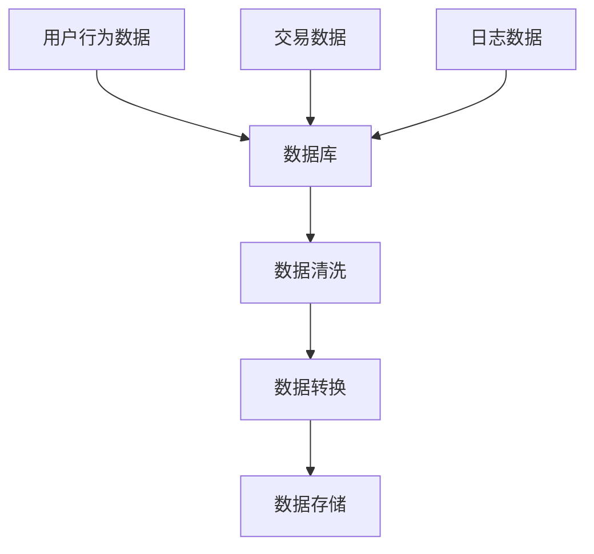
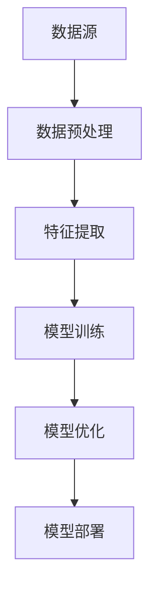
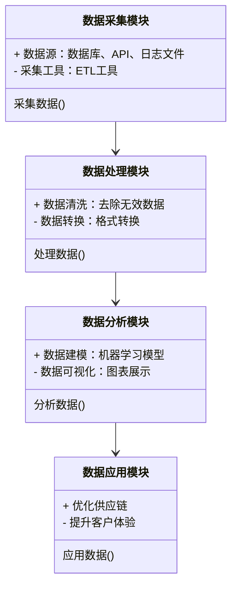
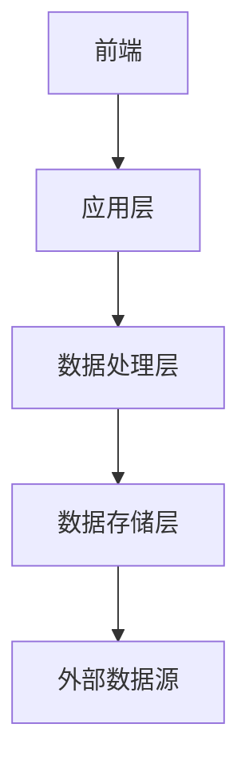

                 


# 巴菲特的经济护城河理论：数据经济时代的竞争优势

> 关键词：经济护城河，数据经济，竞争优势，数据驱动，商业模式

> 摘要：在数据经济时代，传统的经济护城河理论面临新的挑战和机遇。本文将深入探讨巴菲特的经济护城河理论在数据经济时代的核心思想，分析数据如何成为新的竞争优势，并通过具体案例和系统设计，展示如何利用数据构建经济护城河。

---

## 第一部分：经济护城河的理论基础

### 第1章：经济护城河的核心概念

#### 1.1 经济护城河的定义与背景

经济护城河是指企业通过独特的资源、能力或模式，形成竞争优势并防止竞争对手侵蚀其市场份额的能力。巴菲特认为，拥有强大经济护城河的公司能够在长期内持续创造超额利润。传统的经济护城河包括品牌优势、成本优势、网络效应等。

#### 1.2 数据经济时代的经济护城河

在数据经济时代，数据成为最重要的生产要素。企业通过收集、分析和应用数据，能够更精准地洞察市场需求、优化运营效率、提升客户体验。数据经济时代的经济护城河不再是单纯的成本或品牌优势，而是基于数据的洞察力和决策能力。

#### 1.3 数据经济时代经济护城河的特点

- 数据驱动：企业通过数据收集、分析和应用构建竞争优势。
- 技术依赖：数据处理和分析依赖先进的技术工具，如人工智能、大数据平台等。
- 动态变化：数据的实时性和更新性要求企业不断优化护城河。

### 第2章：经济护城河的核心概念与联系

#### 2.1 经济护城河的核心原理

- 数据是经济护城河的核心资源。
- 数据分析能力是护城河的关键能力。
- 数据的应用场景决定了护城河的深度和广度。

#### 2.2 数据经济时代经济护城河的概念结构

通过对比传统经济护城河和数据经济时代经济护城河的概念结构，可以发现数据在护城河构建中的重要性。以下是对比表：

| 对比维度       | 传统经济护城河                 | 数据经济时代经济护城河                 |
|----------------|-------------------------------|---------------------------------------|
| 核心资源       | 品牌、成本、网络效应           | 数据、技术、算法                       |
| 构建方式       | 依靠市场垄断、降低成本         | 依靠数据收集、分析、应用               |
| 可持续性       | 依赖市场环境和政策             | 依赖数据质量和处理能力                 |

---

## 第二部分：数据经济时代经济护城河的构建

### 第3章：数据驱动的经济护城河构建算法

#### 3.1 数据收集与处理流程

以下是数据收集与处理的流程图：



#### 3.2 数据分析与建模

通过数据分析，企业可以发现数据中的规律和趋势，从而优化其商业模式。以下是数据分析流程图：



#### 3.3 经济护城河优化的数学推导

经济护城河的强度可以通过以下公式计算：

$$
\text{经济护城河强度} = f(\text{数据质量}, \text{数据分析能力}, \text{数据应用效率})
$$

其中，数据质量、数据分析能力和数据应用效率是影响经济护城河强度的关键因素。

---

### 第4章：数据经济时代经济护城河的系统分析与架构设计

#### 4.1 系统分析

##### 4.1.1 问题场景介绍

假设我们正在为一家电商公司设计数据驱动的经济护城河。该公司希望通过数据分析优化其供应链和客户体验。

##### 4.1.2 系统功能设计

以下是系统功能设计的类图：



##### 4.1.3 系统架构设计

以下是系统架构设计图：



---

### 第5章：数据经济时代经济护城河的项目实战

#### 5.1 项目环境安装与配置

##### 5.1.1 开发环境搭建

- 操作系统：建议使用Linux或macOS
- 开发工具：建议使用PyCharm或VS Code
- 数据库：建议使用MySQL或MongoDB
- 依赖库：Pandas、NumPy、Scikit-learn、TensorFlow

#### 5.2 核心系统实现

##### 5.2.1 数据收集模块实现

```python
import pandas as pd
import requests

def collect_data():
    url = "https://example.com/api"
    response = requests.get(url)
    data = response.json()
    df = pd.DataFrame(data)
    return df

collect_data()
```

##### 5.2.2 数据分析模块实现

```python
from sklearn.model import LinearRegression

def analyze_data(df):
    model = LinearRegression()
    model.fit(df[['feature1', 'feature2']], df['target'])
    return model

model = analyze_data(df)
```

##### 5.2.3 数据应用模块实现

```python
def apply_model(model):
    new_data = pd.DataFrame({'feature1': [1], 'feature2': [2]})
    prediction = model.predict(new_data)
    return prediction

result = apply_model(model)
```

---

## 第六部分：总结与展望

### 第6章：总结与展望

#### 6.1 总结

数据经济时代，经济护城河的构建离不开数据的收集、分析和应用能力。通过数据驱动的经济护城河，企业可以更精准地洞察市场需求、优化运营效率、提升客户体验。

#### 6.2 展望

随着人工智能和大数据技术的不断进步，数据经济时代经济护城河的构建将更加依赖于技术驱动。未来，企业需要更加注重数据的安全与隐私保护，同时探索更多数据驱动的商业模式。

---

作者：AI天才研究院/AI Genius Institute & 禅与计算机程序设计艺术 /Zen And The Art of Computer Programming

