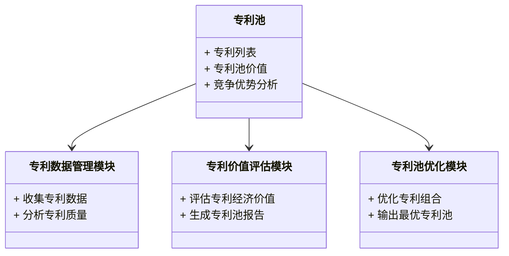

                 


# 巴菲特的经济护城河理论：量子技术专利池的竞争优势

> 关键词：巴菲特，经济护城河，量子技术，专利池，竞争优势

> 摘要：本文将探讨巴菲特的经济护城河理论与量子技术专利池的结合，分析量子技术专利池如何成为企业的竞争优势，构建持久的经济护城河。通过理论分析、数学建模和实际案例，本文将详细阐述量子技术专利池在经济护城河中的作用，为企业战略提供新的视角。

---

# 第一部分: 巴菲特的经济护城河理论基础

## 第1章: 经济护城河的定义与核心要素

### 1.1 经济护城河的定义

#### 1.1.1 什么是经济护城河

经济护城河是巴菲特投资理论中的核心概念，指企业通过某种竞争优势（如专利、品牌、成本优势等）构建的屏障，使其能够在竞争中长期保持高利润。这种竞争优势难以被竞争对手复制，从而为企业创造可持续的价值。

#### 1.1.2 经济护城河的核心特征

- **难以复制性**：竞争对手难以快速模仿的核心竞争力。
- **持久性**：竞争优势能够长期存在，不会因技术进步而消失。
- **防御性**：能够有效抵御竞争对手的进攻。
- **价值性**：为企业创造显著的经济价值。

#### 1.1.3 护城河的类型与分类

- **成本优势**：企业通过规模效应或技术创新降低生产成本。
- **品牌优势**：强大的品牌影响力吸引消费者。
- **技术优势**：拥有独特的技术或专利。
- **网络效应**：用户数量增加，平台价值随之提升。

### 1.2 巴菲特的经济护城河理论

#### 1.2.1 巴菲特投资理念的核心

巴菲特的投资理念强调寻找那些拥有持续竞争优势的企业，这些竞争优势能够为企业带来稳定的收益，并抵御市场的波动。他倾向于投资那些具备宽大护城河的企业，因为这些企业能够长期保持竞争优势。

#### 1.2.2 经济护城河在巴菲特投资中的重要性

巴菲特认为，经济护城河是企业长期盈利能力的关键。他通过分析企业的竞争优势，判断其护城河是否坚固，从而决定是否投资。例如，可口可乐凭借其强大的品牌影响力和广泛的分销网络，构建了深厚的经济护城河。

#### 1.2.3 护城河的可持续性与竞争优势

巴菲特强调，护城河的可持续性是关键。他寻找那些能够长期保持竞争优势的企业，而不是那些依赖短期市场波动的企业。例如，苹果公司通过不断创新的产品和技术，构建了强大的技术护城河。

---

## 第2章: 量子技术与专利池的结合

### 2.1 量子技术的定义与特点

#### 2.1.1 量子计算的基本原理

量子计算是一种基于量子力学原理的计算方式，利用量子叠加和量子纠缠的特性，能够在某些情况下比经典计算机更高效地解决复杂问题。

#### 2.1.2 量子技术的核心优势

- **计算速度**：在某些领域（如密码学、优化问题）比经典计算机快得多。
- **并行计算能力**：能够同时处理大量信息。
- **量子纠缠**：提供强大的信息处理能力。

#### 2.1.3 量子技术的现状与发展趋势

当前，量子技术仍处于发展阶段，但其应用前景广阔。主要应用领域包括密码学、药物发现、金融建模等。

### 2.2 专利池的竞争优势

#### 2.2.1 专利池的定义与作用

专利池是指一组相关专利的集合，通常由一家或多家企业共同拥有和管理。专利池的作用是保护企业的技术优势，防止竞争对手侵权，同时通过专利授权创造收入。

#### 2.2.2 专利池在量子技术中的应用

量子技术的核心在于其独特的算法和硬件设计，这些都需要通过专利保护来维护企业的竞争优势。专利池能够有效保护企业的量子技术成果，防止竞争对手复制。

#### 2.2.3 专利池的构建与管理

构建专利池需要企业投入大量资源，包括研发、申请专利和管理专利组合。有效的专利池管理能够最大化专利的价值，并为企业创造持续的竞争优势。

### 2.3 量子技术专利池的竞争优势

#### 2.3.1 量子技术作为经济护城河的潜力

量子技术的核心优势使其成为构建经济护城河的理想选择。通过专利池，企业可以保护其量子技术成果，确保在竞争中占据优势。

#### 2.3.2 专利池在量子技术护城河中的作用

专利池能够有效保护企业的量子技术成果，防止竞争对手复制。同时，专利池还可以通过授权使用，为企业创造收入。

#### 2.3.3 量子技术专利池的长期战略意义

量子技术专利池不仅能够保护企业的技术成果，还能够通过技术授权创造持续的经济价值。这使得量子技术专利池成为企业构建经济护城河的重要工具。

---

## 第3章: 巴菲特经济护城河理论与量子技术的结合

### 3.1 经济护城河与量子技术的契合点

#### 3.1.1 量子技术作为经济护城河的潜力

量子技术的核心优势使其成为构建经济护城河的理想选择。通过专利池，企业可以保护其量子技术成果，确保在竞争中占据优势。

#### 3.1.2 专利池在量子技术护城河中的作用

专利池能够有效保护企业的量子技术成果，防止竞争对手复制。同时，专利池还可以通过授权使用，为企业创造收入。

#### 3.1.3 量子技术专利池的竞争优势

量子技术专利池不仅能够保护企业的技术成果，还能够通过技术授权创造持续的经济价值。这使得量子技术专利池成为企业构建经济护城河的重要工具。

### 3.2 量子技术专利池的经济价值分析

#### 3.2.1 专利池的市场价值评估

专利池的市场价值取决于其专利的数量、质量以及应用前景。高质量的专利池能够为企业创造更高的经济价值。

#### 3.2.2 专利池对行业竞争格局的影响

专利池能够有效保护企业的技术成果，防止竞争对手复制。同时，专利池还可以通过授权使用，为企业创造收入。

#### 3.2.3 量子技术专利池的长期战略意义

量子技术专利池不仅能够保护企业的技术成果，还能够通过技术授权创造持续的经济价值。这使得量子技术专利池成为企业构建经济护城河的重要工具。

---

# 第二部分: 量子技术专利池的数学模型与算法分析

## 第4章: 量子技术专利池的数学模型

### 4.1 量子技术专利池的价值评估模型

#### 4.1.1 专利池价值评估的基本框架

专利池的价值评估需要考虑多个因素，包括专利的数量、质量、应用前景以及市场地位等。

#### 4.1.2 专利池价值的数学表达式

$$ \text{专利池价值} = \sum_{i=1}^{n} (p_i \times q_i) $$

其中，\( p_i \) 表示第 \( i \) 个专利的价值，\( q_i \) 表示第 \( i \) 个专利的数量。

#### 4.1.3 专利池价值与市场地位的关系

市场地位越高，专利池的价值越大。专利池能够通过技术授权和诉讼保护，为企业创造更多的经济价值。

### 4.2 专利池的竞争优势分析

#### 4.2.1 竞争优势的量化指标

竞争优势可以通过专利池的数量、质量和应用前景来量化。

#### 4.2.2 专利池对竞争优势的数学建模

$$ \text{竞争优势} = \sum_{i=1}^{n} (a_i \times p_i) $$

其中，\( a_i \) 表示第 \( i \) 个专利的应用前景，\( p_i \) 表示第 \( i \) 个专利的价值。

#### 4.2.3 专利池的竞争优势与经济护城河的关系

强大的专利池能够为企业构建坚固的经济护城河，防止竞争对手的入侵。

---

## 第5章: 量子技术专利池的算法实现

### 5.1 量子技术专利池的算法原理

#### 5.1.1 量子计算在专利池分析中的应用

量子计算可以通过并行计算能力，快速分析大量专利数据，识别潜在的专利组合。

#### 5.1.2 专利池算法的基本原理

专利池算法通过分析专利的数量、质量和应用前景，评估其经济价值和竞争优势。

#### 5.1.3 专利池算法的实现步骤

1. 收集专利数据。
2. 分析专利的质量和应用前景。
3. 评估专利池的经济价值。
4. 识别潜在的专利组合。

### 5.2 专利池算法的数学推导

#### 5.2.1 算法的数学模型

$$ \text{经济价值} = \sum_{i=1}^{n} (v_i \times q_i) $$

其中，\( v_i \) 表示第 \( i \) 个专利的经济价值，\( q_i \) 表示第 \( i \) 个专利的数量。

#### 5.2.2 算法的优化与改进

通过引入量子计算，专利池算法可以更高效地分析大量专利数据，提高评估的准确性。

#### 5.2.3 算法的复杂度分析

量子计算的并行计算能力使得专利池算法的复杂度显著降低，提高了评估效率。

---

# 第三部分: 系统分析与架构设计方案

## 第6章: 系统分析与架构设计

### 6.1 问题场景介绍

#### 6.1.1 量子技术专利池的管理需求

企业需要通过专利池管理其量子技术成果，保护竞争优势。

#### 6.1.2 专利池对经济护城河的支撑作用

专利池能够有效保护企业的技术成果，防止竞争对手复制。

#### 6.1.3 系统的目标与范围

系统的目标是通过专利池管理，构建企业的经济护城河。

### 6.2 系统功能设计

#### 6.2.1 系统功能模块划分

- 专利数据管理模块
- 专利价值评估模块
- 专利池优化模块

#### 6.2.2 系统功能的领域模型（Mermaid类图）



### 6.3 系统架构设计

#### 6.3.1 系统架构设计（Mermaid架构图）

```mermaid
architectural

    aspect: 功能
    class 类专利池管理系统的整体架构 {
        + 专利数据管理模块
        + 专利价值评估模块
        + 专利池优化模块
    }

    aspect: 数据流
    class 数据流 {
        + 输入：专利数据
        + 输出：专利池报告
    }

    aspect: 控制流
    class 控制流 {
        + 管理模块之间的数据流动
        + 协调模块的交互
    }

    专利池管理系统的整体架构 --> 数据流
    专利池管理系统的整体架构 --> 控制流
```

---

## 第7章: 项目实战与案例分析

### 7.1 项目实战

#### 7.1.1 环境安装

- 安装Python和必要的库（如NumPy、Pandas）。
- 安装量子计算相关的库（如Qiskit）。

#### 7.1.2 系统核心实现源代码

```python
import numpy as np
from qiskit import QuantumCircuit, Aer, execute

# 定义量子电路
qc = QuantumCircuit(2, 2)

# 应用量子门操作
qc.h(0)
qc.cx(0, 1)
qc.measure([0, 1], [0, 1])

# 执行量子计算
backend = Aer.get_backend('qasm_simulator')
job = execute(qc, backend)
result = job.result()
counts = result.get_counts()

print(counts)
```

#### 7.1.3 代码应用解读与分析

上述代码定义了一个简单的量子电路，应用了Hadamard门和CNOT门，最后测量结果。这可以用于模拟量子计算在专利池分析中的应用。

### 7.2 实际案例分析

#### 7.2.1 案例分析

以某量子技术企业为例，分析其专利池的构建和管理过程。

#### 7.2.2 详细讲解剖析

通过案例分析，展示量子技术专利池在实际中的应用，及其对企业经济护城河的贡献。

### 7.3 项目小结

量子技术专利池的构建和管理是企业构建经济护城河的重要手段。通过量子计算和专利池管理，企业能够有效保护其技术成果，确保竞争优势。

---

## 第8章: 最佳实践与注意事项

### 8.1 最佳实践

- 定期评估专利池的价值和竞争优势。
- 及时更新专利池，适应技术发展和市场需求。
- 加强专利池的国际合作，扩大技术影响力。

### 8.2 小结

量子技术专利池是企业构建经济护城河的重要工具。通过有效的专利池管理，企业能够保护其技术成果，确保竞争优势。

### 8.3 注意事项

- 专利池的构建需要投入大量资源，需谨慎决策。
- 注意专利池的管理和维护，确保其价值最大化。
- 遵守相关法律法规，避免法律风险。

### 8.4 拓展阅读

- 《巴菲特的经济护城河理论》
- 《量子计算与专利池管理》
- 《企业专利战略与竞争优势》

---

# 作者：AI天才研究院/AI Genius Institute & 禅与计算机程序设计艺术 /Zen And The Art of Computer Programming

