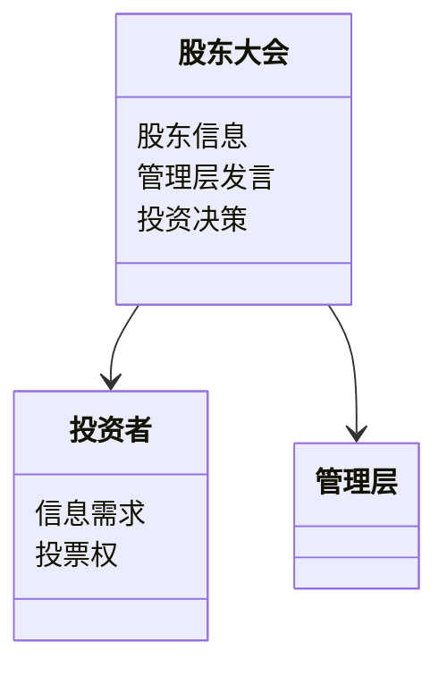
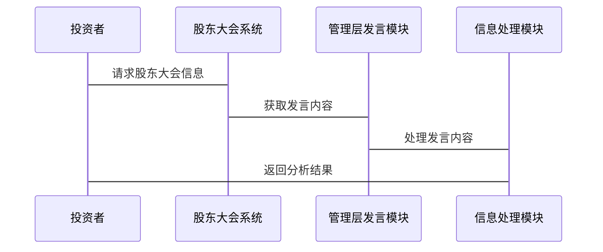

                 


# 巴菲特的股东大会启示

## 关键词：巴菲特，股东大会，投资理念，价值评估，风险管理，投资策略

## 摘要：巴菲特的股东大会是其投资理念的重要展示平台，本文通过分析股东大会的背景、核心概念、投资策略、风险管理等方面，揭示巴菲特成功投资的秘密，为投资者提供实用的分析方法和决策框架。

---

# 第一部分: 巴菲特股东大会的背景与核心概念

## 第1章: 巴菲特股东大会概述

### 1.1 巴菲特股东大会的背景

#### 1.1.1 巴菲特投资理念的形成
沃伦·巴菲特（Warren Buffett）的投资理念起源于其对价值投资的深刻理解。他强调购买股票时应关注企业的内在价值，而非市场波动。这种理念源于本杰明·格雷厄姆（Benjamin Graham）的老师教导，即寻找具有安全边际的企业。

#### 1.1.2 巴菲特股东大会的历史发展
自1971年巴菲特收购伯克希尔哈撒韦公司以来，股东大会成为他分享投资理念和公司战略的重要平台。每年，成千上万的投资者聚集在一起，聆听巴菲特对市场、经济和投资策略的看法。

#### 1.1.3 巴菲特股东大会的重要性
股东大会不仅是伯克希尔哈撒韦公司的年度盛事，更是全球投资者学习巴菲特智慧的重要机会。通过股东大会，投资者可以深入了解公司的经营状况、未来战略和巴菲特的投资思路。

### 1.2 巴菲特股东大会的核心概念

#### 1.2.1 投资者的角色与责任
巴菲特认为，投资者应具备对企业基本面的深入分析能力，并在市场恐慌时保持冷静，寻找低估的投资机会。投资者的首要责任是理解企业价值，而非盲目跟随市场趋势。

#### 1.2.2 价值投资的核心要素
价值投资的核心在于寻找市场价格低于内在价值的企业。巴菲特强调，内在价值是企业未来现金流的现值，投资者应关注企业的盈利能力、竞争优势和财务健康状况。

#### 1.2.3 巴菲特股东大会的决策机制
股东大会是伯克希尔哈撒韦公司与股东沟通的重要桥梁。巴菲特和芒格（Charlie Munger）在会上回答股东提问，分析公司投资决策，并展望未来发展方向。

### 1.3 巴菲特股东大会的参与者

#### 1.3.1 股东的类型与特点
股东大会的参与者包括机构投资者、个人投资者和公司管理层。机构投资者通常持有大量股份，而个人投资者则通过股东大会了解公司动态。

#### 1.3.2 股东大会的主要参与者
伯克希尔哈撒韦公司管理层（巴菲特、芒格等）是股东大会的核心，他们通过问答环节与股东互动，分享公司战略和投资决策。

#### 1.3.3 股东大会的组织与流程
股东大会通常包括公司年报的审议、董事会选举、管理层问答环节和未来战略讨论。流程紧凑，信息透明，为投资者提供了深入了解公司的机会。

---

## 第2章: 巴菲特投资理念的核心概念

### 2.1 价值投资的定义与特点

#### 2.1.1 价值投资的定义
价值投资是一种投资策略，强调以低于内在价值的价格购买优质企业股票。巴菲特认为，市场波动为长期投资者提供了以合理价格买入的机会。

#### 2.1.2 价值投资的核心特点
- 长期持有：价值投资者注重企业的长期表现，而非短期价格波动。
- 安全边际：购买价格低于内在价值，以降低投资风险。
- 企业质量：选择具有强大竞争优势和稳定盈利能力的企业。

#### 2.1.3 价值投资与短期投资的区别
价值投资注重长期稳健，而短期投资追求快速收益。巴菲特认为，长期投资能够避免市场短期波动带来的风险。

### 2.2 巴菲特投资理念的分析框架

#### 2.2.1 投资标的选择标准
巴菲特选择投资标的时，重点关注企业的盈利能力、财务健康状况和竞争优势。他会评估企业的ROE（净资产收益率）和ROA（资产回报率）等指标。

#### 2.2.2 企业竞争优势的分析
竞争优势是企业长期盈利的关键。巴菲特寻找具有护城河（如品牌、技术、规模优势等）的企业，这些企业能够在竞争中保持领先地位。

#### 2.2.3 企业的财务健康状况
巴菲特高度重视企业的财务健康状况，包括低负债、稳定的现金流和健康的利润率。他倾向于投资财务稳健的企业，避免财务风险。

### 2.3 巴菲特投资理念的数学模型

#### 2.3.1 企业内在价值的计算公式
$$ V = \frac{CF}{r - g} $$
其中：
- \( V \)：企业内在价值
- \( CF \)：未来现金流
- \( r \)：折现率
- \( g \)：现金流增长率

#### 2.3.2 投资决策的数学模型
$$ D = \frac{V}{P} $$
其中：
- \( D \)：投资决策
- \( V \)：企业内在价值
- \( P \)：市场价格

---

## 第3章: 巴菲特股东大会的信息分析方法

### 3.1 信息收集与整理

#### 3.1.1 股东大会信息的来源
股东大会的信息来源包括公司年报、管理层问答、投资者报告和行业分析。这些信息为投资者提供了评估企业价值的重要数据。

#### 3.1.2 信息整理的步骤与方法
1. 收集相关信息：包括公司财务数据、市场分析和管理层发言。
2. 数据清洗：去除无效或错误信息。
3. 数据分析：使用统计方法和模型进行深入分析。

#### 3.1.3 信息分析的关键指标
- 营业收入增长率
- 净利润率
- 负债率
- 现金流状况

### 3.2 信息分析的数学模型

#### 3.2.1 投资回报率的计算
$$ ROI = \frac{利润}{投资成本} \times 100\% $$

#### 3.2.2 企业风险的评估模型
$$ R = \frac{标准差}{平均回报率} \times 100\% $$

---

## 第4章: 巴菲特股东大会的系统分析与架构设计

### 4.1 系统功能设计

#### 4.1.1 领域模型


#### 4.1.2 系统架构设计


#### 4.1.3 系统接口设计
接口：股东大会系统提供API，供投资者查询股东大会信息和投资决策数据。

#### 4.1.4 系统交互设计


---

## 第5章: 巴菲特股东大会的项目实战

### 5.1 项目环境安装

#### 5.1.1 环境要求
- 操作系统：Windows/Mac/Linux
- 开发工具：Python、Jupyter Notebook
- 数据库：MySQL/PostgreSQL

#### 5.1.2 依赖安装
```bash
pip install numpy pandas matplotlib
```

### 5.2 核心实现源代码

#### 5.2.1 股东大会信息处理代码
```python
import pandas as pd
import numpy as np

# 数据加载
df = pd.read_csv('shareholder_meeting.csv')

# 数据清洗
df.dropna(inplace=True)
df['profit_margin'] = df['net_profit'] / df['revenue'] * 100

# 数据分析
mean_profit_margin = df['profit_margin'].mean()
std_profit_margin = df['profit_margin'].std()

print(f"平均利润率：{mean_profit_margin}%")
print(f"利润率标准差：{std_profit_margin}")
```

#### 5.2.2 投资回报率计算代码
```python
def calculate_roi(profits, investment):
    return (profits / investment) * 100

roi = calculate_roi(1000000, 5000000)
print(f"投资回报率：{roi}%")
```

---

## 第6章: 巴菲特股东大会的小结与最佳实践

### 6.1 小结

- 巴菲特股东大会是价值投资者的重要学习机会。
- 通过分析股东大会信息，投资者可以更好地理解企业的内在价值和投资风险。

### 6.2 最佳实践 tips

- **长期投资**：避免短期市场波动的影响。
- **深入分析**：在投资前进行充分的调查和分析。
- **关注基本面**：注重企业的财务状况和竞争优势。

### 6.3 注意事项

- 避免盲目跟风，理性分析市场信息。
- 定期复盘投资组合，调整投资策略。

### 6.4 拓展阅读

- 《巴菲特传》：了解巴菲特的投资哲学和人生经历。
- 《价值投资实战指南》：学习如何在实际操作中应用巴菲特的理念。

---

# 作者：AI天才研究院 & 禅与计算机程序设计艺术

---

通过以上结构和内容，我们可以系统地分析巴菲特股东大会的背景、核心概念、投资策略、风险管理等方面，揭示巴菲特成功投资的秘密，为投资者提供实用的分析方法和决策框架。

