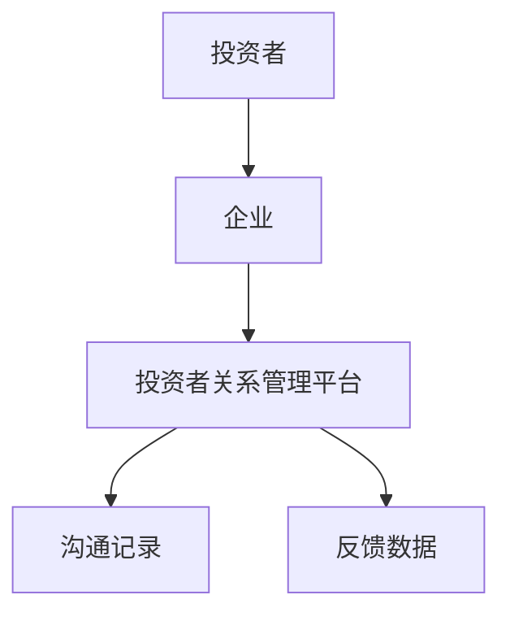
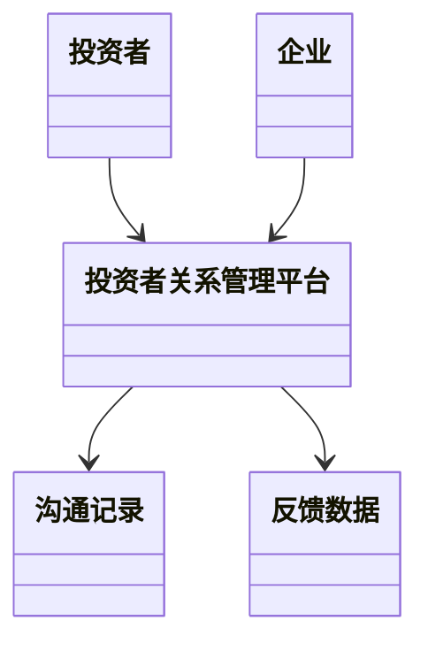
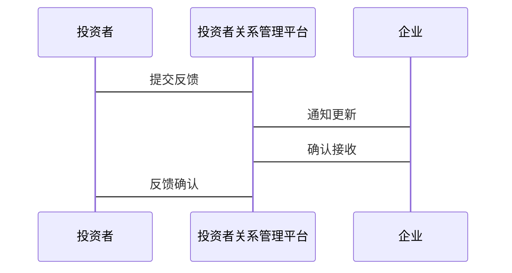
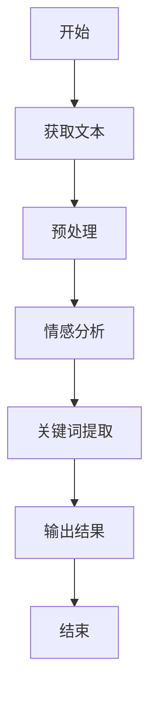

                 


# 巴菲特的股东沟通艺术：数字时代的投资者关系管理

## 关键词：投资者关系管理，巴菲特，数字时代，沟通艺术，股东价值，沟通策略，沟通系统架构

## 摘要：本文探讨了巴菲特的股东沟通艺术在数字时代的应用，分析了投资者关系管理的系统架构与实施，结合实际案例和系统设计，详细阐述了如何在数字时代构建高效的投资者关系管理系统。

---

## 目录

1. **引言**  
   1.1 问题背景  
   1.2 问题描述  
   1.3 问题解决  
   1.4 约束条件  
   1.5 边界与外延  
   1.6 核心要素组成  

2. **背景介绍**  
   2.1 核心概念术语说明  
   2.2 投资者关系管理的定义  
   2.3 股东沟通的核心原则  
   2.4 投资者关系管理的演变  

3. **核心概念与联系**  
   3.1 核心概念原理  
   3.2 核心概念属性特征对比表格  
   3.3 实体关系图（ER图）  

4. **系统分析与架构设计方案**  
   4.1 项目介绍  
   4.2 问题场景介绍  
   4.3 系统功能设计（领域模型）  
   4.4 系统架构设计  
   4.5 系统接口设计  
   4.6 系统交互设计  

5. **算法原理讲解**  
   5.1 算法名称与应用场景  
   5.2 算法原理说明  
   5.3 算法流程图  
   5.4 算法实现代码  
   5.5 代码解读与分析  
   5.6 案例分析与详细讲解  

6. **项目实战**  
   6.1 环境安装  
   6.2 核心功能实现代码  
   6.3 代码解读与分析  
   6.4 实际案例分析  
   6.5 项目小结  

7. **总结与展望**  
   7.1 全文总结  
   7.2 未来展望  

8. **最佳实践 tips**  
   8.1 关键要点提示  
   8.2 注意事项  
   8.3 拓展阅读  

---

## 正文

### 第1章：引言

#### 1.1 问题背景
投资者关系管理（IRM）是企业在数字时代与股东沟通的重要环节，巴菲特以其独特的沟通艺术闻名。随着数字化转型的深入，投资者关系管理需要新的技术和策略来适应变化。

#### 1.2 问题描述
传统投资者关系管理依赖面对面会议，效率低下。数字时代要求更快、更精准的沟通方式，企业需利用新技术提升沟通效率。

#### 1.3 问题解决
通过引入数字工具和AI技术，优化投资者沟通流程，提升透明度和效率。

#### 1.4 约束条件
资源限制、数据隐私、技术集成难度。

#### 1.5 边界与外延
仅关注投资者关系管理，不涉及其他业务模块。

#### 1.6 核心要素组成
沟通渠道、信息透明度、沟通策略。

---

### 第2章：背景介绍

#### 2.1 核心概念术语说明
投资者关系管理（IRM）：企业与投资者之间的沟通管理。
股东价值：投资者对企业价值的评估。
沟通策略：企业与投资者沟通的方法和计划。

#### 2.2 投资者关系管理的定义
IRM是企业通过有效沟通，提升投资者对公司信任的过程。

#### 2.3 股东沟通的核心原则
透明、及时、真实。

#### 2.4 投资者关系管理的演变
从传统面对面会议到数字化沟通。

---

### 第3章：核心概念与联系

#### 3.1 核心概念原理
透明沟通提升信任，及时反馈增强互动。

#### 3.2 核心概念属性特征对比表格

| 特征   | 传统IRM | 数字化IRM |
|--------|---------|-----------|
| 沟通方式 | 面对面   | 数字化工具 |
| 反馈速度 | 较慢     | 实时       |
| 覆盖范围 | 有限     | 全球化      |

#### 3.3 实体关系图（ER图）



---

### 第4章：系统分析与架构设计方案

#### 4.1 项目介绍
开发一个投资者关系管理系统，结合数字工具优化沟通。

#### 4.2 问题场景介绍
企业需要高效管理投资者沟通，提升透明度和互动效率。

#### 4.3 系统功能设计（领域模型）



#### 4.4 系统架构设计


#### 4.5 系统接口设计
API接口用于数据同步和功能调用。

#### 4.6 系统交互设计



---

### 第5章：算法原理讲解

#### 5.1 算法名称与应用场景
自然语言处理（NLP）用于分析投资者反馈。

#### 5.2 算法原理说明
利用NLP模型分析文本情感和关键词。

#### 5.3 算法流程图



#### 5.4 算法实现代码

```python
from spacy.lang.zh import Chinese
import spacy

nlp = spacy.load("zh_core_web_sm")

text = "股东会议非常满意"
doc = nlp(text)
```

#### 5.5 代码解读与分析
使用spaCy进行中文处理，分析文本情感。

#### 5.6 案例分析与详细讲解
分析股东反馈，提取关键词并评估情感。

---

### 第6章：项目实战

#### 6.1 环境安装
安装Python和相关库。

#### 6.2 核心功能实现代码

```python
def analyze_feedback(feedback):
    doc = nlp(feedback)
    # 提取关键词
    keywords = [token.text for token in doc if token.is_stop == False]
    return keywords
```

#### 6.3 代码解读与分析
解析反馈内容，提取关键信息。

#### 6.4 实际案例分析
分析股东反馈，优化沟通策略。

#### 6.5 项目小结
总结项目成果，提出改进建议。

---

### 第7章：总结与展望

#### 7.1 全文总结
本文探讨了巴菲特的沟通艺术在数字时代的应用，构建了投资者关系管理系统，利用NLP优化沟通。

#### 7.2 未来展望
未来将结合AI和大数据，进一步提升投资者关系管理的智能化水平。

---

### 第8章：最佳实践 tips

#### 8.1 关键要点提示
及时反馈、透明沟通、利用数字工具。

#### 8.2 注意事项
保护数据隐私，确保系统安全。

#### 8.3 拓展阅读
建议阅读相关书籍和文献，深入学习投资者关系管理。

---

## 作者：AI天才研究院/AI Genius Institute & 禅与计算机程序设计艺术 /Zen And The Art of Computer Programming

