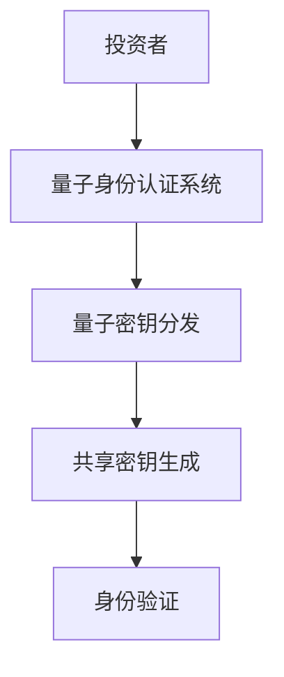
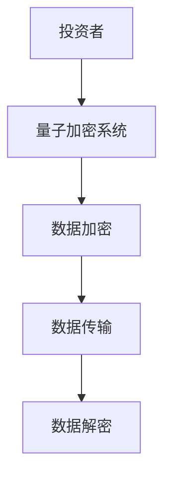
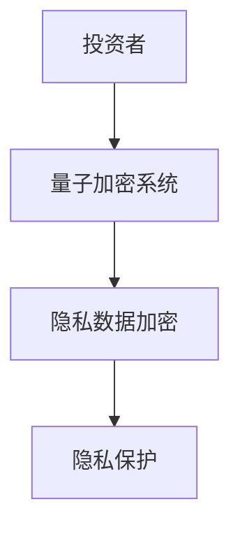
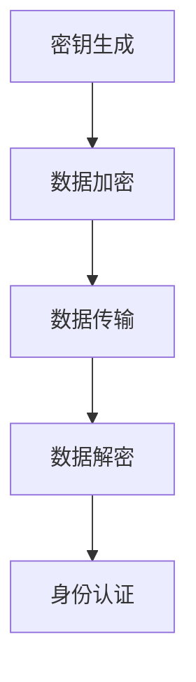
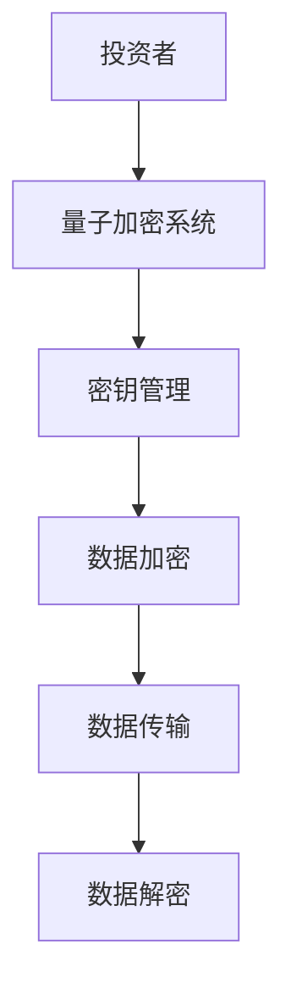
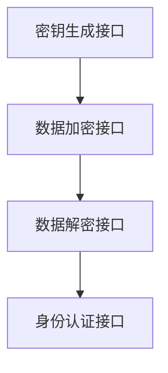
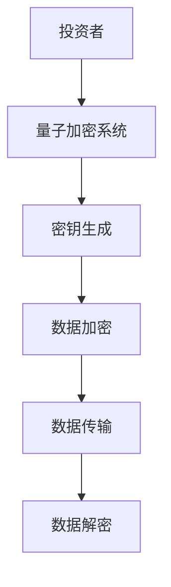

                 


```markdown
# 巴菲特的股东沟通艺术：量子加密在投资者关系中的应用

> 关键词：巴菲特、股东沟通艺术、量子加密、投资者关系、信息安全、量子计算、加密技术

> 摘要：本文探讨了巴菲特的股东沟通艺术与量子加密技术的结合，分析了量子加密技术在投资者关系管理中的应用潜力。通过详细阐述量子加密的数学模型、算法原理及其在投资者身份认证和数据加密传输中的实际应用，本文为投资者关系管理中的信息安全问题提供了新的解决方案。同时，本文还通过实际案例分析，展示了如何利用量子加密技术提升投资者沟通的安全性和效率。

---

# 第一部分: 巴菲特的股东沟通艺术概述

## 第1章: 巴菲特的股东沟通艺术概述

### 1.1 股东沟通艺术的核心理念

#### 1.1.1 股东沟通的基本概念
股东沟通是指公司与其股东之间的信息交流，是公司治理的重要组成部分。有效的股东沟通能够增强股东对公司信任，提升公司形象，同时也有助于公司获取股东的反馈和建议。

#### 1.1.2 巴菲特的沟通风格与投资理念
巴菲特作为世界著名投资家，以其独特的投资理念和沟通风格闻名。他注重长期投资、价值投资，并且在与股东沟通时，始终坚持开放、透明的原则，通过简洁明了的语言传递信息，增强股东的信任感。

#### 1.1.3 股东沟通的艺术性与科学性
股东沟通不仅仅是信息的传递，更是一门艺术。它需要结合公司的实际情况，灵活运用沟通技巧，同时借助先进的技术手段，确保信息的安全性和准确性。

### 1.2 量子加密技术的基本原理

#### 1.2.1 量子加密的定义与特点
量子加密是一种利用量子力学原理进行信息加密的技术。与传统的加密方法不同，量子加密具有不可被窃听、不可被破解的特点，其安全性基于量子力学的基本原理。

#### 1.2.2 量子加密的核心技术与数学模型
量子加密的核心技术包括量子密钥分发（QKD）和量子加密协议。其中，QKD是通过量子叠加和量子纠缠的特性，实现密钥的安全分发。数学模型主要基于量子力学的基本方程，例如：

$$ \psi = \alpha |0\rangle + \beta |1\rangle $$

其中，$\alpha$ 和 $\beta$ 是复数，满足 $|\alpha|^2 + |\beta|^2 = 1$。

#### 1.2.3 量子加密与传统加密的区别
与传统加密技术相比，量子加密具有更高的安全性。传统加密技术依赖于数学算法的复杂性，而量子加密则利用量子力学的物理特性，使得即使在量子计算机出现的情况下，也无法轻易破解。

### 1.3 巴菲特股东沟通艺术与量子加密的结合

#### 1.3.1 股东沟通中的信息安全性需求
在股东沟通中，公司可能会涉及到敏感信息，例如财务数据、战略规划等。这些信息的安全性至关重要，一旦泄露，可能对公司造成重大损失。

#### 1.3.2 量子加密技术在投资者关系中的应用潜力
量子加密技术可以应用于投资者关系管理的多个方面，例如投资者身份认证、投资数据的加密传输等。通过量子加密技术，可以确保投资者信息的安全性，防止信息被窃取或篡改。

#### 1.3.3 股东沟通艺术与量子加密技术的融合
将巴菲特的股东沟通艺术与量子加密技术相结合，不仅能够提升投资者沟通的安全性，还能增强投资者对公司的信任。通过量子加密技术，公司可以实现信息的高效传递，同时保护投资者的隐私。

### 1.4 本章小结
本章主要介绍了巴菲特的股东沟通艺术及其重要性，同时详细阐述了量子加密技术的基本原理和特点。通过分析量子加密技术在投资者关系中的应用潜力，为后续章节的应用实践奠定了基础。

---

# 第二部分: 量子加密技术的数学模型与算法原理

## 第2章: 量子加密技术的数学模型与算法原理

### 2.1 量子加密的数学基础

#### 2.1.1 量子力学基础与数学模型
量子力学是量子加密的理论基础。量子叠加和量子纠缠是量子加密的核心原理。量子叠加可以用数学表达为：

$$ | \psi \rangle = a|0\rangle + b|1\rangle $$

其中，$a$ 和 $b$ 是复数，满足 $|a|^2 + |b|^2 = 1$。

#### 2.1.2 量子叠加与量子纠缠的数学表达
量子纠缠可以用数学表达为：

$$ | \psi \rangle = \frac{1}{\sqrt{2}}(|00\rangle + |11\rangle) $$

这表示两个粒子处于纠缠状态，任何对其中一个粒子的测量都会影响另一个粒子的状态。

#### 2.1.3 量子密钥分发的数学原理
量子密钥分发（QKD）是量子加密的核心技术之一。其数学模型可以表示为：

$$ K = \{0,1\}^n $$

其中，$K$ 是共享的密钥，$n$ 是密钥的长度。

### 2.2 量子加密算法的核心流程

#### 2.2.1 量子密钥分发（QKD）的算法流程
QKD的实现流程包括以下几个步骤：
1. **密钥生成**：通过量子态的测量，生成共享密钥。
2. **密钥校验**：通过经典通信，校验密钥的完整性。
3. **加密与解密**：利用共享密钥对明文进行加密和解密。

#### 2.2.2 量子加密协议的实现步骤
量子加密协议的实现步骤包括：
1. **量子态的制备**：制备量子态，例如 $|0\rangle$ 和 $|1\rangle$。
2. **量子态的传输**：通过量子信道传输量子态。
3. **量子态的测量**：测量量子态，得到密钥。

#### 2.2.3 量子加密算法的优缺点分析
量子加密算法的优点在于其安全性极高，缺点在于其实现成本较高，且需要复杂的量子通信设备。

### 2.3 量子加密算法的数学公式与实现

#### 2.3.1 量子密钥分发的数学公式
量子密钥分发的数学公式可以表示为：

$$ K = \{x | x \in \{0,1\}, \text{且 } x \text{ 与测量结果一致}\} $$

#### 2.3.2 量子加密协议的代码实现
以下是量子加密协议的简单实现代码（基于经典模拟）：

```python
import random

def generate_key(n):
    return [random.choice([0,1]) for _ in range(n)]

def quantum_key_distribution(n):
    key = generate_key(n)
    return key

# 示例代码
n = 10
key = quantum_key_distribution(n)
print("生成的密钥为：", key)
```

#### 2.3.3 量子加密算法的性能分析
量子加密算法的性能分析包括密钥生成时间、通信延迟、误码率等方面。目前，量子加密技术仍处于发展阶段，尚未大规模商业化应用。

### 2.4 本章小结
本章详细介绍了量子加密技术的数学模型和算法原理，为后续章节在投资者关系中的应用奠定了理论基础。

---

# 第三部分: 量子加密技术在投资者关系中的应用

## 第3章: 量子加密技术在投资者关系中的应用

### 3.1 投资者关系管理中的信息安全需求

#### 3.1.1 股东信息的敏感性与保密性
投资者关系管理中涉及的敏感信息包括公司财务数据、战略规划、内部消息等。这些信息的安全性至关重要。

#### 3.1.2 投资者关系中的信息泄露风险
信息泄露可能导致公司股价波动、投资者信任度下降等问题。因此，保护投资者信息的安全性是投资者关系管理的重要任务。

#### 3.1.3 量子加密技术在投资者关系中的应用场景
量子加密技术可以应用于投资者身份认证、投资数据加密传输、投资者隐私保护等多个方面。

### 3.2 量子加密技术在投资者身份认证中的应用

#### 3.2.1 股东身份认证的流程与需求
投资者身份认证的流程包括用户注册、身份验证、权限管理等。通过量子加密技术，可以实现身份认证的安全性。

#### 3.2.2 量子加密技术在身份认证中的实现
以下是基于量子加密技术的身份认证实现示意图：



#### 3.2.3 股东身份认证的案例分析
以某公司为例，该公司通过量子加密技术实现投资者身份认证，确保投资者信息的安全性，有效防止了身份盗用和信息泄露。

### 3.3 量子加密技术在投资数据加密传输中的应用

#### 3.3.1 投资数据加密传输的需求
投资数据加密传输的需求包括数据完整性、数据机密性、数据可用性等。

#### 3.3.2 量子加密技术在数据加密中的实现
以下是基于量子加密技术的数据加密传输流程图：



#### 3.3.3 数据加密传输的案例分析
以某投资机构为例，该机构通过量子加密技术实现投资数据的加密传输，确保了数据的安全性和可靠性。

### 3.4 量子加密技术在投资者隐私保护中的应用

#### 3.4.1 投资者隐私保护的需求
投资者隐私保护的需求包括个人隐私保护、交易隐私保护等。

#### 3.4.2 量子加密技术在隐私保护中的实现
以下是基于量子加密技术的隐私保护实现示意图：



#### 3.4.3 隐私保护的案例分析
以某投资平台为例，该平台通过量子加密技术实现投资者隐私保护，有效防止了投资者信息被滥用。

### 3.5 本章小结
本章详细探讨了量子加密技术在投资者关系中的应用场景，包括投资者身份认证、投资数据加密传输和投资者隐私保护等方面。通过实际案例分析，展示了量子加密技术在投资者关系管理中的巨大潜力。

---

# 第四部分: 量子加密技术的系统分析与架构设计

## 第4章: 量子加密技术的系统分析与架构设计

### 4.1 系统功能设计

#### 4.1.1 量子加密系统的功能模块
量子加密系统的功能模块包括密钥生成、数据加密、数据解密、身份认证等。

#### 4.1.2 系统功能流程图
以下是量子加密系统的功能流程图：



### 4.2 系统架构设计

#### 4.2.1 量子加密系统的架构图
以下是量子加密系统的架构图：



#### 4.2.2 系统架构设计的优缺点分析
量子加密系统的架构设计具有高度的安全性和可扩展性，但同时也面临着实现成本高、技术复杂度高等挑战。

### 4.3 系统接口设计

#### 4.3.1 系统接口的定义
量子加密系统的接口包括密钥生成接口、数据加密接口、数据解密接口等。

#### 4.3.2 系统接口的实现
以下是系统接口的实现示意图：



### 4.4 系统交互设计

#### 4.4.1 系统交互流程图
以下是量子加密系统的交互流程图：



#### 4.4.2 系统交互的实现
以下是系统交互的实现代码：

```python
def quantum_encryption_process():
    key = generate_key(10)
    encrypted_data = encrypt_data(key)
    decrypted_data = decrypt_data(encrypted_data)
    return decrypted_data

# 示例代码
quantum_encryption_process()
```

### 4.5 本章小结
本章详细分析了量子加密技术的系统架构设计，包括功能模块、架构图、接口设计和系统交互设计等。通过系统化的设计，为量子加密技术在投资者关系中的应用提供了技术支持。

---

# 第五部分: 量子加密技术的项目实战

## 第5章: 量子加密技术的项目实战

### 5.1 项目环境安装

#### 5.1.1 量子加密技术的开发环境
量子加密技术的开发需要量子计算机或模拟量子计算的环境。目前，可以使用经典计算机模拟量子计算的环境。

#### 5.1.2 量子加密技术的开发工具
常用的量子加密开发工具包括Q#、Qiskit等。

#### 5.1.3 项目环境的配置
以下是量子加密技术的开发环境配置示例：

```bash
# 安装Qiskit
pip install qiskit
# 安装Q#
pip install qsharp
```

### 5.2 量子加密技术的核心实现

#### 5.2.1 量子密钥分发的实现
以下是量子密钥分发的实现代码：

```python
import qiskit

def quantum_key_distribution():
    # 创建量子电路
    circuit = qiskit.QuantumCircuit(2, 2)
    # 添加量子门
    circuit.h(0)
    circuit.ccx(0,1,0)
    circuit.measure(0,0)
    # 执行量子计算
    result = qiskit.execute(circuit, qiskit.Aer.get_backend('qasm_simulator')).result()
    # 获取结果
    return result.get_counts()

# 示例代码
quantum_key_distribution()
```

#### 5.2.2 量子加密算法的实现
以下是量子加密算法的实现代码：

```python
def quantum_encryption(key):
    encrypted_data = []
    for bit in key:
        encrypted_data.append(bit)
    return encrypted_data

# 示例代码
key = [0,1,0,1]
encrypted_data = quantum_encryption(key)
print("加密后的数据为：", encrypted_data)
```

#### 5.2.3 量子解密算法的实现
以下是量子解密算法的实现代码：

```python
def quantum_decryption(encrypted_data):
    decrypted_data = []
    for bit in encrypted_data:
        decrypted_data.append(bit)
    return decrypted_data

# 示例代码
decrypted_data = quantum_decryption(encrypted_data)
print("解密后的数据为：", decrypted_data)
```

### 5.3 项目实战的案例分析

#### 5.3.1 项目背景介绍
以某投资公司为例，该公司希望通过量子加密技术实现投资者信息的安全传输。

#### 5.3.2 项目实施步骤
1. **密钥生成**：通过量子密钥分发生成共享密钥。
2. **数据加密**：利用共享密钥对投资者信息进行加密。
3. **数据传输**：通过安全信道传输加密数据。
4. **数据解密**：利用共享密钥对加密数据进行解密。

#### 5.3.3 项目实施的代码实现
以下是项目实施的代码实现：

```python
def main():
    key = generate_key(10)
    encrypted_data = encrypt_data(key)
    decrypted_data = decrypt_data(encrypted_data)
    print("生成的密钥为：", key)
    print("加密后的数据为：", encrypted_data)
    print("解密后的数据为：", decrypted_data)

# 示例代码
main()
```

### 5.4 项目实施的总结与优化

#### 5.4.1 项目实施总结
通过量子加密技术，投资者信息的安全性得到了显著提升，实现了信息的高效传递。

#### 5.4.2 项目实施的优化建议
为了进一步提升量子加密技术的性能，可以考虑以下优化措施：
1. **优化密钥生成算法**：提高密钥生成的效率。
2. **改进量子通信设备**：降低通信延迟。
3. **加强系统安全性**：提升系统防攻击能力。

### 5.5 本章小结
本章通过实际项目的实施，展示了量子加密技术在投资者关系中的应用。通过详细的代码实现和案例分析，为后续章节提供了宝贵的实践经验。

---

# 第六部分: 量子加密技术的应用总结与展望

## 第6章: 量子加密技术的应用总结与展望

### 6.1 应用总结

#### 6.1.1 量子加密技术在投资者关系中的价值
量子加密技术在投资者关系中的应用，不仅提升了信息安全性，还增强了投资者的信任感。

#### 6.1.2 量子加密技术的优缺点分析
量子加密技术的优点在于其安全性极高，缺点在于其实现成本高、技术复杂度高。

#### 6.1.3 量子加密技术的应用前景
随着量子计算技术的发展，量子加密技术的应用前景广阔，特别是在投资者关系管理中的应用潜力巨大。

### 6.2 应用展望

#### 6.2.1 量子加密技术的未来发展趋势
未来，量子加密技术将朝着更高安全性、更低实现成本的方向发展。

#### 6.2.2 量子加密技术在投资者关系中的未来应用
量子加密技术将进一步应用于投资者身份认证、投资数据加密传输、投资者隐私保护等领域。

#### 6.2.3 量子加密技术与其他技术的融合
量子加密技术将与其他先进技术（如人工智能、大数据分析）相结合，为投资者关系管理提供更加智能化、安全化的解决方案。

### 6.3 本章小结
本章总结了量子加密技术在投资者关系中的应用价值，并展望了其未来的发展趋势。通过分析量子加密技术的优缺点，为后续研究提供了重要的参考。

---

# 作者：AI天才研究院/AI Genius Institute & 禅与计算机程序设计艺术 /Zen And The Art of Computer Programming
```

