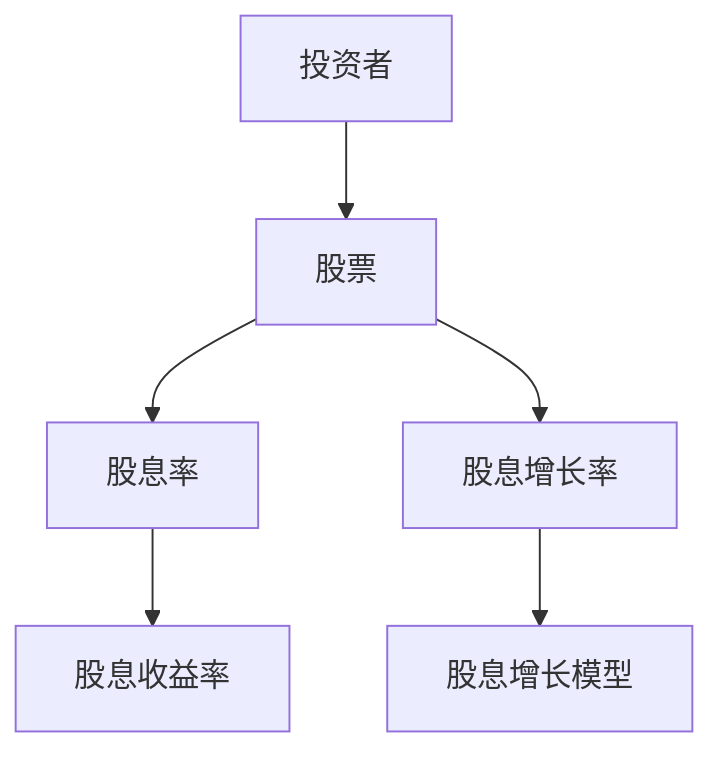

                 


# 巴菲特的股息增长策略：稳定现金流的长期价值

## 关键词：股息增长策略、巴菲特投资理念、现金流稳定、长期价值、股息收益率、股息增长模型、价值投资

## 摘要：巴菲特的股息增长策略是一种通过投资于能够持续增长股息的公司，以实现稳定现金流和长期价值的投资方法。本文从股息增长策略的背景、核心概念、算法原理、系统架构、项目实战等方面，详细阐述了该策略的理论基础和实际应用。通过数学模型、Mermaid图表和Python代码的结合，帮助读者深入理解股息增长策略的内在逻辑和操作方法。

---

## 第一部分：股息增长策略的背景与核心概念

### 第1章：股息增长策略的背景与定义

#### 1.1 股息增长策略的定义

- **1.1.1 股息增长策略的核心概念**  
  股息增长策略是指投资者选择那些能够持续增加股息支付的公司，通过长期持有这些股票来实现财富增长的一种投资策略。其核心在于股息的增长率，而非股息收益率本身。

- **1.1.2 股息增长策略与巴菲特投资理念的联系**  
  巴菲特倡导价值投资，注重企业的内在价值和长期盈利能力。股息增长策略与之契合，因为能够持续增长股息的公司通常具有稳定的盈利能力和发展前景。

- **1.1.3 股息增长策略的长期价值**  
  通过投资于股息增长稳定的公司，投资者可以获得稳定的现金流，抵御市场波动，实现财富的长期增值。

#### 1.2 股息增长策略的背景

- **1.2.1 股息投资的历史发展**  
  股息投资自股票市场诞生以来就备受关注，但股息增长策略作为一种系统化的投资方法，是在价值投资理论的基础上发展起来的。

- **1.2.2 股息增长策略在现代投资中的地位**  
  在现代投资组合理论中，股息增长策略被广泛应用于追求稳定收益和长期增长的投资者，尤其是机构投资者和个人投资者。

- **1.2.3 股息增长策略的适用场景**  
  适用于寻求稳定现金流的投资者，特别是那些希望在市场波动中保持投资组合稳定性的投资者。

#### 1.3 股息增长策略的核心要素

- **1.3.1 股息率的定义与计算**  
  股息率是衡量股票股息收入与股价之比的指标，计算公式为：股息率 = 年度股息 / 股票价格。

- **1.3.2 股息增长率的衡量标准**  
  股息增长率是指股息每年的增长速度，通常可以通过历史数据和公司盈利情况来预测。

- **1.3.3 股息增长策略的边界与外延**  
  股息增长策略不仅关注股息的增长，还关注公司的基本面和行业前景，确保股息增长的可持续性。

#### 1.4 股息增长策略与现金流的关系

- **1.4.1 现金流在股息增长策略中的作用**  
  稳定的现金流是股息增长的基础，公司必须有足够的现金流来支持股息的增长。

- **1.4.2 现金流稳定性对股息增长的影响**  
  现金流的稳定性直接影响公司的股息支付能力和增长潜力，现金流稳定的公司更可能持续增长股息。

- **1.4.3 股息增长策略如何实现现金流的长期稳定**  
  通过投资于现金流稳定且盈利持续增长的公司，股息增长策略能够帮助投资者实现现金流的长期稳定。

#### 1.5 本章小结

本章介绍了股息增长策略的定义、背景、核心要素以及与现金流的关系，为后续的分析奠定了基础。

---

### 第2章：股息增长策略的核心概念与联系

#### 2.1 股息增长模型的原理

- **2.1.1 股息增长模型的定义**  
  股息增长模型是一种用于评估股票内在价值的数学模型，假设股息将以恒定速率增长。

- **2.1.2 股息增长模型的公式推导**  
  $$ P = \frac{D_1}{k - g} $$
  其中，P为股票价值，D_1为下一年度的股息，k为折现率，g为股息增长率。

- **2.1.3 股息增长模型的适用条件**  
  适用于股息持续以恒定速度增长的公司，且折现率大于股息增长率。

#### 2.2 股息增长模型与股息收益率的对比

- **2.2.1 股息收益率的定义与计算**  
  股息收益率 = 年度股息 / 股票价格，仅衡量股息收入与股价的比率，不考虑股息增长潜力。

- **2.2.2 股息增长模型与股息收益率的区别**  
  股息增长模型不仅考虑当前股息收益率，还考虑股息的未来增长潜力，因此能够更全面地评估股票的内在价值。

- **2.2.3 股息增长模型在实际投资中的应用**  
  通过股息增长模型，投资者可以估算股票的内在价值，帮助判断股票是否被低估或高估。

#### 2.3 股息增长模型的ER实体关系图



#### 2.4 本章小结

本章分析了股息增长模型的原理及其与股息收益率的关系，强调了股息增长模型在评估股票价值中的重要性。

---

### 第3章：股息增长模型的算法原理

#### 3.1 股息增长模型的数学公式

- **公式推导**  
  $$ P = \frac{D_1}{k - g} $$
  其中，D_1 = D_0 × (1 + g)，D_0为当前股息，g为股息增长率，k为折现率。

- **案例分析**  
  假设某公司当前股息为$1，股息增长率g=5%，折现率k=10%。则D_1 = $1 × 1.05 = $1.05，股票价值P = $1.05 / (0.10 - 0.05) = $21。

#### 3.2 股息增长模型的Python实现

```python
def dividend_growth_model(D0, g, k):
    D1 = D0 * (1 + g)
    P = D1 / (k - g)
    return P

# 示例计算
D0 = 1  # 当前股息
g = 0.05  # 股息增长率
k = 0.10  # 折现率
P = dividend_growth_model(D0, g, k)
print(f"股票价值为：{P}")
```

#### 3.3 股息增长模型的应用场景

- **稳定增长的公司**：适用于股息持续稳定增长的公司。
- **估值判断**：帮助投资者判断股票是否被低估或高估。

#### 3.4 本章小结

本章通过数学公式和Python代码，详细讲解了股息增长模型的算法原理及其应用。

---

### 第4章：股息增长策略的系统分析与架构设计方案

#### 4.1 问题场景介绍

- **投资目标**：通过股息增长策略实现稳定现金流和长期价值。
- **问题描述**：如何筛选出股息增长稳定、具有长期增长潜力的公司。

#### 4.2 系统功能设计

- **领域模型**  
  ```mermaid
  classDiagram
      class 投资者 {
          资金
          投资组合
      }
      class 股票 {
          股票代码
          股息率
          股息增长率
      }
      class 系统 {
          输入：股票代码
          输出：股票价值
      }
      投资者 --> 系统
      系统 --> 股票
  ```

- **系统架构**  
  ```mermaid
  architecture
      客户端 --> 系统
      系统 --> 数据库
      数据库 --> 股票数据
  ```

- **系统接口设计**  
  - 输入：股票代码、股息率、股息增长率、折现率。
  - 输出：股票价值。

#### 4.3 系统交互设计

- **流程图**  
  ```mermaid
  sequenceDiagram
      投资者 -> 系统: 提供股票代码
      系统 -> 数据库: 查询股票数据
      数据库 -> 系统: 返回股票数据
      系统 -> 投资者: 返回股票价值
  ```

#### 4.4 本章小结

本章通过系统架构和交互设计，展示了如何利用股息增长策略构建一个投资系统。

---

### 第5章：股息增长策略的项目实战

#### 5.1 环境安装

- **Python环境**：安装Python和必要的库（如numpy、pandas）。
- **数据来源**：获取股票数据（如股息率、股息增长率）。

#### 5.2 核心代码实现

```python
import pandas as pd

# 数据加载
data = pd.read_csv('stock_data.csv')

# 计算股息增长率
data['股息增长率'] = (data['股息'] / data['股价'].shift(1)) - 1

# 应用股息增长模型
data['股票价值'] = data.apply(lambda row: dividend_growth_model(row['股息'], row['股息增长率'], 0.10), axis=1)
```

#### 5.3 案例分析

- **案例1**：某公司股息率为4%，股息增长率为3%，折现率10%。计算股票价值。
- **案例2**：比较两只股票的股息增长率和股票价值，选择更有潜力的投资标的。

#### 5.4 本章小结

本章通过实际案例分析，展示了如何将股息增长策略应用于实际投资决策。

---

### 第6章：最佳实践与注意事项

#### 6.1 最佳实践

- **持续学习**：关注公司基本面和行业动态，及时调整投资组合。
- **分散投资**：避免过度集中，降低风险。
- **长期持有**：股息增长策略需要长期持有，避免频繁交易。

#### 6.2 小结

股息增长策略是一种有效的投资方法，但需要结合市场环境和公司基本面进行综合判断。

#### 6.3 注意事项

- 避免仅依赖股息增长模型，忽视其他风险因素。
- 定期评估投资组合，及时调整。

#### 6.4 拓展阅读

- 巴菲特的《聪明的投资者》
- 股息增长策略的经典文献

---

## 作者：AI天才研究院/AI Genius Institute & 禅与计算机程序设计艺术 /Zen And The Art of Computer Programming

---

**以上为完整目录大纲和文章结构。接下来，您可以根据上述结构，逐步撰写每部分内容，确保每个章节和小节都详细展开，提供具体的分析和实例。**

