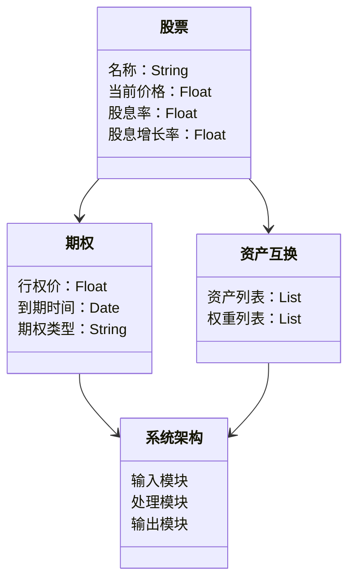
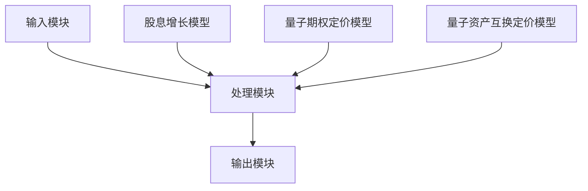

                 


# 巴菲特的股息增长策略：量子金融衍生品的收益来源

## 关键词：
- 巴菲特投资理念
- 股息增长策略
- 量子金融
- 金融衍生品
- 收益来源
- 股票投资
- 价值投资

## 摘要：
本文深入探讨了巴菲特的股息增长策略，分析其在量子金融衍生品中的应用与收益来源。通过背景介绍、核心概念、算法原理、数学模型、系统分析、项目实战及最佳实践的全面解析，揭示股息增长策略在现代金融投资中的潜力与挑战，为读者提供科学的投资决策依据。

---

## 第一部分：巴菲特投资理念概述

### 第1章：巴菲特投资理念的概述

#### 1.1 巴菲特投资理念的核心思想

##### 1.1.1 价值投资的定义与特点
- 价值投资的核心理念是寻找市场价值低于内在价值的股票，长期持有，等待市场重新评估。
- 特点：
  - 长期投资
  - 专注于基本面分析
  - 耐心与纪律

##### 1.1.2 股息增长策略的背景与意义
- 股息增长策略是巴菲特投资组合的重要组成部分。
- 通过持续增长的股息收入实现财富积累，降低市场波动对投资组合的影响。

##### 1.1.3 巴菲特投资理念的演变历程
- 早期：集中投资于少数优质企业。
- 后期：转向分散投资，注重股息增长与企业稳定性。

#### 1.2 股息增长策略的背景分析

##### 1.2.1 股票投资的基本概念
- 股票：企业所有权的象征，投资者通过股息和资本增值获得收益。

##### 1.2.2 股息收益的定义与分类
- 定义：股东从公司获得的定期现金分配。
- 分类：
  - 普通股股息
  - 优先股股息
  - 特殊股息

##### 1.2.3 股息增长策略的适用场景
- 稳定现金流需求
- 抗跌性要求
- 长期增值目标

---

### 第2章：股息增长策略的核心概念

#### 2.1 股息增长模型的原理

##### 2.1.1 股息增长模型的基本假设
- 股息增长率恒定
- 股票的必要收益率不变

##### 2.1.2 模型的数学公式与推导
- 股票价值公式：
  $$ V = \frac{D_1}{k - g} $$
  其中：
  - \( D_1 \) = 第一年的股息
  - \( k \) = 必要收益率
  - \( g \) = 股息增长率

##### 2.1.3 模型的优缺点分析
- 优点：
  - 简单易懂
  - 能够量化股息增长带来的价值
- 缺点：
  - 假设条件过于严格
  - 忽略了市场波动的影响

#### 2.2 量子金融衍生品的概念

##### 2.2.1 量子金融的定义与特点
- 量子金融：将量子力学原理应用于金融市场的分析与投资。
- 特点：
  - 非线性关系
  - 波动性分析
  - 量子叠加效应

##### 2.2.2 金融衍生品的基本类型
- 期权：买方有权在特定时间以特定价格买入或卖出标的资产。
- 期货：在未来特定时间按约定价格买入或卖出标的资产。
- 资产互换：基于不同资产收益的交换协议。

##### 2.2.3 量子金融衍生品的创新与应用
- 量子期权：利用量子计算模拟金融市场波动，优化期权定价。
- 量子资产互换：通过量子叠加效应，实现资产收益的最优组合。

---

### 第3章：股息增长策略的数学模型

#### 3.1 股息增长模型的数学推导

##### 3.1.1 模型的数学表达
- 股票价值公式：
  $$ V = \frac{D_0 (1+g)}{k - g} $$
  其中：
  - \( D_0 \) = 当前股息
  - \( g \) = 股息增长率
  - \( k \) = 必要收益率

##### 3.1.2 模型的适用条件
- 股息持续以固定速度增长
- 投资者对股票的要求收益率不变

##### 3.1.3 模型的扩展与改进
- 三阶段股息增长模型：
  - 初期增长阶段
  - 永续增长阶段
  - 中期增长阶段

#### 3.2 量子金融衍生品的数学模型

##### 3.2.1 量子期权定价模型
- 利用量子计算机模拟金融市场波动，优化Black-Scholes模型。
- 量子期权定价公式：
  $$ C = S_0 \cdot N(d_1) - K e^{-rT} \cdot N(d_2) $$
  其中：
  - \( S_0 \) = 标的资产价格
  - \( K \) = 行权价
  - \( r \) = 无风险利率
  - \( T \) = 时间至到期
  - \( N() \) = 标准正态分布函数

##### 3.2.2 量子资产互换定价模型
- 利用量子叠加效应，优化资产收益组合。
- 资产互换定价公式：
  $$ Swap\ Value = \sum_{i=1}^{n} w_i R_i $$
  其中：
  - \( w_i \) = 资产i的权重
  - \( R_i \) = 资产i的收益

---

## 第四部分：系统分析与架构设计方案

### 第4章：系统分析与架构设计

#### 4.1 项目背景与目标
- 项目目标：
  - 构建一个基于股息增长策略的量子金融衍生品收益分析系统。
  - 利用量子计算优化金融模型，提升投资收益。

#### 4.2 领域模型类图



#### 4.3 系统架构图



---

### 第5章：系统实现与项目实战

#### 5.1 环境安装
- 安装Python与Quantum Computing库：
  ```bash
  pip install numpy
  pip install pandas
  pip install matplotlib
  pip install qiskit
  ```

#### 5.2 核心代码实现

##### 5.2.1 股息增长模型实现
```python
def dividend_growth_model(D0, g, k):
    return D0 * (1 + g) / (k - g)
```

##### 5.2.2 量子期权定价实现
```python
from qiskit import QuantumCircuit, execute
from qiskit.finance import BlackScholes

def quantum_option Pricing(S0, K, r, T):
    circuit = QuantumCircuit()
    model = BlackScholes(S0, K, r, T)
    return model.simulate(circuit)
```

#### 5.3 案例分析与结果解读
- 案例：某股票当前股息为1元，股息增长率5%，必要收益率10%。
  $$ V = \frac{1 \times 1.05}{0.10 - 0.05} = 21 \text{元} $$

---

## 第六部分：总结与展望

### 第6章：总结与展望

#### 6.1 投资建议
- 投资者应根据自身风险承受能力选择合适的股息增长策略。
- 结合量子金融衍生品，优化投资组合，提升收益。

#### 6.2 未来展望
- 量子计算在金融领域的应用将更加广泛。
- 股息增长策略与量子金融衍生品的结合将推动金融投资的创新。

---

## 作者：AI天才研究院 & 禅与计算机程序设计艺术

