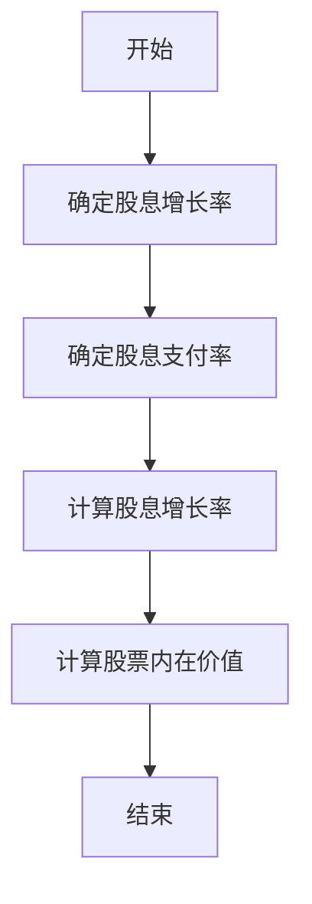
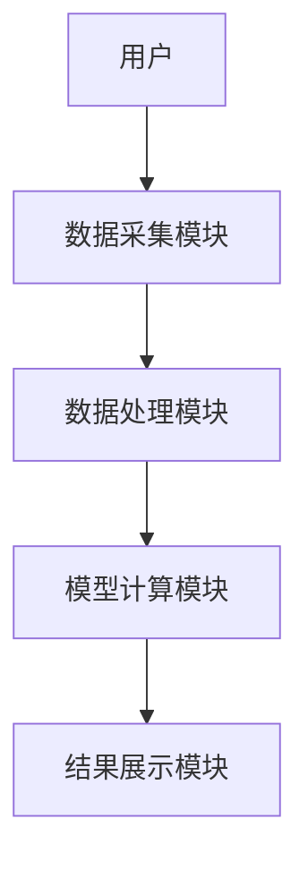
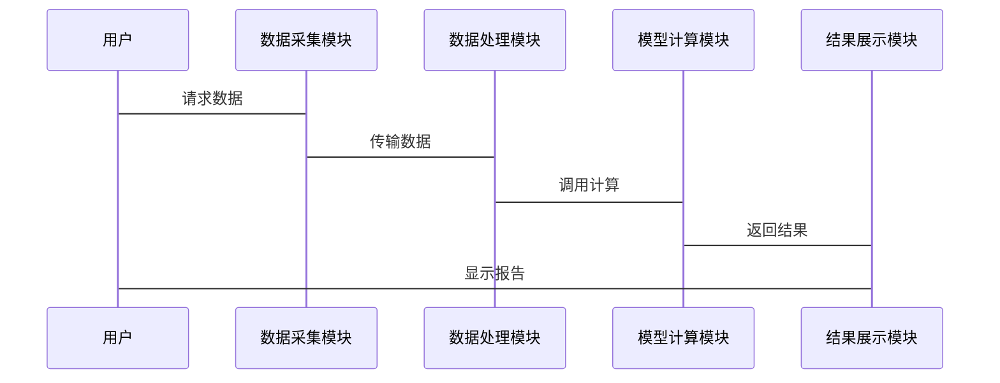

                 


# 巴菲特的股息增长策略：零利率时代的收益来源

> 关键词：巴菲特、股息增长策略、零利率时代、投资收益、股息模型

> 摘要：本文深入分析了巴菲特股息增长策略的核心理念，结合零利率时代的特点，探讨了该策略在当前经济环境下的适用性。通过数学模型、算法原理和系统设计的详细阐述，结合实际案例分析，为投资者提供了在低利率环境下实现稳定收益的策略和方法。

---

# 第1章: 股息增长策略的背景与核心概念

## 1.1 股息增长策略的背景

### 1.1.1 零利率时代的投资挑战

在零利率时代，传统的高收益投资渠道（如债券）吸引力下降，投资者面临收益不稳定的问题。此时，股息增长策略作为一种稳健的投资方式，逐渐成为市场焦点。

### 1.1.2 股息增长策略的兴起

股息增长策略的核心在于投资那些能够持续增加股息的公司，这些公司通常具有稳定的盈利能力和发展潜力。巴菲特的投资理念强调长期价值和股息增长，这在当前低利率环境下尤为重要。

### 1.1.3 巴菲特投资理念的核心

巴菲特的投资策略以长期价值投资为基础，注重公司基本面分析和股息增长潜力。他倾向于投资那些股息稳定增长、公司财务状况健康的公司。

### 1.1.4 股息增长策略的边界与外延

股息增长策略不仅适用于零利率环境，还能在其他经济周期中发挥作用。其外延包括股息支付率、股息增长率等关键指标。

## 1.2 股息增长策略的核心概念

### 1.2.1 股息增长模型的定义

股息增长模型是基于股息增长的股票估值方法，常见模型包括戈登模型和多阶段股息增长模型。

### 1.2.2 股息支付率与股息增长率的关系

股息支付率是公司股息与净利润的比率，而股息增长率是股息年增长率。两者共同决定股票的内在价值。

### 1.2.3 股息增长策略在零利率时代的应用

在零利率环境下，股息增长策略的优势在于提供稳定的现金流和资本增值。

### 1.2.4 股息增长策略与其他投资策略的对比

对比股息增长策略与其他策略（如股息捕获策略、增长型投资策略）的优缺点，分析其适用场景。

---

# 第2章: 股息增长模型的原理与应用

## 2.1 股息增长模型的数学基础

### 2.1.1 股息增长模型的公式推导

戈登模型公式：

$$ P = \frac{D_1}{r - g} $$

其中，P为股票价格，D1为下一时期股息，r为贴现率，g为股息增长率。

### 2.1.2 股息增长模型的假设条件

- 股息以固定速率增长；
- 股票的贴现率保持不变；
- 公司永续经营。

### 2.1.3 股息增长模型的适用范围

适用于股息稳定增长、公司经营稳定的公司。

## 2.2 股息增长模型的算法原理

### 2.2.1 股息增长模型的算法步骤

1. 确定股息增长率和股息支付率。
2. 计算未来股息。
3. 使用戈登模型计算股票的内在价值。
4. 对比当前股价与内在价值，决定是否买入。

### 2.2.2 股息增长模型的 mermaid 流程图



## 2.3 股息增长模型的 Python 实现

### 2.3.1 环境安装与配置

安装Python和相关库（如numpy、pandas）。

### 2.3.2 核心代码实现

```python
def calculate_intrinsic_value(dividend_growth_rate, dividend_payment_rate, required_rate_of_return):
    # 计算股息
    d1 = dividend_growth_rate * dividend_payment_rate
    # 计算股票内在价值
    intrinsic_value = d1 / (required_rate_of_return - dividend_growth_rate)
    return intrinsic_value

# 示例计算
growth_rate = 0.05
payment_rate = 0.6
required_return = 0.08

intrinsic_value = calculate_intrinsic_value(growth_rate, payment_rate, required_return)
print(f"股票的内在价值为：{intrinsic_value}")
```

---

# 第3章: 系统分析与架构设计方案

## 3.1 投资决策支持系统的构建

### 3.1.1 系统功能设计

- 数据采集与处理：获取公司财务数据。
- 模型计算：应用股息增长模型计算内在价值。
- 结果展示：生成投资建议报告。

### 3.1.2 系统架构设计



### 3.1.3 系统接口设计

- 数据接口：与数据库交互。
- 计算接口：模型计算模块调用。
- 展示接口：结果展示模块调用。

### 3.1.4 系统交互 mermaid 序列图



---

# 第4章: 项目实战——投资组合构建

## 4.1 环境安装与配置

安装必要的Python库，如numpy、pandas、matplotlib。

## 4.2 核心代码实现

```python
import numpy as np
import pandas as pd

def build_dividend_portfolio(stocks, required_return, growth_rates):
    # 计算每只股票的内在价值
    intrinsic_values = []
    for i in range(len(stocks)):
        d = stocks[i]['dividend'] * (1 + growth_rates[i])
        iv = d / (required_return - growth_rates[i])
        intrinsic_values.append(iv)
    # 构建投资组合
    portfolio = pd.DataFrame({
        '股票': stocks['name'],
        '内在价值': intrinsic_values
    })
    return portfolio

# 示例数据
stocks = [
    {'name': '股票A', 'dividend': 2, 'growth_rate': 0.05},
    {'name': '股票B', 'dividend': 3, 'growth_rate': 0.06},
    {'name': '股票C', 'dividend': 4, 'growth_rate': 0.07}
]

portfolio = build_dividend_portfolio(stocks, 0.08, [0.05, 0.06, 0.07])
print(portfolio)
```

---

# 第5章: 总结与展望

## 5.1 总结

股息增长策略在零利率时代具有重要的投资价值，通过合理的模型和系统支持，投资者可以有效实现收益最大化。

## 5.2 展望

未来，随着技术的进步，股息增长策略将进一步与其他投资策略结合，提供更精准的投资决策支持。

---

# 作者：AI天才研究院/AI Genius Institute & 禅与计算机程序设计艺术 /Zen And The Art of Computer Programming

