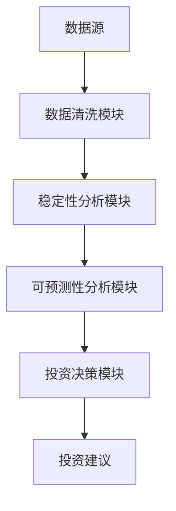

                 

<think>
好的，我将按照您的要求，以《巴菲特的行业选择标准：聚焦稳定性和可预测性》为标题，撰写一篇符合要求的技术博客文章。为了让文章结构更清晰，我会先列出文章的目录大纲，然后逐步展开每个部分的内容。

---

# 巴菲特的行业选择标准：聚焦稳定性和可预测性

> **关键词**：巴菲特、投资理念、行业选择标准、稳定性和可预测性、价值投资、长期投资、财务分析

> **摘要**：本文深入探讨了巴菲特的投资理念，特别是他在选择行业时的两大核心标准：稳定性和可预测性。通过分析巴菲特的核心投资策略、行业分析框架以及实际投资案例，文章揭示了如何利用这些标准来选择具有长期增长潜力的行业和企业。文章还结合技术语言和实际操作案例，详细解读了巴菲特的投资逻辑，并提供了可操作的建议。

---

## 第一部分：背景介绍

### 第1章：巴菲特的投资理念概述

#### 1.1 巴菲特的投资哲学

- **1.1.1 价值投资的定义与核心理念**
  - 价值投资的定义：寻找市场定价低于其内在价值的股票。
  - 核心理念：买入并持有优质资产，等待其价值回归。

- **1.1.2 巴菲特的价值投资体系**
  - 长期投资：关注企业的长期价值，而非短期市场波动。
  - 安全边际：买入价格低于企业内在价值，以降低风险。

- **1.1.3 巴菲特投资理念的演变**
  - 早期投资：集中于廉价股票。
  - 成熟投资：转向具有强大竞争优势的企业。

#### 1.2 巴菲特的行业选择标准

- **1.2.1 稳定性和可预测性的定义**
  - 稳定性：行业在经济周期中的波动较小，企业收入和利润较为稳定。
  - 可预测性：行业未来的发展趋势和企业业绩可以合理预测。

- **1.2.2 巴菲特对行业稳定性的关注**
  - 避免周期性较强的行业，如制造业和建筑业。
  - 偏好公用事业、消费品和金融等相对稳定的行业。

- **1.2.3 可预测性在投资中的重要性**
  - 通过分析行业趋势和企业财务数据，降低投资的不确定性。

---

## 第二部分：核心概念与联系

### 第2章：巴菲特的行业分析框架

#### 2.1 行业稳定性的评估标准

- **2.1.1 行业周期性的影响**
  - 行业生命周期：衰退期、成熟期和成长期。
  - 周期性行业的波动性对稳定性的影响。

- **2.1.2 行业的竞争结构分析**
  - 市场集中度：高集中度行业更稳定。
  - 竞争格局：寡头垄断行业更具优势。

- **2.1.3 行业政策环境的影响**
  - 政策稳定性：政策变化对企业的影响。
  - 政府补贴和税收政策对行业稳定性的作用。

#### 2.2 可预测性的分析方法

- **2.2.1 财务数据的可预测性**
  - 财务报表分析：利润表、资产负债表和现金流量表。
  - 财务指标的预测：ROE、ROA和净利润增长率。

- **2.2.2 行业趋势的可预测性**
  - 行业增长趋势：技术进步、消费升级和政策支持。
  - 行业周期分析：行业处于上升期或成熟期的判断。

- **2.2.3 管理层决策的可预测性**
  - 管理层的稳定性：高管团队的稳定性。
  - 管理层的战略决策：企业未来发展方向的判断。

---

## 第三部分：算法原理讲解

### 第3章：巴菲特的行业分析算法

#### 3.1 稳定性和可预测性评估算法

- **3.1.1 算法流程**
  1. 数据收集：收集目标行业的历史财务数据和行业报告。
  2. 行业稳定性评估：计算波动率和相关指标。
  3. 可预测性评估：分析行业趋势和企业财务指标。
  4. 综合评分：根据稳定性与可预测性的得分，综合评估行业。

- **3.1.2 算法实现**
  - 使用Python编写数据分析脚本，读取财务数据并计算波动率和预测指标。

```python
import pandas as pd
import numpy as np

# 示例代码：计算行业波动率
def calculate_fluctuation(data):
    return data.std() / data.mean()

# 示例代码：预测未来利润增长率
def predict_growth_rate(data, period=5):
    return data['净利润增长率'].rolling(period).mean()

# 示例代码：综合评分
def综合评分(stability_score, predictability_score):
    return (stability_score + predictability_score) / 2
```

---

## 第四部分：数学模型与公式

### 第4章：巴菲特的数学模型与公式

#### 4.1 稳定性评估公式

$$
\text{稳定性评分} = \frac{\text{收入波动率} + \text{利润波动率}}{2}
$$

其中：
- 收入波动率 = 标准差 / 平均收入
- 利润波动率 = 标准差 / 平均利润

#### 4.2 可预测性评估公式

$$
\text{可预测性评分} = \frac{\text{ROE增长率} + \text{ROA增长率}}{2}
$$

其中：
- ROE = 净利润 / 净资产
- ROA = 净利润 / 总资产

---

## 第五部分：系统分析与架构设计

### 第5章：巴菲特行业分析系统的架构设计

#### 5.1 系统功能设计

- **5.1.1 数据收集模块**
  - 数据来源：行业报告、财务报表、市场数据。
  - 数据清洗：处理缺失值和异常值。

- **5.1.2 分析模块**
  - 稳定性分析：计算波动率和相关指标。
  - 可预测性分析：预测未来增长趋势。

- **5.1.3 投资决策模块**
  - 综合评分：根据稳定性与可预测性评分，生成投资建议。

#### 5.2 系统架构设计



---

## 第六部分：项目实战

### 第6章：基于巴菲特标准的行业分析实战

#### 6.1 实战环境与工具

- **6.1.1 环境安装**
  - 安装Python、Pandas和Matplotlib。

- **6.1.2 数据收集**
  - 收集某行业的历史财务数据和行业报告。

#### 6.2 实战代码实现

```python
import pandas as pd
import matplotlib.pyplot as plt

# 示例代码：读取财务数据
data = pd.read_csv('industry_financial.csv')

# 示例代码：计算稳定性评分
stability_score = calculate_fluctuation(data['收入']) + calculate_fluctuation(data['利润'])

# 示例代码：计算可预测性评分
predictability_score = predict_growth_rate(data['ROE']) + predict_growth_rate(data['ROA'])

# 示例代码：绘制稳定性评分分布图
plt.hist(stability_score, bins=10)
plt.title('稳定性评分分布')
plt.show()
```

---

## 第七部分：总结与展望

### 第7章：巴菲特投资理念的总结与展望

#### 7.1 总结

- 巴菲特的投资理念以稳定性与可预测性为核心，通过长期持有优质资产实现财富增长。
- 价值投资要求投资者深入分析行业和企业的基本面，寻找具有长期竞争优势的企业。

#### 7.2 展望

- 结合现代技术，如大数据和人工智能，优化行业分析和预测模型。
- 进一步研究巴菲特投资理念在新兴行业中的应用。

---

## 作者：AI天才研究院 & 禅与计算机程序设计艺术

---

这篇文章通过系统的分析和实战案例，详细解读了巴菲特的行业选择标准，为读者提供了从理论到实践的完整指导。

