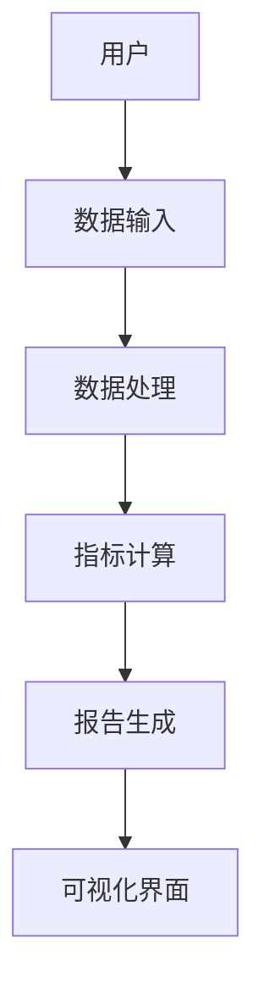

                 

# 巴菲特的财务分析技巧：解读财报的关键指标

## 关键词：巴菲特、财务分析、财报指标、投资技巧、价值投资、财务报表、投资策略

## 摘要：本文通过巴菲特的视角，解读财务报表的关键指标，帮助读者掌握价值投资的方法。文章详细分析了利润表、资产负债表和现金流量表的核心指标，并结合实际案例，展示了如何通过这些指标评估企业的财务健康状况和投资价值。通过本文，读者将能够理解巴菲特的财务分析技巧，并在实际投资中加以应用。

---

# 第一部分：背景介绍

## # 第1章：财务分析的重要性与巴菲特的方法

### ## 1.1 财务分析的核心概念

#### ### 1.1.1 财务报表的基本构成

财务报表是企业财务状况的总结，主要包括三大部分：利润表、资产负债表和现金流量表。

- **利润表**：反映企业在一定时期内的收入和支出情况，计算净利润。
- **资产负债表**：反映企业在某一特定时点的资产、负债和所有者权益的状况。
- **现金流量表**：反映企业在一定时期内的现金流入和流出情况，分为经营活动、投资活动和筹资活动三部分。

#### ### 1.1.2 巴菲特的财务分析方法

巴菲特的财务分析方法以“价值投资”为核心，注重企业的基本面分析。他通过分析财务报表，寻找那些具有持续竞争优势、良好管理和稳定盈利的企业。

- **价值投资**：寻找市场价格低于内在价值的企业进行投资。
- **长期视角**：关注企业的长期盈利能力，而非短期市场波动。
- **安全边际**：通过分析财务指标，寻找具有安全边际的投资标的。

#### ### 1.1.3 财务分析的目标与意义

财务分析的目标是通过解读财务报表，评估企业的财务健康状况、盈利能力和成长潜力，从而为投资决策提供依据。对于巴菲特来说，财务分析不仅是投资决策的基础，更是发现优质企业的关键。

---

### ## 1.2 巴菲特财务分析的独特视角

#### ### 1.2.1 价值投资的定义与特点

价值投资是一种投资策略，通过寻找市场价格低于内在价值的企业进行投资。其特点包括：

- **注重内在价值**：分析企业的基本面，寻找具有持续盈利能力和竞争优势的企业。
- **长期视角**：关注企业的长期价值，而非短期市场波动。
- **安全边际**：通过分析财务指标，寻找具有安全边际的投资标的。

#### ### 1.2.2 巴菲特的“三圈投资法”解析

巴菲特的“三圈投资法”是指：

1. **行业分析**：选择具有持续增长潜力的行业。
2. **竞争优势分析**：寻找具有竞争优势的企业。
3. **财务分析**：通过财务报表分析，评估企业的财务健康状况和盈利能力。

#### ### 1.2.3 财务报表分析在价值投资中的地位

财务报表分析是价值投资的核心步骤之一。通过分析财务报表，巴菲特能够评估企业的财务健康状况、盈利能力和成长潜力，从而发现具有投资价值的企业。

---

## # 第2章：财务报表的关键指标分析

### ## 2.1 利润表分析

#### ### 2.1.1 净利润的计算与解读

净利润是企业一定时期内的最终利润，计算公式为：

$$
净利润 = 营业收入 - 营业成本 - 费用 - 税费
$$

净利润是衡量企业盈利能力的重要指标，也是巴菲特分析企业财务状况的重要依据。

#### ### 2.1.2 营业收入与成本的分析

营业收入是企业从日常经营活动中获得的收入，是财务报表中最重要的指标之一。分析营业收入的增长情况，可以评估企业的市场竞争力和成长潜力。

#### ### 2.1.3 毛利率与净利率的计算

毛利率是衡量企业盈利能力的重要指标，计算公式为：

$$
毛利率 = (营业收入 - 营业成本) / 营业收入
$$

净利率是衡量企业净利润与营业收入的比例，计算公式为：

$$
净利率 = 净利润 / 营业收入
$$

---

#### ### 2.2 资产负债表分析

#### ### 2.2.1 资产、负债与所有者权益的构成

资产负债表反映了企业在某一特定时点的资产、负债和所有者权益的状况。资产包括流动资产和非流动资产，负债包括流动负债和非流动负债，所有者权益包括股本、资本公积、盈余公积等。

#### ### 2.2.2 资产负债率的计算与意义

资产负债率是衡量企业财务杠杆的重要指标，计算公式为：

$$
资产负债率 = 负债总额 / 资产总额
$$

资产负债率越高，说明企业的财务杠杆越高，财务风险也越大。

#### ### 2.2.3 存货周转率与应收账款周转率的分析

存货周转率是衡量企业存货管理效率的重要指标，计算公式为：

$$
存货周转率 = 营业成本 / 平均存货
$$

应收账款周转率是衡量企业应收账款管理效率的重要指标，计算公式为：

$$
应收账款周转率 = 营业收入 / 平均应收账款
$$

---

#### ### 2.3 现金流量表分析

#### ### 2.3.1 经营活动、投资活动与筹资活动的现金流分析

现金流量表反映了企业在一定时期内的现金流入和流出情况，分为经营活动、投资活动和筹资活动三部分。

#### ### 2.3.2 自由现金流的计算与意义

自由现金流是衡量企业财务健康状况的重要指标，计算公式为：

$$
自由现金流 = 净利润 - 投资活动现金流
$$

自由现金流越高，说明企业的财务状况越健康，越有能力进行再投资。

#### ### 2.3.3 现金流量表与财务健康状况的关系

现金流量表是评估企业财务健康状况的重要工具。通过分析现金流入和流出情况，可以评估企业的现金流健康状况和财务弹性。

---

## # 第3章：财务指标的综合分析

### ## 3.1 关键指标的综合运用

#### ### 3.1.1 ROE（净资产收益率）的计算与解读

净资产收益率是衡量企业盈利能力的重要指标，计算公式为：

$$
ROE = 净利润 / 平均净资产
$$

ROE越高，说明企业的净资产收益率越高，盈利能力越强。

#### ### 3.1.2 ROA（资产净利率）的计算与意义

资产净利率是衡量企业资产利用效率的重要指标，计算公式为：

$$
ROA = 净利润 / 平均总资产
$$

ROA越高，说明企业的资产利用效率越高。

#### ### 3.1.3 ROI（投资回报率）的计算与应用

投资回报率是衡量投资收益与投资成本的比率，计算公式为：

$$
ROI = 净利润 / 投资成本
$$

ROI越高，说明投资回报率越高。

---

### ## 3.2 财务指标与企业价值的关系

#### ### 3.2.1 企业价值的定义与计算

企业价值是衡量企业整体价值的重要指标，计算公式为：

$$
企业价值 = 净利润 + 非经营性资产价值 + 负债价值
$$

#### ### 3.2.2 财务指标在企业价值评估中的作用

财务指标是评估企业价值的重要工具。通过分析ROE、ROA、ROI等指标，可以评估企业的盈利能力、资产利用效率和投资回报率，从而判断企业的整体价值。

#### ### 3.2.3 巴菲特的企业价值评估方法

巴菲特通过分析企业的财务报表，评估企业的内在价值。他注重企业的长期盈利能力、竞争优势和财务健康状况，寻找具有安全边际的投资标的。

---

## # 第4章：数学模型与公式

### ## 4.1 财务指标的数学模型

#### ### 4.1.1 净利润的计算

$$
净利润 = 营业收入 - 营业成本 - 费用 - 税费
$$

#### ### 4.1.2 净资产收益率的计算

$$
ROE = 净利润 / 平均净资产
$$

#### ### 4.1.3 资产净利率的计算

$$
ROA = 净利润 / 平均总资产
$$

---

### ## 4.2 财务指标的对比分析

#### ### 4.2.1 ROE与ROA的对比

| 指标 | 公式 | 含义 |
|------|------|------|
| ROE | 净利润 / 平均净资产 | 衡量净资产的盈利能力 |
| ROA | 净利润 / 平均总资产 | 衡量资产的利用效率 |

#### ### 4.2.2 自由现金流与净利润的对比

| 指标 | 含义 |
|------|------|
| 净利润 | 营业收入减去成本、费用和税费后的利润 |
| 自由现金流 | 净利润减去投资活动现金流 |

---

## # 第5章：系统分析与架构设计方案

### ## 5.1 问题场景介绍

通过分析财务报表，评估企业的财务健康状况和投资价值。系统需要能够自动计算关键财务指标，生成分析报告，并提供可视化界面。

---

### ## 5.2 系统功能设计

- **数据输入**：用户输入财务数据，包括利润表、资产负债表和现金流量表。
- **指标计算**：系统自动计算关键财务指标，包括ROE、ROA、ROI等。
- **报告生成**：系统生成分析报告，包括指标对比、趋势分析和投资建议。

---

### ## 5.3 系统架构设计

---

## # 第6章：项目实战

### ## 6.1 案例分析

选择一家企业，分析其财务报表，计算关键财务指标，评估其财务健康状况和投资价值。

---

### ## 6.2 分析过程

1. **数据收集**：收集企业的财务报表数据。
2. **指标计算**：计算ROE、ROA、ROI等指标。
3. **趋势分析**：分析指标的变化趋势。
4. **投资建议**：根据分析结果，提出投资建议。

---

## # 第7章：最佳实践与小结

### ## 7.1 巴菲特的财务分析技巧

- **注重内在价值**：分析企业的基本面，寻找具有持续竞争优势的企业。
- **长期视角**：关注企业的长期盈利能力，而非短期市场波动。
- **安全边际**：通过分析财务指标，寻找具有安全边际的投资标的。

### ## 7.2 投资建议

- **持续学习**：关注企业的财务报表，分析关键指标。
- **保持谨慎**：避免盲目跟风，注重风险控制。
- **关注长期价值**：寻找具有持续竞争优势的企业，长期持有。

---

## 作者：AI天才研究院 & 禅与计算机程序设计艺术

---

通过本文，读者可以掌握巴菲特的财务分析技巧，学会如何通过解读财务报表的关键指标，评估企业的财务健康状况和投资价值。希望本文能够帮助读者在投资领域取得更好的成绩。

