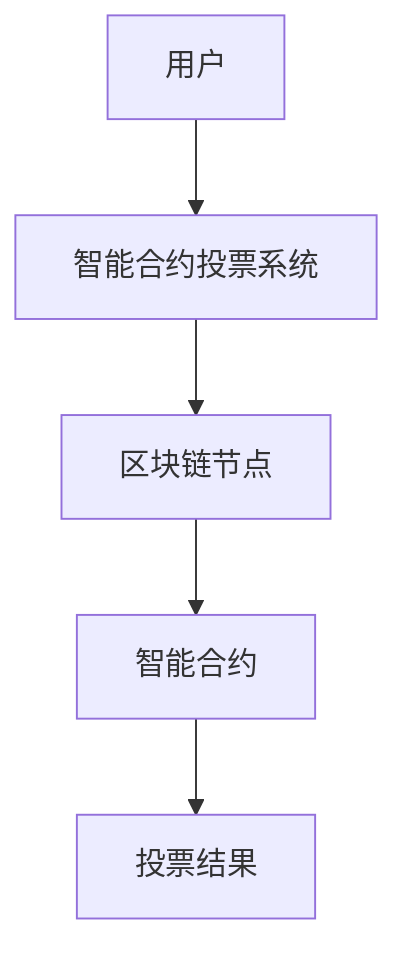

                 


# 巴菲特的资产负债表分析：智能合约对公司治理的影响

## 关键词
智能合约, 公司治理, 区块链技术, 巴菲特, 资产负债表分析

## 摘要
本文探讨了智能合约如何影响公司治理，并结合巴菲特的资产负债表分析方法，分析智能合约在股权管理、股东大会投票等场景中的应用，揭示其对现代企业治理模式的深远影响。

---

# 第1章: 巴菲特的资产负债表分析方法

## 1.1 资产负债表的基本概念

### 1.1.1 资产负债表的定义与作用
资产负债表是企业财务报表的重要组成部分，反映了企业在特定时点的资产、负债和所有者权益的状况。它不仅是评估企业财务健康状况的关键工具，也是投资者进行投资决策的重要依据。

### 1.1.2 巴菲特对资产负债表的重视
巴菲特以其独特的投资理念闻名，他非常重视企业的财务状况，尤其是资产负债表。他认为，企业的价值不仅体现在利润表上，更重要的是资产的质量和负债的结构。

### 1.1.3 资产负债表分析的核心要素
- 流动资产：包括现金、应收账款等，反映了企业的短期偿债能力。
- 非流动资产：包括固定资产、无形资产等，反映了企业的长期投资。
- 流动负债：包括应付账款、短期借款等，反映了企业的短期债务。
- 非流动负债：包括长期借款等，反映了企业的长期债务。

## 1.2 资产负债表的核心指标

### 1.2.1 流动资产与流动负债
流动资产与流动负债的比率反映了企业的短期偿债能力。流动比率和速动比率是常用的指标。

### 1.2.2 净资产收益率（ROE）
净资产收益率是衡量企业盈利能力的重要指标，反映了每单位净资产创造的净利润。

### 1.2.3 负债率与偿债能力
负债率反映了企业负债在资产中的比例，偿债能力则通过利息覆盖倍数等指标衡量。

## 1.3 巴菲特的资产负债表分析方法

### 1.3.1 从资产质量到企业价值
巴菲特关注企业的资产质量，尤其是固定资产和无形资产的价值，认为高质量的资产能够为企业创造持续的利润。

### 1.3.2 负债结构对企业治理的影响
负债结构直接影响企业的财务风险和管理决策。巴菲特倾向于选择负债较低的企业，以降低财务风险。

### 1.3.3 巴菲特投资策略中的资产负债表分析
巴菲特通过分析资产负债表，识别低估企业，评估其投资价值，做出投资决策。

---

# 第2章: 智能合约的核心概念与技术原理

## 2.1 智能合约的定义与特点

### 2.1.1 智能合约的定义
智能合约是一种自动执行的协议，通过区块链技术实现，无需中介参与，能够自动执行和强制执行合同条款。

### 2.1.2 智能合约的核心特点
- 自动化：智能合约自动执行预设的条件。
- 不可篡改性：部署在区块链上的智能合约难以被修改。
- 去中心化：智能合约运行在分布式账本上，避免单点故障。

### 2.1.3 智能合约与传统合同的区别
智能合约与传统合同的区别在于自动化执行和去中心化特点。

## 2.2 智能合约的技术实现

### 2.2.1 智能合约的运行环境
智能合约运行在区块链网络上，每个节点都维护一份完整的合约副本。

### 2.2.2 智能合约的编程语言
Solidity是区块链领域常用的智能合约编程语言，支持面向对象编程和智能合约的开发。

### 2.2.3 智能合约的执行机制
智能合约通过区块链的共识机制实现执行，每个交易被记录在区块链上，确保合约的透明性和不可篡改性。

## 2.3 智能合约的区块链架构

### 2.3.1 区块链的基本原理
区块链是一种分布式账本技术，通过共识机制确保数据的一致性和安全性。

### 2.3.2 智能合约与区块链的关系
智能合约是区块链上的应用程序，通过区块链实现去中心化和自动化执行。

### 2.3.3 智能合约的存储与执行
智能合约以字节码形式存储在区块链上，通过交易触发执行，每个交易被记录在区块链上。

---

# 第3章: 智能合约在公司治理中的应用

## 3.1 智能合约与公司治理的结合

### 3.1.1 智能合约在股权管理中的应用
智能合约可以用于股权分配和管理，确保股东权益的自动分配和记录。

### 3.1.2 智能合约在董事会决策中的作用
智能合约可以用于董事会决策的自动化执行，确保决策过程的透明和公正。

### 3.1.3 智能合约在公司治理中的优势
智能合约提高了公司治理的效率和透明度，减少了人为干预和欺诈风险。

## 3.2 智能合约在股东大会中的应用

### 3.2.1 智能合约投票系统的基本原理
智能合约投票系统通过区块链技术实现投票的透明和不可篡改，确保投票结果的公正性。

### 3.2.2 智能合约在股东大会中的实现
智能合约可以用于股东大会的投票系统，确保每个股东的投票权得到准确记录和执行。

### 3.2.3 智能合约投票系统的安全性
智能合约投票系统通过区块链技术确保投票的安全性，防止投票结果被篡改。

## 3.3 智能合约在公司治理中的潜在风险

### 3.3.1 智能合约的代码漏洞
智能合约的代码可能存在漏洞，一旦被利用，可能导致严重的财务损失。

### 3.3.2 智能合约的不可篡改性
智能合约的不可篡改性意味着一旦部署，很难进行修改，需要在开发阶段确保合约的正确性。

### 3.3.3 智能合约的法律与合规问题
智能合约的法律地位和合规性问题尚未完全解决，需要进一步的法律和政策支持。

---

# 第4章: 智能合约的算法原理与数学模型

## 4.1 智能合约的执行流程

### 4.1.1 合约的编译与部署
智能合约通过Solidity等编程语言编写，编译成字节码后部署在区块链上。

### 4.1.2 合约的调用与执行
智能合约通过交易触发执行，每个交易被记录在区块链上，确保合约的透明性和一致性。

### 4.1.3 合约的事件触发
智能合约可以根据预设条件触发事件，例如当某个条件满足时，自动执行相应的操作。

## 4.2 智能合约的共识机制

### 4.2.1 共识机制的基本原理
共识机制通过分布式网络达成一致，确保智能合约的执行结果被所有节点接受。

### 4.2.2 智能合约的共识算法
智能合约的共识算法包括工作量证明（PoW）、权益证明（PoS）等，确保合约的安全性和可靠性。

### 4.2.3 共识机制对智能合约的影响
共识机制直接影响智能合约的执行效率和安全性，是智能合约技术的核心组成部分。

## 4.3 智能合约的可编程性

### 4.3.1 智能合约的编程语言
Solidity是区块链领域常用的智能合约编程语言，支持复杂的逻辑和条件判断。

### 4.3.2 智能合约的事件和日志
智能合约可以通过事件和日志记录交易的详细信息，便于后续的审计和追踪。

### 4.3.3 智能合约的状态管理
智能合约通过区块链的状态树管理合约的状态，确保合约的状态一致性。

---

# 第5章: 项目实战——智能合约投票系统

## 5.1 项目介绍

### 5.1.1 项目背景
智能合约投票系统是一种基于区块链的投票系统，用于股东大会的投票管理。

### 5.1.2 项目目标
实现一个智能合约投票系统，确保投票的透明和不可篡改性。

## 5.2 系统功能设计

### 5.2.1 系统功能模块
- 用户注册与登录
- 投票发起与管理
- 投票结果查询
- 投票记录审计

### 5.2.2 系统功能流程
1. 用户注册并登录系统。
2. 投票发起者发起投票请求。
3. 参与投票的用户进行投票。
4. 投票结果自动统计并记录在区块链上。

## 5.3 系统架构设计

### 5.3.1 系统架构图


### 5.3.2 系统接口设计
- 用户接口：用于用户注册、登录和投票。
- 智能合约接口：用于智能合约的调用和执行。

## 5.4 项目实现

### 5.4.1 环境配置
- 安装Solidity编译器和区块链节点。
- 配置智能合约的开发环境。

### 5.4.2 智能合约实现
```solidity
// SPDX-License-Identifier: MIT
pragma solidity ^0.8.0;

contract VotingSystem {
    struct Voter {
        bool isRegistered;
        uint votes;
    }

    mapping(address => Voter) public voters;

    function register(address voter) public {
        voters[voter].isRegistered = true;
    }

    function vote(address voter) public {
        require(voters[voter].isRegistered, "Not registered");
        voters[voter].votes++;
    }

    function getVotes(address voter) public view returns (uint) {
        return voters[voter].votes;
    }
}
```

### 5.4.3 合约部署与测试
将智能合约部署到区块链上，并进行测试，确保合约的功能正常。

## 5.5 项目小结
智能合约投票系统通过区块链技术实现了投票的透明和不可篡改性，为公司治理提供了新的解决方案。

---

# 第6章: 智能合约在公司治理中的未来展望

## 6.1 智能合约的未来发展
智能合约技术将更加成熟，应用场景将更加广泛，推动企业治理的数字化转型。

## 6.2 智能合约的法律与合规挑战
智能合约的法律地位和合规性问题需要进一步解决，以确保其合法性和可操作性。

## 6.3 智能合约的技术挑战
智能合约的代码安全性和执行效率需要进一步优化，以应对复杂的应用场景。

---

# 第7章: 总结与建议

## 7.1 核心总结
智能合约作为一种新兴的技术，为公司治理提供了新的可能性，能够提高企业治理的透明度和效率。

## 7.2 实践建议
企业在采用智能合约前，需要进行充分的评估和规划，确保技术的可行性和合规性。

## 7.3 进一步阅读
推荐阅读《区块链入门到精通》和《智能合约开发实战》等书籍，深入了解智能合约的技术细节和应用场景。

---

# 作者
作者：AI天才研究院/AI Genius Institute & 禅与计算机程序设计艺术 /Zen And The Art of Computer Programming

