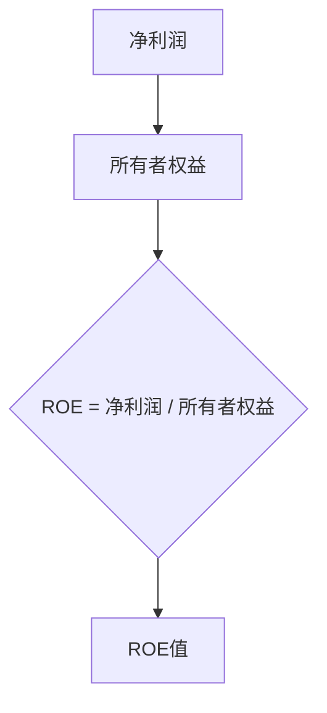
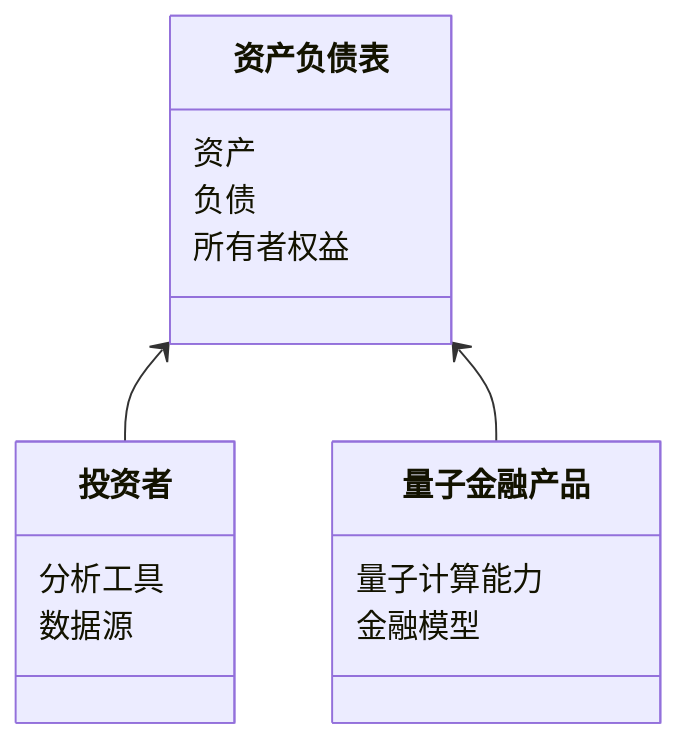
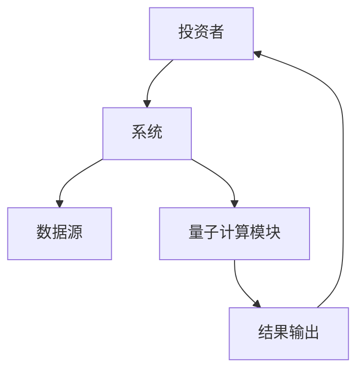

                 


# 巴菲特的资产负债表分析：量子金融产品对公司估值的新影响

> 关键词：巴菲特，资产负债表分析，量子金融产品，公司估值，投资策略

> 摘要：本文探讨了巴菲特的资产负债表分析方法及其在量子金融产品时代对公司估值的影响。通过分析传统与新兴金融工具的差异，结合现代技术手段，如Mermaid流程图和Python代码示例，详细阐述了如何在复杂金融市场中应用巴菲特的投资理念。

---

## 第一部分：背景介绍

### 第1章：巴菲特的生平与投资理念

#### 1.1 巴菲特的早年经历
沃伦·巴菲特（Warren Buffett）出生于1930年，是一位传奇投资者，被誉为“股神”。他在童年时期就展现出对数字的敏锐洞察力，并在高中时期开始投资股票。他的早期投资经历包括购买See’s Candy店和Knox Raiting Service，这些经历为他后来的投资哲学奠定了基础。

#### 1.2 巴菲特的投资哲学
巴菲特的投资理念以价值投资为核心，强调购买低于其内在价值的股票。他相信市场短期波动是不可预测的，但长期来看，股票的价格会回归其内在价值。以下是巴菲特投资哲学的几个关键点：
- **安全边际**：购买价格远低于内在价值的股票，以减少风险。
- **长期投资**：避免频繁交易，耐心持有优质资产。
- **企业基本面分析**：关注企业的盈利能力、财务健康状况和管理层质量。

#### 1.3 巴菲特的著作与影响力
巴菲特的著作《聪明的投资者》（The Intelligent Investor）是投资领域的经典之作。书中提出的“价值投资”理念影响了无数投资者，并成为现代金融理论的重要组成部分。

---

### 第2章：资产负债表分析的基本概念

#### 2.1 资产负债表的构成
资产负债表是反映企业在某一特定时期内财务状况的报表，主要包括资产、负债和所有者权益三个部分。

- **资产**：企业拥有的资源，包括流动资产（如现金、应收账款）和非流动资产（如固定资产、无形资产）。
- **负债**：企业欠款，包括流动负债（如应付账款、短期借款）和非流动负债（如长期借款）。
- **所有者权益**：企业净资产，等于资产减去负债。

#### 2.2 资产负债表分析的意义
通过分析资产负债表，投资者可以评估企业的财务健康状况，包括流动性、偿债能力、资本结构等。这些信息对于评估企业的内在价值至关重要。

---

## 第二部分：核心概念与联系

### 第3章：量子金融产品的定义与影响

#### 3.1 量子金融产品的定义
量子金融产品是一种基于量子计算和复杂数学模型的金融工具，通常涉及衍生品、期权、期货等。这些产品利用量子计算的强大能力，能够在极短时间内计算出大量可能的市场情景，从而优化投资组合和风险控制。

#### 3.2 量子金融产品与传统金融工具的对比
| 对比维度 | 传统金融工具 | 量子金融产品 |
|----------|---------------|---------------|
| 计算能力 | 基于经典计算 | 基于量子计算 |
| 风险评估 | 简单模型 | 复杂模型 |
| 交易速度 | 较慢 | 极快 |

#### 3.3 量子金融产品对资产负债表分析的影响
量子金融产品通过复杂算法优化投资组合，能够更精确地评估企业的内在价值。这使得传统的资产负债表分析方法需要结合量子计算技术进行改进。

---

### 第4章：资产负债表分析的核心要素

#### 4.1 资产分析
- **流动资产**：现金及现金等价物、应收账款、存货。
- **非流动资产**：固定资产、无形资产、长期投资。

#### 4.2 负债分析
- **流动负债**：应付账款、短期借款、应付工资。
- **非流动负债**：长期借款、债券发行。

#### 4.3 所有者权益分析
- **股本**：普通股和优先股。
- ** retained earnings：累计利润。

---

## 第三部分：算法原理

### 第5章：巴菲特的ROE分析法

#### 5.1 ROE的定义与计算
ROE（净资产收益率）= 净利润 / 所有者权益

通过计算ROE，投资者可以评估企业的盈利能力。巴菲特认为，ROE是衡量企业盈利能力的重要指标。

#### 5.2 ROE计算流程（Mermaid流程图）


#### 5.3 Python代码实现
```python
def calculate_roe(net_profit, equity):
    return net_profit / equity

# 示例
net_profit = 1000000  # 净利润
equity = 5000000      # 所有者权益
rof = calculate_roe(net_profit, equity)
print(f"ROE = {rof}")
```

---

## 第四部分：系统分析与架构设计

### 第6章：系统架构设计

#### 6.1 领域模型（Mermaid类图）


#### 6.2 系统架构图


---

## 第五部分：项目实战

### 第7章：苹果公司资产负债表分析

#### 7.1 实验环境
- Python 3.9
- Jupyter Notebook
- 数据来源：苹果公司2022年年报

#### 7.2 代码实现
```python
import pandas as pd

# 假设我们从苹果公司年报中提取了以下数据
data = {
    '流动资产': [95000],
    '非流动资产': [150000],
    '流动负债': [50000],
    '非流动负债': [80000],
    '所有者权益': [220000]
}

df = pd.DataFrame(data)

# 计算ROE
net_profit = 120000  # 假设净利润为120,000美元
equity = df.loc[0, '所有者权益']
rof = net_profit / equity

print(f"ROE = {rof}")
```

#### 7.3 分析与解读
通过上述代码，我们可以计算出苹果公司的ROE，并结合量子金融产品的影响，进一步优化资产负债表分析。

---

## 第六部分：最佳实践

### 第8章：总结与展望

#### 8.1 小结
巴菲特的资产负债表分析方法结合量子金融产品，能够更精准地评估企业的内在价值。通过ROE分析和量子计算的结合，投资者可以做出更科学的投资决策。

#### 8.2 注意事项
- 数据来源的准确性
- 模型的适用性
- 市场的不确定性

#### 8.3 拓展阅读
- 《聪明的投资者》
- 量子计算与金融分析的相关文献

---

作者：AI天才研究院 & 禅与计算机程序设计艺术

---

这篇文章通过系统的分析和实际案例，展示了巴菲特的资产负债表分析方法在量子金融产品时代的新应用。通过结合传统投资理念与现代技术手段，为投资者提供了新的视角和工具。

