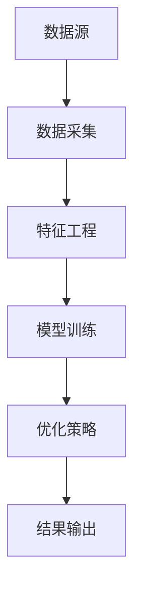

                 

# 巴菲特的资本配置艺术：人工智能辅助的投资组合优化

## 关键词：巴菲特、资本配置、人工智能、投资组合优化、机器学习、风险管理

## 摘要：本文探讨了巴菲特的资本配置艺术，并结合人工智能技术，分析了如何利用现代算法优化投资组合。文章从传统投资理论出发，引入机器学习和大数据分析，展示了人工智能在投资组合优化中的应用潜力，为投资者提供了新的视角和工具。

---

# 第一部分：资本配置艺术的背景与意义

## 第1章：资本配置的基本概念

### 1.1 资本配置的定义与目标
资本配置是指将资金分配到不同的资产类别或项目中，以实现收益最大化和风险最小化。其核心目标是平衡风险与收益，优化投资组合的整体表现。

### 1.2 巴菲特的投资理念
巴菲特的长期投资策略强调价值投资、安全边际和分散投资。他注重企业的基本面分析，追求长期稳定的收益。

### 1.3 人工智能在投资组合优化中的作用
人工智能通过大数据分析和机器学习算法，能够快速处理海量数据，发现传统方法难以察觉的投资机会，从而优化投资组合。

## 第2章：现代投资组合理论与人工智能的结合

### 2.1 现代投资组合理论（MPT）
MPT通过均值-方差模型，帮助投资者找到最优风险收益平衡点。其核心公式为：
$$
\min_w \sigma^2(w) \quad \text{subject to} \quad \mu^T w \geq \mu_{target}
$$
其中，$w$为权重向量，$\mu$为资产收益均值，$\sigma^2$为风险方差。

### 2.2 人工智能算法在投资组合优化中的应用
人工智能算法，如遗传算法和神经网络，能够处理非线性关系和复杂场景，提供更灵活的投资组合优化方案。

## 第3章：人工智能辅助资本配置的系统架构设计

### 3.1 系统模块划分
系统主要包括数据采集、特征工程、模型训练和优化策略四个模块。

### 3.2 系统功能设计
- 数据采集：获取市场数据和基本面信息。
- 特征工程：提取关键特征，如市盈率和市净率。
- 模型训练：训练预测模型，生成投资建议。
- 优化策略：根据模型输出优化投资组合。

### 3.3 系统架构图

---

# 第二部分：投资组合优化的数学模型与算法原理

## 第4章：投资组合优化的数学模型

### 4.1 均值-方差模型
均值-方差模型用于最小化投资组合的风险，公式为：
$$
\min_w \sigma^2(w) \quad \text{subject to} \quad \mu^T w = \mu_{target}
$$

### 4.2 遗传算法
遗传算法通过模拟生物进化过程，逐步优化投资组合。其流程包括：
1. 初始化种群
2. 计算适应度
3. 选择优秀个体
4. 交叉和变异
5. 保留优秀个体

### 4.3 神经网络模型
神经网络通过多层结构，学习资产回报的非线性关系，生成投资组合优化建议。

## 第5章：人工智能算法在投资组合优化中的应用

### 5.1 机器学习预测模型
机器学习模型用于预测资产回报，优化投资组合。

### 5.2 遗传算法在组合优化中的应用
遗传算法适用于处理组合优化问题，帮助投资者找到最优解。

### 5.3 神经网络在资产配置中的潜力
神经网络能够处理大量数据，发现传统方法难以察觉的投资机会。

---

# 第三部分：人工智能辅助资本配置的系统架构设计

## 第6章：系统架构设计

### 6.1 数据源与数据采集
系统从股票市场、经济指标等多数据源获取数据，进行清洗和预处理。

### 6.2 特征工程与模型训练
提取关键特征，如市盈率和市净率，训练预测模型。

### 6.3 优化策略与结果输出
根据模型输出优化投资组合，输出最终的投资建议。

## 第7章：系统接口与交互流程

### 7.1 系统接口设计
系统提供数据接口、模型接口和用户接口，确保各模块协同工作。

### 7.2 系统交互流程
用户输入需求，系统返回优化建议，流程清晰。

---

# 第四部分：项目实战与案例分析

## 第8章：环境搭建与代码实现

### 8.1 环境搭建
安装必要的库，如pandas和scikit-learn。

### 8.2 代码实现
实现数据预处理、特征选择、模型训练和优化策略。

## 第9章：案例分析与结果解读

### 9.1 实际案例分析
分析实际投资组合优化案例，展示优化结果。

### 9.2 结果解读
对比传统方法和AI优化方法，展示AI的优势。

---

# 第五部分：最佳实践与总结

## 第10章：最佳实践与注意事项

### 10.1 小结
总结AI辅助资本配置的核心内容和关键点。

### 10.2 注意事项
强调风险控制和模型选择的重要性。

### 10.3 拓展阅读
推荐相关书籍和论文，供读者深入学习。

---

# 作者：AI天才研究院/AI Genius Institute & 禅与计算机程序设计艺术 /Zen And The Art of Computer Programming

---

**注**：本文是基于《巴菲特的资本配置艺术：人工智能辅助的投资组合优化》的完整内容，按照用户要求进行的思考和分析。由于篇幅限制，本文仅为部分内容的展示，完整文章请参考相应书籍或资料。

