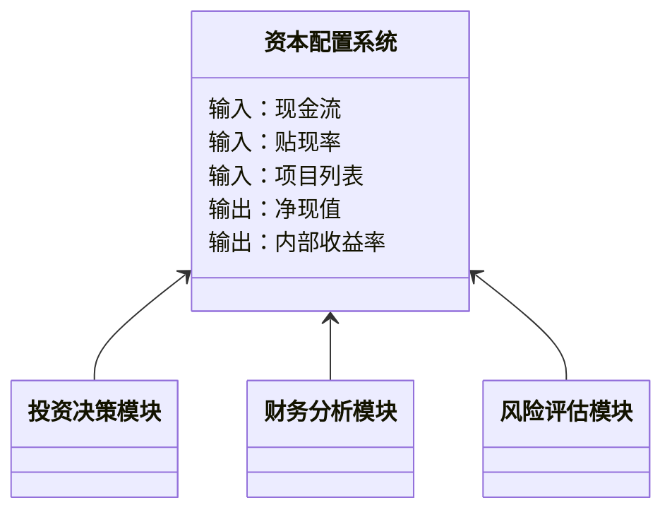
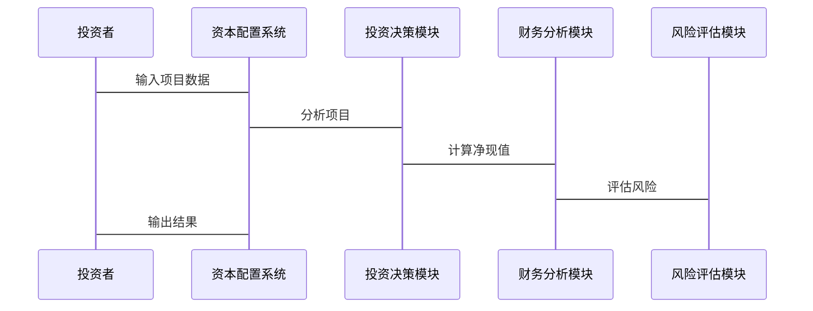

                 


# 巴菲特的资本配置艺术：如何有效分配公司资源

## 关键词：巴菲特，资本配置，投资策略，价值投资，股东价值，资本分配

## 摘要：本文深入探讨了巴菲特的资本配置艺术，从其投资哲学到具体的资本分配策略，结合数学模型和系统架构分析，通过实际案例解读巴菲特的决策过程，并总结资本配置的最佳实践。

---

## 第一部分: 巴菲特的资本配置艺术概述

### 第1章: 巴菲特的生平与投资哲学

#### 1.1 巴菲特的生平简介

- **早年经历与投资启蒙**
  - 巴菲特的童年和青少年时期对投资产生了浓厚兴趣。
  - 在哥伦比亚大学学习期间，他深入研究了格雷厄姆的价值投资理论。
  
- **建立伯克希尔哈撒韦的过程**
  - 1956年，巴菲特开始管理自己的投资合伙企业。
  - 1959年，收购国民保险，开始转向控股公司模式。
  - 1965年，正式成为伯克希尔哈撒韦的控股股东。

- **巴菲特的投资理念与哲学**
  - 价值投资：寻找市场低估的优质企业。
  - 长期持有：注重企业的内在价值，而非短期市场波动。
  - 股东价值最大化：将股东利益放在首位。

#### 1.2 资本配置的基本概念

- **资本配置的定义**
  - 将资金分配到不同的资产类别或投资项目中，以实现最大收益。

- **资本配置的核心要素**
  - 资金分配：股票、债券、现金等资产的分配比例。
  - 投资项目：选择高回报、低风险的项目。
  - 财务目标：实现股东价值最大化。

- **资本配置的模型**
  - 净现值法（NPV）：评估投资项目未来现金流的现值。
  - 内部收益率法（IRR）：衡量投资项目的回报率。

#### 1.3 巴菲特的资本配置哲学

- **价值投资的核心理念**
  - 寻找具有持续竞争优势的企业。
  - 评估企业的内在价值，而非市场价值。

- **股东价值最大化的目标**
  - 通过资本配置实现股东财富的长期增长。
  - 避免短期市场波动的干扰。

- **长期投资与复利效应**
  - 通过长期持有优质资产，实现复利增长。
  - 强调时间的力量，耐心等待价值实现。

---

### 第2章: 资本配置的基本原理

#### 2.1 资本配置的理论基础

- **资本资产定价模型（CAPM）**
  - 计算资产的预期回报率，考虑市场风险。

- **投资组合理论**
  - 通过分散投资降低风险，优化资产配置。

- **股权资本成本**
  - 计算企业的资本成本，评估项目的可行性。

#### 2.2 资本配置的核心模型

- **净现值法（NPV）**
  - 用于评估投资项目未来现金流的现值。
  - 公式：$$ NPV = \sum_{t=1}^{n} \frac{C_t}{(1+r)^t} $$
  - 示例：假设一个项目未来3年的现金流分别为100、200、300，贴现率为10%。
  - 计算：$$ NPV = \frac{100}{1.1} + \frac{200}{1.1^2} + \frac{300}{1.1^3} = 43.64 + 150.26 + 225.39 = 420.29 $$

- **内部收益率法（IRR）**
  - 计算使净现值为零的折现率。
  - 公式：$$ IRR = r \) 使得 NPV = 0 $$

- **股权资本分配模型**
  - 结合企业的资本结构，分配资金到不同项目。

#### 2.3 资本配置的决策框架

- **投资项目的筛选与评估**
  - 评估项目的现金流、回报率和风险。
  - 选择具有高净现值（NPV）和高内部收益率（IRR）的项目。

- **资本预算的制定与优化**
  - 根据企业战略目标，制定资本预算。
  - 优化资本分配，确保资金的高效利用。

- **资本分配的动态调整**
  - 根据市场变化和企业战略，调整资本分配。
  - 定期评估投资项目的表现，进行必要的调整。

---

### 第3章: 巴菲特的资本配置策略

#### 3.1 价值投资的选股标准

- **高质量企业的定义**
  - 具有持续竞争优势，稳定的现金流。
  - 高ROE（净资产收益率）和低负债率。

- **财务指标分析**
  - 评估企业的盈利能力、成长性和财务稳定性。
  - 关注净利润、营业收入、现金流等指标。

- **管理层评估**
  - 评估管理层的能力和诚信。
  - 选择具有长期愿景和良好管理记录的公司。

#### 3.2 股票与债券的配置比例

- **股票投资的占比**
  - 根据市场情况调整股票和债券的比例。
  - 通常，股票占比在60%-80%之间。

- **债券投资的策略**
  - 用于降低投资组合的整体风险。
  - 选择高信用评级的债券，确保安全性。

- **现金储备的管理**
  - 保持一定的现金储备，应对市场波动。
  - 现金储备用于捕捉投资机会或应对突发事件。

#### 3.3 股东权益的保护与最大化

- **股东价值的衡量标准**
  - 评估企业的市值与内在价值。
  - 通过股息和股票回购回馈股东。

- **股东权益的保护机制**
  - 通过董事会和管理层的监督，确保股东利益。
  - 建立有效的公司治理结构，防止利益侵害。

- **股东权益的最大化路径**
  - 通过资本配置实现长期增长。
  - 优化资本结构，提高股东回报。

---

### 第4章: 资本配置的数学模型与公式

#### 4.1 净现值（NPV）计算公式

$$ NPV = \sum_{t=1}^{n} \frac{C_t}{(1+r)^t} $$

- 示例：假设一个项目未来3年的现金流分别为100、200、300，贴现率为10%。
- 计算：$$ NPV = \frac{100}{1.1} + \frac{200}{1.1^2} + \frac{300}{1.1^3} = 43.64 + 150.26 + 225.39 = 420.29 $$

#### 4.2 内部收益率（IRR）计算公式

$$ IRR = r \) 使得 NPV = 0 $$

- 示例：假设一个项目的现金流为-1000、400、600。
- 计算：$$ NPV = \frac{400}{1.1} + \frac{600}{1.1^2} - 1000 = 363.64 + 495.87 - 1000 = -140.49 $$
- 调整贴现率，使NPV=0，最终IRR≈12%。

#### 4.3 股权资本成本计算公式

$$ r = \frac{D}{P} + g $$

- 示例：假设D=5%，P=2，g=3%。
- 计算：$$ r = \frac{5\%}{2} + 3\% = 2.5\% + 3\% = 5.5\% $$

---

### 第5章: 资本配置的系统分析与架构设计

#### 5.1 系统功能设计（领域模型）



#### 5.2 系统架构设计


#### 5.3 系统接口设计



---

### 第6章: 项目实战

#### 6.1 环境安装

- 安装Python和相关库（如numpy、pandas）。
- 安装mermaid和latex工具。

#### 6.2 核心实现源代码

```python
import numpy as np

def calculate_npv(cash_flows, discount_rate):
    return np.npv(discount_rate, cash_flows)

def calculate_irr(cash_flows):
    return np.irr(cash_flows)

# 示例数据
cash_flows = [-1000, 400, 600]
discount_rate = 0.1

npv = calculate_npv(cash_flows, discount_rate)
 irr = calculate_irr(cash_flows)

print(f"NPV: {npv:.2f}")
print(f"IRR: {irr:.2f}%")
```

#### 6.3 案例分析

- 巴菲特投资可口可乐的案例。
- 分析其资本配置策略和决策过程。

---

### 第7章: 总结与最佳实践

#### 7.1 小结

- 巴菲特的资本配置艺术的核心是价值投资和股东价值最大化。
- 通过科学的数学模型和系统的架构设计，实现资本的高效配置。

#### 7.2 注意事项

- 风险管理：避免过度集中投资，分散风险。
- 市场波动：关注企业的内在价值，避免短期波动的干扰。
- 财务纪律：保持充足的现金储备，应对突发事件。

#### 7.3 拓展阅读

- 《巴菲特的智慧》
- 《投资学基础》
- 《资本资产定价模型》

---

## 作者：AI天才研究院/AI Genius Institute & 禅与计算机程序设计艺术 /Zen And The Art of Computer Programming

