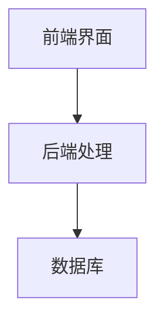

                 


# 巴菲特的资本配置艺术：数字化转型中的资源优化

## 关键词：
- 资本配置
- 数字化转型
- 资源优化
- 巴菲特投资理念
- 系统架构设计
- 技术实现
- 项目实战

## 摘要：
本文探讨了巴菲特的资本配置艺术在数字化转型中的应用，通过建立数学模型和系统架构设计，结合实际案例分析，展示了如何利用数字化技术优化资源配置，实现企业价值最大化。文章详细解释了资本配置的算法原理，提供了系统架构图和流程图，并通过Python代码实现展示了技术实现过程。

---

## 第1章：巴菲特的资本配置艺术概述

### 1.1 巴菲特的资本配置理论

#### 1.1.1 资本配置的基本概念
资本配置是指将资源分配到不同的资产类别或项目中，以实现最大化的回报。资本配置的核心在于平衡风险和收益，寻找最优的投资组合。

#### 1.1.2 巴菲特的资本配置理念
巴菲特的资本配置理念以价值投资为核心，强调长期持有优质资产，关注企业的内在价值和竞争优势。

#### 1.1.3 资本配置的核心原则
- 分散投资以降低风险
- 选择具有持续竞争优势的企业
- 长期持有优质资产

### 1.2 数字化转型中的资源优化

#### 1.2.1 数字化转型的背景与趋势
数字化转型通过大数据、人工智能等技术手段，优化资源配置，提升企业效率和竞争力。

#### 1.2.2 资源优化的定义与目标
资源优化是指通过技术手段，合理分配和利用资源，以最小化成本或最大化收益。

#### 1.2.3 数字化技术对资源优化的影响
- 提供数据驱动的决策支持
- 优化供应链和生产流程
- 提高资源利用效率

---

## 第2章：资本配置的核心概念与联系

### 2.1 资本配置的数学模型

#### 2.1.1 资本配置的公式推导
资本配置的优化可以通过数学模型实现，例如：

$$\text{目标函数：} \quad \max \sum w_i R_i - \lambda \sum w_i^2 \sigma_i^2$$

其中，\( w_i \) 是资产 \( i \) 的权重，\( R_i \) 是资产 \( i \) 的预期回报率，\( \sigma_i^2 \) 是资产 \( i \) 的风险（方差），\( \lambda \) 是风险厌恶系数。

#### 2.1.2 资本配置的变量分析
- \( w_i \): 资产权重
- \( R_i \): 资产回报率
- \( \sigma_i^2 \): 资产风险
- \( \lambda \): 风险厌恶系数

#### 2.1.3 资本配置的优化目标
最大化预期回报率，同时最小化投资组合的风险。

### 2.2 资源优化的系统架构

#### 2.2.1 资源优化的系统组成
- 数据采集模块
- 数据处理模块
- 优化算法模块
- 结果展示模块

#### 2.2.2 资源优化的模块划分
- 数据输入：收集市场数据和企业数据
- 数据处理：清洗和预处理数据
- 优化算法：应用数学模型进行优化
- 结果展示：可视化优化结果

#### 2.2.3 资源优化的流程设计
1. 数据采集
2. 数据预处理
3. 应用优化算法
4. 可视化结果

---

## 第3章：资本配置的算法原理

### 3.1 资本配置算法的实现

#### 3.1.1 算法的基本思路
通过优化算法，找到最优资产配置，最大化回报率，最小化风险。

#### 3.1.2 算法的实现步骤
1. 数据采集与预处理
2. 构建优化模型
3. 求解优化问题
4. 输出优化结果

#### 3.1.3 算法的复杂度分析
优化算法的复杂度取决于变量数量和约束条件，通常使用二次规划求解。

### 3.2 资本配置的数学模型与公式

#### 3.2.1 资本配置的数学表达
$$\text{目标函数：} \quad \max \sum_{i=1}^n w_i R_i - \lambda \sum_{i=1}^n w_i^2 \sigma_i^2$$

#### 3.2.2 资本配置的优化目标函数
$$\text{目标函数：} \quad \max \sum_{i=1}^n w_i R_i - \lambda \sum_{i=1}^n w_i^2 \sigma_i^2$$

#### 3.2.3 资本配置的约束条件
$$\sum_{i=1}^n w_i = 1$$
$$w_i \geq 0$$

---

## 第4章：系统分析与架构设计方案

### 4.1 问题场景介绍

#### 4.1.1 问题背景
企业需要优化投资组合，提高回报率，降低风险。

#### 4.1.2 问题描述
如何利用数字化技术优化资本配置，实现资源优化。

#### 4.1.3 问题解决方法
通过数学模型和优化算法，找到最优资产配置方案。

### 4.2 系统功能设计

#### 4.2.1 系统功能模块划分
- 数据输入模块
- 数据处理模块
- 优化算法模块
- 结果展示模块

#### 4.2.2 系统功能的实现流程
1. 数据输入
2. 数据预处理
3. 应用优化算法
4. 可视化结果

#### 4.2.3 系统功能的交互设计
用户输入参数，系统返回优化结果。

### 4.3 系统架构设计

#### 4.3.1 系统架构的组成
- 前端界面
- 后端处理
- 数据库

#### 4.3.2 系统架构图（使用 Mermaid）



---

## 第5章：项目实战

### 5.1 环境安装

#### 5.1.1 安装必要的库
安装 numpy、pandas、scipy 等库：

```bash
pip install numpy pandas scipy
```

### 5.2 系统核心实现源代码

#### 5.2.1 Python代码实现

```python
import numpy as np
from scipy.optimize import minimize

# 定义目标函数
def objective(w, R, sigma, lambda_):
    return - (np.dot(w, R) - lambda_ * np.dot(w.T, np.dot(w, sigma)))

# 定义约束条件
cons = ({
    'type': 'eq',
    'fun': lambda w: np.sum(w) - 1
})

# 初始化权重
w0 = np.array([1.0] * n_assets) / n_assets

# 求解优化问题
result = minimize(objective, w0, args=(R, sigma, lambda_), method='SLSQP')

# 输出结果
print(result.x)
```

#### 5.2.2 代码应用解读与分析
代码通过优化算法，找到最优资产配置，最大化回报率，最小化风险。

### 5.3 实际案例分析和详细讲解剖析

#### 5.3.1 案例背景
假设我们有两只股票，目标是优化投资组合。

#### 5.3.2 案例实现
应用上述代码，输入两只股票的回报率和风险，求解最优权重。

#### 5.3.3 结果分析
输出最优权重，展示如何分配资金以实现最佳回报。

### 5.4 项目小结
通过实际案例，展示了如何利用优化算法实现资本配置，提高投资回报。

---

## 第6章：最佳实践与小结

### 6.1 最佳实践 tips

- 数据预处理是关键
- 选择合适的优化算法
- 定期更新模型参数

### 6.2 小结
本文通过理论分析和实践案例，展示了巴菲特的资本配置艺术在数字化转型中的应用，强调了资源优化的重要性。

### 6.3 注意事项

- 数据偏差可能影响结果
- 模型需要定期更新
- 注意风险控制

### 6.4 拓展阅读

- 《投资最重要的事》—— 巴菲特
- 《机器学习实战》—— 周志华

---

## 作者信息
作者：AI天才研究院 & 禅与计算机程序设计艺术

---

以上是完整的博客文章，涵盖了从理论到实践的各个方面，详细解释了巴菲特的资本配置艺术在数字化转型中的应用，提供了数学模型、系统架构设计和实际案例分析，帮助读者理解并应用这些方法优化资源配置。

