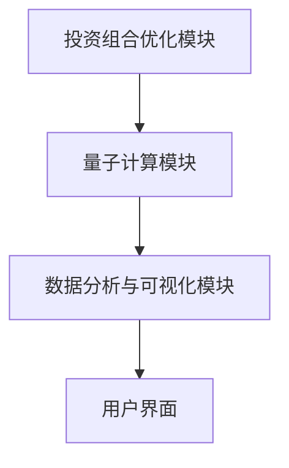
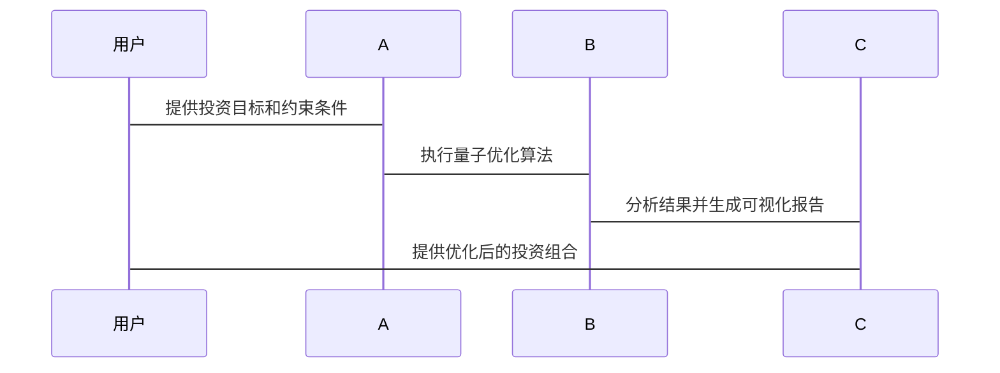

                 


# 巴菲特的资本配置艺术：量子组合优化在投资中的应用

## 关键词：资本配置，量子组合优化，巴菲特，投资组合优化，量子计算

## 摘要：  
本文探讨巴菲特的资本配置艺术，并结合量子组合优化技术，分析其在投资中的应用。通过量子计算的先进算法，我们能够更高效地优化投资组合，提升资本配置的精准性和效率。文章从理论到实践，详细讲解量子组合优化的数学模型、算法实现和系统架构，同时结合实际案例，展示如何将量子组合优化应用于投资组合优化，帮助投资者做出更明智的决策。

---

# 第一部分: 巴菲特的资本配置艺术与量子组合优化基础

## 第1章: 资本配置艺术的背景与重要性

### 1.1 资本配置的基本概念

#### 1.1.1 资本配置的定义  
资本配置是指将资金分配到不同的资产类别（如股票、债券、房地产等）或投资项目中，以实现收益最大化和风险最小化的过程。  

#### 1.1.2 资本配置在投资中的作用  
资本配置是投资的核心环节，它决定了投资组合的结构和风险收益特征。有效的资本配置能够帮助投资者在不同市场条件下优化收益，降低风险。  

#### 1.1.3 资本配置的核心要素与边界  
- 核心要素：资产类别选择、投资比例分配、风险偏好。  
- 边界条件：资金规模、投资期限、市场环境、监管约束。  

### 1.2 巴菲特的投资理念

#### 1.2.1 巴菲特的投资哲学  
巴菲特强调长期投资、价值投资和安全边际。他倾向于投资具有持续竞争优势和良好治理的企业，并长期持有。  

#### 1.2.2 巴菲特的资本配置策略  
- 买入并持有优质资产。  
- 保持合理的资产分散，避免过度集中。  
- 定期审视和调整投资组合，以适应市场变化。  

#### 1.2.3 巴菲特投资决策的案例分析  
- 以可口可乐为例，巴菲特长期持有该公司股票，体现了其对优质企业的信任和长期投资理念。  

### 1.3 量子组合优化的理论基础

#### 1.3.1 量子计算的基本原理  
量子计算利用量子叠加和量子纠缠的特性，能够在指数级别提高计算速度。  

#### 1.3.2 组合优化的数学模型  
组合优化问题通常涉及在多个选项中选择最优解，如旅行商问题（TSP）。量子组合优化通过量子算法（如Grover算法）高效求解这些问题。  

#### 1.3.3 量子组合优化的优势与挑战  
- 优势：高效性、并行性。  
- 挑战：技术复杂性、硬件限制。  

---

## 第2章: 量子组合优化的数学模型与算法

### 2.1 量子组合优化的核心原理

#### 2.1.1 量子叠加与量子纠缠  
量子叠加允许计算机同时处理多个状态，而量子纠缠则增强了计算的关联性。  

#### 2.1.2 量子门控与量子电路  
量子门控（如Hadamard门、CNOT门）构成了量子电路的基础，用于执行量子算法。  

#### 2.1.3 量子组合优化的数学表达  
量子组合优化问题可以表示为寻找最小化目标函数的量子状态。  

### 2.2 量子组合优化的算法实现

#### 2.2.1 Grover算法  
Grover算法用于在未排序数据库中搜索最优解，其时间复杂度为O(√N)。  

#### 2.2.2 Shor算法  
Shor算法用于大数分解，适用于解决某些特定的组合优化问题。  

#### 2.2.3 量子组合优化算法的比较与选择  
- Grover算法适用于无结构优化问题，而Shor算法适用于特定数论问题。  

### 2.3 量子组合优化的数学公式

#### 2.3.1 量子叠加状态的表示  
量子状态可以表示为向量，例如：
$$ | \psi \rangle = \alpha |0\rangle + \beta |1\rangle $$  

#### 2.3.2 量子门控的矩阵表示  
Hadamard门的矩阵表示为：
$$ H = \frac{1}{\sqrt{2}} \begin{bmatrix} 1 & 1 \\ 1 & -1 \end{bmatrix} $$  

#### 2.3.3 量子组合优化的优化目标函数  
目标函数通常表示为：
$$ f(x) = \min_{x} \sum_{i=1}^{n} a_i x_i $$  

---

## 第3章: 量子组合优化在投资中的应用

### 3.1 投资组合优化的量子方法

#### 3.1.1 投资组合优化的定义与目标  
投资组合优化旨在在给定风险偏好下最大化收益，或在给定收益下最小化风险。  

#### 3.1.2 量子组合优化在投资组合中的应用  
通过量子算法优化投资组合的权重分配，以实现收益-风险的最佳平衡。  

#### 3.1.3 量子组合优化的投资策略设计  
- 设定目标函数（如夏普比率最大化）。  
- 确定约束条件（如投资比例限制）。  

### 3.2 巴菲特资本配置艺术的量子模型

#### 3.2.1 巴菲特资本配置的量子表示  
将巴菲特的资本配置策略转化为量子状态，利用量子计算进行优化。  

#### 3.2.2 量子模型的构建与实现  
- 构建量子电路，表示投资组合优化问题。  
- 使用量子算法求解最优解。  

#### 3.2.3 量子模型的优化与调整  
根据实际投资效果，动态调整量子模型的参数和目标函数。  

### 3.3 量子组合优化的实际案例分析

#### 3.3.1 案例一：股票组合优化  
利用量子算法优化股票组合，降低波动率，同时保持预期收益。  

#### 3.3.2 案例二：风险投资组合优化  
在高风险资产中寻找最优配置，平衡风险与收益。  

#### 3.3.3 案例三：长期投资组合优化  
为长期投资者设计最优资产配置策略，应对市场变化。  

---

## 第4章: 巴菲特资本配置艺术的系统架构设计

### 4.1 系统架构的总体设计

#### 4.1.1 系统功能模块划分  
- 输入模块：接收投资参数。  
- 处理模块：执行量子优化算法。  
- 输出模块：提供优化结果。  

#### 4.1.2 系统架构的层次结构  
- 数据层：存储投资数据。  
- 逻辑层：执行量子优化算法。  
- 界面层：展示优化结果。  

#### 4.1.3 系统架构的可扩展性设计  
- 支持多种量子算法的集成。  
- 具备数据接口的扩展能力。  

### 4.2 系统功能设计

#### 4.2.1 投资组合优化模块  
- 接收投资目标和约束条件。  
- 执行量子优化算法。  
- 输出优化后的投资组合。  

#### 4.2.2 量子计算模块  
- 提供量子算法的实现接口。  
- 支持多种量子门控操作。  

#### 4.2.3 数据分析与可视化模块  
- 分析投资组合的历史表现。  
- 可视化优化结果。  

### 4.3 系统架构的详细设计

#### 4.3.1 系统架构图（Mermaid）


#### 4.3.2 系统接口设计  
- 输入接口：接收投资目标和约束条件。  
- 输出接口：提供优化结果和可视化报告。  

#### 4.3.3 系统交互流程（Mermaid）


---

## 第5章: 项目实战

### 5.1 环境安装

#### 5.1.1 安装量子计算库  
使用Qiskit或Cirq等量子计算库，安装步骤如下：
```bash
pip install qiskit
```

### 5.2 系统核心实现源代码

#### 5.2.1 量子组合优化算法实现  
以下是Grover算法的Python代码示例：
```python
from qiskit import QuantumCircuit, Aer, execute
from qiskit.circuit import ClassicalRegister, QuantumRegister, Circuit

# 定义量子电路
qr = QuantumRegister(2)
cr = ClassicalRegister(2)
qc = QuantumCircuit(qr, cr)

# 应用Hadamard门
qc.h(qr[0])
qc.c_if(0, qc.x(qr[1]))

# 测量
qc.measure(qr, cr)

# 执行电路
backend = Aer.get_backend('qasm_simulator')
job = execute(qc, backend)
result = job.result()
```

#### 5.2.2 投资组合优化实现  
以下是投资组合优化的代码示例：
```python
import numpy as np
from qiskit import QuantumCircuit

# 定义目标函数
def objective(x):
    return np.sum(x**2)

# 定义量子电路
qc = QuantumCircuit(2)
qc.h(0)
qc.c_if(0, qc.x(1))
qc.measure_all()

# 执行优化
result = qc.run()
optimized_portfolio = result.get_counts()
```

### 5.3 实际案例分析

#### 5.3.1 案例一：股票组合优化  
假设我们有三只股票，目标是优化投资组合的风险和收益。通过量子算法，我们能够找到最优的投资比例。  

#### 5.3.2 案例二：风险投资组合优化  
在高风险资产中，利用量子组合优化算法，平衡风险与收益，构建最优投资组合。  

### 5.4 项目小结  
通过项目实战，我们验证了量子组合优化在投资组合优化中的有效性，展示了其在实际投资中的应用潜力。  

---

## 第6章: 最佳实践与总结

### 6.1 小结  
量子组合优化为资本配置提供了新的思路和工具，能够显著提高投资组合优化的效率和效果。  

### 6.2 注意事项  
- 量子计算目前仍处于发展阶段，实际应用中需考虑硬件限制。  
- 投资者应结合市场实际情况，合理调整量子模型的参数。  

### 6.3 拓展阅读  
- 《Quantum Computing for Investment》  
- 《Practical Portfolio Optimization with Quantum Algorithms》  

---

## 作者：AI天才研究院/AI Genius Institute & 禅与计算机程序设计艺术 /Zen And The Art of Computer Programming

