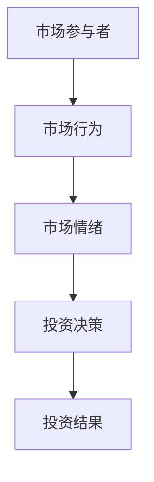
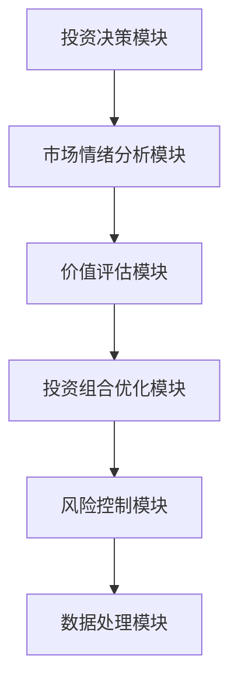
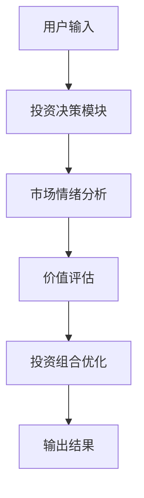

                 


# 巴菲特的逆向投资思维

**关键词：** 巴菲特，逆向投资，价值投资，安全边际，市场情绪，投资策略

**摘要：**  
本文深入探讨巴菲特的逆向投资思维，从其核心理念、算法原理到实际应用，系统地分析其在投资决策中的优势与应用。通过详细讲解逆向思维的原理、优势及具体操作方法，为投资者提供实用的策略和工具。

---

## 目录

### 第一章：巴菲特投资理念的核心思想

#### 1.1 巴菲特投资理念的背景与起源

- 1.1.1 传统投资理论的局限性
  - 价值投资的兴起
  - 市场无效性与机会的发现
- 1.1.2 巴菲特投资理念的形成与发展
  - 早期投资经历
  - 《 Intelligent Investor》的核心思想
- 1.1.3 逆向思维的定义与特点
  - 逆向思维的定义
  - 与传统投资策略的区别

#### 1.2 逆向思维在投资中的应用

- 1.2.1 逆向思维的核心要素
  - 长期价值导向
  - 安全边际原则
  - 股东权益最大化
- 1.2.2 逆向思维的优势
  - 把握市场低估的机会
  - 避免羊群效应
  - 分散风险

### 第二章：逆向思维的核心概念与联系

#### 2.1 逆向思维的原理分析

- 2.1.1 市场情绪与逆向投资的关系
  - 市场情绪的波动性
  - 逆向思维如何利用市场情绪
- 2.1.2 逆向思维的逻辑结构
  - 市场行为与价格的关系
  - 价值评估与市场定价的差异
- 2.1.3 逆向思维的数学模型
  - 价值评估公式
  - 市场情绪指数的计算

#### 2.2 逆向思维的核心概念对比

- 2.2.1 逆向思维与正向思维的对比
  - 投资决策的逻辑差异
  - 风险与收益的平衡
- 2.2.2 逆向思维与价值投资的对比
  - 核心理念的异同
  - 实践中的策略差异
- 2.2.3 逆向思维与趋势投资的对比
  - 时间窗口的选择
  - 投资目标的差异

#### 2.3 逆向思维的ER实体关系图



### 第三章：逆向思维的算法原理与数学模型

#### 3.1 逆向思维的算法流程

- 3.1.1 逆向思维的算法步骤
  - 数据收集与处理
  - 市场情绪分析
  - 价值评估
  - 投资决策
- 3.1.2 算法流程图
  ```mermaid
  graph TD
      A[开始] --> B[识别市场情绪]
      B --> C[评估市场估值]
      C --> D[寻找低估机会]
      D --> E[制定投资策略]
      E --> F[结束]
  ```

#### 3.2 逆向思维的数学模型

- 3.2.1 市场估值模型
  $$ V = P \times E \times G $$
  其中，\( V \) 表示内在价值，\( P \) 表示价格，\( E \) 表示预期收益，\( G \) 表示成长性。

- 3.2.2 安全边际计算
  $$ S = V - P $$
  其中，\( S \) 表示安全边际，\( V \) 表示内在价值，\( P \) 表示市场价格。

### 第四章：系统分析与架构设计

#### 4.1 问题场景介绍

- 投资决策过程中的信息处理与风险控制
- 逆向思维在投资系统中的应用

#### 4.2 系统功能设计

- 4.2.1 投资决策模块
  - 市场情绪分析
  - 价值评估
  - 投资组合优化
- 4.2.2 数据处理模块
  - 数据采集与清洗
  - 数据存储与管理
- 4.2.3 风险控制模块
  - 安全边际计算
  - 风险评估与预警

#### 4.3 系统架构设计



#### 4.4 系统接口设计

- API接口定义
  - 数据接口：市场数据获取
  - 计算接口：价值评估、安全边际计算

#### 4.5 系统交互流程



### 第五章：项目实战

#### 5.1 环境安装与数据准备

- 数据源选择
- 数据清洗与预处理

#### 5.2 核心代码实现

- 价值评估函数
  ```python
  def calculate_intrinsic_value(price, earnings, growth):
      return price * earnings * growth
  ```

- 安全边际计算
  ```python
  def calculate_margin_of_safety(intrinsic_value, market_price):
      return intrinsic_value - market_price
  ```

#### 5.3 实际案例分析

- 案例：某公司投资分析
  - 数据分析与处理
  - 价值评估与市场定价对比
  - 投资决策与结果分析

### 第六章：总结与展望

#### 6.1 总结

- 逆向思维的核心思想
- 投资策略的优缺点
- 实践中的注意事项

#### 6.2 展望

- 逆向思维的未来发展
- 技术进步对投资策略的影响
- 新的投资机会的探索

---

**作者：AI天才研究院/AI Genius Institute & 禅与计算机程序设计艺术 /Zen And The Art of Computer Programming**

---

### 关键词：
- 巴菲特
- 逆向投资
- 价值投资
- 安全边际
- 市场情绪
- 投资策略

---

### 摘要：
本文系统地探讨了巴菲特的逆向投资思维，从其核心理念到算法原理，再到实际应用，详细分析了逆向思维在投资决策中的优势与应用。通过具体案例分析和数学模型的建立，为投资者提供了实用的策略和工具。

