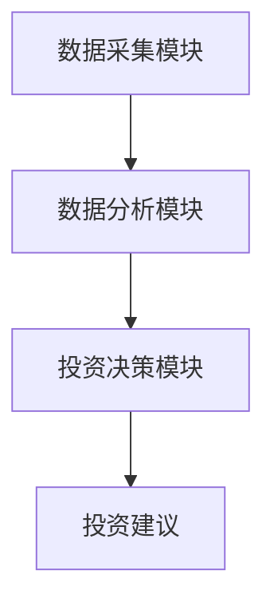

                 


# 巴菲特的银行业投资逻辑：金融科技挑战下的重新评估

## 关键词：巴菲特，银行业投资，金融科技，风险管理，投资逻辑

## 摘要：  
本文深入探讨了巴菲特在银行业投资中的核心逻辑，并分析了金融科技对银行业及投资策略的深远影响。通过结合巴菲特的投资哲学、银行行业的特点以及金融科技的发展趋势，文章重新评估了传统银行业投资逻辑在数字化时代的适用性，并提出了适应新时代的调整策略。文章从理论分析到实践应用，为投资者提供了全面的视角和实用的指导。

---

## 第1章：巴菲特的银行业投资逻辑概述

### 1.1 巴菲特的投资理念与方法  
#### 1.1.1 巴菲特的投资哲学  
巴菲特的投资哲学以“价值投资”为核心，强调长期持有优质资产，注重企业的内在价值而非市场波动。他的投资逻辑基于对企业基本面的深入分析和对管理层的信任。  

#### 1.1.2 巴菲特对银行业的投资逻辑  
巴菲特认为银行业是一个高度监管的行业，银行的核心价值在于其贷款业务的资产质量和资本回报能力。他倾向于选择那些具有强大资本实力、低负债率和稳定客户基础的银行。  

#### 1.1.3 巴菲特投资逻辑的核心要素  
- 安全边际：通过购买价格低于内在价值的股票，确保投资的安全性。  
- 核心竞争优势：选择具有独特竞争优势的企业，确保长期盈利能力。  
- 财务健康：关注企业的财务状况，尤其是负债水平和资本回报率。  

---

### 1.2 巴菲特对银行业的独特见解  
#### 1.2.1 银行行业的特点与风险  
银行业是典型的杠杆行业，其盈利能力和风险高度依赖于经济周期和利率变化。银行的核心资产是贷款，而贷款的质量直接决定银行的盈利能力。  

#### 1.2.2 巴菲特对银行股的估值方法  
巴菲特采用市盈率（P/E）和市净率（P/B）等指标对银行股进行估值，同时结合ROE（净资产收益率）和ROA（资产回报率）分析企业的盈利能力。  

#### 1.2.3 巴菲特对银行股投资的长期性  
巴菲特认为银行股是长期投资的理想选择，尤其是在经济稳定期，银行的盈利能力具有较高的确定性。  

---

## 第2章：金融科技对银行业的影响

### 2.1 金融科技的定义与发展趋势  
#### 2.1.1 金融科技的定义  
金融科技（FinTech）是指利用技术手段对传统金融行业进行创新和优化，涵盖支付、借贷、投资、保险等多个领域。  

#### 2.1.2 金融科技的发展趋势  
金融科技的发展呈现出数字化、智能化和平台化的趋势，技术创新正在重塑金融行业的生态。  

#### 2.1.3 金融科技对银行传统业务的挑战  
金融科技的崛起对银行的传统业务模式提出了挑战，尤其是在支付、信贷和客户体验方面。  

---

### 2.2 金融科技对银行运营模式的影响  
#### 2.2.1 金融科技对银行成本结构的影响  
金融科技的应用降低了银行的运营成本，例如通过自动化技术减少人工成本。  

#### 2.2.2 金融科技对银行客户体验的影响  
金融科技通过大数据和人工智能技术提升客户体验，例如个性化推荐和智能客服。  

#### 2.2.3 金融科技对银行风险管理的影响  
金融科技通过实时数据分析和风险评估模型，提高了银行的风险管理能力。  

---

### 2.3 金融科技对银行投资价值的影响  
#### 2.3.1 金融科技对银行估值的影响  
金融科技的应用可能提升银行的估值，尤其是那些能够有效整合技术优势的银行。  

#### 2.3.2 金融科技对银行竞争优势的影响  
金融科技赋予银行新的竞争优势，例如技术创新和服务创新。  

#### 2.3.3 金融科技对银行长期投资价值的影响  
金融科技的长期应用将增强银行的盈利能力和抗风险能力，从而提升其长期投资价值。  

---

## 第3章：金融科技挑战下的银行业投资策略

### 3.1 金融科技对银行业投资逻辑的挑战  
#### 3.1.1 传统银行业投资逻辑的局限性  
传统投资逻辑主要依赖于财务指标和管理层能力，但在数字化时代，这些指标可能无法全面反映银行的竞争力。  

#### 3.1.2 金融科技对银行业投资逻辑的重塑  
金融科技的应用要求投资者重新评估银行的核心竞争力，尤其是技术驱动的创新能力。  

#### 3.1.3 金融科技对银行业投资逻辑的未来影响  
金融科技将继续推动银行业投资逻辑的演变，投资者需要更加关注技术驱动的业务增长和创新。  

---

### 3.2 金融科技时代银行业投资策略的调整  
#### 3.2.1 投资策略的调整方向  
投资者需要更加关注银行的技术创新能力、数字化转型能力以及与科技公司的合作模式。  

#### 3.2.2 投资策略的具体实施方法  
- 选择具有技术优势的银行：重点关注那些在金融科技领域有显著投入和创新的银行。  
- 关注银行与科技公司的合作：评估银行与科技公司的合作深度和潜力。  
- 重视数字化转型的成效：考察银行在数字化转型中的实际表现和客户反馈。  

#### 3.2.3 投资策略的长期效果评估  
投资者需要定期评估银行在金融科技领域的表现，并根据市场变化调整投资策略。  

---

### 3.3 巴菲特投资逻辑的现代应用  
#### 3.3.1 巴菲特投资逻辑的现代挑战  
在数字化时代，巴菲特的投资逻辑需要结合金融科技的发展趋势进行调整。  

#### 3.3.2 巴菲特投资逻辑的现代应用  
- 仍然重视银行的财务健康：关注ROE、ROA等指标，确保银行的盈利能力。  
- 注重银行的技术创新能力：选择那些能够适应数字化转型的银行。  
- 关注银行的长期竞争优势：评估银行在金融科技时代的持续竞争力。  

#### 3.3.3 巴菲特投资逻辑的未来演变  
巴菲特的投资逻辑将更加注重技术驱动的创新，同时保持对财务健康和管理层能力的关注。  

---

## 第4章：系统架构与投资模型设计

### 4.1 投资模型的系统架构  
#### 4.1.1 投资模型的模块划分  
- 数据采集模块：收集银行的财务数据、市场数据和科技应用数据。  
- 数据分析模块：利用大数据和机器学习技术对银行进行综合评估。  
- 投资决策模块：根据分析结果生成投资建议。  

#### 4.1.2 投资模型的模块交互  
数据采集模块将数据传输到数据分析模块，后者生成评估报告并传输到投资决策模块，最终生成投资建议。  

#### 4.1.3 投资模型的系统流程图  


---

### 4.2 投资模型的算法原理  
#### 4.2.1 投资模型的算法选择  
投资模型采用机器学习算法，尤其是随机森林和神经网络，对银行的财务数据和科技应用数据进行综合分析。  

#### 4.2.2 投资模型的算法实现  
```python
import pandas as pd
from sklearn.ensemble import RandomForestClassifier

# 数据预处理
data = pd.read_csv('bank_data.csv')
X = data.drop('target', axis=1)
y = data['target']

# 模型训练
model = RandomForestClassifier()
model.fit(X, y)

# 模型预测
predictions = model.predict(X)
```

---

### 4.3 投资模型的数学模型与公式  
#### 4.3.1 投资模型的数学表达  
$$ \text{投资价值} = \alpha \times \text{财务指标} + \beta \times \text{科技应用指标} $$  
其中，$\alpha$ 和 $\beta$ 是模型的参数，通过训练数据确定。  

---

## 第5章：项目实战与案例分析

### 5.1 项目环境与工具安装  
#### 5.1.1 项目环境的搭建  
- 操作系统：Windows 10 或 macOS 10.15  
- 编程语言：Python 3.8 或更高版本  
- 开发工具：Jupyter Notebook 或 VS Code  

#### 5.1.2 投资分析工具的安装  
- 安装必要的库：`pandas`, `numpy`, `scikit-learn`, `matplotlib`  

---

### 5.2 投资模型的实现  
#### 5.2.1 数据采集与清洗  
```python
import pandas as pd
import numpy as np

data = pd.read_csv('bank_data.csv')
data.dropna(inplace=True)
```

---

#### 5.2.2 数据分析与建模  
```python
from sklearn.ensemble import RandomForestClassifier
from sklearn.metrics import accuracy_score

X = data.drop('target', axis=1)
y = data['target']

model = RandomForestClassifier()
model.fit(X, y)
y_pred = model.predict(X)
print(accuracy_score(y, y_pred))
```

---

#### 5.2.3 模型优化与部署  
通过网格搜索优化模型参数，并将模型部署到生产环境，用于实时分析和投资决策。  

---

## 第6章：总结与展望

### 6.1 总结  
本文从巴菲特的银行业投资逻辑出发，结合金融科技的发展趋势，重新评估了银行业投资策略的调整方向。通过系统架构和投资模型的设计，为投资者提供了实用的指导。  

### 6.2 未来展望  
随着金融科技的不断进步，银行业投资逻辑将更加注重技术驱动的创新和数字化转型。投资者需要持续关注银行在金融科技领域的表现，并灵活调整投资策略。  

---

## 作者：AI天才研究院/AI Genius Institute & 禅与计算机程序设计艺术/Zen And The Art of Computer Programming

